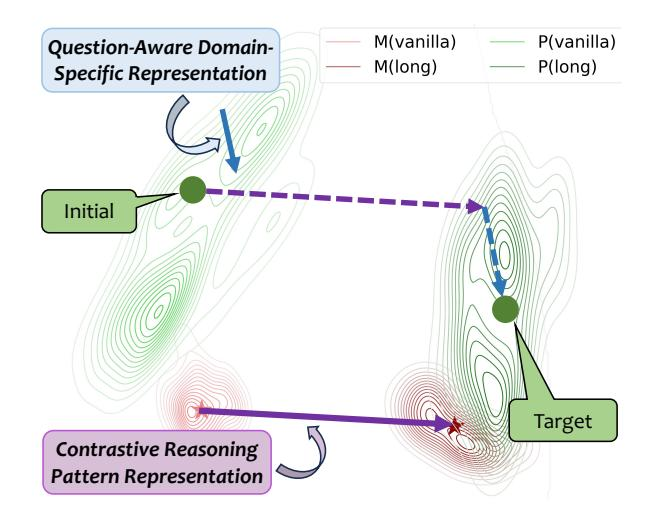
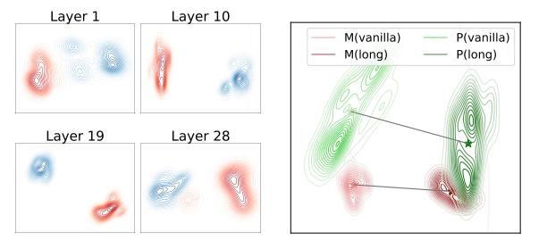

# 1 Introduction

Recently, slow-thinking reasoning models, such as OpenAI's o1 series of models [\(OpenAI](#page-10-0) , [2024](#page-10-0) ) and DeepSeek-R1 [\(Guo et al.](#page-9-0) , [2025\)](#page-9-0), have significantly advanced the capabilities of large language models (LLMs) [\(Zhao et al.](#page-11-0) , [2023\)](#page-11-0). As a typical approach, these reasoning models leverage long chain-of-thoughts (long CoTs), encompassing planning, validation, and backtracking strategies, to solve complex reasoning tasks [\(Yang et al.](#page-11-1) , [2024](#page-11-1) ; [Team et al.](#page-10-1) , [2025](#page-10-1) ; [Pang et al.](#page-10-2) , [2025\)](#page-10-2). Most existing work focuses on eliciting long CoTs on tasks that are easy to verify, such as mathematics [\(Cheng](#page-9-1) [et al.](#page-9-1) , [2024a](#page-9-1) ; [Yeo et al.](#page-11-2) , [2025\)](#page-11-2) and coding [\(Xu](#page-11-3)

> **[图片提取文字 (无描述)]:**
> M(vanilla) P(vanilla) Question-Aware Domain-M(long) P(long) Specific Representation Initial Target **Contrastive Reasoning Pattern Representation**

Figure 1: The illustration of how GLoRE unlocks the general long CoT reasoning capabilities through representation engineering in the parameter space. For a specific problem, we first employ a contrastive reasoning pattern to transition the model from the vanilla CoT area to the long CoT area. Then, we inject domainspecific representations to steer the model toward the precision space tailored for this problem. Here, "M" and "P" denote math and physics, respectively.

[et al.](#page-11-3) , [2025\)](#page-11-3). They find that the capability of long CoT reasoning can be efficiently elicited with only thousands of training examples [\(Ye et al.](#page-11-4) , [2025\)](#page-11-4). Furthermore, some recent work finds that this capability can easily transfer to other tasks, even without any task-specific examples [\(Du et al.,](#page-9-2) [2025\)](#page-9-2). These interesting phenomena raise a question: *Is long CoT reasoning a general capability encoded in LLMs?*

In this work, we take the first step towards unraveling the mystery from the perspective of *representation engineering* [\(Zou et al.,](#page-11-5) [2023\)](#page-11-5). As a transparent and interpretable method, representation engineering treats representation as the fundamental unit of analysis to understand and control high-level capabilities of LLMs, such as instruction following [\(Stolfo et al.](#page-10-3) , [2025\)](#page-10-3), personality [\(Cao](#page-9-3)

\* [Equal contribution.](#page-11-3)

† [Corresponding author.](#page-11-3)

> **[图片提取文字 (无描述)]:**
> Layer 1 Layer 10 P(vanilla) M(vanilla) M(long) P(long) Layer 19 Layer 28

(a) Different layers. (blue for vanilla, red for long) (b) Different domains. ("M" for math, "P" for physics)

Figure 2: Visualization of vanilla and long CoTs on Qwen2.5-7B-Instruct.

[et al.,](#page-9-3) [2024\)](#page-9-3), and hallucination [\(Li et al.,](#page-10-4) [2023a;](#page-10-4) [Arditi et al.,](#page-8-0) [2024\)](#page-8-0). Specifically, representations are extracted from the encodings of LLMs for data that reflect specific capabilities [\(Dong et al.,](#page-9-4) [2024a\)](#page-9-4). These representations can then be used for analysis and control of model behaviors.

Inspired by this approach, we leverage representation engineering to analyze the mechanism of long CoT reasoning. As illustrated in Figure [2a,](#page-1-0) the representations of long CoTs across diverse problems are concentrated in a specific area of the whole space. In addition, their distribution areas are clearly distinct from those of vanilla CoTs. Taken together, the two pieces of evidence suggest that LLMs do encode long CoT reasoning as a separate and general capability within their parameter spaces. Based on this insight, we further examine the representations of long and vanilla CoTs across various domains. The results in Figure [2b](#page-1-0) show that different domains share similar contrastive representations between long and vanilla CoTs, which further demonstrates the transferability of long CoT reasoning. In addition, the representations of mathematical domains are relatively concentrated, while those of other domains (*e.g.,* physics) are more dispersed. This suggests that general long CoT reasoning requires not only *unique reasoning patterns* but also *domain-specific information*. That is, domain-specific long CoT data is important for the elicitation of long CoT reasoning in specific domains. However, not all domains are easy to construct high-quality long CoTs.

To facilitate General Long CoT reasoning across domains, we further propose a *training-free* approach based on Representation Engineering, namely GLoRE. Specifically, we first construct the representations of long CoT patterns from contrastive representations between long and vanilla CoT data of high-resource domains (*i.e.,* mathematics). Then, we build a domain-specific representation memory by using vanilla CoT data from corresponding domains. At inference time, we first retrieve relevant domain-specific representations from the corresponding memory and then inject both the retrieved representations and those of long CoT patterns into the LLM for reasoning. Such an approach is *cost-efficient*, as it is free from training and only relies on long CoT data from highresource domains. To validate the effectiveness of our approach, we conduct experiments in both in-domain (mathematics) and cross-domain scenarios (GPQA, including physics, chemistry, and biology). In particular, our approach consistently outperforms all the training-free baselines and even surpasses the supervised fine-tuning method, while maintaining lower time complexity.

Our contributions can be summarized as follows:

- To the best of our knowledge, we are the first to analyze the mechanism of long CoT reasoning from the perspective of representation.
- We propose a novel training-free method based on representation engineering, which can effectively unlock the general long CoT reasoning capabilities of LLMs.
- Extensive experiments demonstrate the effectiveness and efficiency of our proposed method in both in-domain and cross-domain scenarios.

