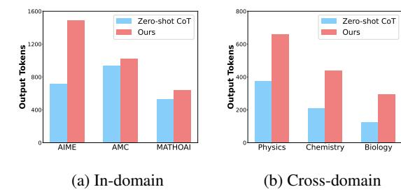
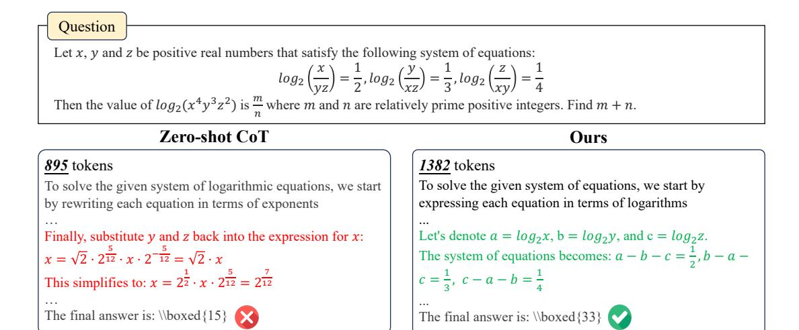
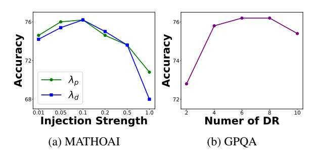
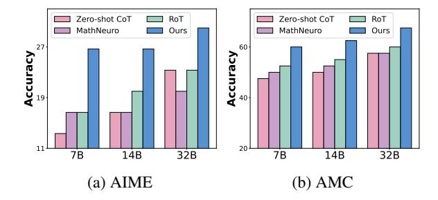

# **4.2** Question-Aware Domain-Specific Representation

After injecting the representation of the long CoT reasoning pattern, LLMs can be steered to generate long CoTs at inference. However, as stated in Section 3.2 ("Analysis of Domain-Specific Representations"), reasoning patterns only are not enough. For effective long CoT reasoning, domain-specific information is also important. Therefore, we propose to extract domain-specific representations and construct a representation memory. Note that the memory is constructed from vanilla CoT data, which is easy to obtain. At inference time, to provide domain-specific information for long CoT reasoning, we retrieve representations relevant to the question and inject them into LLMs. In the following part, we detail these two components.

Domain-Specific Representation Memory. Since domain-specific information is shared across long and vanilla CoTs, we propose to collect them using only vanilla CoTs, which can be easily obtained through methods like zero-shot prompting (e.g., "Let's think step by step."). Then, we can construct a representation memory for relevant information retrieval at inference time. Specifically, for a question  $x_i$  and its associated vanilla CoT  $s_i$ , we extract the representation of the question  $R_L(x_i)$  as the key of the memory and the representation of the question combined with the CoT  $R_L(s_i)$  as the value of the memory.

Question-Aware Representation Retrieval. With

the domain-specific representation memory, we can retrieve representations relevant to the specific question for better long CoT reasoning. Specifically, for a question x, we extract its representation as the query to retrieve top-k representations from the memory. The retrieval is implemented by first calculating cosine similarity between the query and keys and then extracting the corresponding values with the highest similarity values. To highlight common information, we further average the kretrieved representations. Finally, we follow the method in Section 4.1 to inject the domain-specific representation d into LLMs. Different from Section 4.1, we choose to inject into the final token position, as it can influence the generation of the next token while preserving the encoding of previous tokens. It can be represented as follows:

$$\tilde{h}_L^{-1} = h_L^{-1} + \lambda_d \cdot d, \tag{6}$$

$$\tilde{h}_L^{-1} = \tilde{h}_L^{-1} \cdot \frac{\|h_L^{-1}\|_2}{\|\tilde{h}_L^{-1}\|_2},\tag{7}$$

where  $\lambda_d$  is the hyperparameter controlling the strength of injection.

## 5 Experiments

In this section, we first set up the experiments, then report the results and conduct a detailed analysis.

### 5.1 Experimental Setup

**CoT Examples Construction.** To obtain vanilla and long CoT examples, we utilize open-source

| Scenarios   |               | In-domain       |        |       | Cross-domain |         |           |         |         |
|-------------|---------------|-----------------|--------|-------|--------------|---------|-----------|---------|---------|
|             |               | Math BenchMarks |        |       |              | GPQA    |           |         |         |
| 1           | ask           | MATHOAI         | AIME24 | AMC23 | Average      | Physics | Chemistry | Biology | Overall |
|             | Zero-shot CoT | 72.80           | 13.33  | 47.50 | 44.54        | 38.37   | 22.58     | 36.84   | 30.81   |
|             | Few-shot CoT  | 69.80           | 6.67   | 42.50 | 39.66        | 33.72   | 20.43     | 26.32   | 26.77   |
|             | BoostStep     | 70.80           | 10.00  | 45.00 | 41.93        | 34.88   | 23.66     | 21.05   | 28.28   |
| Qwen2.5-7B  | MathNeuro     | 73.60           | 16.67  | 50.00 | 46.76        | 37.21   | 22.58     | 36.84   | 30.30   |
| -Instruct   | RoT           | 73.80           | 16.67  | 52.50 | 47.66        | 41.86   | 23.66     | 42.11   | 33.33   |
|             | SFT           | 74.80           | 23.33  | 60.00 | 52.71        | 44.19   | 23.66     | 52.63   | 35.35   |
|             | GLoRE         | 76.20           | 26.67  | 60.00 | 54.29        | 46.51   | 25.81     | 42.11   | 36.36   |
|             | Zero-shot CoT | 48.20           | 3.33   | 30.00 | 27.18        | 19.77   | 16.13     | 42.11   | 20.20   |
|             | Few-shot CoT  | 45.60           | 6.67   | 27.50 | 26.59        | 22.09   | 15.05     | 36.84   | 20.20   |
|             | BoostStep     | 47.60           | 6.67   | 25.00 | 26.42        | 20.93   | 18.28     | 36.84   | 21.21   |
| Llama3.1-8B | MathNeuro     | 49.00           | 10.00  | 30.00 | 29.67        | 22.09   | 22.58     | 47.37   | 24.75   |
| -Instruct   | RoT           | 49.40           | 10.00  | 32.50 | 30.63        | 24.42   | 23.66     | 42.11   | 25.76   |
|             | SFT           | 50.20           | 13.33  | 35.00 | 32.84        | 26.88   | 27.96     | 47.37   | 29.29   |
|             | GLoRE         | 51.60           | 16.67  | 35.00 | 34.42        | 27.91   | 29.03     | 47.37   | 30.30   |

Table 1: Performance comparison in both in-domain and cross-domain scenarios using Qwen2.5-7B-Instruct and Llama3.1-8B-Instruct. The best method in each group is marked in **bold**.

data from STILL-2 (Min et al., 2024), which is a high-quality dataset distilled from DeepSeek-R1-Lite-Preview (Guo et al., 2025). From this dataset, we randomly select 100 examples from the mathematics, physics, chemistry, and biology domains, respectively.

**Datasets.** To comprehensively evaluate the efficacy of our proposed method, we conduct experiments in two scenarios: in-domain and cross-domain. For the in-domain scenario, we evaluate our method on several challenging open-source mathematical benchmarks, including MATHOAI (Lightman et al., 2024), AIME2024, and AMC2023. For the cross-domain scenario, we utilize the GPQA (Rein et al., 2024) dataset, which is a challenging multiple-choice benchmark crafted by domain experts in physics, chemistry, and biology. In this paper, we use the highest quality diamond set for evaluation following Li et al. (2025).

**Baselines.** To facilitate a systematic comparison, we select several representative methods, including prompting-based approaches (*i.e.*, Zeroshot CoT, Few-shot CoT, and BoostStep (Zhang et al., 2025)), neuron activation method (*i.e.*, Math-Neuro (Christ et al., 2024)), representation engineering method (*i.e.*, RoT (Hu et al., 2024)), and supervised fine-tuning method. Detailed descriptions of these baselines are provided in Appendix E.

**Implementation Details.** In our experiments, we use two representative open-source LLMs:

> **[图片提取文字 (无描述)]:**
> 1600 Zero-shot CoT Zero-shot CoT Ours Ours Output Tokens Output Tokens 400 AIME AMC MATHOAI Physics Chemistry Biology (a) In-domain (b) Cross-domain

Figure 4: The average number of output tokens generated by Qwen2.5-7B-Instruct.

Qwen2.5-7B-Instruct (Yang et al., 2024) and Llama3.1-8B-Instruct (Dubey et al., 2024). For the contrastive reasoning pattern representation, we set the injection strength  $\lambda_p$  as 0.1. For the question-aware domain-specific representation, we set the number of retrieved representations k as 8 and the injection strength  $\lambda_d$  as 0.1. Both representations are injected into the intermediate layer of LLMs. Following the existing work (Li et al., 2023b; Wang et al., 2024; Cheng et al., 2024b), we use the greedy decoding strategy for inference.

## 5.2 Experimental Results

The experimental results are presented in Table 1. As we can see, the few-shot CoT method (*i.e.*, few-shot CoT and BoostStep) performs poorly, even worse than the zero-shot CoT. The main reason is that LLMs lose their ability to learn from demonstrations after supervised fine-tuning (Wei et al., 2023). Adding examples at the discrete token level

| Task   | MAT                     | HOAI                     | GPQA                    |                          |  |
|--------|-------------------------|--------------------------|-------------------------|--------------------------|--|
| Model  | Qwen2.5-7B -Instruct | Llama3.1-8B -Instruct | Qwen2.5-7B -Instruct | Llama3.1-8B -Instruct |  |
| GLoRE  | 76.20                   | 51.60                    | 36.36                   | 30.30                    |  |
| w/o CR | 73.40                   | 49.80                    | 33.84                   | 25.76                    |  |
| w VR   | 73.60                   | 50.00                    | 33.84                   | 26.26                    |  |
| w LR   | 75.40                   | 51.20                    | 35.35                   | 30.30                    |  |
| w/o DR | 74.20                   | 50.60                    | 32.32                   | 26.77                    |  |
| w LDR  | 76.40                   | 51.60                    | 37.88                   | 29.80                    |  |

Table 2: Ablation study on MATHOAI and GPQA datasets. "CR", "VR", "LR", "DR" and "LDR" denote contrastive reasoning pattern representation, vanilla CoT representation, long CoT representation, question-aware domain-specific vanilla, and long CoT representation.

can increase input length, which distracts the model from the current problem and disrupts the inference process (Dong et al., 2024b; Peng et al., 2025). In contrast, MathNeuro can improve performance by identifying and scaling relevant neurons, but it focuses solely on specific neuron connections, neglecting the cooperative activity of multiple neurons. To address this limitation, RoT introduces contrastive representations of CoT and non-CoT prompts, enabling fine-grained control over the reasoning process. However, this approach is insufficient to guide the model toward deliberate thinking, resulting in limited performance improvements.

Finally, **GLoRE** significantly outperforms all the training-free baselines and even surpasses the supervised fine-tuning method. Our approach first uses a contrastive reasoning pattern representation to switch the LLM to a slow thinking pattern, enabling it to engage in deep thinking and perform step-by-step reasoning. This allows **GLoRE** to generate longer and more detailed reasoning solutions, indicating that the representation effectively guides LLMs into a slow-thinking mode, as illustrated in Figure 4. Additionally, for specific problems, we leverage question-aware domain-specific representation, which provides domain-specific information during inference to achieve fine-grained control over the reasoning process.

#### 5.3 Detailed Analysis

In this part, we construct a detailed analysis of the effectiveness and efficiency of our approach.

## 5.3.1 Ablation Study

Our approach incorporates two key components to activate the long CoT reasoning capabilities of LLMs. To validate each component of our proposed method, we conduct an ablation study by

| Methods | Zero-shot | Few-shot               | BoostStep               | GLoRE              |
|---------|-----------|------------------------|-------------------------|--------------------|
| T.C.    | $O(p^2)$  | $\mathcal{O}((d+p)^2)$ | $\mathcal{O}(n(d+p)^2)$ | $\mathcal{O}(p^2)$ |

Table 3: The efficiency analysis of **GLoRE** and previous work. Here, "T.C." is the time complexity, d, p and n denote the length of the demonstrations, the length of the problem and the number of the reasoning steps.

removing or replacing the contrastive reasoning pattern and question-aware domain-specific representation on MATHOAI and GPQA datasets.

The results are presented in Table 2. We can see that removing any component would lead to performance degradation, indicating that all the components in our method are helpful. Specifically, for the contrastive reasoning pattern representation, we compare the effects of injecting only the representation of vanilla CoT or long CoT and observe that both lead to performance degradation. In particular, injecting only vanilla CoT representation significantly reduces performance, as the model fails to transition into a slow-thinking mode. For the question-aware domain-specific representation, we observe that injecting long CoT domainspecific thought achieves performance comparable to vanilla CoT. This indicates that our method can effectively leverage vanilla CoT from other domains, highlighting its cost efficiency.

### 5.3.2 The Efficiency of GLoRE

In this part, We discuss the efficiency of **GLoRE**, as shown in Table 3. First, the few-shot CoT method incorporates additional demonstrations in the input, which leads to the increased inference time. This is because the time complexity of the Transformer scales quadratically with the length of the input sequence (Dong et al., 2025a; Zhan et al., 2024; Liu et al., 2025). Additionally, BoostStep decomposes the reasoning process into multiple substeps and guides the model with relevant examples at each step. This requires the model to perform multiple reasoning iterations for a single problem, further increasing the computational overhead. In contrast, GLoRE maintains the same time complexity as zero-shot CoT, which is significantly lower than few-shot CoT and BoostStep. We extract representation from the model's latent space and inject them during inference, without reducing the reasoning efficiency. This demonstrates that GLoRE can significantly enhance reasoning capabilities through representation engineering while preserving computational efficiency.

> **[图片提取文字 (无描述)]:**
> Question Let x, y and z be positive real numbers that satisfy the following system of equations:  $log_2\left(\frac{x}{yz}\right) = \frac{1}{2}, log_2\left(\frac{y}{yz}\right) = \frac{1}{3}, log_2\left(\frac{z}{yy}\right) = \frac{1}{4}$ Then the value of  $log_2(x^4y^3z^2)$  is  $\frac{m}{n}$  where m and n are relatively prime positive integers. Find m+n. Zero-shot CoT Ours 895 tokens *1382* tokens To solve the given system of logarithmic equations, we start To solve the given system of equations, we start by by rewriting each equation in terms of exponents expressing each equation in terms of logarithms Finally, substitute y and z back into the expression for x: Let's denote  $a = log_2 x$ ,  $b = log_2 y$ , and  $c = log_2 z$ . The system of equations becomes:  $a - b - c = \frac{1}{2}$ ,  $b - a - c = \frac{1}{2}$  $x = \sqrt{2} \cdot 2^{\frac{5}{12}} \cdot x \cdot 2^{-\frac{5}{12}} = \sqrt{2} \cdot x$ This simplifies to:  $x = 2\frac{1}{2} \cdot x \cdot 2\frac{5}{12} = 2\frac{7}{12}$  $c = \frac{1}{3}$ ,  $c - a - b = \frac{1}{4}$ The final answer is: \\boxed{15} The final answer is: \\boxed{33}

Figure 5: A specific example of how our method activates the long CoT reasoning capabilities of LLMs.

> **[图片提取文字 (无描述)]:**
> 76 76 Accuracy 74 68 72 Injection Strength Numer of DR 0.01 10 (a) MATHOAI

Figure 6: Performance comparison w.r.t. the inject strength  $\lambda_p$  and  $\lambda_d$ , and the number of retrieved domain-specific representations k on the MATHOAI dataset using Qwen2.5-7B-Instruct. Here, "DR" denotes the retrieved question-aware domain-specific representation.

## 5.3.3 Hyper-parameters Analysis

**GLoRE** includes a few hyper-parameters to tune. In this part, we report the tuning results of three hyper-parameters: the injection strength for contrastive reasoning pattern representation  $(\lambda_p)$  and question-aware domain-specific representation  $(\lambda_d)$ , and the number of retrieved representations k. The results are shown in Figure 6.

We find that the performance is optimal when both injection strengths are set to 0.1. If the injection strength is too small, the model cannot effectively perceive the intervention of the representations, preventing it from engaging in slow thinking or incorporating domain-specific information. Conversely, if the injection strength is too large, the injected representations may disrupt the original semantic information of the model, leading to performance degradation. Additionally, we observe that **GLoRE** achieves the best performance when the number of similar representations is set to 8. If

> **[图片提取文字 (无描述)]:**
> Zero-shot CoT Zero-shot CoT RoT RoT MathNeuro Ours MathNeuro Ours Accuracy 19-Accuracy 11 **7B** 32B **7B** 32B 14B 14B (b) AMC AIME

Figure 7: Performance comparison on AIME and AMC datasets using Qwen-series LLMs.

the number is too small, the model cannot access sufficient domain-specific information to support reasoning. In contrast, if the number is too large, irrelevant information may be introduced, which can interfere with the reasoning process.

#### **5.3.4** Experiments on Larger Models

In this part, we conduct experiments on Qwenseries LLMs using AIME and AMC datasets. As illustrated in Figure 7, **GLoRE** consistently outperforms all other baselines. This further demonstrates the effectiveness of our proposed method.

