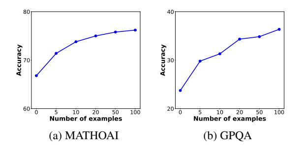
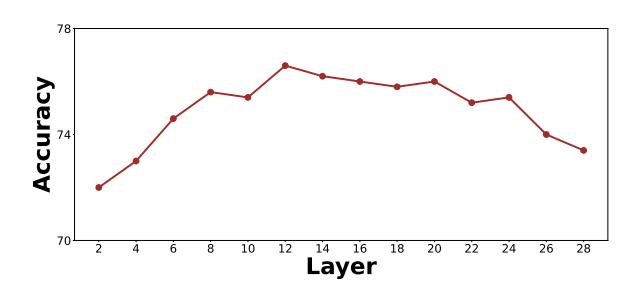

# **5.3.5** The Effect of the Representation Memory Size

In this part, we investigate the impact of scaling the representation memory size on **GLoRE**. The results are illustrated in 8. As we can see, the performance consistently improves as the number of examples in the representation memory increases. This improvement can be attributed to two main reasons. On one hand, when computing the average representation of the contrastive reasoning pattern representation, using a larger num-

> **[图片提取文字 (无描述)]:**
> Accuracy 107 Accuracy 08 Number of examples Number of examples (a) MATHOAI

Figure 8: Accuracy with increasing numbers of examples in the representation memory on the MATHOAI and GPQA datasets using Qwen2.5-7B-Instruct.

> **[图片提取文字 (无描述)]:**
> Accuracy Layer

Figure 9: Performance comparison of the injection layer L on the MATHOAI dataset using Qwen2.5-7B-Instruct.

ber of demonstrations helps better isolate problemspecific information, resulting in more precise highlevel long CoT pattern representations. On the other hand, when extracting and injecting domainspecific features, the increased representation memory provides the model with access to more relevant question-aware domain-specific representations, enabling fine-grained refinement of the reasoning process in specific domains.

## 5.3.6 The Impact of Layer Selection

In this section, we explore the impact of layer selection. We conduct experiments across different layers on the MATHOAI dataset using Qwen2.5- 7B-Instruct. The results are presented in Figure [9.](#page-8-2) Our method exhibits a performance peak at the middle layer, with performance improving as the number of layers increases initially, but plateauing or declining in later layers. Additionally, our method is not significantly affected by the layer selection, which demonstrates its robustness.

## 5.3.7 Case Study

In this part, we demonstrate a specific example of how GLoRE activates the long CoT reasoning capabilities of LLMs. The case study example is illustrated in Figure [5.](#page-7-2) Overall, compared to the zero-shot CoT method, GLoRE can encour-

age LLMs to generate more intermediate reasoning steps, enabling them to engage in deliberate thinking. Specifically, the zero-shot CoT method directly converts y and z into x, leading to errors in complex variable substitution and simplification, which disrupts the reasoning chain and results in calculation mistakes. In contrast, GLoRE introduces intermediate variables to simplify the reasoning process and structures the problem-solving approach in a step-by-step manner. This approach helps maintain logical consistency throughout the reasoning process, significantly activating the long CoT reasoning capabilities of LLMs on complex reasoning problems.

## 6 Conclusion

In this work, we conduct an empirical analysis for the mechanism of long CoT reasoning from the perspective of representation. Our findings reveal that long CoT reasoning appears to be a general capability potentially encoded in LLMs. Inspired by this, we propose a novel training-free method based on representation engineering, which can effectively and efficiently unleash the general long CoT reasoning capabilities of LLMs. Overall, our work provides a deeper understanding of long CoT reasoning, paving the way for transparent and interpretable slow-thinking reasoning models.

## 7 Limitations

One limitation of our work is that our method requires access to the internal representations of the model, making it infeasible for closed-source LLMs. In addition, due to the constraints of our cost and resources, we only conduct experiments on representative tasks and LLMs.

## Acknowledgements

This work was partially supported by National Natural Science Foundation of China under Grant No. 92470205 and 62222215, Beijing Municipal Science and Technology Project under Grant No. Z231100010323009, Beijing Natural Science Foundation under Grant No. L233008, and Ant Group. Xin Zhao is the corresponding author.

