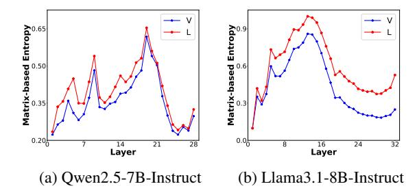

# References

Andy Arditi, Oscar Obeso, Aaquib Syed, Daniel Paleka, Nina Panickssery, Wes Gurnee, and Neel Nanda. 2024. Refusal in language models is mediated by a single direction. In *NeurIPS*.

- Yuanpu Cao, Tianrong Zhang, Bochuan Cao, Ziyi Yin, Lu Lin, Fenglong Ma, and Jinghui Chen. 2024. Personalized steering of large language models: Versatile steering vectors through bi-directional preference optimization. In *NeurIPS*.
- Xiaoxue Cheng, Junyi Li, Wayne Xin Zhao, and Ji-Rong Wen. 2024a. Chainlm: Empowering large language models with improved chain-of-thought prompting. In *LREC/COLING*, pages 2969–2983. ELRA and ICCL.
- Xiaoxue Cheng, Junyi Li, Wayne Xin Zhao, and Ji-Rong Wen. 2025. Think more, hallucinate less: Mitigating hallucinations via dual process of fast and slow thinking. *CoRR*, abs/2501.01306.
- Xiaoxue Cheng, Junyi Li, Xin Zhao, Hongzhi Zhang, Fuzheng Zhang, Di Zhang, Kun Gai, and Ji-Rong Wen. 2024b. Small agent can also rock! empowering small language models as hallucination detector. In *EMNLP*, pages 14600–14615. Association for Computational Linguistics.
- Bryan R. Christ, Zack Gottesman, Jonathan Kropko, and Thomas Hartvigsen. 2024. Math neurosurgery: Isolating language models' math reasoning abilities using only forward passes. *CoRR*, abs/2410.16930.
- Zican Dong, Junyi Li, Jinhao Jiang, Mingyu Xu, Wayne Xin Zhao, Bingning Wang, and Weipeng Chen. 2025a. Longred: Mitigating short-text degradation of long-context large language models via restoration distillation. *CoRR*, abs/2502.07365.
- Zican Dong, Junyi Li, Xin Men, Xin Zhao, Bingning Wang, Zhen Tian, Weipeng Chen, and Ji-Rong Wen. 2024a. Exploring context window of large language models via decomposed positional vectors. In *NeurIPS*.
- Zican Dong, Han Peng, Peiyu Liu, Wayne Xin Zhao, Dong Wu, Feng Xiao, and Zhifeng Wang. 2025b. Domain-specific pruning of large mixture-of-experts models with few-shot demonstrations. *arXiv preprint arXiv:2504.06792*.
- Zican Dong, Tianyi Tang, Junyi Li, Wayne Xin Zhao, and Ji-Rong Wen. 2024b. BAMBOO: A comprehensive benchmark for evaluating long text modeling capacities of large language models. In *LREC/COLING*, pages 2086–2099. ELRA and ICCL.
- Yifan Du, Zikang Liu, Yifan Li, Wayne Xin Zhao, Yuqi Huo, Bingning Wang, Weipeng Chen, Zheng Liu, Zhongyuan Wang, and Ji-Rong Wen. 2025. Virgo: A preliminary exploration on reproducing o1-like mllm. *arXiv preprint arXiv:2501.01904*.
- Abhimanyu Dubey, Abhinav Jauhri, Abhinav Pandey, Abhishek Kadian, Ahmad Al-Dahle, Aiesha Letman, Akhil Mathur, Alan Schelten, Amy Yang, Angela Fan, Anirudh Goyal, Anthony Hartshorn, Aobo Yang, Archi Mitra, Archie Sravankumar, Artem Korenev, Arthur Hinsvark, Arun Rao, Aston Zhang, Aurélien

- Rodriguez, Austen Gregerson, Ava Spataru, Baptiste Rozière, Bethany Biron, Binh Tang, Bobbie Chern, Charlotte Caucheteux, Chaya Nayak, Chloe Bi, Chris Marra, Chris McConnell, Christian Keller, Christophe Touret, Chunyang Wu, Corinne Wong, Cristian Canton Ferrer, Cyrus Nikolaidis, Damien Allonsius, Daniel Song, Danielle Pintz, Danny Livshits, David Esiobu, Dhruv Choudhary, Dhruv Mahajan, Diego Garcia-Olano, Diego Perino, Dieuwke Hupkes, Egor Lakomkin, Ehab AlBadawy, Elina Lobanova, Emily Dinan, Eric Michael Smith, Filip Radenovic, Frank Zhang, Gabriel Synnaeve, Gabrielle Lee, Georgia Lewis Anderson, Graeme Nail, Grégoire Mialon, Guan Pang, Guillem Cucurell, Hailey Nguyen, Hannah Korevaar, Hu Xu, Hugo Touvron, Iliyan Zarov, Imanol Arrieta Ibarra, Isabel M. Kloumann, Ishan Misra, Ivan Evtimov, Jade Copet, Jaewon Lee, Jan Geffert, Jana Vranes, Jason Park, Jay Mahadeokar, Jeet Shah, Jelmer van der Linde, Jennifer Billock, Jenny Hong, Jenya Lee, Jeremy Fu, Jianfeng Chi, Jianyu Huang, Jiawen Liu, Jie Wang, Jiecao Yu, Joanna Bitton, Joe Spisak, Jongsoo Park, Joseph Rocca, Joshua Johnstun, Joshua Saxe, Junteng Jia, Kalyan Vasuden Alwala, Kartikeya Upasani, Kate Plawiak, Ke Li, Kenneth Heafield, Kevin Stone, and et al. 2024. The llama 3 herd of models. *CoRR*, abs/2407.21783.
- Alaaeldin El-Nouby, Michal Klein, Shuangfei Zhai, Miguel Ángel Bautista, Vaishaal Shankar, Alexander T. Toshev, Joshua M. Susskind, and Armand Joulin. 2024. Scalable pre-training of large autoregressive image models. In *ICML*. OpenReview.net.
- Siqi Fan, Xin Jiang, Xiang Li, Xuying Meng, Peng Han, Shuo Shang, Aixin Sun, Yequan Wang, and Zhongyuan Wang. 2024. Not all layers of llms are necessary during inference. *CoRR*, abs/2403.02181.
- Luis Gonzalo Sánchez Giraldo, Murali Rao, and José C. Príncipe. 2015. Measures of entropy from data using infinitely divisible kernels. *IEEE Trans. Inf. Theory*, 61(1):535–548.
- Xinyu Guan, Li Lyna Zhang, Yifei Liu, Ning Shang, Youran Sun, Yi Zhu, Fan Yang, and Mao Yang. 2025. rstar-math: Small llms can master math reasoning with self-evolved deep thinking. *arXiv preprint arXiv:2501.04519*.
- Daya Guo, Dejian Yang, Haowei Zhang, Junxiao Song, Ruoyu Zhang, Runxin Xu, Qihao Zhu, Shirong Ma, Peiyi Wang, Xiao Bi, et al. 2025. Deepseek-r1: Incentivizing reasoning capability in llms via reinforcement learning. *arXiv preprint arXiv:2501.12948*.
- Roee Hendel, Mor Geva, and Amir Globerson. 2023. In-context learning creates task vectors. In *EMNLP (Findings)*, pages 9318–9333. Association for Computational Linguistics.
- Bertram Højer, Oliver Simon Jarvis, and Stefan Heinrich. 2025. [Improving reasoning performance in](https://openreview.net/forum?id=IssPhpUsKt) [large language models via representation engineer](https://openreview.net/forum?id=IssPhpUsKt)[ing.](https://openreview.net/forum?id=IssPhpUsKt) In *The Thirteenth International Conference on Learning Representations*.

- Oskar John Hollinsworth, Curt Tigges, Atticus Geiger, and Neel Nanda. 2024. [Language models linearly](https://doi.org/10.18653/v1/2024.blackboxnlp-1.5) [represent sentiment.](https://doi.org/10.18653/v1/2024.blackboxnlp-1.5) In *Proceedings of the 7th BlackboxNLP Workshop: Analyzing and Interpreting Neural Networks for NLP*, pages 58–87, Miami, Florida, US. Association for Computational Linguistics.
- John J Hopfield. 1982. Neural networks and physical systems with emergent collective computational abilities. *Proceedings of the national academy of sciences*, 79(8):2554–2558.
- Lijie Hu, Liang Liu, Shu Yang, Xin Chen, Zhen Tan, Muhammad Asif Ali, Mengdi Li, and Di Wang. 2024. Understanding reasoning in chain-of-thought from the hopfieldian view. *CoRR*, abs/2410.03595.
- Kenneth Li, Oam Patel, Fernanda B. Viégas, Hanspeter Pfister, and Martin Wattenberg. 2023a. Inferencetime intervention: Eliciting truthful answers from a language model. In *NeurIPS*.
- Xiaoxi Li, Guanting Dong, Jiajie Jin, Yuyao Zhang, Yujia Zhou, Yutao Zhu, Peitian Zhang, and Zhicheng Dou. 2025. Search-o1: Agentic searchenhanced large reasoning models. *arXiv preprint arXiv:2501.05366*.
- Yifan Li, Yifan Du, Kun Zhou, Jinpeng Wang, Wayne Xin Zhao, and Ji-Rong Wen. 2023b. Evaluating object hallucination in large vision-language models. In *EMNLP*, pages 292–305. Association for Computational Linguistics.
- Yifan Li, Hangyu Guo, Kun Zhou, Wayne Xin Zhao, and Ji-Rong Wen. 2024. Images are achilles' heel of alignment: Exploiting visual vulnerabilities for jailbreaking multimodal large language models. In *ECCV (73)*, volume 15131 of *Lecture Notes in Computer Science*, pages 174–189. Springer.
- Hunter Lightman, Vineet Kosaraju, Yuri Burda, Harrison Edwards, Bowen Baker, Teddy Lee, Jan Leike, John Schulman, Ilya Sutskever, and Karl Cobbe. 2024. Let's verify step by step. In *ICLR*. Open-Review.net.
- Sheng Liu, Haotian Ye, Lei Xing, and James Y. Zou. 2024. In-context vectors: Making in context learning more effective and controllable through latent space steering. In *ICML*. OpenReview.net.
- Yurou Liu, Jiahao Chen, Rui Jiao, Jiangmeng Li, Wenbing Huang, and Bing Su. 2025. [DenoiseVAE:](https://openreview.net/forum?id=ym7pr83XQr) [Learning molecule-adaptive noise distributions for](https://openreview.net/forum?id=ym7pr83XQr) [denoising-based 3d molecular pre-training.](https://openreview.net/forum?id=ym7pr83XQr) In *The Thirteenth International Conference on Learning Representations*.
- Yingqian Min, Zhipeng Chen, Jinhao Jiang, Jie Chen, Jia Deng, Yiwen Hu, Yiru Tang, Jiapeng Wang, Xiaoxue Cheng, Huatong Song, Wayne Xin Zhao, Zheng Liu, Zhongyuan Wang, and Ji-Rong Wen. 2024. Imitate, explore, and self-improve: A reproduction report on slow-thinking reasoning systems. *CoRR*, abs/2412.09413.

- OpenAI. 2024. [Learning to reason with llms.](https://openai.com/index/learning-to-reason-with-llms/)
- Bo Pang, Hanze Dong, Jiacheng Xu, Silvio Savarese, Yingbo Zhou, and Caiming Xiong. 2025. Bolt: Bootstrap long chain-of-thought in language models without distillation. *arXiv preprint arXiv:2502.03860*.
- Han Peng, Jinhao Jiang, Zican Dong, Wayne Xin Zhao, and Lei Fang. 2025. [Cafe: Retrieval head-based](https://arxiv.org/abs/2505.10063) [coarse-to-fine information seeking to enhance multi](https://arxiv.org/abs/2505.10063)[document qa capability.](https://arxiv.org/abs/2505.10063) *Preprint*, arXiv:2505.10063.
- Daking Rai and Ziyu Yao. 2024. An investigation of neuron activation as a unified lens to explain chainof-thought eliciting arithmetic reasoning of llms. In *ACL (1)*, pages 7174–7193. Association for Computational Linguistics.
- David Rein, Betty Li Hou, Asa Cooper Stickland, Jackson Petty, Richard Yuanzhe Pang, Julien Dirani, Julian Michael, and Samuel R. Bowman. 2024. GPQA: A graduate-level google-proof q&a benchmark. In *First Conference on Language Modeling*.
- Daniel Scalena, Gabriele Sarti, and Malvina Nissim. 2024. Multi-property steering of large language models with dynamic activation composition. *CoRR*, abs/2406.17563.
- Oscar Skean, Md Rifat Arefin, Dan Zhao, Niket Patel, Jalal Naghiyev, Yann LeCun, and Ravid Shwartz-Ziv. 2025. [Layer by layer: Uncovering hid](https://arxiv.org/abs/2502.02013)[den representations in language models.](https://arxiv.org/abs/2502.02013) *Preprint*, arXiv:2502.02013.
- Alessandro Stolfo, Vidhisha Balachandran, Safoora Yousefi, Eric Horvitz, and Besmira Nushi. 2025. [Im](https://openreview.net/forum?id=wozhdnRCtw)[proving instruction-following in language models](https://openreview.net/forum?id=wozhdnRCtw) [through activation steering.](https://openreview.net/forum?id=wozhdnRCtw) In *The Thirteenth International Conference on Learning Representations*.
- Xinyu Tang, Xiaolei Wang, Wayne Xin Zhao, Siyuan Lu, Yaliang Li, and Ji-Rong Wen. 2024a. Unleashing the potential of large language models as prompt optimizers: An analogical analysis with gradientbased model optimizers. *CoRR*, abs/2402.17564.
- Xinyu Tang, Xiaolei Wang, Wayne Xin Zhao, and Ji-Rong Wen. 2024b. DAWN-ICL: strategic planning of problem-solving trajectories for zero-shot in-context learning. *CoRR*, abs/2410.20215.
- Kimi Team, Angang Du, Bofei Gao, Bowei Xing, Changjiu Jiang, Cheng Chen, Cheng Li, Chenjun Xiao, Chenzhuang Du, Chonghua Liao, et al. 2025. Kimi k1. 5: Scaling reinforcement learning with llms. *arXiv preprint arXiv:2501.12599*.
- Laurens van der Maaten and Geoffrey Hinton. 2008. [Visualizing data using t-sne.](http://jmlr.org/papers/v9/vandermaaten08a.html) *Journal of Machine Learning Research*, 9(86):2579–2605.
- Ashish Vaswani, Noam Shazeer, Niki Parmar, Jakob Uszkoreit, Llion Jones, Aidan N. Gomez, Lukasz Kaiser, and Illia Polosukhin. 2017. Attention is all you need. In *NIPS*, pages 5998–6008.

- Dimitri von Rütte, Sotiris Anagnostidis, Gregor Bachmann, and Thomas Hofmann. 2024. A language model's guide through latent space. In *ICML*. Open-Review.net.
- Yuhao Wang, Ruiyang Ren, Junyi Li, Xin Zhao, Jing Liu, and Ji-Rong Wen. 2024. REAR: A relevance-aware retrieval-augmented framework for open-domain question answering. In *EMNLP*, pages 5613–5626. Association for Computational Linguistics.
- Yuhao Wang, Ruiyang Ren, Yucheng Wang, Wayne Xin Zhao, Jing Liu, Hua Wu, and Haifeng Wang. 2025a. [Reinforced informativeness optimization for long](https://arxiv.org/abs/2505.20825)[form retrieval-augmented generation.](https://arxiv.org/abs/2505.20825) *Preprint*, arXiv:2505.20825.
- Yuhao Wang, Ruiyang Ren, Yucheng Wang, Wayne Xin Zhao, Jing Liu, Hua Wu, and Haifeng Wang. 2025b. Unveiling knowledge utilization mechanisms in llmbased retrieval-augmented generation. *arXiv preprint arXiv:2505.11995*.
- Lai Wei, Zihao Jiang, Weiran Huang, and Lichao Sun. 2023. Instructiongpt-4: A 200-instruction paradigm for fine-tuning minigpt-4. *CoRR*, abs/2308.12067.
- Lai Wei, Zhiquan Tan, Chenghai Li, Jindong Wang, and Weiran Huang. 2024. Large language model evaluation via matrix entropy. *CoRR*, abs/2401.17139.
- Haotian Xu, Xing Wu, Weinong Wang, Zhongzhi Li, Da Zheng, Boyuan Chen, Yi Hu, Shijia Kang, Jiaming Ji, Yingying Zhang, et al. 2025. Redstar: Does scaling long-cot data unlock better slow-reasoning systems? *arXiv preprint arXiv:2501.11284*.
- An Yang, Baosong Yang, Beichen Zhang, Binyuan Hui, Bo Zheng, Bowen Yu, Chengyuan Li, Dayiheng Liu, Fei Huang, Haoran Wei, Huan Lin, Jian Yang, Jianhong Tu, Jianwei Zhang, Jianxin Yang, Jiaxi Yang, Jingren Zhou, Junyang Lin, Kai Dang, Keming Lu, Keqin Bao, Kexin Yang, Le Yu, Mei Li, Mingfeng Xue, Pei Zhang, Qin Zhu, Rui Men, Runji Lin, Tianhao Li, Tingyu Xia, Xingzhang Ren, Xuancheng Ren, Yang Fan, Yang Su, Yichang Zhang, Yu Wan, Yuqiong Liu, Zeyu Cui, Zhenru Zhang, and Zihan Qiu. 2024. Qwen2.5 technical report. *CoRR*, abs/2412.15115.
- Yixin Ye, Zhen Huang, Yang Xiao, Ethan Chern, Shijie Xia, and Pengfei Liu. 2025. Limo: Less is more for reasoning. *arXiv preprint arXiv:2502.03387*.
- Edward Yeo, Yuxuan Tong, Morry Niu, Graham Neubig, and Xiang Yue. 2025. Demystifying long chain-of-thought reasoning in llms. *arXiv preprint arXiv:2502.03373*.
- Ping Yu, Jing Xu, Jason Weston, and Ilia Kulikov. 2024. Distilling system 2 into system 1. *CoRR*, abs/2407.06023.

- Yu-Liang Zhan, Zhong-Yi Lu, Hao Sun, and Ze-Feng Gao. 2024. Over-parameterized student model via tensor decomposition boosted knowledge distillation. In *NeurIPS*.
- Beichen Zhang, Yuhong Liu, Xiaoyi Dong, Yuhang Zang, Pan Zhang, Haodong Duan, Yuhang Cao, Dahua Lin, and Jiaqi Wang. 2025. Booststep: Boosting mathematical capability of large language models via improved single-step reasoning. *arXiv preprint arXiv:2501.03226*.
- Dan Zhang, Sining Zhoubian, Ziniu Hu, Yisong Yue, Yuxiao Dong, and Jie Tang. 2024. Rest-mcts\*: LLM self-training via process reward guided tree search. In *NeurIPS*.
- Wayne Xin Zhao, Kun Zhou, Junyi Li, Tianyi Tang, Xiaolei Wang, Yupeng Hou, Yingqian Min, Beichen Zhang, Junjie Zhang, Zican Dong, Yifan Du, Chen Yang, Yushuo Chen, Zhipeng Chen, Jinhao Jiang, Ruiyang Ren, Yifan Li, Xinyu Tang, Zikang Liu, Peiyu Liu, Jian-Yun Nie, and Ji-Rong Wen. 2023. A survey of large language models. *CoRR*, abs/2303.18223.
- Andy Zou, Long Phan, Sarah Chen, James Campbell, Phillip Guo, Richard Ren, Alexander Pan, Xuwang Yin, Mantas Mazeika, Ann-Kathrin Dombrowski, Shashwat Goel, Nathaniel Li, Michael J. Byun, Zifan Wang, Alex Mallen, Steven Basart, Sanmi Koyejo, Dawn Song, Matt Fredrikson, J. Zico Kolter, and Dan Hendrycks. 2023. Representation engineering: A top-down approach to AI transparency. *CoRR*, abs/2310.01405.

> **[图片提取文字 (无描述)]:**
> Entropy 6.0 Matrix-based Entropy 0.50 0.35 Matrix-0.20 0.0 14 Layer 21 28 Layer 32 24 (a) Qwen2.5-7B-Instruct (b) Llama3.1-8B-Instruct

Figure 10: Matrix-based entropy across all layer in Qwen2.5-7B-Instruct and Llama3.1-8b-Instruct. "V" and "L" denote the vanilla and long CoT, respectively.

