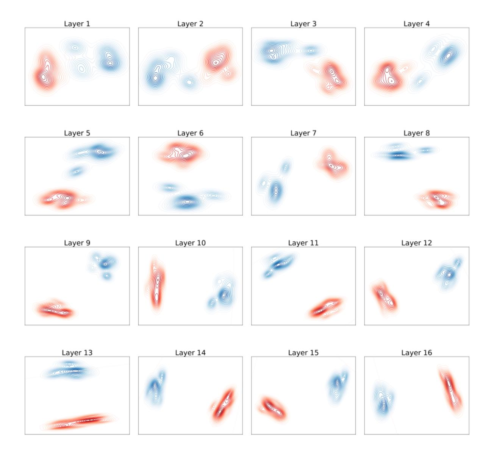
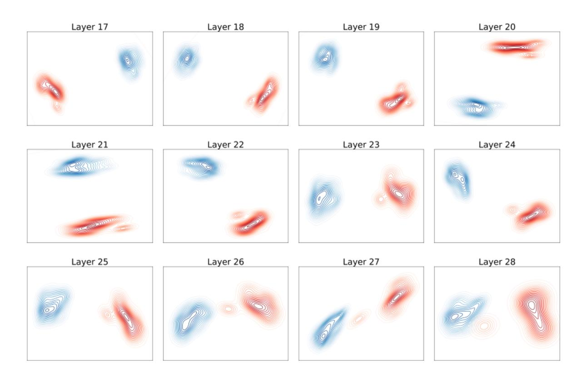
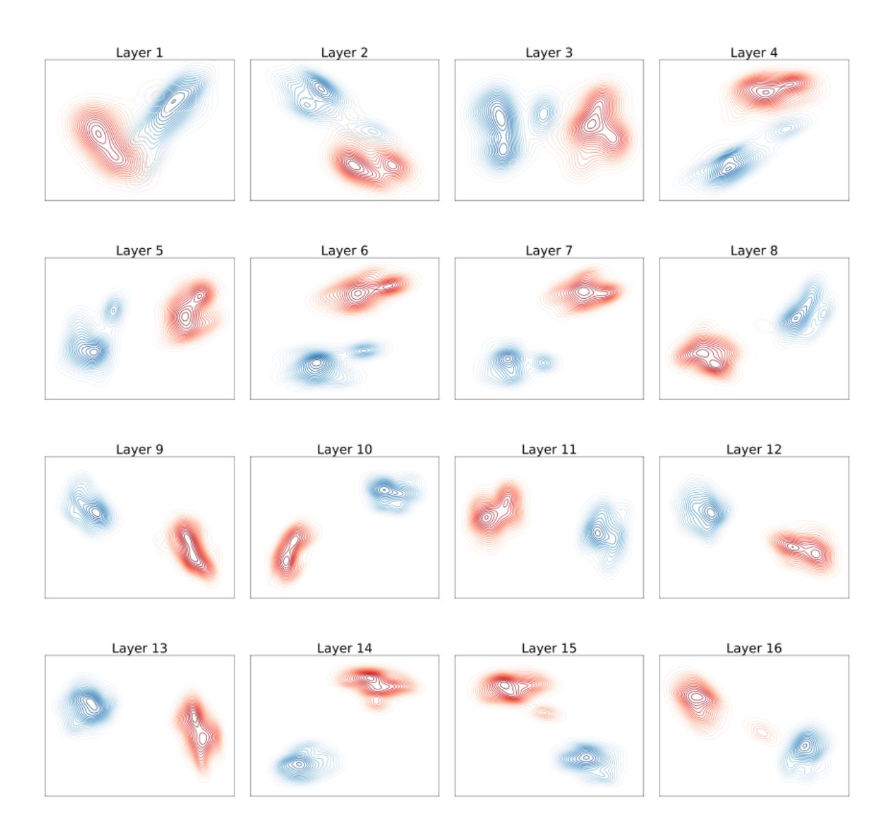
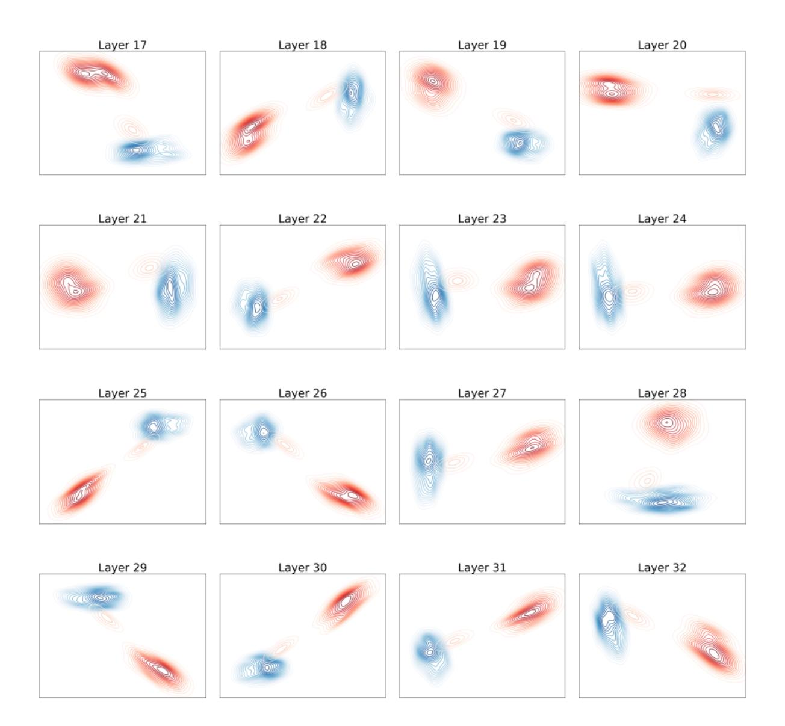
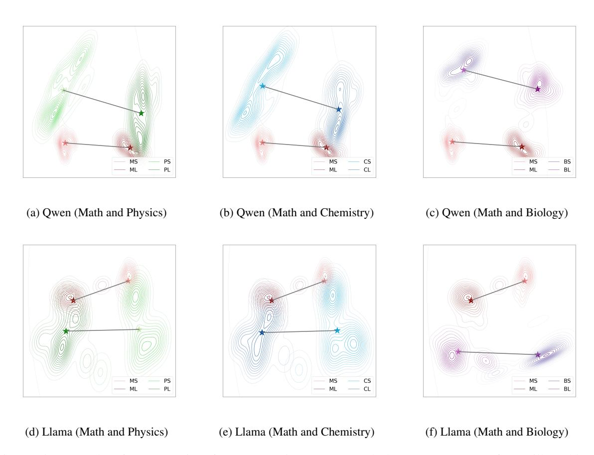

# D Detailed Visualization of Representations across Different Domains

In this section, we present detailed visualizations of vanilla and long CoT representations in the middle layers of LLMs across math and other domains (*i.e.*, physics, chemistry, and biology). The results are shown in Figure 15.

### **E** Detailed Description of Baselines.

In this part, we provide detailed descriptions of all the baselines used in our experiments. These include prompting-based approaches (*i.e.*, Zeroshot CoT, Few-shot CoT, and BoostStep (Zhang et al., 2025)), neuron activation method (*i.e.*, Math-Neuro (Christ et al., 2024)), representation engineering method (*i.e.*, RoT (Hu et al., 2024)), and supervised fine-tuning method.

- **Zero-shot CoT**: The model generates answers directly using only the problem and a CoT prompt (*i.e.*, Answer the following question step by step and put the final answer in \boxed{}) as input, without any additional demonstrations.
- <u>Few-shot CoT</u>: The model makes predictions with long CoT examples and a CoT prompt.

> **[图片提取文字 (无描述)]:**
> Layer 1 Layer 2 Layer 3 Layer 4 Layer 5 Layer 6 Layer 7 Layer 8 Layer 9 Layer 10 Layer 12 Layer 11 Layer 13 Layer 14 Layer 15 Layer 16

Figure 11: t-SNE plot of Qwen2.5-7B-Instruct's representations for vanilla (blue) and long CoTs (red) across 1-16 layers.

- BoostStep [\(Zhang et al.,](#page-11-10) [2025\)](#page-11-10): This method guides the model to perform the reasoning process incrementally and provides similar step-level examples at each reasoning step.
- MathNeuro [\(Christ et al.,](#page-9-7) [2024\)](#page-9-7) This method leverages weights and activations from the forward pass to identify and isolate specific parameters associated with reasoning capabilities, and enhances the model's reasoning performance through pruning and scaling of these parameters.
- RoT [\(Hu et al.,](#page-10-9) [2024\)](#page-10-9): This method extracts contrastive representations based on whether a CoT prompt or a non-CoT prompt is included in the input, and then injects them into the model's latent

space.

• SFT: This method employs a supervised finetuning method on 100 long-form thought samples from each of four domains and performs zero-shot CoT during inference.

> **[图片提取文字 (无描述)]:**
> Layer 17 Layer 18 Layer 19 Layer 20 Layer 22 Layer 23 Layer 21 Layer 24 Layer 25 Layer 26 Layer 27 Layer 28

Figure 12: t-SNE plot of Qwen2.5-7B-Instruct's representations for vanilla (blue) and long CoTs (red) across 17-28 layers.

> **[图片提取文字 (无描述)]:**
> Layer 3 Layer 1 Layer 2 Layer 4 Layer 5 Layer 6 Layer 7 Layer 8 Layer 9 Layer 10 Layer 11 Layer 12 Layer 13 Layer 14 Layer 15 Layer 16

Figure 13: t-SNE plot of Llama3.1-8B-Instruct's representations for vanilla (blue) and long CoTs (red) across 1-16 layers.

> **[图片提取文字 (无描述)]:**
> Layer 17 Layer 18 Layer 19 Layer 20 Layer 21 Layer 22 Layer 23 Layer 24 Layer 25 Layer 26 Layer 27 Layer 28 Layer 29 Layer 30 Layer 31 Layer 32 ഡ്രത്ത

Figure 14: t-SNE plot of Llama3.1-8B-Instruct's representations for vanilla (blue) and long CoTs (red) across 17-32 layers.

> **[图片提取文字 (无描述)]:**
> (a) Qwen (Math and Physics) (b) Qwen (Math and Chemistry) (c) Qwen (Math and Biology) (d) Llama (Math and Physics) (e) Llama (Math and Chemistry) (f) Llama (Math and Biology)

Figure 15: t-SNE plot of representations from Qwen2.5-7B-Instruct and Llama3.1-8B-Instruct for vanilla and long CoTs across math and other domains (*i.e.,* physics, chemistry and biology). "MS", "PS", "CS", and "BS" denote the vanilla CoT on the math, physics, chemistry, and biology domains, respectively. "ML", "PL", "CL", and "BL" denote the long CoT on these domains.