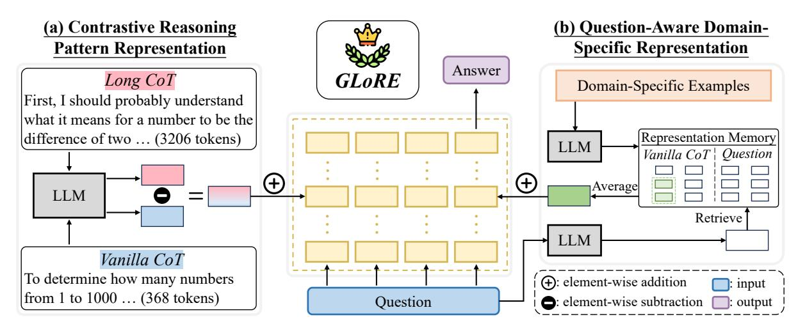

# **4.1 Contrastive Reasoning Pattern Representation**

Recall that different domains share similar contrastive representations between long and vanilla CoTs, as stated in Section 3.2 ("Analysis of General Representations"). Motivated by this finding, we propose to facilitate the transition from vanilla CoT to long CoT patterns by leveraging contrastive representations from high-resource domains (*e.g.*, mathematics). In the following part, we introduce how to extract and inject contrastive reasoning pattern representations.

**Representation Extraction.** Given a set of questions  $\mathcal{X}$  from high-resource domains, first, we extract their representations following the method in Section 3.2. Then, to enhance the transferability of extracted representations, we average the contrastive representations across all the data, abstracting away domain-specific information. Formally, we calculate the contrastive reasoning pattern representation  $p_L$  at the layer L as follows:

$$p_L = \frac{1}{|\mathcal{X}|} \sum_{i=1}^{|\mathcal{X}|} (R_L(l_i) - R_L(s_i)),$$
 (3)

where  $\mathcal{X}$  is the set of questions,  $R_L(l_i)$  and  $R_L(s_i)$  denote the representations of long and vanilla CoT at layer L, respectively.

**Representation Control.** After extracting the reasoning pattern representation, we inject it into specific layers of LLMs during the forward pass to guide LLMs towards deliberate reasoning. Since the reasoning pattern is a global behavior in the generation process, we choose to inject the representation into that of the first token, ensuring that each following token can attend to it. In addition, to preserve the original capabilities of LLMs as much as possible, we follow Liu et al. (2024) to normalize the updated representations. Formally, the updated representation  $\tilde{h}_L^0$  of the first token at the layer L is calculated as follows:

$$\tilde{h}_L^0 = h_L^0 + \lambda_p \cdot p_L, \tag{4}$$

$$\tilde{h}_L^0 = \tilde{h}_L^0 \cdot \frac{\|h_L^0\|_2}{\|\tilde{h}_L^0\|_2},\tag{5}$$

where  $\lambda_p$  is the hyperparameter controlling the strength of injection.

> **[图片提取文字 (无描述)]:**
> (a) Contrastive Reasoning (b) Question-Aware Domain-**Specific Representation Pattern Representation** Answer **GLoRE** Long CoT Domain-Specific Examples First, I should probably understand what it means for a number to be the Representation Memory difference of two ... (3206 tokens) LLM Vanilla CoT | Question Average LLM Retrieve LLM Vanilla CoT To determine how many numbers (+): element-wise addition input from 1 to 1000 ... (368 tokens) Question : element-wise subtraction : output

Figure 3: The overview of our approach **GLoRE**. It extracts contrastive reasoning pattern representations (part a) and question-aware domain-specific representations (part b) and injects them into LLMs. For part a, we derive the representations from the difference between long and vanilla CoTs. For part b, we construct a domain-specific representation memory from vanilla CoTs only and retrieve representations relevant to the question.

