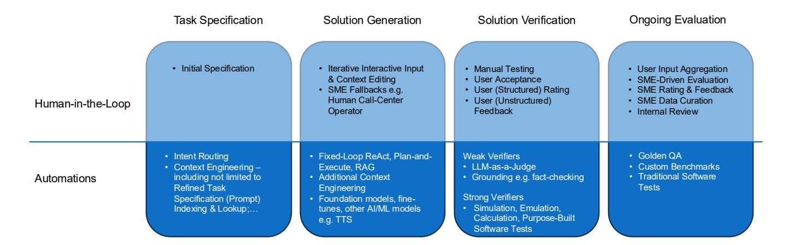

# 4.2 HIL in Verification and Evaluation

Verification mechanisms measure whether the systems output meets the correctness conditions for a specific task, problem, or input, and may be triggered online or during offline evaluation. Evaluation mechanisms measure how well the system performs on given collections of tasks or inputs and metrics over time.

Beyond software development, practitioners are recognizing and capitalizing on the tractability of the decision (action) space for known human workflows across domains, from human support systems to scientific lab routines. However, automation for recognizing (verifying) correct workflow completion is lacking in many cases. The Subject Matter Expert (SME) knowledge has not been captured to a sufficient degree in data or tooling. Hence, while the data is being captured and tooling created, deployed systems are forced to rely on end-user and/or SME verification.

The SME may no longer be the solution generator (completing the workflow manually) but they are still in the pipeline, at the verification and evaluation stages (Figure [1\)](#page-3-0). We found the pervasiveness and extent of human SME involvement across case studies surprising, given attention across academia and industry to evaluation. Capitalization [\[Foody 2025\]](#page-4-20) is indicative of a broader trend. Opportunities are still open to develop (reusable) domainspecific evaluation methods, and to improve and scale evaluation data ingestion, curation, synthetic generation, and so on.

We have also observed Agentic AI system architectures in deployment are relatively simple compared to SoA academic systems. Simple fixed-loop ReAct-based [\[Yao et al.](#page-4-21) [2023\]](#page-4-21) and RAG-based [\[Lewis](#page-4-22) [et al.](#page-4-22) [2020\]](#page-4-22) agents are common to an extreme. Clear benefits are software maintainability leading to higher reliability. Non-technical factors (e.g. education, business decisions, etc.) are of course at play. As for technical factors, given the sophistication gap between production-grade Agentic AI systems for mathematical and scientific applications and other applications with other evidence, we suspect lack of strong verifiers is key.

Verifiability implies repeatability. In practice, we have observed test-and-retry to be a common motif in production systems. Advanced production systems commonly employ sandboxing, emulation, or simulation of Agentic AI outputs during runtime and/or optimization.

> **[图片提取文字 (无描述)]:**
> Ongoing Evaluation Task Specification Solution Generation Solution Verification Initial Specification Iterative Interactive Input Manual Testing User Input Aggregation & Context Editing User Acceptance SME-Driven Evaluation · User (Structured) Rating SME Fallbacks e.g. SME Rating & Feedback Human Call-Center User (Unstructured) SME Data Curation Human-in-the-Loop Feedback Operator Internal Review Intent Routing Fixed-Loop ReAct, Plan-and-Weak Verifiers Golden QA LLM-as-a-Judge Custom Benchmarks Context Engineering – Execute, RAG Traditional Software including not limited to Grounding e.g. fact-checking Automations Additional Context Refined Task Tests Engineering Strong Verifiers Foundation models, fine-Specification (Prompt) Simulation, Emulation, Indexing & Lookup;... tunes, other AI/ML models Calculation, Purpose-Built e.g. TTS Software Tests

Figure 1: Use-cases in practice split the stages of task specification, generation, verification, and ongoing evaluation between human-in-the-loop and automated methods. Lists in each stage are example methods observed in production-track use-cases, and do not comprehensively represent the plethora of methods in the literature.

