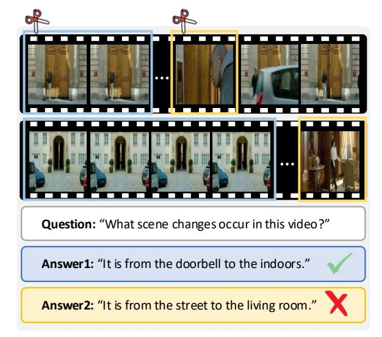
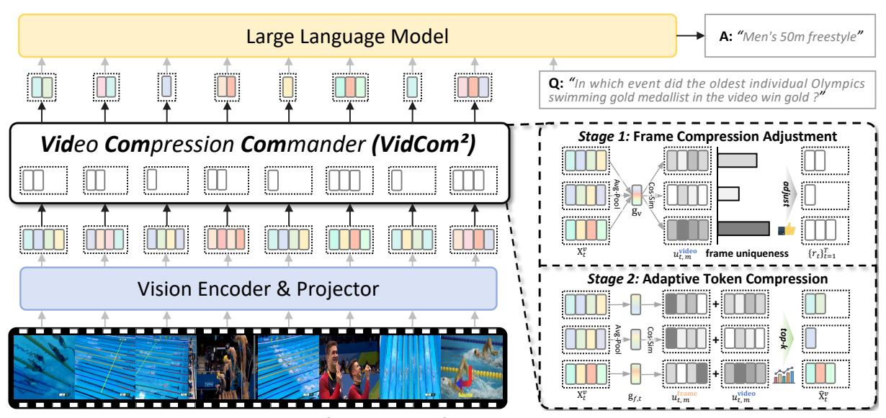
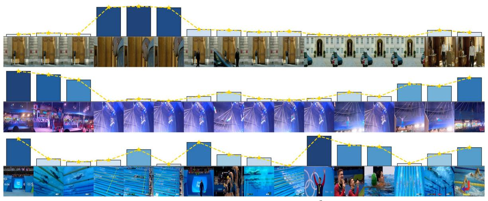
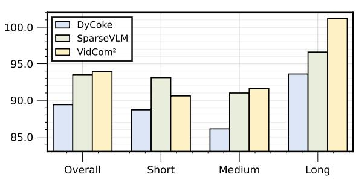

#### Video Compression Commander: Plug-and-Play Inference Acceleration for Video Large Language Models

**Xuyang Liu**1,2\* **Yiyu Wang**1\* **Junpeng Ma**3 **Linfeng Zhang**1⊠
1Shanghai Jiao Tong University 2Sichuan University 3Fudan University

#### **Abstract**

Video large language models (VideoLLM) excel at video understanding, but face efficiency challenges due to the quadratic complexity of abundant visual tokens. Our systematic analysis of token compression methods for VideoLLMs reveals two critical issues: (i) overlooking distinctive visual signals across frames, leading to information loss: (ii) suffering from implementation constraints, causing incompatibility with modern architectures or efficient operators. To address these challenges, we distill three design principles for VideoLLM token compression and propose a plug-andplay inference acceleration framework "Video Compression Commander" (VidCom2). By quantifying each frame's uniqueness, VidCom2 adaptively adjusts compression intensity across frames, effectively preserving essential information while reducing redundancy in video sequences. Extensive experiments across various VideoLLMs and benchmarks demonstrate the superior performance and efficiency of our VidCom2. With only 25% visual tokens, VidCom2 achieves 99.6% of the original performance on LLaVA-OV while reducing 70.8% of the LLM generation latency. Notably, our Frame Compression Adjustment strategy is compatible with other token compression methods to further improve their performance. Our code is available at https: //github.com/xuyang-liu16/VidCom2.

#### 1 Introduction

Recently, Video Large Language Models (VideoLLMs) have demonstrated remarkable performance in video understanding and reasoning tasks (Zhang et al., 2023; Wang et al., 2025). However, videos inherently contain multiple consecutive frames, resulting in a significantly higher number of visual tokens compared to images. For in-

> **[图片提取文字 (无描述)]:**
> Question: "What scene changes occur in this video?" Answer1: "It is from the doorbell to the indoors." **Answer2:** "It is from the street to the living room."

Figure 1: **Power of frame uniqueness.** Removing **24** redundant frames results in **accurate** video understanding by VideoLLMs, while dropping just **8** unique frames leads to **inaccurate** video comprehension, highlighting the critical role of unique frames for VideoLLMs.

stance, LLaVA-OneVision (Li et al., 2024a) processes  $32 \times 196$  visual tokens per video, while LLaVA-Video (Zhang et al., 2024c) handles even more at  $64 \times 182$  visual tokens. This high token count inevitably leads to expensive computation (Liu et al., 2025b), especially for long video understanding (Chen et al., 2024b).

To mitigate this computational burden, researchers have turned to token compression methods (Chen et al., 2024a; Yang et al., 2025), considering the inherent visual redundancy and aiming to minimize redundant visual information. These approaches can be categorized as pre-LLM (Zhang et al., 2024b) or intra-LLM (Chen et al., 2024a) methods, based on whether compression occurs before or within the LLM. Most of these methods are training-free, enabling plug-and-play inference acceleration for existing VideoLLMs. However, despite these efforts, existing token compression methods suffer from *two critical issues*:

(I) Design Myopia: In human video perception,

\*Equal contribution. Work done during a visit to the EPIC Lab at Shanghai Jiao Tong University.

☑ Corresponding author: zhanglinfeng@sjtu.edu.cn

| Methods             | Pre- | Intra- | [CLS]    | Video-     | Frame     | Efficient   |
|---------------------|------|--------|----------|------------|-----------|-------------|
| Methous             | LLM  | LLME   | ependeno | y Specific | Uniquenes | s Attention |
| FastV               |      | ✓      |          |            |           | <u>.</u>    |
| PDrop               |      | 1      |          |            |           |             |
| SparseVLM           |      | 1      |          |            |           |             |
| MUSTDrop            | 1    | 1      | ✓        |            |           |             |
| FiCoCo              | 1    | ✓      | ✓        |            |           |             |
| FasterVLM           | 1    |        | ✓        |            |           | ✓           |
| DyCoke              | 1    |        |          | ✓          |           | ✓           |
| VidCom 2 | /    |        |          | ✓          | ✓         | ✓           |

Table 1: Feature comparison with existing trainingfree token compression methods. Most suffer from design myopia and implementation constraints.

we naturally focus on distinctive frames (e.g., those with significant spatio-temporal changes) while ignoring repetitive and redundant visual information (Ma et al., 2025). By contrast, most existing token compression methods apply a *uniform* compression strategy across all frames, treating each one as equally informative. Even recent VideoLLM-specific method DyCoke (Tao et al., 2025) exhibits this limitation by grouping every four consecutive frames into a fixed window and compressing them identically, without regard for the varying distinctiveness of individual frames. Figure 1 further illustrates the critical nature of this issue: removing 24 redundant frames does not affect the accurate response of the LLaVA-One Vision, whereas dropping just 8 unique frames causes it to fail, despite being only a third of the number. This contrast shows that uniform compression risks discarding critical information in unique frames that VideoLLMs may rely on, thereby significantly impacting overall performance. Notably, Table 2 indicates that some methods even **underperform** random token dropping, further indicating their sub-optimal performance.

(II) Implementation Constraints: Beyond design limitations, existing methods face practical constraints. Some token compression works (Zhang et al., 2024b; Liu et al., 2024) rely on [CLS] attention weights in ViT for informative token preservation, yet modern VideoLLMs adopt SigLIP (Zhai et al., 2023) as visual encoder without [CLS] token. Meanwhile, certain methods (Zhang et al., 2025; Xing et al., 2025) aim to leverage textual information but require explicit attention weights in specific LLM layers, making them incompatible with efficient attention operators (Dao et al., 2022). This incompatibility leads to higher peak memory usage, even surpassing that of uncompressed processing (see Table 4), which is especially problematic for long video understanding (Wen et al., 2025a,b).

We summarize existing works in Table 1 and

identify *three key principles* for designing effective and efficient token compression methods for VideoLLM: (i) Model Adaptability: The method should be easily compatible with and adaptable to the majority of existing VideoLLMs (Zhang et al., 2024c; Wang et al., 2024); (ii) Frame Uniqueness: The method should consider varying distinctiveness across video frames; (iii) Operator Compatibility: The method should maintain compatibility with efficient operators (Dao, 2024).

Based on above analysis, we propose "Video Compression Commander" (i.e., VidCom2), an efficient plug-and-play token compression method for VideoLLMs from the perspective of frame Our VidCom2 follows a princiuniqueness. pled two-stage approach: first adjusting framewise compression intensity based on each frame's uniqueness in the video sequence, then performing token compression by evaluating token distinctiveness both within individual frames and across the entire video. Through this careful design, VidCom2 mimics human video perception by adaptively adjusting attention to different frames (see Figure 3), preserving information from key frames while minimizing redundant visual content.

In summary, our contributions are three-fold:

- Empirical Method Analysis: We critically analyze existing token compression methods, unveiling their inherent limitations and delineating three key design principles for effective and efficient VideoLLM token compression.
- Video Compression Commander: We are the first to propose a VideoLLM token compression framework based on frame uniqueness, offering a plug-and-play method with frame-wise dynamic compression.
- Outstanding Performance & Efficiency: Extensive experiments on diverse benchmarks demonstrate superior efficiency-performance trade-offs. With 15% tokens, VidCom2 outperforms the second-best method by **3.9**% and **2.2**% on LLaVA-OV and LLaVA-Video.

#### 2 Related Work

#### 2.1 Video Large Language Models

Large vision-language models (LVLMs) combine vision encoders with LLMs for exceptional visual understanding (Li et al., 2024a; Wang et al., 2024). While LVLMs can handle basic video

tasks, the growing demand has led to specialized video large language models (VideoLLMs) (Zhang et al., 2024c, 2023). These VideoLLMs enhance video understanding through extensive datasets and targeted training strategies, as demonstrated by LLaVA-OneVision (Li et al., 2024a) for multimodal tasks and LLaVA-Video (Zhang et al., 2024c) for video instruction-following. However, the long sequences of visual tokens from continuous video frames limit their practical applications.

#### 2.2 Token Compression for LVLMs

Recently, with the increase in visual tokens in LVLMs, research has shifted from trainingaware (Li et al., 2024c) to training-free token compression methods (Yang et al., 2025). Training-free approaches are generally categorized as: (a) Pre-LLM token compression at the ViT or projector level (Zhang et al., 2024b; Liu et al., 2025a); (b) Intra-LLM token compression within the LLM decoder (Chen et al., 2024a; Zhang et al., 2025; Chen et al., 2025); and (c) Hybrid token compression that compresses tokens at both ViT and LLM (Han et al., 2024). However, these methods treat video frames as separate images, overlooking temporal relationships. While recent work DyCoke (Tao et al., 2025) introduces temporal token merging across consecutive frame windows, it cannot achieve retention ratios below 25%. More importantly, existing methods, including DyCoke, adopt uniform compression across frames without considering frame uniqueness, and many face compatibility issues with efficient operators (Dao et al., 2022).

In this work, we propose a plug-and-play efficient token compression strategy that leverages frame-specific features to tackle current challenges in efficient VideoLLM inference.

#### 3 Methodology

#### 3.1 Preliminary

**VideoLLM Architecture.** Most current VideoLLMs follow the "ViT-MLP-LLM" paradigm (Li et al., 2024a; Zhang et al., 2024c). For example, in LLaVA-Video, a video sequence  $\mathbf{V} = \{\mathbf{v}_t\}_{t=1}^T \in \mathbb{R}^{T \times H \times W \times 3}$  is first encoded by ViT into embeddings  $\mathbf{Z} = \{\mathbf{z}_t\}_{t=1}^T \in \mathbb{R}^{T \times N \times D}$ . These embeddings are projected by a 2-layer MLP and pooled to produce visual tokens  $\mathbf{X}^v = \{\mathbf{x}_t^v\}_{t=1}^T \in \mathbb{R}^{T \times M \times D'}$ , with M < N, which are then fed into

the LLM for autoregressive instruction-following:

$$p\left(\mathbf{Y} \mid \mathbf{X}^{v}, \mathbf{X}^{t}\right) = \prod_{i=1}^{L} p\left(\mathbf{y}_{i} \mid \mathbf{X}^{v}, \mathbf{X}^{t}, \mathbf{Y}_{1:i-1}\right),$$
(1)

where  $\mathbf{Y} = {\{\mathbf{y}_i\}}_{i=1}^L$  are the generated response tokens, and  $\mathbf{X}^t$  are the textual tokens.

Token Compression for VideoLLMs. Token compression aims to reduce data redundancy by directly compressing token representations for inference acceleration. For VideoLLMs, this typically involves compressing visual token sequences  $\mathbf{X}_{t}^{v}$  into a reduced representation  $\hat{\mathbf{X}}^{v}$ :

$$\hat{\mathbf{X}}^v = \mathbf{\Phi}(\mathbf{X}^v), \text{ where } |\hat{\mathbf{X}}^v| < |\mathbf{X}^v|$$
 (2)

where  $\Phi$  represents the token compression operator and  $|\cdot|$  denotes the token length.

Token compression is particularly crucial for VideoLLMs due to their processing of substantially more visual tokens compared to standard LVLMs, a result of the multi-frame nature of videos. Consecutive frames often share high similarity, leading to significant visual redundancy. While recent method DyCoke (Tao et al., 2025) address some aspects of multi-frame redundancy, it struggles with uneven frame distinctiveness and achieving aggressive compression rates. Our work focuses on designing an effective token compression operator  $\Phi$  that adaptively handles frame-wise distinctiveness while enabling flexible compression rates, addressing these key challenges for VideoLLMs.

#### 3.2 Video Compression Commander

To improve the computational efficiency of VideoLLMs, we propose "Video Compression Commander" (VidCom2), a novel token compression framework that adaptively minimizes visual redundancy within a predefined token budget while preserving distinctive visual information. VidCom2 maintains compatibility with efficient attention operators (Dao et al., 2022; Dao, 2024) and supports flexible compression rates, enabling plug-and-play inference acceleration.

Figure 2 illustrates the overall framework of VidCom2, which achieves efficient token compression for VideoLLMs through a methodical *two-stage* framework: (i) Frame Compression Adjustment, which evaluates frame uniqueness within the video sequence and dynamically allocates optimal token budgets through compression intensity adjustment; and (ii) Adaptive Token Compression,

> **[图片提取文字 (无描述)]:**
> Large Language Model A: "Men's 50m freestyle" Q: "In which event did the oldest individual Olympics swimming gold medallist in the video win gold?" Stage 1: Frame Compression Adjustment Video Compression Commander (VidCom²)  $\{r_t\}_{t=1}^T$ frame uniqueness Stage 2: Adaptive Token Compression Vision Encoder & Projector

Figure 2: **Overall framework of VidCom**2. Our VidCom2 performs plug-and-play token compression in two stages: (i) **Frame Compression Adjustment**: adjusts compression intensity based on frame uniqueness (see Figure 3), (ii) **Adaptive Token Compression**: preserves tokens based on their within-frame and cross-video uniqueness.

which assesses token distinctiveness both withinframe and across-video, strategically performing compression based on the frame-specific budgets from the previous stage. Below, we elaborate on the detailed operations of these two stages.

#### 3.3 Stage 1: Frame Compression Adjustment

The core of this stage is to adaptively adjust compression intensity based on frame uniqueness across the video. A natural question arises: **How** can a frame's uniqueness be quantified within the video context?. Since each frame  $\mathbf{x}_t^v \in \mathbb{R}^{M \times D'}$  consists of M visual tokens, we define frame uniqueness through the collective distinctiveness of its constituent tokens.

Specifically, we first obtain a global video representation  $\mathbf{g}_{\mathbf{v}}$  by average pooling all tokens across T frames, each with M tokens:

$$\mathbf{g}_{\mathbf{v}} = \frac{1}{T \cdot M} \sum_{t=1}^{T} \sum_{m=1}^{M} \mathbf{x}_{t,m}^{v}, \quad \mathbf{g}_{\mathbf{v}} \in \mathbb{R}^{D'}, \quad (3)$$

where  $\mathbf{g}_{\mathbf{v}}$  serves as a coarse-grained summary of the entire video. Then, inspired by existing efforts (Sun et al., 2025), we compute the similarity between each token  $\mathbf{x}_{t,m}^v$  and global video representation  $\mathbf{g}_{\mathbf{v}}$  in high-dimensional space:

$$s_{t,m}^{\text{video}} = \frac{\mathbf{x}_{t,m}^{v} \cdot \mathbf{g_{v}}}{\|\mathbf{x}_{t,m}^{v}\| \|\mathbf{g_{v}}\|}, \quad s_{t,m}^{\text{video}} \in [-1, 1], \quad (4)$$

where a lower  $s_{t,m}^{\mathrm{video}}$  implies that token  $\mathbf{x}_{t,m}^v$  is less redundant (more unique) relative to the full video. We define the video-level uniqueness score of token  $\mathbf{x}_{t,m}^v$  as  $u_{t,m}^{\mathrm{video}} = -s_{t,m}^{\mathrm{video}}$  and compute the frame

uniqueness score  $u_t = \frac{1}{M} \sum_{m=1}^{M} u_{t,m}^{\text{video}}$ , where a larger  $u_t$  indicates higher density of distinctive tokens in frame t compared to the rest of the video. Figure 3 demonstrates how  $u_t$  effectively quantifies frame-wise uniqueness density within video sequences. More cases are in Appendix F.

These frame-wise scores  $\{u_t\}_{t=1}^T$  are used to modulate per-frame compression intensity. To stabilize the scores, we compute  $\tilde{u}_t = (u_t - \max(u_t))/\tau$  ( $\tau = 0.01$ ), and obtain the relative importance weight  $\sigma_t$  of each frame via softmax:

$$\sigma_t = \frac{\exp(\tilde{u}_t)}{\sum_{l=1}^{T} \exp(\tilde{u}_l) + \epsilon},\tag{5}$$

where  $\epsilon = 10^{-8}$  prevents division by zero. Based on these weights, we adjust the preset retention ratio R(%) for each frame:

$$r_t = R \times \left(1 + \sigma_t - \frac{1}{T}\right),\tag{6}$$

where  $\sigma_t - \frac{1}{T}$  represents the relative deviation from average importance. Consequently, VidCom² adaptively adjusts compression intensity (i.e.,  $\{r_t\}_{t=1}^T$ ) based on frame uniqueness, enabling differentiated token compression degrees across frames while maintaining the average retention ratio R.

#### 3.4 Stage 2: Adaptive Token Compression

The core of this stage lies in how to select and retain more unique visual information based on the compression degrees  $\{r_t\}_{t=1}^T$  determined in the previous stage. Since visual information is composed of tokens, this problem naturally transforms

> **[图片提取文字 (无描述)]:**
> 1. 1. 1.

Figure 3: **Visualization of frame uniqueness quantified by our VidCom2.** Taller and darker bars indicate frame uniqueness, where VidCom2 allocates more tokens to unique frames to preserve critical visual information.

into: How can a token's uniqueness be quantified within the video context?. Given the multi-frame nature of videos, a token's uniqueness could be evaluated both locally and globally, i.e., within its frame and across the entire video sequence.

As for token uniqueness within its frame, we can quantify it by measuring its relationship with the frame's global representation. Specifically, for the t-th frame, we obtain its global representation through average pooling:

$$\mathbf{g}_{f,t} = \frac{1}{M} \sum_{m=1}^{M} \mathbf{x}_{t,m}^{v}, \quad \mathbf{g}_{f,t} \in \mathbb{R}^{D'}, \quad (7)$$

By computing the cosine similarity of the m-th token within the t-th frame with its frame-level global representation  $\mathbf{g}_{f,t}$ , we first define:

$$s_{t,m}^{\text{frame}} = \frac{\mathbf{x}_{t,m}^{v} \cdot \mathbf{g}_{f,t}}{\|\mathbf{x}_{t,m}^{v}\| \|\mathbf{g}_{f,t}\|}, \quad s_{t,m} \in [-1,1], \quad (8)$$

We then define the frame-level uniqueness score as  $u_{t,m}^{\mathrm{frame}} = -s_{t,m}^{\mathrm{frame}}$ , where higher values indicate greater token uniqueness within the frame.

Moreover, since we have already obtained the video-level uniqueness score  $u_{t,m}^{\text{video}} = -s_{t,m}^{\text{video}}$  of token  $\mathbf{x}_{t,m}^v$  in the previous stage, we combine these two uniqueness scores to derive comprehensive uniqueness score of token  $\mathbf{x}_{t,m}^v$  by:

$$u_{t,m} = u_{t,m}^{\text{frame}} + u_{t,m}^{\text{video}}, \tag{9}$$

which provides a balanced assessment of the token's distinctiveness both within its frame and across the entire video.

Given the adjusted compression intensity (i.e.,  $\{r_t\}_{t=1}^T$ ) based on frame uniqueness in the previous stage, the token compression process for the t-th

frame can be formulated as:

$$\mathbf{X}_t^v \to \hat{\mathbf{X}}_t^v = \text{TopK}(\mathbf{X}_t^v, \{u_{t,m}\}_{m=1}^M, r_t \times M)$$
(10)

where  $\hat{\mathbf{X}}_t^v$  represents the compressed token sequence for the t-th frame,  $\{u_{t,m}\}_{m=1}^M$  are the comprehensive uniqueness scores of each token in  $\mathbf{X}_t^v$ , and  $r_t$  is the frame-specific retention ratio.

To this end, our VidCom2 adaptively adjusts the compression intensity based on frame uniqueness, selectively retaining tokens that are distinctive both within their frames and across the entire video, thereby minimizing information redundancy. The complete algorithm is detailed in Appendix E.

#### 4 Experiments

#### 4.1 Experimental Setting

Benchmark. We conduct comprehensive comparative experiments across multiple benchmarks, including: MVBench (Li et al., 2024b), LongVideoBench (Wu et al., 2024), MLVU (Zhou et al., 2024), VideoMME (Fu et al., 2024), EgoSchema (Mangalam et al., 2023), and PerceptionTest (Patraucean et al., 2023), employing LMMs-Eval (Zhang et al., 2024a) evaluation framework. More details are in Appendix A.

Implementations. We evaluate our method on popular VideoLLMs: LLaVA-OneVision (LLaVA-OV) (Li et al., 2024a), LLaVA-Video (Zhang et al., 2024c), and Qwen2-VL (Wang et al., 2024). Detailed model information is in Appendix B. All experiments use NVIDIA A100-SXM4-80GB GPUs. Baselines. We evaluate our method against various training-free token compression strategies, including: FastV (Chen et al., 2024a), PDrop (Xing et al., 2025), SparseVLM (Zhang et al., 2025), and Dy-

| VideoMME            |         |                |      |         |       |        |      |             |
|---------------------|---------|----------------|------|---------|-------|--------|------|-------------|
| Methods             | MVBench | LongVideoBench | MLVU | Overall | Short | Medium | Long | Average (%) |
| Upper Bound         |         |                |      |         |       |        |      |             |
| LLaVA-OV-7B         | 56.9    | 56.4           | 63.0 | 58.6    | 70.3  | 56.6   | 48.8 | 100.0       |
| Retention Ratio=30% |         |                |      |         |       |        |      |             |
| DyCoke[CVPR'25]     | 56.6    | 54.7           | 60.3 | 56.1    | 67.1  | 54.6   | 46.6 | 96.5        |
| Retention Ratio=25% |         |                |      |         |       |        |      |             |
| Random              | 54.2    | 52.7           | 59.7 | 55.6    | 65.4  | 53.0   | 48.3 | 94.8        |
| FastV[ECCV'24]      | 55.5    | 53.3           | 59.6 | 55.3    | 65.0  | 53.8   | 47.0 | 94.9        |
| PDrop[CVPR'25]      | 55.3    | 51.3           | 57.1 | 55.5    | 64.7  | 53.1   | 48.7 | 94.1        |
| SparseVLM[ICML'25]  | 56.4    | 53.9           | 60.7 | 57.3    | 68.4  | 55.2   | 48.1 | 97.5        |
| DyCoke[CVPR'25]     | 49.5    | 48.1           | 55.8 | 51.0    | 61.1  | 48.6   | 43.2 | 87.0        |
| VidCom2             | 57.2    | 54.9           | 62.5 | 58.6    | 69.8  | 56.4   | 49.4 | 99.6        |
| Retention Ratio=15% |         |                |      |         |       |        |      |             |
| FastV[ECCV'24]      | 51.6    | 48.3           | 55.0 | 48.1    | 51.4  | 49.4   | 43.3 | 85.0        |
| PDrop[CVPR'25]      | 53.2    | 47.6           | 54.7 | 50.1    | 58.7  | 48.7   | 45.0 | 87.4        |
| SparseVLM[ICML'25]  | 52.9    | 49.7           | 57.4 | 53.4    | 61.0  | 52.1   | 47.0 | 91.2        |
| VidCom2             | 54.3    | 52.0           | 58.9 | 56.2    | 65.8  | 54.8   | 48.1 | 95.1        |
| Upper Bound         |         |                |      |         |       |        |      |             |
| LLaVA-Video-7B      | 60.4    | 59.6           | 70.3 | 64.3    | 77.2  | 62.1   | 53.4 | 100.0       |
| Retention Ratio=30% |         |                |      |         |       |        |      |             |
| DyCoke[CVPR'25]     | 57.5    | 55.5           | 60.6 | 61.3    | 73.4  | 59.3   | 51.2 | 93.8        |
| Retention Ratio=25% |         |                |      |         |       |        |      |             |
| FastV[ECCV'24]      | 53.8    | 51.2           | 57.8 | 59.3    | 67.1  | 60.0   | 50.8 | 89.7        |
| SparseVLM[ICML'25]  | 55.4    | 54.2           | 58.9 | 60.1    | 71.1  | 59.1   | 50.1 | 91.6        |
| DyCoke[CVPR'25]     | 50.8    | 53.0           | 56.9 | 56.1    | 65.8  | 53.6   | 48.9 | 86.3        |
| VidCom2             | 57.0    | 55.5           | 59.0 | 61.7    | 73.0  | 61.7   | 50.0 | 93.6        |
| Retention Ratio=15% |         |                |      |         |       |        |      |             |
| FastV[ECCV'24]      | 44.0    | 44.6           | 53.8 | 51.3    | 56.4  | 51.1   | 46.2 | 78.0        |
| SparseVLM[ICML'25]  | 53.1    | 52.7           | 56.2 | 55.7    | 65.0  | 53.9   | 48.3 | 86.3        |
| VidCom2             | 53.3    | 51.5           | 56.8 | 58.3    | 68.0  | 57.3   | 49.7 | 88.5        |
|                     |         |                |      |         |       |        |      |             |

Table 2: Performance comparison with other baselines with LLaVA-OV-7B and LLaVA-Video-7B across different benchmarks. "Average" shows the mean performance across different benchmarks. DyCoke requires pruning similar tokens from consecutive 4 frames, making it not possible for the retention ratio of R < 25%.

> **[图片提取文字 (无描述)]:**
> DyCoke 100.0 ] SparseVLM VidCom2 95.0 90.0 85.0 Medium Overall Short Long

Figure 4: Performance with Qwen2-VL. At R = 25%, VidCom2 surpasses DyCoke and SparseVLM by 7.6% and 4.6% of original performance in long video tasks.

Coke [\(Tao et al.,](#page-9-4) [2025\)](#page-9-4), more introduction can be seen in Appendix [C.](#page-11-2) Following SparseVLM, we use the "equivalent retention ratio"[1](#page-5-1) for fair comparisons. Unlike others, DyCoke compresses both visual tokens and KV cache. For fair comparison, we evaluate only on its token compression strategy.

#### 4.2 Main Comparisons

Performance Comparisons. Table [2](#page-5-0) presents a comparative analysis of our VidCom2 against multiple token compression methods across various benchmarks. The experimental results reveal *two*

| Methods             | EgoSchema    | PerceptionTest |
|---------------------|--------------|----------------|
| Upper Bound         |              |                |
| LLaVA-OV-7B         | 60.4 (100%)  | 57.1 (100%)    |
| Retention Ratio=25% |              |                |
| FastV[ECCV'24]      | 57.5 (95.2%) | 55.4 (97.0%)   |
| PDrop[CVPR'25]      | 58.0 (96.0%) | 55.6 (97.4%)   |
| DyCoke[CVPR'25]     | 59.5 (98.5%) | 56.4 (98.8%)   |
| VidCom2             | 59.7 (98.8%) | 56.7 (99.3%)   |

Table 3: Performance comparison on EgoSchema and PerceptionTest. Percentages represent ratios to the original performance of LLaVA-OV-7B.

#### *key performance advantages* of VidCom2 :

(i) State-of-the-art Performance: VidCom2 demonstrates exceptional performance across diverse video understanding benchmarks. On LLaVA-OV and LLaVA-Video with compression ratio R = 25%, VidCom2 substantially outperforms DyCoke by margins of 12.6% and 7.3%, respectively. Remarkably, VidCom2 at R = 25% (achieving 99.6% performance retention) even surpasses DyCoke operating at a higher compression ratio of R = 30% (96.5% performance retention). This superiority extends to long-form video understanding tasks with Qwen2-VL (Figure [4\)](#page-5-2), where VidCom2 achieves 101.2% performance on VideoMME (Long), surpassing both Dy-

1 "Equivalent retention ratio" represents the average percentage of visual tokens retained across all LLM layers.

| Methods             | Latency (s)   | LLM Generation↓Model Generation↓ Latency (s) | Total↓ Latency (min:sec)Memory (GB) (samples/s) |              | GPU Peak↓ Throughput↑ | Performance↑ |
|---------------------|---------------|-------------------------------------------------|----------------------------------------------------|--------------|-----------------------|--------------|
| LLaVA-OV-7B         | 618.0         | 1008.4                                          | 26:03                                              | 17.7         | 0.64                  | 56.9         |
| Retention Ratio=25% |               |                                                 |                                                    |              |                       |              |
| Random              | 178.2(↓71.2%) | 566.0(↓43.9%)                                   | 18:44(↓28.1%)                                      | 16.0(↓9.6%)  | 0.89(1.39×)           | 54.6(↓2.3)   |
| FastV[ECCV'24]      | 260.9(↓57.8%) | 648.6(↓35.7%)                                   | 20:07(↓22.8%)                                      | 24.7(↑39.5%) | 0.83(1.30×)           | 55.5(↓1.4)   |
| PDrop[CVPR'25]      | 205.6(↓66.7%) | 592.6(↓41.2%)                                   | 18:50(↓27.7%)                                      | 24.5(↑38.4%) | 0.88(1.38×)           | 55.3(↓1.6)   |
| SparseVLM[ICML'25]  | 410.6(↓33.6%) | 807.7(↓19.9%)                                   | 25:03(↓3.8%)                                       | 27.1(↑53.1%) | 0.67(1.05×)           | 56.4(↓0.5)   |
| DyCoke[CVPR'25]     | 205.2(↓66.8%) | 598.0(↓40.7%)                                   | 18:56(↓27.4%)                                      | 16.1(↓9.0%)  | 0.88(1.38×)           | 49.5(↓7.4)   |
| VidCom2             | 180.7(↓70.8%) | 574.7(↓43.0%)                                   | 18:46(↓28.0%)                                      | 16.0(↓9.6%)  | 0.88(1.38×)           | 57.2(↑0.3)   |
| Retention Ratio=15% |               |                                                 |                                                    |              |                       |              |
| Random              | 130.3(↓78.9%) | 532.5(↓47.2%)                                   | 18:02(↓30.8%)                                      | 15.8(↓10.7%) | 0.92(1.44×)           | 53.1(↓3.8)   |
| FastV[ECCV'24]      | 172.4(↓72.1%) | 599.3(↓40.6%)                                   | 18:19(↓29.7%)                                      | 24.6(↑39.0%) | 0.91(1.42×)           | 51.6(↓5.3)   |
| PDrop[CVPR'25]      | 165.3(↓73.3%) | 552.6(↓45.2%)                                   | 18:32(↓28.9%)                                      | 24.5(↑38.4%) | 0.90(1.41×)           | 53.2(↓3.7)   |
| SparseVLM[ICML'25]  | 370.4(↓40.1%) | 764.8(↓24.2%)                                   | 24:09(↓7.3%)                                       | 27.1(↑53.1%) | 0.69(1.08×)           | 52.9(↓4.0)   |
| VidCom2             | 129.2(↓79.1%) | 533.0(↓47.1%)                                   | 18:11(↓30.2%)                                      | 15.8(↓10.7%) | 0.92(1.44×)           | 54.3(↓2.6)   |

Table 4: Efficiency comparisons on LLaVA-OV-7B. "LLM Generation Latency": time for LLM-only response generation; "Model Generation Latency": time for model to generate response; "Total Latency": total time to complete MVBench; and "Throughput": number of MVBench samples processed per second.

Coke (93.6%) and SparseVLM (96.6%) by substantial margins of 7.6% and 4.6%, respectively. Additional comparisons in Table [3](#page-5-3) further validate the superior performance advantages of VidCom2 across various video understanding scenarios.

(ii) Robustness in Extreme Compression: Under aggressive compression with R = 15%, most baselines such as FastV and PDrop exhibit significant performance degradation. Even the VideoLLMspecific method DyCoke fails to achieve such aggressive compression due to inherent design limitations. However, VidCom2 maintains robust performance, outperforming the second-best method SparseVLM by an average of 3.9% and 2.1% on LLaVA-OV and LLaVA-Video. This demonstrates VidCom2 's superiority in frame-adaptive compression, dynamically adjusting intensity to preserve distinctive visual information.

Besides, we observe an interesting phenomenon that Intra-LLM methods (*e.g.*, SparseVLM), which incorporate textual information, perform relatively better on long video tasks (*e.g.*, LongVideoBench and VideoMME (long)) compared to shorter video benchmarks like MVBench and VideoMME (Short). For instance, SparseVLM slightly outperforms VidCom2 on LongVideoBench with LLaVA-Video at R = 15%. This suggests that for longer videos with fixed frame counts, leveraging textual information for visual token compression helps VideoLLMs focus on text-relevant visual areas, potentially leading to improved performance.

Efficiency Comparisons. Beyond performance, Table [4](#page-6-0) presents comprehensive real-world inference efficiency comparisons among different token compression methods on MVBench, with all experiments conducted on four NVIDIA A100 GPUs. We follow the original implementation of each baseline method, and unless otherwise specified, Flash Attention 2 [\(Dao,](#page-8-2) [2024\)](#page-8-2) is used as the efficient attention operator throughout comparisons. The comparison results in Table [4](#page-6-0) reveal *two key efficiency advantages* of our VidCom2 :

(i) State-of-the-art Efficiency: VidCom2 achieves remarkable inference efficiency, comparable to simple random token dropping. With 25% visual tokens retained, the additional computation of VidCom2 is negligible – only 2.5s extra (1.3% of LLM generation time) for the entire MVBench inference. Despite this minimal overhead, VidCom2 significantly reduces both the LLM generation latency and overall model latency (primarily from ViT and LLM) by 70.8% and 43.0% respectively, achieving 1.38× throughput while maintaining 99.6% average performance across benchmarks. These results highlight the efficiency of VidCom2 in accelerating inference for VideoLLMs.

(ii) Efficient Operator Compatibility: Pre-LLM methods like DyCoke and our VidCom2 maintain Flash Attention compatibility while continuously reducing peak memory usage, showcasing their efficiency. When equipped with Flash Attention, both VidCom2 and random dropping further reduce peak memory usage by approximately 2 GB compared to standard Flash Attention, demonstrating that VidCom2 's computation introduces no additional memory overhead. In contrast, Intra-LLM methods (*e.g.*, PDrop and FastV) even substantially increase memory consumption. For instance, FastV increases the original peak memory by significantly 39.5%. This dramatic increase stems from their reliance on explicit attention weights, rendering them incompatible with Flash Attention in certain layers.

| Metrics                                           | MLVU | Overall | Video Short | MME Medium | Long | Avg.  |
|---------------------------------------------------|------|---------|----------------|---------------|------|-------|
| Vanilla                                           | 63.0 | 58.6    | 70.3           | 56.6          | 48.8 | 100.0 |
| $s_{t,m}^{\mathrm{frame}}$                        | 59.5 | 54.0    | 62.2           | 54.2          | 45.3 | 94.1  |
| $-s_{t m}^{\text{frame}}$                         | 61.9 | 57.9    | 68.8           | 56.9          | 48.1 | 98.8  |
| $s_{t,m}^{\text{video}}$                          | 58.9 | 53.3    | 61.7           | 52.1          | 46.1 | 93.2  |
| $-s_{t m}^{\text{video}}$                         | 61.4 | 58.3    | 69.3           | 56.1          | 49.3 | 99.3  |
| $u_{t,m}^{\text{frame}} + u_{t,m}^{\text{video}}$ | 62.1 | 58.5    | 69.6           | 56.3          | 49.3 | 99.7  |

Table 5: Effects of different token evaluation metrics. The first two parts explores the optimal  $u_{t,m}^{\rm frame}$  and  $u_{t,m}^{\rm video}$ , while the last part examines the optimal  $u_{t,m}$ .

Given the large number of frames and tokens in video sequences, such memory-intensive methods show limited practical value for VideoLLMs.

#### 4.3 Ablation Study and Analysis

We conduct multiple ablation studies and analyses with R=25% on LLaVA-OV-7B, exploring optimal token evaluation strategies and validating the effectiveness of Frame Compression Adjustment for both VidCom2 and other methods.

#### **Effects of Different Token Evaluation Metrics.**

Table 5 presents various metrics for token evaluation, consisting of three parts: (a) frame-level uniqueness score  $u_{t,m}^{\rm frame}$ , (b) video-level uniqueness score  $u_{t,m}^{\rm video}$ , and (c) the final score  $u_{t,m}$  that combines  $u_{t,m}^{\rm frame}$  and  $u_{t,m}^{\rm video}$  to guide our token preservation strategy.

For frame-level uniqueness, defining  $u_{t,m}^{\mathrm{frame}}$  as the negative similarity to frame-level global representation ( $-s_{t,m}^{\mathrm{frame}}$ ) outperforms positive similarity. Similarly, for video-level uniqueness, tokens less similar to the video-level global representation prove more informative. These results indicate that unique tokens, both within frames and across the video, should be prioritized during token compression to preserve richer visual information.

Token compression guided by either frame-level or video-level uniqueness scores outperforms the baselines in Table 2, showcasing the effectiveness of uniqueness-based selection. Their combination further achieves optimal performance, suggesting that token uniqueness should be evaluated both within-frame and across-video to maximize visual content preservation during token compression.

## Effects of Frame Compression Adjustment. Table 6 compares different compression adjustment strategies: (a) "Uniform" with fixed R=25% (no adjustment); (b) " $\max_{m} u_{t,m}^{\text{video}}$ " and (c) " $\overline{u_{t,m}^{\text{video}}}$ ", which compute frame uniqueness score $u_t$ for token budget allocation using maximum and average

| Matrias                               | NAT S/TT |          | A     |        |      |       |
|---------------------------------------|----------|----------|-------|--------|------|-------|
| Metrics                               | MLVU     | Overall  | Short | Medium | Long | Avg.  |
| Vanilla                               | 63.0     | 58.6     | 70.3  | 56.6   | 48.8 | 100.0 |
| Uniform                               | 61.9     | 57.9     | 68.8  | 56.9   | 48.1 | 98.8  |
| Frame Com                             |          | Adjustme | ent   |        |      |       |
| $\max u_{t,m}^{\text{video}}$         | 62.1     | 58.1     | 68.4  | 56.7   | 49.3 | 99.4  |
| $\overline{u_{t,m}^{\mathrm{video}}}$ | 62.3     | 58.2     | 69.1  | 55.9   | 49.6 | 99.6  |

Table 6: Effects of different compression adjustment. "Uniform": fixed R=25%. "max  $u_{t,m}^{\mathrm{video}}$ " and " $\overline{u_{t,m}^{\mathrm{video}}}$ " denote frame uniqueness score  $u_t$  of frame t computed by maximum and average operations of  $u_{t,m}^{\mathrm{video}}$ .

| Size    | MVBench |         | Axia  |             |      |       |
|---------|---------|---------|-------|-------------|------|-------|
| Size    |         | Overall | Short | Medium      | Long | Avg.  |
| Vanilla | 56.9    | 58.6    | 70.3  | 56.6        | 48.8 | 100.0 |
| 4       | 56.8    | 57.9    | 69.6  | 55.6        | 48.7 | 99.1  |
| 8       | 56.8    | 58.3    | 69.8  | 56.4        | 48.6 | 99.6  |
| 16      | 57.2    | 58.5    | 70.0  | <b>56.7</b> | 48.9 | 100.1 |
| 32      | 57.2    | 58.6    | 69.8  | 56.4        | 49.4 | 100.1 |

Table 7: Effects of different window sizes for local  $g_v$  computation. Window sizes up to 32 (global perspective) are evaluated on LLaVA-OV-7B.

operations of  $u_{t,m}^{\text{video}}$  in frame t, where larger  $u_t$  leads to more tokens preserved in frame t.

Generally, Frame Compression Adjustment strategies demonstrate performance improvements over uniform compression, validating the effectiveness of dynamically adjusting compression intensity based on frame uniqueness. This confirms our intuition that allocating more token budget to distinctive frames helps preserve important visual information along the temporal dimension. Moreover, averaging token uniqueness  $(\overline{u_{t,m}^{\text{video}}})$  outperforms maximum operation  $(\max_{m} u_{t,m}^{\text{video}})$ , as it better captures the overall **uniqueness density** of a frame rather than focusing on isolated distinctive features, providing a more comprehensive measure of frame-level temporal uniqueness.

