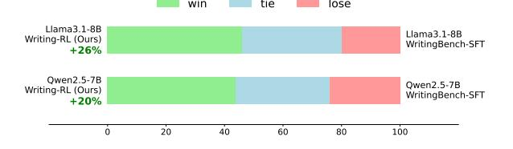
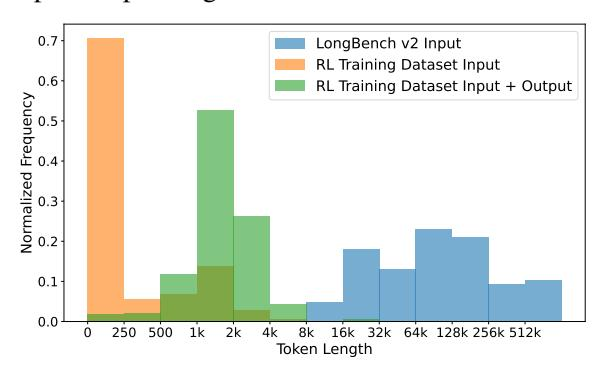

# 3 Writing-RL

In this work, we propose Writing-RL, an *Adaptive Curriculum Reinforcement Learning* framework aimed at further improving long-form writing capabilities. The framework comprises three key components: *Margin-aware Data Selection*, *Pairwise Comparison Reward* and *Dynamic Reference Scheduling*. We describe these components below.

## <span id="page-2-0"></span>3.1 Margin-aware Data Selection

Previous data selection approaches typically take question difficulty as a key criterion, measured by the accuracy of the policy model [\(Shi et al.,](#page-10-6) [2025;](#page-10-6) [Bae et al.,](#page-9-3) [2025\)](#page-9-3), simplistic indicators [\(Cheng](#page-9-4) [et al.,](#page-9-4) [2021;](#page-9-4) [Yang et al.,](#page-11-9) [2025\)](#page-11-9) like solution step counts or simple heuristics grounded in human intuition [\(Hendrycks et al.,](#page-9-5) [2021b\)](#page-9-5). While difficultyprioritized data selection has been effective in verifiable tasks such as math and code, it depends on clearly defined ground truth to measure difficulty. In open-ended writing tasks, however, the lack of ground-truths makes difficulty hard to measure.

To address this issue, we propose *Margin-aware Data Selection*, which uses the performance gap between the policy output and the highest-quality reference as a measure of *learning potential*. Our intuition is simple: a question suitable for learning is a question with sufficient room for performance improvement. Specifically, the procedure is detailed as follows.

Generation with Multiple LLMs. Instead of relying on a single model as the difficulty estimator [\(Shi et al.,](#page-10-6) [2025;](#page-10-6) [Bae et al.,](#page-9-3) [2025\)](#page-9-3), we leverage a set of competitive LLMs C = {π, M1, M2, . . . }, including the policy model π, to generate diverse candidate responses for each writing instruction.

Multi-dimensional Grading. Each generated re-

sponse  $r_j$  from model  $M_j \in \mathcal{C}$  is graded using a multi-dimensional pointwise LLM-as-a-Judge approach (Liu et al., 2024; Wu et al., 2025c), with averaged quality score denoted as  $s_i$  per response. Data Selection on Learning Potential. To prioritize samples from which the policy model can benefit most, we define the model-grounded learning potential p as the quality gap between the best competitor and the policy model:

$$p = \max_{j \in \mathcal{C}, j \neq \pi} (s_j - s_\pi)$$

 $p = \max_{j \in \mathcal{C}, \ j \neq \pi} (s_j - s_\pi)$  where  $s_\pi$  is the score of the policy model's response. A higher p indicates greater headroom for improvement. To filter out potential noise, we first discard samples where all the competitors receive low scores, as such instructions are often overly difficult or suffer from quality issues themselves. After filtering, we retain the top-k examples based on their learning potential p to construct the training set.

### Pairwise Comparison Reward Mechanism 3.2

The reward function is a critical component to guide policy optimization in RL. While rule-based outcome reward (DeepSeek-AI et al., 2025; Team et al., 2025) has been proven to be remarkably effective in verifiable tasks, it cannot be directly applied to long-form writing due to the lack of ground truth and its subjective nature, posing challenges to reward design.

Recent efforts utilize LLM-as-a-Judge (Zheng et al., 2023; Wu et al., 2025c) to measure the quality of model-generated responses. There are two evaluation approaches including pointwise grading and pairwise comparison. Though widely adopted due to its simplicity, pointwise grading exhibits limited discriminative capabilities and relatively high variance. On the contrary, pairwise comparison evaluates the response against a high-quality reference, capturing the subtle differences and potential direction of improvement. By providing more discriminative reward signals, pairwise comparison incentivizes the model to generate a better response and defeat high-quality references for positive rewards. Therefore, our reward design is as follows:

$$r_{\text{quality}}(\mathbf{x}) = \begin{cases} 1 & \text{if Judge}(\mathbf{ref}, \mathbf{x}) = \mathbf{x} \succ \mathbf{ref} \\ 0.5 & \text{if Judge}(\mathbf{ref}, \mathbf{x}) = \mathbf{x} \equiv \mathbf{ref} \\ 0 & \text{if Judge}(\mathbf{ref}, \mathbf{x}) = \mathbf{x} \prec \mathbf{ref} \end{cases}$$

where  $r_{\text{quality}}(\mathbf{x})$  denotes the reward for a generated response x; ref represents the high-quality reference response; and Judge(ref, x) is the evaluation

function performed by the LLM-based judge to compare x with ref.

In our experiments detailed in Appendix D.1, our model judge achieves a relatively high agreement (0.75) with human judges. Furthermore, LLM judges are known to exhibit position bias (Zheng et al., 2023) in pairwise comparisons, systematically favoring the first response. To impose additional learning pressure, we deliberately place the model-generated response in the second position, thereby introducing positional disadvantage in training. This avoids the need for positionswapped comparisons and halves the evaluation cost, while encouraging the model to generate stronger outputs from a less favorable position.

### 3.3 Dynamic Reference Scheduling

Curriculum Learning (Bengio et al., 2009) schedules progressive task difficulty for better learning efficiency. Previous efforts utilize offlinecalculated difficulty for scheduling (Shi et al., 2025; Song et al., 2025) or introducing additional rollouts during training for adaptive sample selection (Bae et al., 2025; Yu et al., 2025). Though effective in reasoning-centered RL, these methods suffer from either non-adaptive difficulty estimates or increased inference overhead.

To address this issue, we propose a Dynamic Reference Scheduling approach that encourages the policy model to sequentially outperform references of ascending quality. With the algorithm detailed in Algorithm 1, our framework introduces a more competitive reference when the policy model beats the current one during training, enabling asynchronous per-sample difficulty updates and dynamic adaptivity to the evolving model.

Prior to Training: Data Preparation. Given a set of writing instructions W, we first apply the Margin-aware Data Selection strategy as elaborated in Sec 3.1, obtaining multiple competitive references  $\mathcal{R} = \{r_{\pi}, r_1, r_2, \dots\}$  and their corresponding LLM-judged quality scores S = $\{s_{\pi}, s_1, s_2, \dots\}$  for each instruction. The references are then sorted in ascending order of quality to produce a stage-wise reference list  $\mathcal{R}_s$  =  $\{r_{a1}, r_{a2}, \dots\}$ . To maintain sufficient positive feedback early in training, we deliberately include the response from the initial policy model  $\pi$  in the reference set, as the other reference-generation LLMs are generally more competent.

During Training: Dynamic Scheduling. At the start of training, each instruction is initialized with

### <span id="page-4-0"></span>Algorithm 1 Dynamic Reference Scheduling for Long-form Writing

```
1: Pre-processing: For each instruction w \in W, apply Margin-aware Data Selection (Section 3.1) to obtain a stage-wise
     reference list \mathcal{R}^{(w)} = \{r_{\pi}^{(w)}, r_1^{(w)}, r_2^{(w)}, \dots\} ordered by ascending quality.
 2: Input: Instruction set W; reference lists \{\mathcal{R}^{(w)}\}_{w\in W}; policy model \pi_{\theta}; RL updater \mathcal{A} (e.g., PPO); batch size B.
 3: Initialize reference pointer t_w \leftarrow 1 for all w \in W

 4: while training not finished do
          Sample batch \mathcal{B} = \{w_k\}_{k=1}^B from W
 5:
 6:
          for all w_k \in \mathcal{B} do
               r_k \leftarrow \mathcal{R}^{(w_k)}[t_{w_k}]
 7:

 8:
                Generate response g_k \leftarrow \pi_{\theta}(w_k)
 9:
               Compute reward R_k \leftarrow \text{Judge}(r_k, g_k)
                                                                                                                                     \triangleright 1 (win), 0.5 (tie), 0 (loss)
10:
          Update policy \pi_{\theta} \leftarrow \mathcal{A}(\pi_{\theta}, \{(w_k, g_k, R_k)\}_{k=1}^B)
11:
          for all w_k \in \mathcal{B} such that R_k = 1 do
12.

                if t_{w_k} < |\mathcal{R}^{(w_k)}| then
13.
14:
                    t_{w_k} \leftarrow t_{w_k} + 1
                                                                                                                         ▷ promote to next stronger reference
15:
                end if
16:
          end for
17: end while
```

the lowest-quality reference  $r_{q1}$ , which is comparable to the initial policy model's response. As the model evolves during training, the model gradually generates higher-quality responses during rollouts and receives positive rewards in some of the pairwise comparisons. Subsequently, the defeated references  $r_t$  are replaced with marginally stronger ones  $r_{t+1}$  while the undefeated references are retained, progressively increasing the challenge without overwhelming the model, in alignment with the model's evolving capability. This dynamic and adaptive reference update mechanism establishes an asynchronous learning schedule for each writing instruction and effectively incentivizes the model to consistently perform better.

### 4 Experiments

To demonstrate the effectiveness of Writing-RL, we conduct experiments on writing-oriented fine-tuned LLMs to see whether it can further advance long-form writing capabilities beyond SFT.

### 4.1 Datasets

We use two carefully-constructed writing datasets primarily designed for SFT, including LongWriter training set (Bai et al., 2024b) and WritingBench training set (Wu et al., 2025c). As detailed in Section 3.1, we perform the *Margin-aware Data Selection* on the datasets respectively. Specifically, we first generate references for each writing instruction with the initial policy model and four competent LLMs, including Qwen-Plus (Yang et al., 2024), GPT-40 (Hurst et al., 2024), Claude-3.7 (Anthropic Team, 2025) and DeepSeek-R1 (DeepSeek-AI et al., 2025). Then, we utilize a fine-tuned judge

model (Wu et al., 2025c), which is optimized for evaluating long-form writing responses, to grade the responses in multiple dimensions. Finally, after the selection process, we obtain 1.5k chosen samples from each dataset for further reinforcement learning. Each sample contains a writing instruction and references ordered by ascending quality. Additionally, we present analysis of topic coverage in Appendix B.1.

### 4.2 Training Setup

To fully harness the potential of reinforcement learning, we use two writing-expert LLMs as the base models for RL, which are primarily fine-tuned with the full WritingBench training set, denoted as *Qwen2.5-7B-WritingBench-SFT* and *Llama3.1-8B-WritingBench-SFT* respectively.

With the proposed Writing-RL, we use the PPO algorithm (Schulman et al., 2017) to optimize the models for long-form writing. During the training process, we adopt Qwen-Plus to serve as pairwise comparison judge, providing rewards for policy optimization. We include more details about reward model choice and training parameters in Appendix A.3 and Appendix A respectively.

### 4.3 Benchmarks and Baselines

To comprehensively evaluate long-form writing capabilities of LLMs, we use three established benchmarks including WritingBench (Wu et al., 2025c), LongBench-Write (Bai et al., 2024b), and Creative-Writing-Bench (EQ-Bench creative writing split) (Paech, 2023). The benchmarks are of broad coverage and use strong judge LLMs to evaluate the quality of generated responses. We con-

<span id="page-5-0"></span>

| Model                                                                                                                                                                                                                                                                                                                                                                                                                                                                                                                                                                                                                                                                                                                                                                                                                                                                                                                                                                                                                                                                                                                                                                                                                                                                                                                                                                                                                                                                                                                                                                                                                                                                                                                                                                                                                                                                                                                                                                                                                                                                                                                          | Writi    | ng-Oriented Training | Long-form Writing Evaluation |               |                 |         |  |  |
|--------------------------------------------------------------------------------------------------------------------------------------------------------------------------------------------------------------------------------------------------------------------------------------------------------------------------------------------------------------------------------------------------------------------------------------------------------------------------------------------------------------------------------------------------------------------------------------------------------------------------------------------------------------------------------------------------------------------------------------------------------------------------------------------------------------------------------------------------------------------------------------------------------------------------------------------------------------------------------------------------------------------------------------------------------------------------------------------------------------------------------------------------------------------------------------------------------------------------------------------------------------------------------------------------------------------------------------------------------------------------------------------------------------------------------------------------------------------------------------------------------------------------------------------------------------------------------------------------------------------------------------------------------------------------------------------------------------------------------------------------------------------------------------------------------------------------------------------------------------------------------------------------------------------------------------------------------------------------------------------------------------------------------------------------------------------------------------------------------------------------------|----------|----------------------|------------------------------|---------------|-----------------|---------|--|--|
| n de la companya de la companya de la companya de la companya de la companya de la companya de la companya de la companya de la companya de la companya de la companya de la companya de la companya de la companya de la companya de la companya de la companya de la companya de la companya de la companya de la companya de la companya de la companya de la companya de la companya de la companya de la companya de la companya de la companya de la companya de la companya de la companya de la companya de la companya de la companya de la companya de la companya de la companya de la companya de la companya de la companya de la companya de la companya de la companya de la companya de la companya de la companya de la companya de la companya de la companya de la companya de la companya de la companya de la companya de la companya de la companya de la companya de la companya de la companya de la companya de la companya de la companya de la companya de la companya de la companya de la companya de la companya de la companya de la companya de la companya de la companya de la companya de la companya de la companya de la companya de la companya de la companya de la companya de la companya de la companya de la companya de la companya de la companya de la companya de la companya de la companya de la companya de la companya de la companya de la companya de la companya de la companya de la companya de la companya de la companya de la companya de la companya de la companya de la companya de la companya de la companya de la companya de la companya de la companya de la companya de la companya de la companya de la companya de la companya de la companya de la companya de la companya de la companya de la companya de la companya de la companya de la companya de la companya de la companya de la companya de la companya de la companya de la companya de la companya de la companya de la companya de la companya de la companya de la companya de la companya de la companya de la companya de la companya de la companya de la companya de la companya de l | SFT      | RL                   | WritingBench                 | Creative-W.B. | LongBench-Write | Average |  |  |
|                                                                                                                                                                                                                                                                                                                                                                                                                                                                                                                                                                                                                                                                                                                                                                                                                                                                                                                                                                                                                                                                                                                                                                                                                                                                                                                                                                                                                                                                                                                                                                                                                                                                                                                                                                                                                                                                                                                                                                                                                                                                                                                                |          | (a) Proprieta        | ry LLMs                      |               |                 |         |  |  |
| Qwen-Plus                                                                                                                                                                                                                                                                                                                                                                                                                                                                                                                                                                                                                                                                                                                                                                                                                                                                                                                                                                                                                                                                                                                                                                                                                                                                                                                                                                                                                                                                                                                                                                                                                                                                                                                                                                                                                                                                                                                                                                                                                                                                                                                      | -        | _                    | 77.62                        | 76.78         | 95.42           | 83.27   |  |  |
| GPT-4o                                                                                                                                                                                                                                                                                                                                                                                                                                                                                                                                                                                                                                                                                                                                                                                                                                                                                                                                                                                                                                                                                                                                                                                                                                                                                                                                                                                                                                                                                                                                                                                                                                                                                                                                                                                                                                                                                                                                                                                                                                                                                                                         | _        | -                    | 83.42                        | 80.45         | 92.92           | 85.60   |  |  |
| (b) Writing-Oriented Fine-Tuned LLMs                                                                                                                                                                                                                                                                                                                                                                                                                                                                                                                                                                                                                                                                                                                                                                                                                                                                                                                                                                                                                                                                                                                                                                                                                                                                                                                                                                                                                                                                                                                                                                                                                                                                                                                                                                                                                                                                                                                                                                                                                                                                                           |          |                      |                              |               |                 |         |  |  |
| Suri-7B                                                                                                                                                                                                                                                                                                                                                                                                                                                                                                                                                                                                                                                                                                                                                                                                                                                                                                                                                                                                                                                                                                                                                                                                                                                                                                                                                                                                                                                                                                                                                                                                                                                                                                                                                                                                                                                                                                                                                                                                                                                                                                                        | <b>/</b> | Х                    | 49.70                        | 18.44         | 33.44           | 33.86   |  |  |
| Longwriter-9B                                                                                                                                                                                                                                                                                                                                                                                                                                                                                                                                                                                                                                                                                                                                                                                                                                                                                                                                                                                                                                                                                                                                                                                                                                                                                                                                                                                                                                                                                                                                                                                                                                                                                                                                                                                                                                                                                                                                                                                                                                                                                                                  | 1        | DPO                  | 79.10                        | 44.15         | 80.83           | 68.03   |  |  |
| Longwriter-Zero-32B                                                                                                                                                                                                                                                                                                                                                                                                                                                                                                                                                                                                                                                                                                                                                                                                                                                                                                                                                                                                                                                                                                                                                                                                                                                                                                                                                                                                                                                                                                                                                                                                                                                                                                                                                                                                                                                                                                                                                                                                                                                                                                            | 1        | GRPO                 | 82.92                        | 61.14         | 85.90           | 76.65   |  |  |
|                                                                                                                                                                                                                                                                                                                                                                                                                                                                                                                                                                                                                                                                                                                                                                                                                                                                                                                                                                                                                                                                                                                                                                                                                                                                                                                                                                                                                                                                                                                                                                                                                                                                                                                                                                                                                                                                                                                                                                                                                                                                                                                                | (        | c) Qwen2.5-7B-Instru | ıct Model Famil              | y             |                 |         |  |  |
| Qwen2.5-7B-Instruct                                                                                                                                                                                                                                                                                                                                                                                                                                                                                                                                                                                                                                                                                                                                                                                                                                                                                                                                                                                                                                                                                                                                                                                                                                                                                                                                                                                                                                                                                                                                                                                                                                                                                                                                                                                                                                                                                                                                                                                                                                                                                                            | X        | Х                    | 73.16                        | 49.29         | 87.20           | 69.88   |  |  |
| Qwen2.5-7B-WritingBench-SFT (12k)                                                                                                                                                                                                                                                                                                                                                                                                                                                                                                                                                                                                                                                                                                                                                                                                                                                                                                                                                                                                                                                                                                                                                                                                                                                                                                                                                                                                                                                                                                                                                                                                                                                                                                                                                                                                                                                                                                                                                                                                                                                                                              | 1        | ×                    | 83.71                        | 70.24         | 92.56           | 82.17   |  |  |
| Qwen2.5-7B-WritingBench-SFT (24k)                                                                                                                                                                                                                                                                                                                                                                                                                                                                                                                                                                                                                                                                                                                                                                                                                                                                                                                                                                                                                                                                                                                                                                                                                                                                                                                                                                                                                                                                                                                                                                                                                                                                                                                                                                                                                                                                                                                                                                                                                                                                                              | 1        | ×                    | 83.76                        | 69.60         | 92.65           | 82.00   |  |  |
| Qwen2.5-7B-Reference-SFT                                                                                                                                                                                                                                                                                                                                                                                                                                                                                                                                                                                                                                                                                                                                                                                                                                                                                                                                                                                                                                                                                                                                                                                                                                                                                                                                                                                                                                                                                                                                                                                                                                                                                                                                                                                                                                                                                                                                                                                                                                                                                                       | 1        | ×                    | 84.23                        | 68.89         | 92.88           | 82.00   |  |  |
| Qwen2.5-7B-Writing-RL (Ours)                                                                                                                                                                                                                                                                                                                                                                                                                                                                                                                                                                                                                                                                                                                                                                                                                                                                                                                                                                                                                                                                                                                                                                                                                                                                                                                                                                                                                                                                                                                                                                                                                                                                                                                                                                                                                                                                                                                                                                                                                                                                                                   | 1        | PPO                  | 87.23                        | 73.19         | 93.06           | 84.49   |  |  |
| Qwen2.5-7B-Writing-RL (Ours)                                                                                                                                                                                                                                                                                                                                                                                                                                                                                                                                                                                                                                                                                                                                                                                                                                                                                                                                                                                                                                                                                                                                                                                                                                                                                                                                                                                                                                                                                                                                                                                                                                                                                                                                                                                                                                                                                                                                                                                                                                                                                                   | ✓        | GRPO                 | 86.29                        | 75.41         | 91.84           | 84.51   |  |  |
|                                                                                                                                                                                                                                                                                                                                                                                                                                                                                                                                                                                                                                                                                                                                                                                                                                                                                                                                                                                                                                                                                                                                                                                                                                                                                                                                                                                                                                                                                                                                                                                                                                                                                                                                                                                                                                                                                                                                                                                                                                                                                                                                | (c       | l) Qwen2.5-14B-Instr | uct Model Fami               | ly            |                 |         |  |  |
| Qwen2.5-14B-Instruct                                                                                                                                                                                                                                                                                                                                                                                                                                                                                                                                                                                                                                                                                                                                                                                                                                                                                                                                                                                                                                                                                                                                                                                                                                                                                                                                                                                                                                                                                                                                                                                                                                                                                                                                                                                                                                                                                                                                                                                                                                                                                                           | X        | Х                    | 72.67                        | 56.89         | 89.20           | 72.92   |  |  |
| Qwen2.5-14B-WritingBench-SFT                                                                                                                                                                                                                                                                                                                                                                                                                                                                                                                                                                                                                                                                                                                                                                                                                                                                                                                                                                                                                                                                                                                                                                                                                                                                                                                                                                                                                                                                                                                                                                                                                                                                                                                                                                                                                                                                                                                                                                                                                                                                                                   | 1        | ×                    | 84.95                        | 79.27         | 93.75           | 85.99   |  |  |
| Qwen2.5-14B-Writing-RL (Ours)                                                                                                                                                                                                                                                                                                                                                                                                                                                                                                                                                                                                                                                                                                                                                                                                                                                                                                                                                                                                                                                                                                                                                                                                                                                                                                                                                                                                                                                                                                                                                                                                                                                                                                                                                                                                                                                                                                                                                                                                                                                                                                  | 1        | PPO                  | 88.27                        | 83.17         | 94.17           | 88.53   |  |  |
|                                                                                                                                                                                                                                                                                                                                                                                                                                                                                                                                                                                                                                                                                                                                                                                                                                                                                                                                                                                                                                                                                                                                                                                                                                                                                                                                                                                                                                                                                                                                                                                                                                                                                                                                                                                                                                                                                                                                                                                                                                                                                                                                | (0       | e) Llama3.1-8B-Instr | uct Model Fami               | ly            |                 |         |  |  |
| Llama3.1-8B-Instruct                                                                                                                                                                                                                                                                                                                                                                                                                                                                                                                                                                                                                                                                                                                                                                                                                                                                                                                                                                                                                                                                                                                                                                                                                                                                                                                                                                                                                                                                                                                                                                                                                                                                                                                                                                                                                                                                                                                                                                                                                                                                                                           | X        | Х                    | 66.56                        | 48.83         | 80.79           | 65.39   |  |  |
| Llama3.1-8B-WritingBench-SFT                                                                                                                                                                                                                                                                                                                                                                                                                                                                                                                                                                                                                                                                                                                                                                                                                                                                                                                                                                                                                                                                                                                                                                                                                                                                                                                                                                                                                                                                                                                                                                                                                                                                                                                                                                                                                                                                                                                                                                                                                                                                                                   | 1        | ×                    | 83.75                        | 77.70         | 90.67           | 84.04   |  |  |
| Llama3.1-8B-Reference-SFT                                                                                                                                                                                                                                                                                                                                                                                                                                                                                                                                                                                                                                                                                                                                                                                                                                                                                                                                                                                                                                                                                                                                                                                                                                                                                                                                                                                                                                                                                                                                                                                                                                                                                                                                                                                                                                                                                                                                                                                                                                                                                                      | 1        | ×                    | 83.98                        | 76.70         | 91.53           | 84.07   |  |  |
| Llama3.1-8B-Writing-RL (Ours)                                                                                                                                                                                                                                                                                                                                                                                                                                                                                                                                                                                                                                                                                                                                                                                                                                                                                                                                                                                                                                                                                                                                                                                                                                                                                                                                                                                                                                                                                                                                                                                                                                                                                                                                                                                                                                                                                                                                                                                                                                                                                                  | 1        | PPO                  | 87.11                        | 82.67         | 92.09           | 87.29   |  |  |

Table 1: Evaluation results of the models trained with Writing-RL, with the highest score in each model family **bold**. Notably, our trained models perform the best within their model family, competitive with the proprietary models.

duct three independent runs and report average performance for both model families to reduce variance. Note that the judge LLMs adopted for evaluation are diverse and different from the rewarding judge LLM used in training, mitigating the risk of overfitting particular judge preferences to ensure a fair evaluation.

Our selected baselines include strong proprietary models, instruction fine-tuned LLMs (Yang et al., 2024; Dubey et al., 2024), writing-oriented fine-tuned LLMs (Wu et al., 2025c; Bai et al., 2024b; Pham et al., 2024; Wu et al., 2025a), and the models supervisedly fine-tuned on our RL dataset. More evaluation details can be found in Appendix B.

### 4.4 Results

Remarkable Writing Performance Gains. As shown in Table 1, the results demonstrate that our models outperform others across the benchmarks. Specifically, *Llama3.1-8B-Writing-RL* achieves the highest average score of 87.29, and *Qwen2.5-7B-Writing-RL* follows with an average of 84.49, both showing strong performance at their scale. Furthermore, our approach scales effectively to larger models, yielding substantial improvements as evi-

<span id="page-5-1"></span>> **[图片提取文字 (无描述)]:**
> win tie lose Llama3.1-8B Llama3.1-8B Writing-RL (Ours) WritingBench-SFT +26% Owen2.5-7B Qwen2.5-7B Writing-RL (Ours) WritingBench-SFT +20% 20 40 60 80 100


Figure 2: **Human Evaluation** results of pairwise comparison between our RL-trained models and the best-performing SFT-trained competitors.

denced by *Qwen2.5-14B-Writing-RL* achieving an outstanding average score of 88.53. Notably, our trained models exhibit long-form writing capabilities that match or even surpass those of proprietary models, positioning them as strong open-source alternatives for long-form generation.

**SFT Encounters Data Saturation.** We observe distinct performance trends when applying RL and SFT to relatively strong models.

Despite using identically constructed datasets, we observe a marginal performance regression in *Qwen2.5-7B-WritingBench-SFT* (24k) relative to its counterpart *Qwen2.5-7B-WritingBench-SFT* (12k). Furthermore, the models continuously fine-tuned with high-quality references in the

<span id="page-6-1"></span>

| Model                         | Writing-Oriented Training |     | Evaluation |      |       |        |      |         |
|-------------------------------|---------------------------|-----|------------|------|-------|--------|------|---------|
| 1110401                       | SFT                       | RL  | Easy       | Hard | Short | Medium | Long | Overall |
| Qwen2.5-7B-Instruct           | ×                         | Х   | 31.8       | 28.3 | 38.9  | 26.0   | 21.3 | 29.6    |
| Qwen2.5-7B-WritingBench-SFT   | 1                         | X   | 27.6       | 27.7 | 35.0  | 25.1   | 20.4 | 27.6    |
| Qwen2.5-7B-Writing-RL (Ours)  | ✓                         | PPO | 35.8       | 29.3 | 42.1  | 25.7   | 26.5 | 31.8    |
| Llama3.1-8B-Instruct          | Х                         | Х   | 32.3       | 28.9 | 35.6  | 27.4   | 26.9 | 30.2    |
| Llama3.1-8B-WritingBench-SFT  | 1                         | X   | 29.7       | 27.7 | 36.7  | 23.7   | 24.1 | 28.4    |
| Llama3.1-8B-Writing-RL (Ours) | ✓                         | PPO | 31.2       | 33.8 | 42.2  | 29.3   | 24.1 | 32.8    |

Table 2: **Output-to-Input Generalization:** Evaluation results of the models trained with Writing-RL on LongBench v2, demonstrating the generalization potential from long-output generation to long-input reasoning.

RL dataset, namely *Llama3.1-8B-Reference-SFT* and *Qwen2.5-7B-Reference-SFT*, also show minimal performance gain, or even slight degradation. This observation potentially underscores the phenomenon of data saturation, where as the model gets stronger, it is harder to construct SFT data to effectively further improve model capability.

RL Leads to Further Improvements. In contrast, models trained by Writing-RL demonstrate consistent improvements and thereby indicate the promising potential of RL to further advance model capability where SFT encounters limitations.

Robustness Across RL Algorithms. Applied to the Qwen2.5-7B backbone, the GRPO variant yields an average score of 84.51, performing comparably to PPO. GRPO shows a slight edge in creative writing, whereas PPO leads marginally on WritingBench and LongBench-Write. While minor task-specific variances exist, the overall parity confirms that the performance gains are fundamentally driven by data quality, reward design, and curriculum strategy, rendering the framework highly effective regardless of the underlying RL optimizer.

### 4.5 Human Evaluation

Furthermore, we recognize that human evaluation can complement automatic LLM-as-Judge. Therefore, we also conduct human evaluation experiments to further validate our model performance. We randomly sample 100 writing instructions in total from our evaluation datasets and generate responses using our RL-trained models and the most competitive baselines. Then, the annotators select the better-quality response under the same writing instruction. As shown in Fig. 2, the results demonstrate higher win rates of our trained models, indicating their stronger long-form writing capability and better alignment with human preferences. Additionally, we include a case study of realistic writing scenarios in Appendix E.

## 5 Generalization from Output to Input

To understand the influence of Writing-RL on long-context capabilities of Writing-RL, we adopt the challenging long-context reasoning benchmark LongBench v2 (Bai et al., 2024a) to evaluate long-input reasoning. Notably, as shown in Figure 3, the input lengths in LongBench v2 are substantially longer than those in our training set, mostly exceeding not only the input lengths but also the total input—output lengths.

<span id="page-6-0"></span>> **[图片提取文字 (无描述)]:**
> 0.7 LongBench v2 Input RL Training Dataset Input 0.6 RL Training Dataset Input + Output Normalized Frequency 0.1 0.0 250 2k 16k 32k 64k 128k 256k 512k 500 1k 4k 8k Token Length


Figure 3: Length distribution of our *long-output* RL training dataset and the *long-input* evaluation dataset LongBench v2.

As detailed in Table 2, our findings are encouraging. Beyond improved performance in long-form generation, the writer models fine-tuned with Writing-RL also exhibit surprising generalization to long-context reasoning with substantially longer inputs, while the SFT-trained counterparts show slight performance degradation in this regime. To further understand and analyze this interesting phenomenon, we give an intuitive explanation to the following research questions.

Why does long-output training generalize to long-input reasoning? Generating high-quality long-form text inherently requires a deep and holistic understanding of the preceding context. Therefore, long-generation RL encourages LLMs to develop long-input understanding capabilities as a prerequisite for producing coherent long-outputs.

<span id="page-7-0"></span>

| Selection                                                                                  | Initial                 | Learning                  | Writ.                                                                                |
|--------------------------------------------------------------------------------------------|-------------------------|---------------------------|--------------------------------------------------------------------------------------|
| Strategy                                                                                   | Score                   | Potential                 | Score                                                                                |
| Baseline (w/o RL)<br>Full (w/o Selection)<br>Difficulty-prioritized<br>Margin-aware (Ours) | 84.20<br>77.61<br>78.84 | -<br>3.64<br>8.18<br>9.16 | $83.71_{\pm 0.10}$<br>$85.91_{\pm 0.24}$<br>$86.29_{\pm 0.28}$<br>$86.98_{\pm 0.23}$ |

Table 3: Comparison of different data selection strategies, indicating the benefits of higher learning potential.

<span id="page-7-3"></span>

| Curriculum<br>Strategy | Writ.<br>Bench | C.W.<br>Bench | Long.<br>Write | Average<br>Score        |
|------------------------|----------------|---------------|----------------|-------------------------|
| Baseline (w/o RL)      | 83.71          | 70.24         | 92.56          | 82.17 <sub>±0.10</sub>  |
| None                   | 86.51          | 71.47         | 92.26          | $83.41_{\pm 0.23}$      |
| Static                 | 86.40          | 72.84         | 92.26          | $83.83_{\pm0.54}$       |
| Dynamic (Ours)         | 87.23          | 73.19         | 93.06          | <b>84.49</b> $\pm$ 0.37 |

Table 5: Ablation of our adaptive curriculum scheduling approach, demonstrating the superiority of our method and the effectiveness of curriculum design in RL.

What is the source of the generalization phenomenon? We systematically ablate key components of our pipeline to isolate the drivers of generalization on LongBench-v2, revealing that the RL training paradigm itself serves as the primary catalyst for performance gains. While continuing SFT on the RL dataset slightly degrades the base model's capabilities, employing RL strategies consistently drives positive transfer. We include more controlled experiments, data analysis and case study in Appendix C.

Why does long-output RL generalize better than SFT? SFT forces the model to imitate and memorize the behaviors of the training samples, while RL aligns model behavior with outcome-based objectives via reward signals. Therefore, by empowering the model to enhance its underlying capabilities, RL generalizes better. This observation is also consistent with recent findings in other domains (Chu et al., 2025; Shen et al., 2025).

How might these findings inform long-context training? The generalization from long-output generation to long-input reasoning may suggest a mutually beneficial relationship between long-input and long-output training. Integrating both perspectives may lead to more effective long-context training strategies, and we leave the systematic exploration of this promising approach to future work.

### 6 Discussions

## <span id="page-7-1"></span>6.1 Analysis of Data Selection Strategy

To validate our Margin-aware Data Selection strategy, we conduct experiments on the WritingBench training set, training *Qwen2.5-7B-WritingBench*-

| Reward                                      | Multi     | Reference   | Writ.                                                                      |
|---------------------------------------------|-----------|-------------|----------------------------------------------------------------------------|
| Strategy                                    | Dimension | Based       | Score                                                                      |
| Baseline (w/o RL) Pointwise Pairwise (Ours) | X<br>./   | X<br>X<br>V | 83.71 <sub>±0.10</sub><br>84.50 <sub>±0.09</sub><br>86.98 <sub>±0.23</sub> |

Table 4: Comparison of different reward designs, indicating the effectiveness of multi-dimensional pairwise LLM judges during training.

| Model                                                                                 | MT-Bench                    | MMLU                     |
|---------------------------------------------------------------------------------------|-----------------------------|--------------------------|
| Qwen2.5-7B-Instruct<br>Qwen2.5-7B-WritingBench-SFT<br>Qwen2.5-7B-Writing-RL (Ours)    | 7.21<br>7.34<br><b>7.62</b> | <b>71.85</b> 69.66 69.75 |
| Llama3.1-8B-Instruct<br>Llama3.1-8B-WritingBench-SFT<br>Llama3.1-8B-Writing-RL (Ours) | 6.16<br><b>6.42</b><br>6.29 | <b>66.03</b> 64.98 65.02 |

Table 6: Evaluation results on the general-capabilities benchmarks MT-Bench and MMLU.

SFT model with high-quality references generated by Qwen-Plus. We adopt WritingBench to benchmark writing capability due to its broad coverage and efficiency, and we report mean performance and standard deviation across three independent evaluation runs. As shown in Table 3, the results indicate that our strategy can boost learning efficiency by choosing samples with higher learning potential, highlighting the effectiveness of *learning potential* as the key metric.

## 6.2 Analysis of Reward Design

To validate our pairwise reward design, we compare our reward mechanism with the widely adopted pointwise grading method (Zheng et al., 2023; Liu et al., 2025), which utilizes LLM-based judge to provide a scalar rating representing response quality. We follow the experiment setting in Section 6.1. The results shown in Table 4 demonstrate the superiority of our approach in providing more discriminative rewards, incentivizing the model to further advance writing capabilities.

## <span id="page-7-2"></span>6.3 Analysis of reference quality

Under the Pairwise Comparison Reward Mechanism, reference quality dictates the difficulty of obtaining positive rewards, directly impacting training stability and performance. To evaluate this, we test static reference sets generated by various LLMs, alongside a combined *Best Reference* set and a *Self-Generated* baseline.

As Table 8 demonstrates, reference quality is critical for effective optimization. Low-quality references (*e.g.*, *Self-Generated*) cause rapid reward saturation, halting progress once the model eas-

<span id="page-8-1"></span>

| Model                                                            | Judge Model              | WritingBench   | Creative       | LongBench-Write | Average        |
|------------------------------------------------------------------|--------------------------|----------------|----------------|-----------------|----------------|
| Qwen2.5-7B-WritingBench-SFT                                      | –                        | 83.71          | 70.24          | 92.56           | 82.17          |
| Qwen2.5-7B-Writing-RL (V3 Judge)<br>Qwen2.5-7B-Writing-RL (Ours) | DeepSeek-V3<br>Qwen-Plus | 87.87<br>87.23 | 72.66<br>73.19 | 92.36<br>93.06  | 84.30<br>84.49 |

<span id="page-8-0"></span>Table 7: Performance comparison using different judge models for reward calculation. Replacing Qwen-Plus with DeepSeek-V3 yields comparable gains over the SFT baseline, demonstrating that our method's effectiveness is robust to the choice of the reward model.

| Reference Quality                                            | Score                            |
|--------------------------------------------------------------|----------------------------------|
| Self-Generated<br>Qwen-Plus<br>DeepSeek-R1<br>Best Reference | 86.80<br>86.98<br>86.15<br>82.51 |

Table 8: Comparison of different reference quality settings.

ily achieves high win rates. Conversely, overly high-quality references (*e.g., Best Reference*) create sparse positive rewards early in training, destabilizing the learning process. These findings highlight a fundamental limitation of static reference scheduling: its inability to adapt to the policy model's evolving capabilities.

## 6.4 Ablation on Curriculum Scheduling

Given the importance of reference quality and the limitations of fixed references discussed in Section [6.3,](#page-7-2) we propose *Dynamic Reference Scheduling*, which progressively introduces higher-quality references as the model evolves. To validate this strategy, we conduct an ablation study comparing three curriculum setups: mixed training without scheduling, static scheduling which partitions the dataset into two subsets with different difficulty, and our proposed dynamic scheduling. As shown in Table [5,](#page-7-3) the results confirm the superiority of our approach. Furthermore, both static and dynamic scheduling outperform the no-curriculum baseline, demonstrating the effectiveness of incorporating curriculum into RL.

## 6.5 Ablation of Judge Model

To verify that the performance improvements observed in our Writing-RL framework are not dependent on the specific preference distribution or biases of a single judge model, we conducted an ablation study replacing our default judge, Qwen-Plus, with DeepSeek-V3.

As illustrated in Table [7,](#page-8-1) both RL-trained variants notably outperform the SFT baseline. The model trained with DeepSeek-V3 as the judge achieves an average score of 84.30, which is statis-

tically comparable to our default Qwen-Plus judge. This consistency confirms that the effectiveness of our iterative RL pipeline is driven by the Writing-RL module design rather than specific judge model.

## 6.6 Influence on General Capabilities

The evaluation results presented in Table [6](#page-7-3) provide insights into the impact of writing-oriented training on the general capabilities of LLMs, as assessed by the MMLU [\(Hendrycks et al.,](#page-9-10) [2021a\)](#page-9-10) and MT-Bench [\(Zheng et al.,](#page-11-6) [2023\)](#page-11-6). MMLU results indicate that RL-trained models maintain parity with their SFT counterparts, evincing negligible degradation in core knowledge. Furthermore, longoutput variants surpass baseline instruct models on MT-Bench. Collectively, these findings demonstrate that our RL framework enhances long-form generation while preserving general capabilities.

