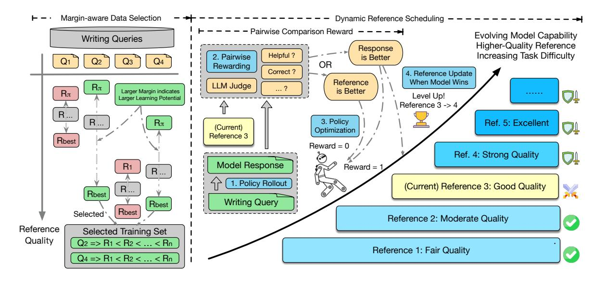

# Writing-RL: Advancing Long-form Writing via Adaptive Curriculum Reinforcement Learning

Xuanyu Lei1,2, Chenliang Li3 , Yuning Wu3 , Kaiming Liu2 , Weizhou Shen3 , Peng Li1,† , Ming Yan3,† , Fei Huang3 , Ya-Qin Zhang1 , Yang Liu1,2,†

1 Institute for AI Industry Research (AIR), Tsinghua University, Beijing, China 2Dept. of Comp. Sci. & Tech., Institute for AI, Tsinghua University, Beijing, China 3 Institute of Intelligent Computing, Alibaba Group

leixy24@mails.tsinghua.edu.cn, lipeng@air.tsinghua.edu.cn ym119608@alibaba-inc.com, liuyang2011@tsinghua.edu.cn

## Abstract

Recent advances in Large Language Models (LLMs) have enabled strong performance in long-form writing, but current training paradigms remain limited: Supervised Fine-Tuning (SFT) remains constrained by data saturation and performance ceilings, while Reinforcement Learning with Verifiable Reward (RLVR), though successful in verifiable domains like math and code, cannot be directly migrated to open-ended long-form writing due to a lack of ground-truths. To further advance long-form writing, we present Writing-RL: an *Adaptive Curriculum Reinforcement Learning* framework to advance long-form writing capabilities beyond SFT. The framework consists of three key components: *Margin-aware Data Selection* strategy that prioritizes samples with high learning potential, *Pairwise Comparison Reward* mechanism that provides discriminative learning signals in the absence of verifiable rewards, and *Dynamic Reference Scheduling* approach, which plays a critical role by adaptively adjusting task difficulty based on evolving model performance. Experiments on 7B-scale writer models show that Writing-RL effectively improves long-form writing performance over strong SFT baselines. Furthermore, we observe that models trained with long-output RL generalize surprisingly well to long-input reasoning tasks, potentially offering a promising perspective for rethinking long-context training.

## 1 Introduction

Recent years have witnessed the remarkable advance of Large Language Models (LLMs) [\(Ope](#page-10-0)[nAI,](#page-10-0) [2023;](#page-10-0) [DeepSeek-AI et al.,](#page-9-0) [2025;](#page-9-0) [Zhao et al.,](#page-11-0)

[2023\)](#page-11-0) to follow complicated instructions and provide helpful responses. Among their impressive capabilities, long-form writing, which aims to generate long and high-quality articles, has drawn increasing attention [\(Wu et al.,](#page-11-1) [2025b;](#page-11-1) [Bai et al.,](#page-9-1) [2024b;](#page-9-1) [Wu et al.,](#page-11-2) [2025c\)](#page-11-2) due to its broad practical applications.

However, generating articles of both sufficient length and high quality is non-trivial for current LLMs. Previous research has identified several challenges in employing LLMs for long-form generation, including inherently limited output ceiling [\(Bai et al.,](#page-9-1) [2024b;](#page-9-1) [Tu et al.,](#page-10-1) [2025\)](#page-10-1) and performance degradation as output length grows [\(Wu](#page-11-2) [et al.,](#page-11-2) [2025c;](#page-11-2) [Tu et al.,](#page-10-1) [2025\)](#page-10-1). To address these issues, recent efforts perform targeted Supervised Fine-Tuning (SFT) on LLMs to extend their output lengths, with long-generation datasets constructed by iterative agent pipelines [\(Bai et al.,](#page-9-1) [2024b;](#page-9-1) [Quan](#page-10-2) [et al.,](#page-10-2) [2024;](#page-10-2) [Wu et al.,](#page-11-2) [2025c\)](#page-11-2) or instruction backtranslation [\(Pham et al.,](#page-10-3) [2024;](#page-10-3) [Wang et al.,](#page-11-3) [2024\)](#page-11-3). Though effective, these approaches introduce a heavy burden of dataset construction due to the broad coverage of writing tasks and potential copyright issues [\(Maini et al.,](#page-10-4) [2024\)](#page-10-4) when incorporating human-written texts. Furthermore, training LLMs to imitate the collected long-generation responses inherently imposes a capability upper bound determined by teacher models or human experts, which may cause data saturation and sample inefficiency.

Meanwhile, recent progress of Reinforcement Learning (RL) with Verifiable Rewards [\(DeepSeek-](#page-9-0)[AI et al.,](#page-9-0) [2025;](#page-9-0) [Team et al.,](#page-10-5) [2025;](#page-10-5) [Yuan et al.,](#page-11-4) [2025\)](#page-11-4) in reasoning-intensive areas reveals a promising direction to advance model capabilities beyond SFT. In long-form writing, however, the lack of ground truths prevents a straightforward transfer of these successes. [Wu et al.](#page-11-5) [\(2025a\)](#page-11-5) utilize static reward models for grading, failing to dynamically adapt to evolving model capability. Overall, adaptive online RL for long-form writing remains under-explored

† Corresponding Authors.

‡ Code is released at [https://github.com/](https://github.com/Tongyi-Zhiwen/Writing-RL) [Tongyi-Zhiwen/Writing-RL](https://github.com/Tongyi-Zhiwen/Writing-RL).

> **[图片提取文字 (无描述)]:**
> Margin-aware Data Selection Dynamic Reference Scheduling - Pairwise Comparison Reward - - - - -**Evolving Model Capability** Writing Queries Higher-Quality Reference Response Increasing Task Difficulty Helpful? 2. Pairwise is Better Q4 Q2 Q3 OR Rewarding Correct? 4. Reference Update Reference When Model Wins LLM Judge  $H\pi$ Larger Margin indicates is Better Rπ Level Up! Larger Learning Potential Reference 3 -> 4 R... R ... 3. Policy Ref. 5: Excellent Rπ (Current) Optimization Reference 3 Rbest Reward = 0Ref. 4: Strong Quality Model Response R1 Reward = 1 R... 1. Policy Rollout (Current) Reference 3: Good Quality R... Rbest Writing Query Rbest Rbest Selected\* Reference 2: Moderate Quality Reference Selected Training Set Quality Q2 => R1 < R2 < ... < Rn Reference 1: Fair Quality Q4 => R1 < R2 < ... < Rn

Figure 1: Overall framework of Writing-RL. 1) *Margin-aware Data Selection*: prioritizes samples with high learning potential; 2) *Pairwise Comparison Reward*: provides more discriminative reward signals; 3) *Dynamic Reference Scheduling*: adaptively incentivizes the model to surpass progressively stronger references.

and presents several challenges:

- Data Selection: Data quality and difficulty play a critical role in eliciting model potential. However, the optimal approach for selecting data for RL in long-form writing tasks remains unclear, requiring more explorations towards better learning efficiency.
- Reward Design: Rule-based outcome rewards [\(DeepSeek-AI et al.,](#page-9-0) [2025\)](#page-9-0) cannot be directly applied to generative writing tasks. Without ground-truth labels, constructing an effective reward mechanism for long-form writing poses a significant challenge.
- Curriculum Scheduling: Curriculum Learning [\(Bengio et al.,](#page-9-2) [2009\)](#page-9-2) is widely used to progressively improve model performance, but current static scheduling fails to adapt to the model's evolving competence, thereby reducing training effectiveness.

To tackle these challenges, our work proposes Writing-RL: an *Adaptive Curriculum Reinforcement Learning* framework tailored for long-form writing. As illustrated in Figure [1,](#page-1-0) our framework begins with *Margin-aware Data Selection* strategy which leverages the quality differential between the policy model response and the highest-quality reference as a measure of *learning potential*, diverging from the conventional difficulty-prioritized selection approach. Considering the limited discriminative capacity of pointwise rewarding, we construct a *Pairwise Comparison Reward* mechanism which challenges the policy model to generate

responses of better quality than provided references to earn positive rewards. To facilitate progressive model enhancement, we propose a *Dynamic Reference Scheduling* approach that assigns each query a set of references with progressively increasing quality. The scheduling approach dynamically updates the references per sample when the evolving policy model surpasses the current reference during training. In this way, the dynamic curriculum adjusts sample-level task difficulty based on the current model performance, encouraging the model to consistently outperform a marginally superior reference. This rationale aligns with insights from recent R1-like RL practices [\(Shi et al.,](#page-10-6) [2025;](#page-10-6) [Bae](#page-9-3) [et al.,](#page-9-3) [2025\)](#page-9-3) that samples neither too easy nor too difficult help to achieve the best learning efficiency.

To evaluate our framework, we conduct continuous reinforcement training on top of supervised fine-tuned writer models. The results indicate that our RL framework effectively boosts the long-form writing capability, advancing the SOTA performances of 7B-level writer models. Besides the improvement in long-form generation, we also observe an inspiring generalization phenomenon: our RL-trained writer model *(average input length < 1k)* shows a surprising improvement in long-text reasoning tasks *(input length: 8k–2M)*, in contrast to the performance degradation of the SFT-trained model. The results suggest a novel perspective on long-context learning: models trained on *longoutput* tasks may also improve their reasoning abilities on *long-input* tasks, offering new insights into

the relationship between long-context understanding and generation.

In summary, the contributions of our work are:

- We propose Writing-RL: an *Adaptive Curriculum Reinforcement Learning* framework for long-form writing, which integrates three key components: *Margin-aware Data Selection*, *Pairwise Comparison Reward*, and *Dynamic Reference Scheduling*.
- Particularly, we propose Dynamic Reference Scheduling, which adaptively adjusts samplelevel task difficulty based on the model's evolving performance. This dynamic curriculum encourages the model to continually outperform progressively stronger references.
- Our writer model achieves state-of-the-art performance at its scale, demonstrating the effectiveness of Writing-RL. Furthermore, we observe inspiring Output-to-Input Generalization from *long-output* generation to *long-input* reasoning, potentially offering a novel perspective to rethink long-context training.

## 2 Related Work

Training Methods for Long-form Writing. Recent efforts to advance long-form writing capabilities [\(Bai et al.,](#page-9-1) [2024b;](#page-9-1) [Wu et al.,](#page-11-2) [2025c\)](#page-11-2) mainly focus on constructing long-generation datasets for fine-tuning. Main approaches include teacher model distillation [\(Wu et al.,](#page-11-2) [2025c\)](#page-11-2), iterative agent pipelines for extended output [\(Bai et al.,](#page-9-1) [2024b;](#page-9-1) [Tu et al.,](#page-10-1) [2025;](#page-10-1) [Quan et al.,](#page-10-2) [2024\)](#page-10-2) and instruction back-translation [\(Pham et al.,](#page-10-3) [2024;](#page-10-3) [Wang et al.,](#page-11-3) [2024\)](#page-11-3). [\(Wu et al.,](#page-11-5) [2025a\)](#page-11-5) incorporates static reward models for supervision, which fails to dynamically adapt to evolving model capability during training. However, the application of adaptive online reinforcement learning methods are relatively underexplored, hindering further improvement.

Long-form Writing Evaluation. Long-form writing [\(Wu et al.,](#page-11-1) [2025b\)](#page-11-1) requires LLMs to write openended articles, posing challenges for evaluation due to the lack of ground-truths. Earlier studies establish writing benchmarks [\(Wu et al.,](#page-11-2) [2025c;](#page-11-2) [Que et al.,](#page-10-7) [2024\)](#page-10-7), with proprietary models [\(Bai](#page-9-1) [et al.,](#page-9-1) [2024b;](#page-9-1) [Paech,](#page-10-8) [2023;](#page-10-8) [Liu et al.,](#page-10-9) [2024\)](#page-10-9) or finetuned LLMs [\(Wu et al.,](#page-11-2) [2025c;](#page-11-2) [Ke et al.,](#page-10-10) [2024\)](#page-10-10) to serve as judges. However, there exist several biases of including position bias and self-enhancement bias [\(Zheng et al.,](#page-11-6) [2023\)](#page-11-6), challenging the reliability of LLM-as-Judge evaluation methods.

Curriculum Learning. Reinforcement Learning methods [\(Schulman et al.,](#page-10-11) [2017;](#page-10-11) [Shao et al.,](#page-10-12) [2024;](#page-10-12) [DeepSeek-AI et al.,](#page-9-0) [2025\)](#page-9-0) have become a critical step to elicit LLM capabilities. To boost efficiency, Curriculum Learning [\(Bengio et al.,](#page-9-2) [2009\)](#page-9-2) has been widely adopted in RL practices [\(Team et al.,](#page-10-5) [2025;](#page-10-5) [Xie et al.,](#page-11-7) [2025;](#page-11-7) [Wen et al.,](#page-11-8) [2025\)](#page-11-8), including static difficulty-based scheduling [\(Luo et al.,](#page-10-13) [2025;](#page-10-13) [Song](#page-10-14) [et al.,](#page-10-14) [2025\)](#page-10-14) and dynamic data selection [\(Bae et al.,](#page-9-3) [2025;](#page-9-3) [Shi et al.,](#page-10-6) [2025\)](#page-10-6). However, they use rulebased correctness as a measure for difficulty and perform sample selection, which increases rollouts and may cause imbalanced learning across samples.

