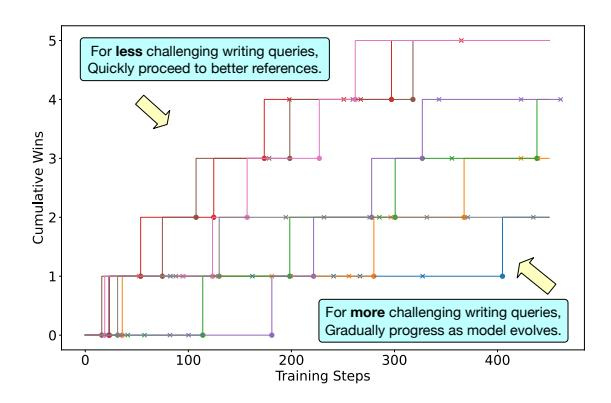

# D.1 Analysis on agreement between model judges and human judges

| Model                            | Agreement    |
|----------------------------------|--------------|
| claude-3.7-sonnet                | 0.82         |
| DeepSeek-R1 gpt-4o-2024-11-20 | 0.76 0.70 |
| qwen-plus                        | 0.75         |

Table 15: Agreement experiments between model judges and human judges.

To evaluate the reliablilty of the LLM judges in our setting, we conduct extensive experiments on 300 samples to measure the agreement between model judges and human judges. Our annotators involved are employed by a professional annotation company and they have been informed of our data usage and provided consent. They possess necessary knowledge for long-form writing and they are paid 18 per hour. We assign 5 annotators to annotate one data sample(writing instruction, response A, response B) and we use their majority voting label as the final result for each sample. The inter-annotator agreement, with a Cohen's kappa coefficient (κ) of 0.69, is generally considered high, as values exceeding 0.6 are typically regarded as indicating relatively good agreement. In the annotation process, we offer clear guidance for the annotators (adapted from WritingBench). Specifically, we guide them to think like real user who poses the writing instruction and prioritize content correctness and proper use of materials after an initial annotation trial. The guidelines for the annotators are as follows.

Please carefully read the Query, putting yourself in the user's position, and choose which of the two responses, A or B, is better. Select "A" if A is better, "B" if B is better, and "Tie" if they are about the same. Do not be misled by length or formatting.

Focus on the \*\*correctness of content\*\* and the \*\*proper use of materials\*\* in the responses, especially if the query specifies such requirements.

The results are shown in Table [15,](#page-19-2) demonstrating the relatively high agreement between human and model judges and the reliability of LLM-as-Judge methods used in our training process.

## D.2 Sample-wise Learning Schedule

As shown in Figure [5,](#page-20-1) our approach enables sample-wise asynchronous scheduling to dynamically adapt task difficulty to model capability. For the difficult instructions, the model proceeds more slowly to stronger references while for the easier instructions, the model proceeds quickly towards more competitive references.

> **[图片提取文字 (无描述)]:**
> 5 For less challenging writing queries, Quickly proceed to better references. 4 Cumulative Wins For more challenging writing queries, Gradually progress as model evolves. 0 200 100 300 400 Training Steps

Figure 5: Sample-wise asynchronous learning schedule during training enabled by *Dynamic Reference Scheduling*. Each line represents a sample, where an upward step indicates LLM surpassing its current reference and advancing to a better one.

## D.3 Analysis of Sample Size

To investigate the impact of dataset scale and quality on model performance, we conduct an ablation study comparing different sample sizes.

The experimental results yield two key insights:

- Quality over Quantity: The 1.5k selected samples outperform the full 5k dataset by 1.03 points on average. This confirms that removing low-potential or noisy samples prevents the model from converging on sub-optimal patterns found in the larger, unrefined set.
- Diminishing Returns: Increasing the sample size from 1.2k to 1.5k (using the same selection criteria) yields a marginal improvement in the average score (84.30 to 84.49). This suggests that for the specific domain of writing tasks, the learning benefits begin to plateau once the model has been exposed to a sufficient density of high-potential examples.

Overall, we think the 1.5k sample size is a reasonable choice.

