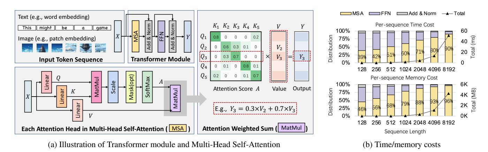
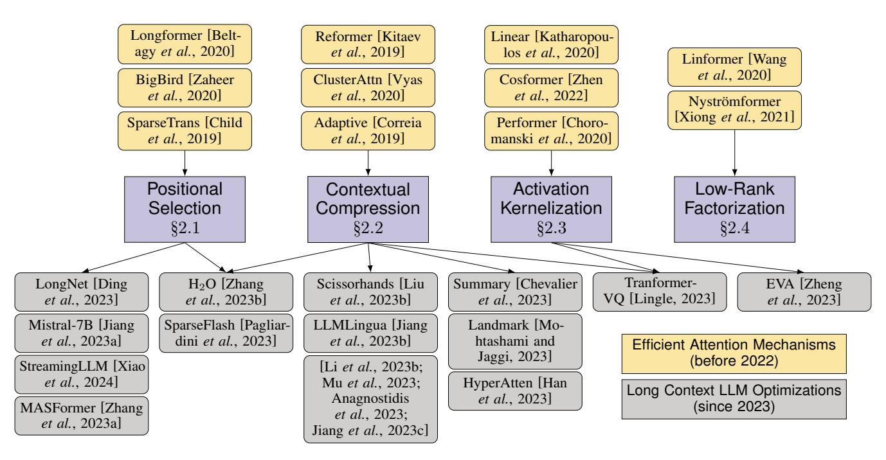
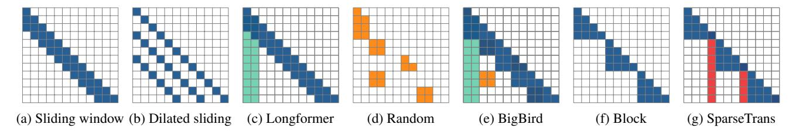
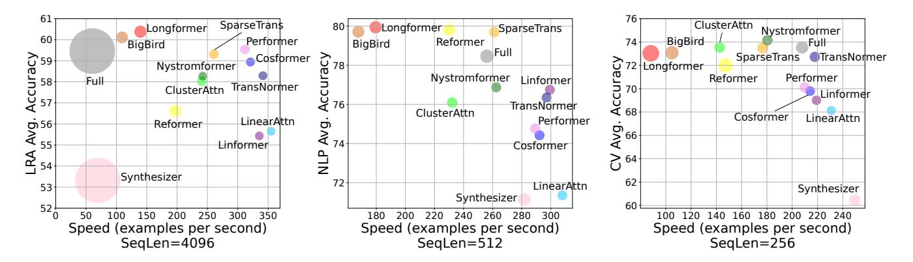
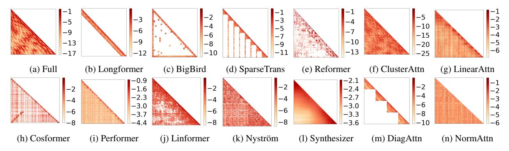

# X-former Elucidator: Reviving Efficient Attention for Long Context Language Modeling

Xupeng Miao $^{1,2}$ , Shenhan Zhu $^1$ , Fangcheng Fu $^1$ , Ziyu Guo $^3$ , Zhi Yang $^1$ , Yaofeng Tu $^4$ , Zhihao Jia $^2$  and Bin Cui $^1$ 

1School of CS & Key Lab of High Confidence Software Technologies (MOE), Peking University 2Carnegie Mellon University

3The Chinese University of Hong Kong 4ZTE Corporation

{xupeng, zhihao}@cmu.edu, {shenhan.zhu, ccchengff, yangzhi, bin.cui}@pku.edu.cn, zyguo@cse.cuhk.edu.hk, tu.yaofeng@zte.com.cn

#### **Abstract**

Transformer-based LLMs are becoming increasingly important in various AI applications. However, apart from the success of LLMs, the explosive demand of long context handling capabilities is a key and in-time problem for both academia and industry. Due to the limitations from the quadratic complexity of the attention mechanism, long context scenarios require much more resources for LLM development and deployment, bringing huge challenges to the underlying AI infrastructure. Meanwhile, we observe that there is a trend of reviving previous efficient attention mechanisms to latest LLMs. However, it still remains an open question about how to select from these diverse approaches in practice. In this paper, we answer this question from several aspects. First, we revisit these latest long-context LLM innovations and discuss their relationship with prior approaches with a novel and comprehensive taxonomy. Next, we conduct a thorough evaluation over various types of workloads considering both efficiency and effectiveness. Finally, we provide an in-depth analysis, summarize our key findings, and offer insightful suggestions on the trade-offs of designing and deploying efficient attention mechanisms for Transformer-based LLMs.

#### 1 Introduction

Transformer-based large language models (LLMs) [Vaswani et al., 2017] are becoming a key backbone of foundation models in recent years, which has been applied to diverse areas [Shao et al., 2024; Zhong et al., 2022; Li et al., 2023a], such as natural language processing (NLP), computer vision (CV), and multi-modal tasks. It has been observed that emerging LLMs have achieved dramatic breakthroughs (e.g., ChatGPT, Bard), constantly improving the state-of-the-art model performance (e.g., generation quality). LLMs are leading this paradigm to shift in deep learning (DL) and becoming the cornerstone of AI development.

However, one of the main pitfalls of Transformer-based LLMs is the quadratic complexity of the attention mechanism (with respect to the sequence length). As shown in Figure 1a, the attention mechanism requires to calculate the attention score matrix  $\mathbf{A} \in \mathbb{R}^{n \times n}$  from the dot product of row vectors in  $\mathbf{Q}$  and  $\mathbf{K}$ , where  $\mathbf{Q}, \mathbf{K}, \mathbf{V} \in \mathbb{R}^{n \times d}$  and n is the sequence length. Specifically, each position (i, j) in A implies the strength of the relationship between the i-th token and the j-th token in the given sequence. Figure 1b illustrates the per-sequence execution time and memory footprint of a single Transformer module while increasing the sequence length from 128 to 8192 on one NVIDIA Titan RTX 24GB GPU. We can observe that multi-head self-attention (MSA) occupies more than half of overheads when the input sequence length grows to 512. Some latest LLM applications (e.g., long document handling, multi-round chatting) have claimed to support longer sequences with thousands of tokens (e.g., GPT4-32K, Yarn-Mistral-7b-128k, and Baichuan2-192K) and such requirements are still increasing. For these scenarios, the default full attention calculation (i.e., query-key productions between all pairs of tokens) dominates the entire LLM, requiring a large amount of computation and memory resources. Such limitations seriously affects the training and inference efficiency of LLMs and potentially restricts their applicability to more real-world scenarios.

We also notice that since the emergence of ChatGPT, dozens of approaches targeting attention optimizations over existing LLMs continuously appear during the past year. To make LLMs efficiently support long contexts, the key idea behind these explorations is seeking for alternative attention mechanisms to alleviate the computational inefficiency and memory pressure issues for LLM training and inference. However, they simplify attention in significantly different methods (e.g., selecting few important context tokens, reformulating non-linear activation functions), leading to unequal time cost or memory usage. Furthermore, there is no such thing as a free lunch because these optimizations have side effects on the model performance in varying degrees. Therefore, these efficient long context LLM optimizations exhibit vast diversity and pose tough choices for real LLM applications. Unfortunately, as a timely research topic, there lacks a comprehensive survey

> **[图片提取文字 (无描述)]:**
> Add & Norm Text (e.g., word embedding) Per-sequence Time Cost  $K_1$   $K_2$   $K_3$   $K_4$   $K_5$ might game 100% 60 Distribution Image (e.g., patch embedding) 75% Add 50% 25% Transformer Module Input Token Sequence 1024 2048 4096 8192  $Q_5$ Mask(opt) a Per-sequence Memory Cost SoftMax 100% 6K Attention Score A Value Output MatMul ear Distribution 75% 50% ear E.g.,  $Y_3 = 0.3 \times V_2 + 0.7 \times V_3$ 25% 128 1024 2048 4096 8192 Attention Weighted Sum ( MatMul Each Attention Head in Multi-Head Self-Attention ( MSA ) Sequence Length (a) Illustration of Transformer module and Multi-Head Self-Attention (b) Time/memory costs

Figure 1: Fig. 1a: Transformer. Fig. 1b: The increasing time and memory costs when scaling a Transformer module to longer sequences

in this crowded field to provide constructive guidelines for long context LLMs.

**Survey Scope** In fact, scaling LLMs to long context requires innovations from various perspectives, such as designing context compression methods [Mohtashami and Jaggi, 2023; Jiang et al., 2023b; Zhang et al., 2023b], replacing Transformer architecture with attention-free solutions (e.g., recurrent units [Peng et al., 2023], state space models [Gu and Dao, 2023]), leveraging external knowledge during inference (e.g., retrieval-augmented generation [Xu et al., 2023]), and extrapolating the positional embedding for better contextual capabilities (e.g., RoPE [Su et al., 2024]). Our survey mainly focuses on the attention optimizations for efficient long context modeling and aims to provide a comprehensive understanding on the intuitions behind their design trade-offs. Surprisingly, we notice that there is a trend of applying previous efficient attention mechanisms (before 2022) to recent LLMs (since 2023), while minimizing the degradation of model performance. Although some of them are designed for encoders, most of them can easily adapt to the autoregressive decoding paradigm in decoder-only LLMs through certain algorithm adjustments (e.g., maintaining an upper triangular casual mask attention matrix like Figure 3). To the best of our knowledge, we are the first to reveal the development trajectory of these latest long-context LLM advancements as well as their relationships with previous work, making our survey fundamentally different from prior surveys on similar topics [Tay et al., 2020; Miao et al., 2023b].

Specifically, we summarize our contributions as follows:

- We critically revisit latest long-context LLM optimizations, illustrates their technical origins, and provide a new taxonomy to clarify the fundamental differences behind their designs.
- We conduct over 20,000 GPU hours empirical studies to compare the computational efficiency, memory usage, and model performance under relatively fair conditions.
- We provide practical suggestions on algorithm selection and system design for LLMs and offer valuable insights on designing effective and efficient attention mechanisms for long-context LLMs in the future.

### 2 Taxonomy of Efficient Attention for LLMs

In this survey, we revisit previous efficient attention mechanisms and classify them into four categories. We then illustrate the relationship between these prior work with the recent attention optimizations for long context LLMs. Figure 2 presents our taxonomy of these approaches and the technological evolution pathway behind recent long context LLM advances. In the following, we will go through each category and provide an in-depth analysis of them.

#### 2.1 Positional Selection

The first notable line of work directly select few tokens in some pre-defined positions to approximate the original attention results based on the full context. In this way, the query-key pairs to be calculated locate at few specific positions in the attention matrix suggested by algorithm experts. The design of these selected positions are usually determined by some observations in real distribution of attention scores from empirical studies or theoretical analysis. For example, Mistral-7B [Jiang et al., 2023a] takes a sliding window attention mechanism that only emphasizes the left neighboring tokens within the rotating buffer. MASFormer [Zhang et al., 2023a] employs a block sparse attention mechanism and only performs attention calculation within blocks. LongNet [Ding et al., 2023] adapts a dilated window approach to expand the attentive field and capture both short-range and long-range token dependencies. StreamingLLM [Xiao et al., 2024] maintains the sliding window and attention sinks by assuming the initial tokens have strong attention scores even if they are not semantically important. We found that the key ideas of these LLM optimizations are mostly originated from the following approaches.

A1: Longformer. Longformer [Beltagy et al., 2020] designs three types of sparse pattern, i.e. sliding window, dilated sliding window and global, as shown in Figures 3a,3b, and 3c. Since the local context in a sequence may have semantic associations, the two window patterns force a token to aggregate information from neighboring tokens (i.e., the diagonal area in the attention matrix with the size of w). The dilated variant allows a larger receptive field and can be used as an alternative to the original sliding window pattern in some settings. The global pattern introduces all-to-one connections (i.e., g non-

> **[图片提取文字 (无描述)]:**
> Longformer [Belt-Reformer [Kitaev Linear [Katharopouagy et al., 2020] et al., 2019] los et al., 2020] Linformer [Wang et al., 2020] BigBird [Zaheer Cosformer [Zhen ClusterAttn [Vyas et al., 2020] et al., 2020] et al., 2022] Nyströmformer [Xiong et al., 2021] SparseTrans [Child Performer [Choro-Adaptive [Correia et al., 2019] et al., 2019] manski *et al.*, 2020] Activation Positional Low-Rank Contextual Compression Selection Kernelization Factorization §2.1 §2.2 §2.3 §2.4 Tranformer-Scissorhands [Liu Summary [Chevalier EVA [Zheng LongNet [Ding H2O [Zhang VQ [Lingle, 2023] et al., 2023] et al., 2023] et al., 2023b] et al., 2023b] et al., 2023] Mistral-7B [Jiang LLMLingua [Jiang Landmark Mo-SparseFlash [Pagliaret al., 2023a] dini et al., 2023] et al., 2023b] htashami and Efficient Attention Mechanisms Jaggi, 2023] (before 2022) StreamingLLM [Xiao [Li et al., 2023b; et al., 2024] Mu et al., 2023; HyperAtten [Han Long Context LLM Optimizations Anagnostidis et al., 2023] (since 2023) MASFormer [Zhang et al., 2023; et al., 2023a] Jiang *et al.*, 2023c]

Figure 2: Illustration of the relationship between previous efficient attention mechanisms and recent long context LLM optimizations.

zero columns in the attention matrix). It aims to emphasize some special and important tokens, making them noticed by all tokens. To better leverage different patterns, Longformer integrates them together as a combined sparse pattern.

A2: BigBird. BigBird [Zaheer et al., 2020] employs window and global attentions as Longformer does. In addition, BigBird proposes the random pattern, which allows a query to attend to a fixed number (i.e., r) of random keys. From a graph spectral theory perspective, these random edges between tokens benefit the information propagation between arbitrary token pairs. However, the random pattern brings inconvenience in an efficient implementation. To this end, in the GPU kernel implementation of BigBrid, it proposes to blockify the attention matrix and sparse patterns by defining a  $b \times b$  block as a basic computation unit. Computation on the attention matrix is performed at the granularity of basic blocks. Figure 3e illustrates BigBird sparse patterns which are split into  $2 \times 2$  blocks.

A3: Sparse Transformer (SparseTrans). Sparse-Trans [Child et al., 2019] is an early work directing only at decoder-only Transformers on auto-regressive generation workloads. SparseTrans defines a hybrid fixed-position attention pattern that is suitable for general data without any prior knowledge of the strided pattern. It integrates both block-local and block-global patterns as shown in Figure 3g. In this way, these global columns help to summarize previous tokens' information and propagate to all future tokens.

### 2.2 Contextual Compression

Another line of work directly compresses the context into fewer tokens to alleviate the computational and memory overheads. Therefore, it is necessary to find appropriate compression methods to keep important information in the attention matrix. Some approaches adaptively determine which querykey pairs to be calculated according to the context information based on different token importance measurements [Mu et al., 2023; Anagnostidis et al., 2023; Zhang et al., 2023b; Jiang et al., 2023c]. For example, Scissorhands [Liu et al., 2023b] drops the tokens whose corresponding attention scores are lower than a budget and keeps the remaining tokens for the following LLM decoding. H2O [Zhang et al., 2023b] combines these tokens with high attention scores and the sliding window approach for better performance. Selective Context [Li et al., 2023b] evaluates the informativeness of tokens with self-information and retain content with higher self-information. LLMLingua [Jiang et al., 2023b] further takes account into the conditional dependencies between tokens and proposes an iterative prompt compression method. Some approaches inserts some summary [Chevalier et al., 2023] or landmark [Mohtashami and Jaggi, 2023] tokens into the context to replace the original tokens during attention calculation [Ge et al., 2023]. There are also some approaches partitioning context tokens with similar information into small groups by hashing techniques [Han et al., 2023; Pagliardini et al., 2023]. We found that some prior work also optimize the attention calculation with similar design.

A4: Reformer. Reformer [Kitaev et al., 2019] proposes the locality sensitive hashing (LSH) attention mechanism. It gathers the nearest queries and keys into the same bucket during the pre-processing phase. More specifically, it uses a random-projection-based LSH function  $h(\cdot)$  to map queries (keys) into different buckets. Suppose the number of buckets is s, given a random matrix  $\mathbf{R} \in \mathbb{R}^{d \times s/2}$ , we have  $h(x) = \arg\max([x\mathbf{R}; -x\mathbf{R}])$ . It assumes that similar queries (keys) will fall into identical buckets with high probability and then we can limit the attention calculation within the

> **[图片提取文字 (无描述)]:**
> (a) Sliding window (b) Dilated sliding (d) Random (e) BigBird (f) Block

Figure 3: Positional attention patterns. Fig. 3c: Window + Global. Figure 3e: Random + Window + Global. Fig. 3g: Block + Global Column.

same bucket, rather than the whole sequence. It could be further improved by applying multiple rounds (i.e., l) of hashing. Besides, Reformer shares query and key weight matrices  $(\mathbf{W}^Q, \mathbf{W}^K)$ , which forces queries and keys to be identical. However, uneven bucket splitting may increase the difficulties of parallel computation in GPUs. Reformer proposes to reorder queries (keys) according to cluster indices and split them into small uniform chunks. It is also necessary to re-order the output vectors back after the chunk-wise multiplication.

A5: Clustered Attention (ClusterAttn). ClusterAttn [Vyas et al., 2020] uses centroids (representative queries) to provide a fast approximation for the full attention calculation. During pre-processing, a fast clustering (e.g., K-means with l iterations, which is also used by Routing Transformer [Roy et al., 2021]) step groups all queries into c non-overlapping clusters. It assumes queries in the same cluster (which suggests close in spatial) can be represented by the same one (i.e., cluster centroid). These centroids are then multiplied with all keys, and the resulting attention distribution will be broadcasted to all queries in the same cluster. It is further improved by using top-k keys for each cluster (i.e. the keys that get top-khighest attention scores with each centroid) to re-calculate the attention with clustered queries. It involves more computation overheads, but largely reduces the misusing risks (e.g., a key with low attention for some queries mistakenly gets high attention with the centroid).

*Others.* Some work adaptively select important tokens to compress the context, such as adaptively sparse Transformer [Correia *et al.*, 2019], Informer [Zhou *et al.*, 2021], and so on [Gupta *et al.*, 2021]. However, considering the diversity of input workloads, it's still challenging for nowadays LLMs to find appropriate compression methods and keep important information in the attention matrix without prior knowledge.

#### 2.3 Activation Kernelization

Another category of approaches is kernelization methods that reorganize the original activation function  $\mathtt{softmax}(\mathbf{QK}^\top)$  to a matrix multiplication after the kernel functions [Tsai et al., 2019]. Specifically, it replaces  $\mathtt{exp}(\cdot)$  with  $S(\cdot, \cdot)$ , which can be written as  $S(a,b) = \phi(a)\phi(b)^\top$ . Here  $S(\cdot, \cdot)$  should be non-negative and the feature map function  $\phi(\cdot)$  is required to be non-negative and monotonically non-decreasing. As a result, given a query  $q_i$ , its original attention output  $y_i^{\text{original}} = \mathtt{softmax}(q_i\mathbf{K}^\top)\mathbf{V}$  could be approximated as:

$$y_{i}^{\text{kernel}} = \sum_{j} \frac{\exp(q_{i}k_{j}^{\top})}{\sum_{l} \exp(q_{i}k_{l}^{\top})} v_{j} \approx \sum_{j} \frac{S(q_{i}, k_{j})}{\sum_{l} S(q_{i}, k_{l})} v_{j}$$
(1)
$$= \frac{\sum_{j} \left(\phi(q_{i})\phi(k_{j})^{\top}\right) v_{j}}{\sum_{l} \phi(q_{i})\phi(k_{l})^{\top}} = \frac{\left[\phi(\mathbf{Q}) \left(\phi(\mathbf{K})^{\top} \mathbf{V}\right)\right]_{i}}{\left[\phi(\mathbf{Q}) \sum_{l} \phi(k_{l})^{\top}\right]_{i}}.$$
(2)

Through getting rid of softmax, kernelization methods calculate  $\phi(\mathbf{K})^{\top}\mathbf{V}$  first and then multiply  $\phi(\mathbf{Q})$  on the left. Such a computation order avoids directly calculating  $\mathbf{Q}\mathbf{K}^{\top}$ , and reduces the time complexity from  $\mathcal{O}(dn^2)$  to  $\mathcal{O}(d^2n)$ .

A6: Linear Attention (LinearAttn). LinearAttn [Katharopoulos et al., 2020] is the first kernelization attention method that switches the order from  $(\mathbf{Q}\mathbf{K}^{\top})\mathbf{V}$  to  $\mathbf{Q}(\mathbf{K}^{\top}\mathbf{V})$ . It defines the feature map function as  $\phi(\cdot) = \text{elu}(\cdot) + 1$ . The advantage of the exponential linear unit [Clevert et al., 2015] over the mediocre choice of ReLU(·) is its non-zero gradients when x is negative.

A7: Cosformer. Cosformer [Zhen et al., 2022] uses the feature map function of  $\phi(\cdot) = \text{ReLU}(\cdot)$  and employs a cos-based re-weighting mechanism in the kernel function. Specifically, it multiplies the attention score of each query-key pair with a recency bias as following:

$$S'(q_i, k_j) = S(q_i, k_j) \cos\left(\frac{i - j}{n} \cdot \frac{\pi}{2}\right)$$
 (3)

Such a re-weighting mechanism makes tokens in closer positions have a higher bias. E.q. (3) can be dissected in the kernel form:

$$S(q_i, k_j) \cos \alpha_{i-j} = \phi(q_i)\phi(k_j)^{\top} \cdot (\cos \alpha_i \cos \alpha_j + \sin \alpha_i \sin \alpha_j) = q_i^{\cos} (k_j^{\cos})^{\top} + q_i^{\sin} (k_j^{\sin})^{\top}, \quad (4)$$

where  $\alpha_t = \frac{t\pi}{2n}, q_i^{\cos} = \phi(q_i) \cos \alpha_i, q_i^{\sin}, k_j^{\cos}, k_j^{\sin}$  are defined in similar way. In this way, we only need to calculate

$$\mathbf{Q}^{\cos}\left((\mathbf{K}^{\cos})^{\top}\mathbf{V}\right), \mathbf{Q}^{\sin}\left((\mathbf{K}^{\sin})^{\top}\mathbf{V}\right),$$
 (5)

satisfying the calculation scheme of kernelization methods.

**A8: Performer.** Performer [Choromanski *et al.*, 2020] defines the random feature map function as a series of carefully designed functions:

$$\phi(x) = \frac{h(x)}{\sqrt{p}} \left( f_1(x\Omega^\top), \dots, f_l(x\Omega^\top) \right) \tag{6}$$

where  $\Omega \in \mathbb{R}^{p \times d}$  is a random matrix composed of p i.i.d. random vectors obeying some d-dim distribution  $\mathcal{D}$ . By specifying  $f, h, \mathcal{D}$  as certain values, Performer gets a suitable random feature map for softmax-kernel estimation. In this series

of feature maps, the feature map configuration which sets  $h=1, f=\text{ReLU}, \mathcal{D}=\mathcal{N}(0, \mathbf{I}_d)$  has shown better performance against the approximated softmax-kernel.

Some recent LLM optimizations are built on top of these kernelization methods. For example, EVA [Zheng *et al.*, 2023] generalize the formulation of Performer and random-feature-based attention [Peng *et al.*, 2021] by control variates approximation. Tranformer-VQ [Lingle, 2023] combines LSH and kernelization techniques to reduce the attention complexity.

### 2.4 Low-Rank Factorization

Low-rank factorization methods go one step further beyond contextual compression and discard the mindset of reducing the number of dot-products of query-key pairs. This line of work treats the attention matrix (or the one after softmax) as a low-rank matrix and finds ways to decompose it into products of low-dim matrices. These approaches reduce the time and memory complexities by directly reducing the dimension sizes of tensors. Although there is currently no long context LLM based on such methods, it's still worth discussing in our survey as a representative approach.

**A9:** Linformer. Linformer [Wang et al., 2020] reduces dimensions by linear projection on inputs. It projects key and value matrices from  $\mathbb{R}^{n\times d}$  to  $\mathbb{R}^{p\times d}$  using low-dim projections  $\mathbf{P_1}, \mathbf{P_2} \in \mathbb{R}^{p\times n}$ , i.e.,

$$\mathbf{X} = \operatorname{softmax} \left( \frac{\mathbf{Q} \left( \mathbf{P}_1 \mathbf{K} \right)^{\top}}{\sqrt{d}} \right) \left( \mathbf{P}_2 \mathbf{V} \right). \tag{7}$$

The projection on **K** results in a smaller attention matrix, reducing the quadratic complexity ultimately. The reduction on sequence length dimension means loss of a large portion of information, especially when the input sequence is extremely long. For better efficiency, Linformer can share projection matrices across heads, key-value pairs or even layers.

**A10:** Nyströmformer. Nyströmformer [Xiong et al., 2021] uses the Nyström method [Wang and Zhang, 2013] to approximate the softmax attention. Though conventional Nyström method needs to access full  $\mathbf{Q}\mathbf{K}^{\top}$  for approximation, Nyströmformer revises the approximation into the form:

$$\tilde{\mathbf{X}} = \operatorname{softmax} \left( \frac{\mathbf{Q} \tilde{\mathbf{K}}^{\top}}{\sqrt{d}} \right) \left( \operatorname{softmax} \left( \frac{\tilde{\mathbf{Q}} \tilde{\mathbf{K}}^{\top}}{\sqrt{d}} \right) \right)^{+}$$

$$\operatorname{softmax} \left( \frac{\tilde{\mathbf{Q}} \mathbf{K}^{\top}}{\sqrt{d}} \right) \mathbf{V}$$

$$= \mathbf{A}_{k} \mathbf{A}_{ak}^{+} \mathbf{A}_{q} \mathbf{V} = (\mathbf{A}_{k} \mathbf{A}_{ak}^{+}) (\mathbf{A}_{q} \mathbf{V}) \tag{8}$$

Here  $\tilde{\mathbf{Q}}, \tilde{\mathbf{K}} \in \mathbb{R}^{p \times d}$  are sub-sampled from  $\mathbf{Q}, \mathbf{K}$  by segmentmeans, which divides the original matrix into p segments of equal length and uses the means of segments (also called landmarks) to form the sub-sampling matrix.  $\mathbf{A}_{qk}^+$  denotes the Moore-Penrose pseudoinverse of matrix  $\mathbf{A}_{qk}$ , which is also approximated using an iterative algorithm (l rounds). The softmax attention is factorized into three low-dim multipliers,  $\mathbf{A}_k, \mathbf{A}_{qk}^+, \mathbf{A}_q$ . The order of matrix multiplication operations is referred by parenthesis in E.q. (8). Nyströmformer applies an additional skip connection of  $\mathbf{V}$  using a 1-dim depth-wise convolution for better model performance.

### 2.5 Other Approaches

A11: Synthesizer. Synthesizer [Tay et al., 2021a] is an attempt to replace dot-product self-attention with (1) a learnable, randomly initialized alignment matrix, and (2) the output of a two-layered feed-forward network conditioning only on hidden vectors  $\mathbf{X}$ . It further provides four synthetic attention variants as alternatives. Factorized random synthetic attention uses two learnable matrices  $\mathbf{R}_1, \mathbf{R}_2 \in \mathbb{R}^{n \times p}$  to generate a random attention matrix:

$$X = \operatorname{softmax}\left(\mathbf{R}_1 \mathbf{R}_2^{\top}\right) \mathbf{V}. \tag{9}$$

The attention matrix is independent of input tokens. For p < d,  $\mathbf{R}_1 \mathbf{R}_2^{\top}$  computes less than  $\mathbf{Q} \mathbf{K}^{\top}$ .

A12: TransNormer. TransNormer [Qin et al., 2022] aims to tackle two empirically found problems in conventional kernelization methods: (1) unbounded gradients are observed due to the normalization inherited from the softmax function (i.e. the denominator in E.g. (2)), which leads to unstable convergence in model training, and (2) attention probabilities are diluted due to the non-existence of softmax function, which is detrimental to Transformers in capturing strong neighboring dependencies between tokens. Therefore, TransNormer divides the model into two parts. The early layers use blocklocal pattern in softmax attention (called DiagAttention) to facilitate the model's learning process on local dependencies of tokens, and the later layers use RMSNorm to replace the denominator as normalization for  $\phi(\mathbf{Q}) (\phi(\mathbf{K})^{\top} \mathbf{V})$  (called NormAttention), aiming to stabilize the training gradients. Both of them have linear complexity w.r.t. sequence length.

#### 2.6 Summary

To reduce the attention complexity for long context LLMs, there are many other attention simplification methods beyond prior work, e.g., reducing the complexity from hidden dimension. For example, attention sharing approaches make different attention heads share the same keys and values, such as Multi-query attention (MQA) and Group-query attention (GQA) [Ainslie *et al.*, 2023]. Deja Vu [Liu *et al.*, 2023c] cuts off specific attention heads by the contextual sparsity hypothesis. CacheGen [Liu *et al.*, 2023a] takes a losslessly bitstream compression method to reduce the size of context representation (i.e., KV-cache). We acknowledge that these explorations can be beneficial to reduce the resource usage of attention calculation. However, our survey mainly focuses on the attention optimizations from the sequence length dimension, alleviating the quadratic complexity problem for long contexts.

#### 3 Empirical Study and Analysis

To provide a more comprehensive understanding of prior efficient attention mechanisms, we also provide an empirical study and analysis to explore these reviving efficient attention mechanisms. Considering the technical similarities between prior work and recent LLM optimizations, we re-implement twelve representative efficient attention mechanisms in PyTorch. The involved dense algebras are based on PyTorch's default MatMul operators and we also write an efficient blocksparse GPU kernels to support sparse algebras [Miao et al., 2023a]. And we evaluate them on three kinds of popular

> **[图片提取文字 (无描述)]:**
> 61 SparseTrans ClusterAttn 80 SparseTrans Longformer Longformer Nystromformer 60 BigBird Performer Reformer 74 BigBird Full BigBird Full ∑ 59 TransNormer Cosformer SparseTrans 72 Longformer Nystromformer Nystromformer Performer Reformer Linformer Full TransNormer ClusterAttn Linformer 76 TransNormer ₹ 68 ClusterAttn Cosformer LinearAttn LinearAttn ġ. Performer **5**56 Reformer 9 > 66 Linformer Cosformer > 64 Synthesizer 62 LinearAttn 53 Synthesizer Synthesizer 60 52 150 200 250 300 350 220 240 260 280 100 120 140 160 180 200 220 240 Speed (examples per second) Speed (examples per second) Speed (examples per second) SeqLen=4096 SegLen=256 SegLen=512

Figure 4: Performance (y-axis), speed (x-axis), and memory footprint (size of the circles) of different methods in different tasks

and diverse LLM workloads by training these Transformers from scratch. The first is the long range arena (LRA) benchmark [Tay et al., 2021b], which is a systematic and unified benchmark designed for efficient Transformers with long input sequences. We then go beyond the LRA benchmark to both the NLP task and the CV task with long sequences. To obtain copious and unbiased conclusions, we also carefully design the configurations of each individual efficient attention mechanism and guarantee making a fair comparison, limiting all approaches within the same theoretical computational budget. The entire evaluations take around 21,114 GPU hours in total on a NVIDIA Titan RTX 24GB GPU cluster. The whole code repository of our evaluations are open sourced to benefit the follow-up studies. The code and more experiment details can be found in our additional technical report [mya, 2023].

#### 3.1 Performance Comparison

Figure 4 illustrates the overall performance comparison of these methods and their trade-offs for each individual task. In each subfigure, the y-axis represents the corresponding task statistical efficiency (in different evaluation metrics) and the x-axis shows the computation speed (i.e., the number of processed sequences per second for training). All evaluated approaches are expressed as circles with different colors and each circle's center coordinates refer to its corresponding statistical and computational efficiencies. The size of these circles illustrates the memory efficiency (i.e., memory footprint) of each approach.

We found that, in the LRA benchmark with long sequence, full attention has unbearable time and memory overheads, but achieves superior model performance. The kernelization methods (e.g., Performer and Cosformer) get the best balance between performance and speed with low memory usage. Positional selection methods (e.g., Longformer and BigBird) are also good alternatives to full attention with at least 1.81× speed up and 8.07× memory saving. But these methods are slower than full attention in NLP tasks with a slightly shorter sequence length of 512. Only SparseTrans surpasses full attention in all efficiency metrics. Other positional selection methods are slower, and the rest categories of methods have obvious performance degradation. In CV tasks with much shorter sequences, full attention itself is quite a good solution, as most efficient attention mechanisms are either slower or

weaker. Due to the combination of positional selection and activation kernelization, TransNormer could be an alternative solution for less memory usage and faster speed with slight performance loss.

### 3.2 Interpretability Study

To better understand the fundamental differences of these efficient attention approaches, we study their impacts on the attention calculation results. We pick up one attention head of the last layer for each well-trained model on the NLP task and visualize their attention matrices in Figure 5. Illustrations for more heads are in [mya, 2023]. As we can see, the attention score of full attention has strong local biases. Many large attention scores appear even far away from the diagonal area, which complements long-range dependencies to the diagonal local attention. Positional selection methods apply sparse patterns on attention matrices, and blank positions in the visualization are not included in attention calculation. Their local sparse patterns formulate a diagonal region in the figures. There are also some dark rows and columns to learn the long-range dependencies in these sparse attentions. Longformer only uses sliding window attention and BigBird puts global blocks at the edges of attention matrices, while SparseTrans has a global column after each block. For contextual compression methods, their illustrated local and long-range dependencies change significantly. show the effectiveness of their hashing and/or clustering estimation. Both Reformer and ClusterAttn learn the dependencies in the low-dimensional space after hashing and/or clustering, rather than the original space. That's why there are no significant dark diagonal blocks in the attention matrices. Activation kernelization methods reorder the multiplication operators and do not have explicit attention anymore. But we can still obtain the approximate full attention by recomputing  $\phi(\mathbf{Q})\phi(\mathbf{K})^{\top}$  first and divide it by the denominator of E.q. (2). We also observe some local biases, especially for Cosformer and Performer due to their additional optimizations (e.g., re-weighting). For low-rank factorization methods, we use the computation results before V in E.q. (7) and (8) as their attention matrices. The results involve some negative values due to  ${\bf P}_2$  and  ${\bf A}_{qk}^+$ , which are represented as the blank positions in Figures 5j and 5k. The random attention matrix of Synthesizer, which is independent of inputs and thus iden-

> **[图片提取文字 (无描述)]:**
> -5 -10-6 -15-9 -10-13-20(a) Full (b) Longformer (c) BigBird (d) SparseTrans (e) Reformer (f) ClusterAttn (g) LinearAttn **■**-0.9 -1.6-2-2.4-2.3-2.7-4 -6 -3.0-3.0-6 -6 -6 -3.7-3.3-3.6-10(h) Cosformer (i) Performer (j) Linformer (l) Synthesizer (n) NormAttn (k) Nyström (m) DiagAttn

Figure 5: Visualization of attention matrices (after softmax) for all effcient attention mechanisms (in log-scale for better illustration).

tical for all data instances, has broader local regions for high attention values. As a combination method, TransNormer uses DiagAttention to model local dependencies, while its NormAttention devotes to long-range dependencies and does not show a strong local trend as other kernelization methods do.

