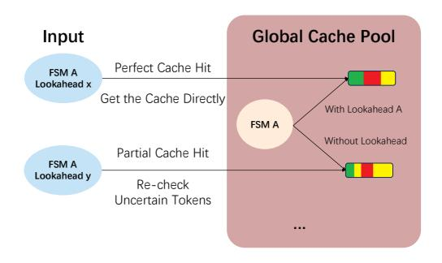

# 2.1 Constrained Decoding and Context-free Grammar

LLMs like Deepseek-R1 [\[7\]](#page-9-12), gpt-oss [\[24\]](#page-9-13) all generate the tokens autoregressively, predicting the next token based on the previous output. Each time the LLM needs to output a token, it will calculate a logit vector for the vocabulary and then convert it into a probability distribution with the softmax function [4]. In the end, a sampler will choose an output token based on the distribution to output.

Constrained decoding [8] is a technique for guiding LLMs to generate text according to a specified grammar. During each decoding step, tokens that do not conform to the grammar are marked as invalid, and their corresponding logit values are set to  $-\infty$  to assign them zero probability, thus preventing them from being sampled and ensuring the output of LLMs follows the grammar.

Context-free Grammar (CFG) [6] is generally used to define the grammar structures, and it is described by Extended Backus-Naur Form (EBNF) [1] in most constrained decoding methods. An EBNF consists of a set of production rules, each representing a symbol that can be expanded into a sequence of terminal characters or references to other symbols. With the rule references, EBNF can naturally express complex recursive structures.

#### 2.2 XGrammar

Constrained decoding modifies the logit vector before the LLM outputs the next token, requiring a runtime check to determine whether the token is valid across the entire vocabulary. Without optimization, this process introduces significant overhead, which substantially slows down the output speed of LLMs.

XGrammar [9] is designed to achieve near-zero overhead to-ken mask generation. XGrammar employs a pushdown automaton parser to trace the output of LLMs. Its key insight is that for each state in CFGs, there are a lot of tokens that can be determined to be accepted or rejected within the state's rule, and there are a few context-dependent tokens that need the context information to determine whether they can be accepted by the current state at runtime. XGrammar stores the pre-computed accepted tokens, rejected tokens, and context-dependent tokens into the adaptive token mask cache. With the token mask cache, XGrammar can skip massive computation for accepted tokens and rejected tokens at runtime. Moreover, XGrammar further increases the cache hit rate by introducing context expansion, which leverages the rule reference structure in the grammar to further check and reject context-dependent tokens.

With the optimization techniques, XGrammar can handle static structured generation tasks well. However, XGrammar needs to compile all the grammars ahead of time, which is not suitable for dynamic structured generation tasks, since the grammars can be sent to the engine at runtime. Thus, how to efficiently handle dynamic structured generation tasks remains a challenge.

#### 3 Methods

#### 3.1 Overview

XGrammar-2 addresses dynamic agentic workloads with a unified design centered on first-class structural dispatching and fine-grained reuse across dynamically changing grammars. TagDispatch (Section 3.2) captures intra-request dynamism by expressing tagtriggered switching between free-form text and structured subgrammars. Cross-grammar cache (Section 3.3) handles inter-request dynamism by reusing token mask caches across grammars with shared substructures. To support efficient execution on dynamic

and complex grammars, XGrammar-2 adopts an Earley-based adaptive token mask cache (Section 3.4) as the cache mechanism. JIT compilation (Section 3.5) further amortizes cache construction over decoding steps instead of materializing the full cache upfront. Repetition state compression (Section 3.6) reduces runtime overhead and improves robustness for recurring grammar patterns.

## 3.2 TagDispatch: Dynamic Dispatch Semantics

Intra-request dynamism: prior output determines subsequent structures. This requires free-formed text interleaved by structure constraints separated by certain triggers, such as a tool name or a channel control token. Although this semantics can in principle be encoded in plain EBNF, the encoding becomes cumbersome and inefficient, since it must simultaneously accept arbitrary nontag text, recognize multiple tags, and route each tag to a different sub-grammar.

To effectively express such structures, we introduce TagDispatch, an EBNF-compatible grammar intrinsic to describing tag-triggered switching between free-form text and structured sub-grammars. As shown in Figure 3, a TagDi spatch is parameterized by (i) a list of tag-grammar pairs  $(t_i, G_i)$ , where emitting tag  $t_i$  dispatches decoding to sub-grammar  $G_i$ , and (ii) a set of stop strings stop\_strs that terminate dispatching. Conceptually, TagDispatch partitions decoding into two modes: dispatching and dispatched. Decoding starts in the dispatching mode, where the engine accepts ordinary text while continuously matching registered tags. Once a tag is matched, the engine switches to the dispatched mode and constrains subsequent decoding with the corresponding sub-grammar. After that sub-grammar completes, decoding returns to the dispatching mode. If a stop string is matched in the dispatching mode, TagDispatch exits.

In the dispatching mode, we use an Aho–Corasick automaton (AC automaton) [2] to match multiple tags simultaneously. The automaton compiles all candidate tags into a single deterministic finite automaton (DFA), enabling incremental matching over the generated text. When a partial match fails, the automaton falls back to a previously matched state and continues matching. This enables efficient online trigger matching over free-form text.

TagDispatch can effectively describe agentic output structures. For example, a snippet of LLM output with tool calling is OK, I will call a tool. <function=get\_weather>{"city": "San Francisco"} </function>. The prefix <function=get\_weather> can be registered as a tag in TagDispatch, and dispatches decoding to the JSON-argument grammar (and optional wrapper grammar) associated with get\_weather. After the dispatched grammar completes, TagDispatch returns to the dispatching mode, allowing the model to continue generating free-form text or trigger another tag. The same abstraction also applies to channelized outputs, where a channel tag is followed by a channel-specific structure.

#### 3.3 Cross-Grammar Cache

Different requests' grammars often share some common sub-structures. Even within a single grammar, some sub-structures are still duplicated. These repeated compilation leads to large overhead. To leverage the token mask caches of these sub-structures, we design a **Cross-Grammar Cache** to avoid recomputation.

> **[图片提取文字 (无描述)]:**
> Quit Continuous end Matching TagDispatch Intrinsic Other TagDispatch( Characters ("<function=", grammar1), ("<think>", grammar2), stop\_strs = "end" Other (think> function= 3 Strings Dispatching grammar1 grammar2 Dispatched

Figure 3: The definition and the constructed automata from TagDispatch.

In XGrammar-2, structures are represented as multiple FSMs. Each FSM can have edges referring to another FSM to represent the recursive structure in EBNF. To efficiently reuse the token mask caches of the common sub-structures, we have two main challenges:

- How to detect the common substructures. We need to determine whether two FSMs are equivalent; since each FSM can refer to other FSMs, the checker also needs to check the referred FSM, and the reference structure may contain loops.
- (2) How to reuse the token mask caches from other FSMs. In XGrammar, the token mask cache not only considers FSM's structural information, but also how this FSM is referred to by other FSMs to further increase cache hit rate (see context-expansion in XGrammar paper). Even though the structure of two FSM matches, the cache may not be simply reused because they have different referencing structure. [9].

For the first challenge, we design a **hierarchical hashing algorithm** for FSMs to detect identical sub-structures. This algorithm resolves the problem by assigning each FSM a structural hash that incorporates both its local state-transition structure and the whole-structure hashes of the FSMs referenced by its rule-reference edges. The key idea is to combine the hash of each referenced FSM into the hash of the referencing FSM, so that structural information is aggregated bottom-up along the FSM reference graph. Cyclic references break this bottom-up order and therefore require additional handling. The overall procedure is:

- (1) Build the FSM reference graph induced by rule-reference edges.
- (2) Hash the acyclic portion bottom-up with Algorithm 1.
- (3) Handle each simple cycle using provisional hashes followed by cycle-hash refinement (Algorithm 2).
- (4) Use the final FSM hashes as keys for cross-grammar cache reuse.

Algorithm 1 hashes one FSM, assuming that the hashes of all referenced FSMs are already available. It first canonicalizes the local state graph by deterministically sorting outgoing edges and assigning canonical state IDs via BFS from the initial state. It then traverses the states in this canonical order and incrementally hashes the serialized state and edge information, including the edge type, label, and target state ID. Therefore, for the acyclic portion of the

reference graph, we can topologically sort the FSMs and apply Algorithm 1 in reverse topological order.

Simple cycles require additional handling because the bottom-up assumption of Algorithm 1 no longer holds: an FSM in the cycle may refer to another FSM whose final hash is not yet known. To address this, we first assign a special provisional value to unresolved rule-reference edges inside the cycle and apply Algorithm 1 to obtain provisional hashes for the FSMs in the cycle. We then apply Algorithm 2 [13] to refine these provisional hashes with the cycle structure itself. This yields distinct final hashes for different positions in the cycle and preserves the uniqueness of the resulting structural hashes.

> **[图片提取文字 (无描述)]:**
> Global Cache Pool Input Perfect Cache Hit FSM A Lookahead x Get the Cache Directly With Lookahead A FSM A Without Lookahead Partial Cache Hit FSM A Lookahead y Re-check Uncertain Tokens ...

Figure 4: Cross-grammar cache reuse under matching and mismatched lookahead conditions.

For the second challenge, in the cross-grammar cache, with a given rule with the FSM A, we will check if the token mask caches for the same FSM have been computed Figure 4. If there is, then it is a cache hit. If the rules share the same lookahead assertion, then it is a perfect cache hit, and we can reuse the token mask cache directly. Otherwise, it is a partial cache hit, and we need to recheck all the uncertain tokens and the tokens that are validated by the original lookahead assertion. Then, we add the new cache to the global cache pool. In this method, most of the token mask cache will be reused. Once the size of the cross-grammar cache reaches the limit, we use LRU to evict entries. However, as we follow XGrammar's adaptive storage method, the memory overhead of the cross-grammar cache remains low and rarely reaches this limit.

In summary, this cross-grammar cache can handle single FSMs, FSMs forming a tree reference structure, and also FSMs forming a graph with simple cycles, and maximize the cache reuse between and within grammars.

