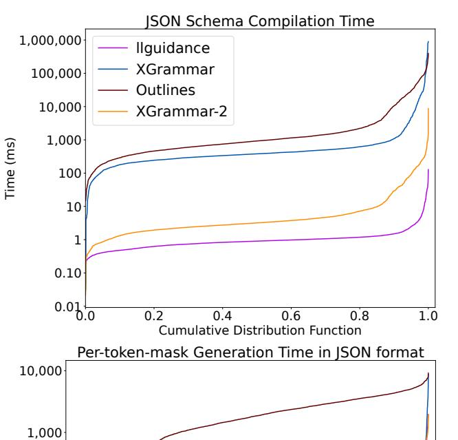
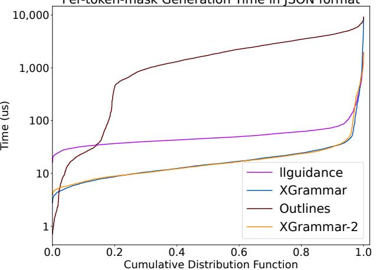

# E XGrammar's Adaptive Token Mask cache Generation Algorithm

In XGrammar, all grammars are processed as a group of FSMs. During compilation, for each state of the FSMs, a corresponding adaptive token mask cache is generated. Each adaptive token mask cache consists of three parts:

- Accepted tokens: tokens that can be accepted by the FSM and thus conform to the grammar.
- Rejected tokens: tokens that will be rejected by the FSM and therefore do not conform to the grammar.
- Uncertain tokens: tokens that can reach the final state(s) of the FSMs without consuming all their characters. The remaining part must be checked at runtime.

At runtime, we collect all the current states. Tokens that can be accepted by at least one adaptive token mask cache are directly marked as accepted. For the remaining tokens, if a token is marked as uncertain in at least one adaptive token mask cache, we further check whether it can be accepted given the current states. If so, it is also marked as accepted. All other tokens are marked as rejected. Through this process, a final token mask is generated.

## F Earley's Parsing Algorithm

The efficiency of the Earley parser comes from its well-designed algorithm, which applies dynamic programming. During parsing, it records the current state (the rule and the position within the rule), the number of characters consumed, and the starting position of the current rule. Based on the information, the parser performs three basic operations: predict, scan, and complete. Predict applies when the current position in a rule references another rule; in this case, the parser transitions to the referenced rule and applies Earley's algorithm recursively. Scan applies when the rule expects a character, and the parser checks whether the current character can be accepted by the state. Complete applies when a rule reaches its end; the parser then returns to its parent states (which may be multiple) and advances them. With these three operations, the Earley parser efficiently exploits common substructures among different rules, thereby improving parsing performance.

## G Mask Generation Efficiency on JSON Schemas

Although this paper focuses on dynamic structure generation in agentic use cases, it is still interesting to see how XGrammar-2 performs on generations with pre-defined static JSON schemas. The dataset in JSONSchemaBench [\[11\]](#page-9-17). The results are in [Figure 11.](#page-11-3) XGrammar-2 can also perform well on static structured generation tasks. Additionally, XGrammar-2 brings improved grammar compilation time to compile most JSON Schemas within 1 ms.

> **[图片提取文字 (无描述)]:**
> JSON Schema Compilation Time 1,000,000 llguidance XGrammar 100,000 Outlines 10,000 XGrammar-2 1,000 Time (ms) 100 10 1 0.10 0.01 0.2 0.4 0.6 1.0 Cumulative Distribution Function Per-token-mask Generation Time in ISON format 10,000 1,000

> **[图片提取文字 (无描述)]:**
> i ei-token-inask deneration inne in joon ionnat 10,000 1,000 Time (us) 100 llguidance 10 XGrammar Outlines XGrammar-2 0.2 0.4 0.6 0.0 0.8 1.0 Cumulative Distribution Function

Figure 11: JSONSchemaBench.

