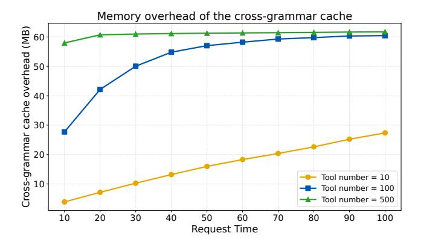
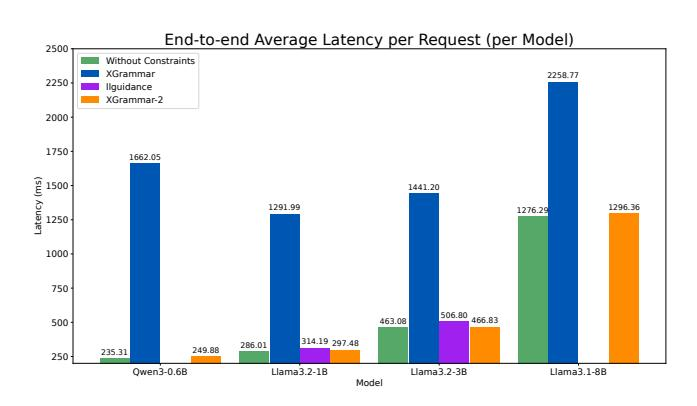

# 3.5 JIT Compilation of Adaptive Token Mask Cache

Prior efficient constrained decoding works, such as Outlines and XGrammar, have a compilation stage that computes a token mask cache for every possible state in the grammar. However, due to the intra-request dynamism in agentic tasks, one request may allow dozens or even hundreds of tools, resulting in a huge grammar that is too expensive to compile at the beginning. To avoid the large compilation overhead, we design a **configurable JIT** compilation system to amortize the grammar compilation overhead over the mask generation phase and avoid compilation for states that are never used

To achieve JIT compilation, we design a token mask cache pool to store the generated token mask caches. This pool stores the cache corresponding to each grammar state and is initially empty. Each time we visit a new state, we will retrieve the pool for the state with the hash algorithm described in Section 3.3. If cache hits, we can reuse the token mask cache directly. Otherwise, we need to generate the token mask cache at runtime and update the token mask cache pool.

JIT compilation of the token mask cache amortizes computation from compile time to runtime. Runtime computation is overlapped with decoding, influencing per-token latency, while compilation is overlapped with prefilling and influences the time to the first token. We wish both to be hidden. It would be better hidden if we could flexibly adjust the ratio of compile-time computation amortized to runtime. Thus, we design the configurable JIT method to utilize the time. During preprocessing, we will estimate the time to generate the token mask cache for each state. Then, we will try to calculate K most time-consuming token mask, when the LLM is prefilling(K is a fixed value, which is adjusted for the best performance). With this method, we can overlap the time of prefilling and preprocessing, and the time of decoding and mask generation well, achieving zero-overhead token mask generation.

#### 3.6 Repetition State Compression

Repetition is widely used in grammar, especially in JSON schema. Keywords like MinLength, MaxLength, MinItems, MaxItems, etc., will generate repetition structures. If we handle the repetition structures trivially, then we need to generate a token mask cache for each possible grammar state, which is linear to the repetition times and time-consuming.

> **[图片提取文字 (无描述)]:**
> Grammar String → [^\"]{20, 1024} Expand the States and Generate Token Mask Caches Accept 1023 Accept 1024 Accept < 1024 - k Accept 1022 characters characters characters characters Compress into One State Keep Uncompressed

Figure 5: Repetition State Compression.

We design a repetition state compression algorithm to speed up the process. The key insight is that in many cases, the differences between states within a repetition are minimal, as illustrated in [Fig](#page-5-0)[ure 5,](#page-5-0) and we can compress the states, which bounds the size of the grammar. Formally, for a rule R, we introduce a special construct R{l, r} to describe the repetition structure. We require that R must consume at least one character to avoid repetition of zero length. The parser state for R{l, r} is (R{l, r}, k), where k denotes the time that R has repeated.

We can divide the raw repetition structures into three cases: (1) For R{l,r}, if r is small, then we expand the repetition structure as usual, since the grammar size is small. (2) If both l and r are large, then we can compress this structure. The structure will be further transformed into a sequence of R{l - t,r - t}(t is a chosen threshold constant) and t of the rule R. (3) If l is small, then we divide the R{l, r} into R{l,t} and R{t, r}. Then, we can handle each one in (1) and (2), respectively. The full algorithm is shown in Algorithm [3.](#page-10-3)

After the repetition state compression algorithm, all the unexpanded repetition structures will have a subsequence of t times of the rule R. Thus, when generating token mask caches, we can perceive the repetition structures as a single state that only accepts sequences conforming to R{0, t + 1}, and it significantly reduces the uncertainty of the token mask caches' repetition structures. At runtime, we use the k of (R{l, r}, k) to check the uncertain tokens, which guarantees the correctness.

This method strikes a balance between the number of states and the uncertainty of the token mask cache. The number of states remains bounded by a constant, even for large repetition ranges, which increases the efficiency and the robustness.

## 4 Evaluation

In this section, we evaluate the efficiency and accuracy of XGrammar-2 and compare XGrammar-2 with state-of-the-art structured generation engines. Our experiments are motivated by the following questions:

- How to quantify the dynamism in agentic tasks, and how does it affect the efficiency of structured generation? ([§4.1\)](#page-5-1)
- Can XGrammar-2 handle grammar compilation and mask generation efficiently? ([§4.2\)](#page-6-0)

- Can XGrammar-2 achieve minimal overhead for end-to-end function calling in LLM serving? ([§4.3\)](#page-7-0)
- How effective is each optimization technique introduced in XGrammar-2? ([§4.4\)](#page-8-3)
- Can XGrammar-2 work correctly to constrain the LLMs' outputs in agentic tasks? ([§I\)](#page-12-0)

For experiments focusing on the efficiency of token mask generation ([§4.1,](#page-5-1) [§4.2,](#page-6-0) [§4.4,](#page-8-3) [§G,](#page-11-0) [§H\)](#page-11-1), we use an AMD EPYC 9654 processor. For the end-to-end experiment ([§4.3\)](#page-7-0), the setup includes an Nvidia RTX 5090 GPU and an Intel(R) Xeon(R) Platinum 8470Q CPU. For accuracy evaluation ([§I\)](#page-12-0), we utilize an Nvidia B200 GPU and an Intel(R) Xeon(R) Platinum 8570 CPU. The software versions are as follows: XGrammar, v0.1.19; llguidance, v1.2.0; Outlines, v0.2.11; and SGLang, v0.5.3.post3. All mask generation engines are run with a single thread.

## 4.1 Quantifying Dynamism in Agentic Tasks

In this section, we quantify the dynamism in agentic tasks and justify the necessity of abstractions and optimizations introduced in this work, especially the TagDispatch intrinsic and the Crossgrammar Cache.

Inter-request Dynamism. The main challenge for inter-request dynamism is that different requests often require different structures, making full-grammar reuse ineffective. We therefore quantify both whole-grammar overlap and reusable substructure overlap across requests.

We choose a tool pool of 1908 distinct tools from BFCL [\[27\]](#page-9-1) and construct two scenarios, each containing 100 requests. In the static setting, every request uses the same 10, 100, or 500 tools to build the grammar. In the dynamic setting, each request samples 10, 100, or 500 tools uniformly at random from the tool pool. For each setting, we measure the reuse rate of full structures and substructures across requests, and report grammar compilation time in [Figure 6,](#page-6-1) and the memory overhead of the cross-grammar cache is shown in [Figure 7.](#page-6-2)

As shown in Table [1,](#page-6-3) inter-request dynamism significantly reduces the reuse of complete grammar structures in the dynamic setting. In contrast, substructure reuse remains much higher, indicating that although full grammars change frequently across requests, many underlying components can still be reused. This suggests that reuse opportunities exist primarily below the wholegrammar level. [Figure 6](#page-6-1) further shows that, in the dynamic setting, XGrammar's compilation cost increases rapidly with the number of tools due to the lack of fine-grained cache, whereas XGrammar-2 scales much more gently with the cross-grammar cache. [Figure 7](#page-6-2) also shows that the memory overhead of the cross-grammar cache will not grow rapidly as the request number grows. Due to the design of the cross-grammar cache, the memory overhead is more relevant to the total number of used tools.

Overall, inter-request dynamism makes whole-grammar reuse ineffective, since complete grammars change frequently across requests. At the same time, substantial reusable substructures remain, motivating cross-grammar reuse for efficient structured generation.

Intra-request Dynamism. The main challenge for intra-request dynamism is handling free-form text together with tag-triggered dynamic structures within a single request, which is cumbersome to express in EBNF and difficult to scale.

To quantify this complexity, we consider a natural construction of plain EBNF dispatching: we first build an Aho-Corasick automaton for tag matching and then translate it into EBNF. In this translation, each automaton node corresponds to a rule, and each transition corresponds to a rule reference. We therefore record the number of automaton states, the number of automaton transitions, and the size of the resulting EBNF to reflect the amount of grammar structure needed to encode the dispatching logic. All the used tags have a common prefix like *function=*, and the rest are randomly generated.

As shown in Table 2, both the automaton size and the resulting EBNF size grow rapidly as the number of tags increases. This indicates that implementing dispatching through plain EBNF becomes increasingly cumbersome and scales poorly. Moreover, TagDispatch is much more efficient than the plain EBNF grammar. In contrast, TagDispatch represents the dispatch structure directly, making the implementation much clearer and more compact.

| Total Tool | Structu | Structure Reuse Rate (%) |        | Substructure Reuse Rate (%) |  |  |
|------------|---------|--------------------------|--------|-----------------------------|--|--|
| Number     | Static  | Dynamic                  | Static | Dynamic                     |  |  |
| 10         | 99.0    | 0                        | 99.1   | 25.2                        |  |  |
| 100        | 99.0    | 0                        | 99.1   | 79.9                        |  |  |
| 500        | 99.0    | 0                        | 99.1   | 95.6                        |  |  |

Table 1: Structure and substructure reuse rate for static and dynamic workloads. Dynamic workloads fail to reuse the full structure, but can effectively reuse substructures.

> **[图片提取文字 (无描述)]:**
> Grammar Compilation Time by Total Tool Number  $10^{5}$ 60308.0 Grammar Compilation Time (ms)  $10^{4}$ 6697.0 4733.00 783.6  $10^{3}$ 682.80 219.50 84.48  $10^{2}$ 63.50  $10^{1}$ 4.18 XGrammar static XGrammar dynamic 10° 0.67 - - XGrammar-2 static XGrammar-2 dynamic  $10^{-1}$ 500 10 100 Total Tool Number

Figure 6: Average Grammar compilation time for static and dynamic workloads. Dynamic workloads significantly increase compile time.

#### 4.2 Grammar Processing Efficiency

In this section, we will evaluate the efficiency of grammar compilation and mask generation among several structured generation engines. We evaluate two major structures for agent tasks: function calling and response protocols are common scenarios for dynamic structured generation.

> **[图片提取文字 (无描述)]:**
> Memory overhead of the cross-grammar cache Cross-grammar cache overhead (MB) Tool number = 10 ── Tool number = 100 → Tool number = 500 Request Time

Figure 7: The memory overhead of the cross-grammar cache(MB).

| #Tags   | Total Length | Size  |       |      | Compilation Time (ms) |             |
|---------|--------------|-------|-------|------|-----------------------|-------------|
| ,, 1485 | Total Bengin | AC #S | AC #E | EBNF | EBNF                  | TagDispatch |
| 5       | 100          | 60    | 118   | 417  | 1008.6                | 191.4       |
| 20      | 400          | 207   | 412   | 1440 | 3422.1                | 494.6       |
| 50      | 1000         | 487   | 972   | 3385 | 7405.3                | 867.1       |
| 100     | 2000         | 952   | 1902  | 6612 | 15483.5               | 2002.1      |

Table 2: Measured sizes of the naturally constructed EBNF grammar and compilation time comparison between EBNF and TagDispatch.AC #S means the number of states in the AC Automaton; AC #E is the number of transitions in the AC Automaton.

In this part, we choose CONFETTI [3] as our dataset. CONFETTI provides a collection of functions and ground-truth contexts for large language models, consisting of both natural language text and function calls. This dataset effectively simulates real-world function-calling scenarios. We modify the dataset to two common formats: Llama's tool calling format and OpenAI Harmony Response Format. The results are shown in Figure 8, Figure 9. Besides, the cache hit rates of XGrammar-2 are: 71.43% (Llama's Tool Calling Format and 47.21% (OpenAI Harmony Response Format).

The results show that XGrammar-2 has an advantage in pertoken overhead, while llguidance has about 250 us per-token overhead with OpenAI Harmony Response Format and a more than 1000 us per-token overhead with Llama's Tool Calling Format. XGrammar also performs well on per-token overhead. However, for dynamic structured generation tasks, mask generation engines cannot know all the grammar at the very beginning. It will introduce huge overhead if the engine needs a long compilation time. The results of compilation time show that XGrammar-2 has a compilation time of about 10 ms, while XGrammar needs more than 1000 ms to compile. XGrammar-2 performs well on both per-token overhead and compilation time, which demonstrates that XGrammar-2 shows superior performance in grammar execution.

> **[图片提取文字 (无描述)]:**
> Per-token-mask Generation Time(Llama's Tool Calling Format)  $10^{3}$ Ilguidance Time (us) XGrammar 102 XGrammar-2 101 0% 20% 40% 60% 80% 100% Cumulative Distribution Function Per-token-mask Generation Time(OpenAl Harmony Response Format)  $10^{3}$ Ilguidance XGrammar XGrammar-2 Time (us) 101 0% 20% 40% 60% 80% 100% Cumulative Distribution Function

Figure 8: Average Per-token Overhead in Llama's Tool Calling Format and OpenAI Harmony Response Format.

> **[图片提取文字 (无描述)]:**
> Grammar Compilation Time(Llama's Tool Calling Format)  $10^{4}$ Time (ms) Ilguidance **XGrammar** XGrammar-2 101 20% 0% 40% 60% 80% 100% Cumulative Distribution Function Grammar Compilation Time(OpenAl Harmony Response Format)  $10^{4}$ (ms) 103 llguidance **XGrammar** XGrammar-2  $10^{2}$ 101 60% 0% 20% 40% 80% 100% Cumulative Distribution Function

Figure 9: Compilation Time in Llama's Tool Calling Format and OpenAI Harmony Response Format.

## 4.3 End-to-end LLM Engine Evaluation

The results in §4.2 demonstrate that XGrammar-2 shows superior performance in grammar execution. In this section, we evaluate the overhead introduced by constrained decoding in real-world settings and examine whether our method achieves low-overhead structured generation for dynamic structured generation. We adopt BFCL-v3[27] as the dataset. BFCL-v3 is a dataset consisting of combinations of tools and prompts, which can be used to measure models' ability to call functions. Thus, we can apply structured generation engines on the models to stimulate the real serving scenarios. We use Qwen-0.6B, Llama3.2-1B, Llama3.2-3B-Instruct, and Llama3.1-8B as the test models, and run the test with SGLang. SgLang-v0.5.3.post3 with Outlines-v0.2.11 cannot support dynamic structured generation like tool-calling. SgLang-v0.5.3.post3 with llguidance-v1.2.0 can support dynamic structured generation, but it results in empty outputs for Qwen3-0.6B and induces language drift from pure English to other languages in Llama3.1-8B. The results are shown in Figure 10 and Table 3.

> **[图片提取文字 (无描述)]:**
> End-to-end Average Latency per Request (per Model) 2500 Without Constraints XGrammar 2258.77 2250 Ilguidance XGrammar-2 2000 1750 1662.05 (ms) 1500 -1441.20 1291.99 1296.36 1276.29 1000 750 506.80 466.83 463.08 500 314.19 297.48 286.01 249.88 235.31 250 Owen3-0.6B Llama3.2-1B Llama3.2-3B Llama3.1-8B Model

Figure 10: End-to-end Function Calling Latency.

| Model Name     | el Name Type |     | Batch Size |      |  |  |
|----------------|--------------|-----|------------|------|--|--|
|                |              | 1   | 16         | 128  |  |  |
| Qwen3-0.6B     | XGrammar     | 462 | 1712       | 3021 |  |  |
| Qwell3-0.0b    | XGrammar-2   | 599 | 4287       | 9475 |  |  |
| Llama-3.2-1B   | XGrammar     | 274 | 861        | 1147 |  |  |
| Liailia-5.2-1D | XGrammar-2   | 441 | 2933       | 6640 |  |  |
| Llama-3.2-3B   | XGrammar     | 139 | 597        | 791  |  |  |
| Liailia-3.2-3D | XGrammar-2   | 184 | 1655       | 3830 |  |  |
| Llama-3.1-8B   | XGrammar     | 83  | 525        | 738  |  |  |
| Liailia-3.1-0D | XGrammar-2   | 96  | 920        | 1938 |  |  |

Table 3: The output token throughput (token/s) With Different Models and Batch Size.

The results in Figure 10 show that compared to XGrammar, XGrammar-2 has about a 7x speedup over the end-to-end latency, and also a larger total token throughput. Besides, the gap between the result of XGrammar-2 and the result without constraints is no more than 6%. Compared with liguidance, XGrammar-2 shows a small latency and better compatibility. The output token throughput

in [Table 3](#page-7-4) also shows that XGrammar-2 is superior to XGrammar. This demonstrates that XGrammar-2 can support dynamic structured generation efficiently.

## 4.4 Ablation Study of Optimization Techniques

In this section, we further investigate the efficiency improvements brought by our various optimizations to better illustrate the reasons for our design decisions. We start with a baseline implementation using the Earley parser and without any of the optimizations. Based on the baseline, we incrementally apply the proposed optimizations, namely JIT compilation, cross-grammar cache, and repetition state compression. We choose JSONSchemaBench [\[11\]](#page-9-17) as the dataset. JSONSchemaBench collects about 11k JSON Schemas from about 20 lines to more than 200k lines. This dataset can be used to measure each optimization technique from multiple angles.

Table 4: Ablation study of optimization techniques.

| Optimization      | preprocessing time(𝑚𝑠) | time to generate the mask(𝜇𝑠) |
|-------------------|---------------------------|----------------------------------|
| Baseline          | 4960.04                   | 45.50                            |
| ↓                 |                           |                                  |
| +JIT              | 612.07                    | 722.47                           |
| ↓                 | (8.1×↓)                   | (15.9×↑)                         |
| + Cross-grammar   | 534.80                    | 333.75                           |
| Cache             | (1.1×↓)                   | (2.2×↓)                          |
| ↓                 |                           |                                  |
| +Repetition State | 5.37                      | 126.49                           |
| Compression       | (99.6×↓)                  | (2.6×↓)                          |

The results show that JIT serves as a general optimization technique that substantially improves preprocessing time, although it introduces additional overhead to generate the mask. Cross-Grammar Caching can generally reduce the time to generate the mask to an acceptable level, and keep the mask generation time low in cache-hit cases. Besides, Repetition Compression achieves significant improvements on some long-tail cases because it can ensure a constant process time on repetition structures. We also evaluate the benefit of the Earley Parser, and the result is in [Appendix H.](#page-11-1)

