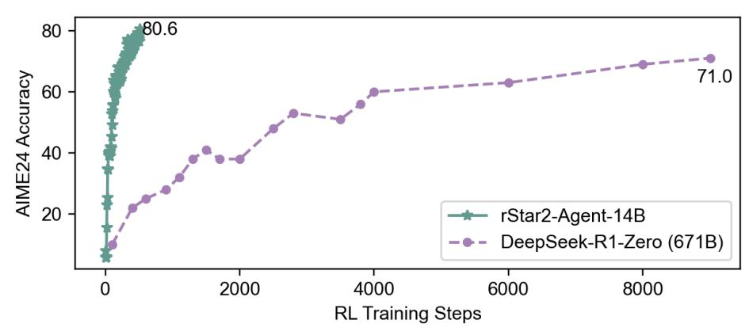

# Abstract

We introduce rStar2-Agent, a 14B math reasoning model trained with agentic reinforcement learning to achieve frontier-level performance. Beyond current long CoT, the model demonstrates advanced cognitive behaviors, such as thinking carefully before using Python coding tools and reflecting on code execution feedback to autonomously explore, verify, and refine intermediate steps in complex problem-solving. This capability is enabled through three key innovations that makes agentic RL effective at scale: (i) an efficient RL infrastructure with a reliable Python code environment that supports high-throughput execution and mitigates the high rollout costs, enabling training on limited GPU resources (64 MI300X GPUs); (ii) *GRPO-RoC*, an agentic RL algorithm with a *Resample-on-Correct* rollout strategy that addresses the inherent environment noises from coding tools, allowing the model to reason more effectively in a code environment; (iii) An efficient agent training recipe that starts with *non-reasoning* SFT and progresses through multi-RL stages, yielding advanced cognitive abilities with minimal compute cost. To this end, rStar2-Agent boosts a pre-trained 14B model to state of the art in only 510 RL steps within one week, achieving average pass@1 scores of 80.6% on AIME24 and 69.8% on AIME25, surpassing DeepSeek-R1 (671B) with significantly shorter responses. Beyond mathematics, rStar2-Agent-14B also demonstrates strong generalization to alignment, scientific reasoning, and agentic tool-use tasks. Code and training recipes are available at <https://github.com/microsoft/rStar>.

| Model                   | AIME24 | AIME25 | HMMT25 |
|-------------------------|--------|--------|--------|
| OpenAI o3-mini (medium) | 79.6   | 77.0   | 53.0   |
| DeepSeek-R1 (671B)      | 79.8   | 70.0   | 44.4   |
| DeepSeek-R1-Zero (671B) | 71.0   | 53.3   | 46.0   |
| Claude-Opus-4.0 (Think) | 76.0   | 69.2   | -      |
| QWQ-32B                 | 79.5   | 65.8   | 47.5   |
| rStar2-Agent-14B        | 80.6   | 69.8   | 52.7   |

> **[图片提取文字 (无描述)]:**
> 80.6 80 71.0 AIME24 Accuracy 60 40 20 rStar2-Agent-14B DeepSeek-R1-Zero (671B) 2000 4000 6000 8000 **RL Training Steps**

Figure 1: rStar2-Agent-14B reaches frontier-level math reasoning in just 510 RL training steps.

∗The first four authors contributed equally

†Project leaders; correspondence to lzhani@microsoft.com and maoyang@microsoft.com

