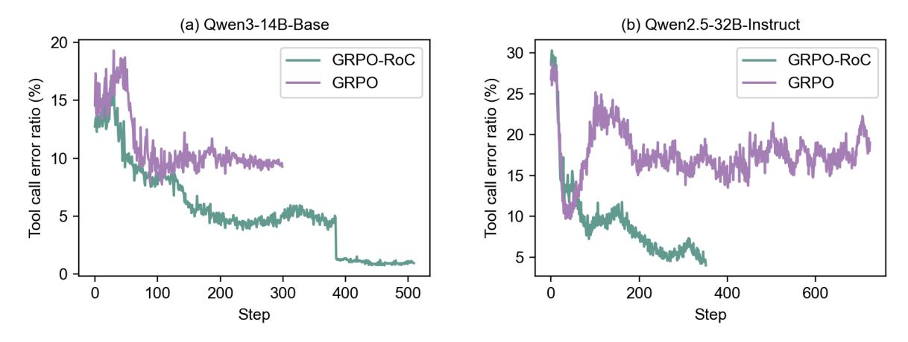
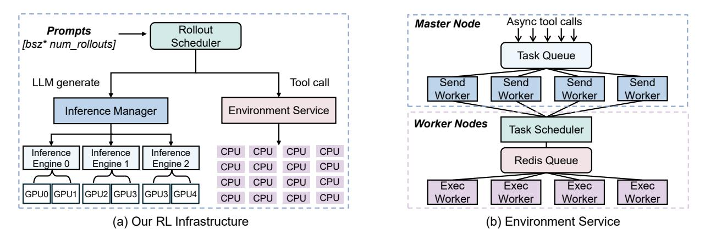
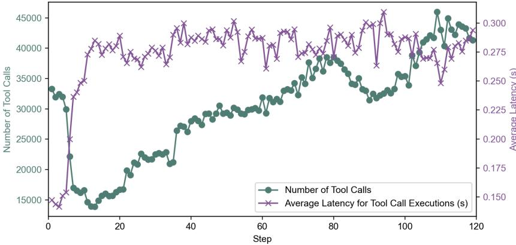
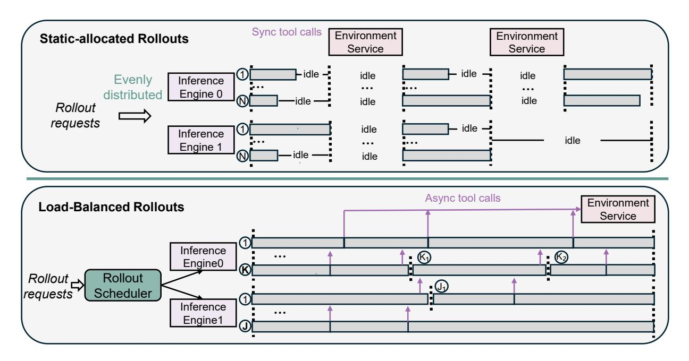

# Tools: You may call one or more functions to assist with the user query. You are provided with function signatures within <tools></tools> XML tags:

<tools>{"type": "function", "function": {"name": "execute\_python\_code\_with\_standard\_io", "description": "Execute Python code with standard input and capture standard output. This function takes a Python code string and an input string, provides the input string through standard input (stdin) to the code, and captures and returns any output produced through standard output (stdout). If the executed code raises an exception, the error message will be captured and returned instead.", "parameters": {"type": "object", "properties": {"code": {"type": "string", "description": "A string containing Python code to be executed. The code can read from standard input using the input() function."}, "input": {"type": "string", "description": "A string that will be provided as standard input to the code when it calls input()."}}, "required": ["code", "input"]}, "return": {"type": "string", "description": "str: The output produced by the executed code through standard output. If an error occurs during execution, the error message will be returned. </tools> For each function call, return a json object with function name and arguments within <tool\_call></tool\_call> XML tags:<tool\_call>{"name": <function-name>, "arguments": <args-json-object>}</tool\_call><|im\_end|>

#### <|im\_start|>user

You must put your answer inside <answer> </answer> tags, i.e., <answer> answer here </answer>. And your final answer will be extracted automatically by the \boxed{} tag.

This is the problem: **{Question}** <|im\_end|> <|im\_start|>assistant <think>

<span id="page-4-0"></span>Figure 3: Our prompt template. Question will be replaced with the specific question during training.

no code tool call is present, the rollout terminates. Otherwise, the code block is extracted and executed by the environment service, and the output is appended to the trajectory under the user role. The model then takes this updated context as input and continues the next turn of reasoning under the assistant role. This multi-turn rollout process repeats until the model produces a final answer or reaches a predefined maximum number of turns *T*.

Tool Call Format. We use a general function call interface for invoking coding tools, with each tool call represented in a structured JSON format as shown in the example below:

```
<tool call>{"name": "execute python code with standard io", "arguments": {"code": "import sympy\n\n def
   verify divisibility (m,p):\n\n for p in sympy.primerange(2, 100000) ··· ", "input": ""}</tool call>
```

At the end of each turn, we check for <tool call> </tool call> blocks. If found, the JSON is parsed to extract the code block from the "code" field and, if available, input arguments from the "input" field within "arguments". If parsing fails due to an invalid format, the error message is wrapped in <tool response></tool response> tags and returned to the model. Otherwise, the extracted code and arguments are forwarded to the environment service (see Fig. [2\)](#page-3-2), which produces one of four possible responses:

- *successful execution with standard output*, returning the program output;
- *successful execution without standard output*, returning the output as shown by IPython;
- *execution error*, returning the error message and traceback logs;
- *timeout*, where the code is syntactically valid but fails to complete within the time limit, often due to high complexity or logical errors such as infinite loops.

In all cases, the environment feedback is wrapped in <tool response> tags and fed back to the model.

This structured approach provides a standardized, API-like interface that removes parsing ambiguity and clearly separates reasoning from execution. Compared to previous methods [\[Mai et al.,](#page-20-8) [2025,](#page-20-8) [Li et al.,](#page-19-4) [2025,](#page-19-4) [Feng et al.,](#page-19-7) [2025\]](#page-19-7) that rely on markdown-style syntax (e.g., ···python ... ···and ···output ...···) or custom tokens (e.g., <code>, <interpreter>), our design is more extensible, generalizes to diverse tools, and aligns with the widely-used functioncalling protocols in LLM APIs, which facilitates integration and future extension.

Prompt Template. Fig. [3](#page-4-0) shows our prompt used during the agentic reinforcement learning. The model is instructed to first generate a reasoning process enclosed in <reason> ···< /reason>, followed by the final answer in <answer> ···< /answer>. To guide correct coding tool usage, the prompt explicitly details the available tools (i.e., the coding tool), including the descriptions and the structured function call format.

Notably, the multi-turn rollout setup may produce multiple <reason> blocks, but only a single <answer> block is allowed, as shown in Fig. [2.](#page-3-2) The final numeric result must be wrapped in \boxed{} for extraction.

#### <span id="page-5-0"></span>2.2 End-to-End Agentic Reinforcement Learning

## <span id="page-5-1"></span>2.2.1 Preliminary: GRPO

Group Relative Policy Optimization (GRPO). We start by introducing the GRPO algorithm. Specifically, for each question *q* and its ground-truth answer *a* from a dataset *D*, GRPO samples a group of rollout trajectories {*o*1,*o*2,··· ,*oG*} from the old policy πθ*old* and then optimizes the policy π<sup>θ</sup> by maximizing the following objective:

$$J_{\text{GRPO}}(\theta) = \mathbb{E}_{(q,a) \sim D, \{o_i\}_{i=1}^G \sim \pi_{\theta_{\text{old}}}(\cdot|q)} \\ \left[ \frac{1}{G} \sum_{i=1}^G \frac{1}{|o_i|} \sum_{t}^{|o_i|} \left( \min \left[ \frac{\pi_{\theta}(o_{i,t}|q, o_{i, < t})}{\pi_{\theta_{\text{old}}}(o_{i,t}|q, o_{i, < t})} A_{i,t}, \operatorname{clip}\left( \frac{\pi_{\theta}(o_{i,t}|q, o_{i, < t})}{\pi_{\theta_{\text{old}}}(o_{i,t}|q, o_{i, < t})}, 1 - \varepsilon, 1 + \varepsilon \right) A_{i,t} \right] - \beta D_{KL}(\pi_{\theta} \parallel \pi_{\text{ref}}) \right) \right]$$

$$\tag{1}$$

where ε and β are hyper-parameters that control the clipping range of importance sampling ratio and the weight of KL penalty term, respectively. *Ai*,*<sup>t</sup>* denotes the estimated advantage, computed using a group of rewards {*r*1,*r*2,...*rG*} corresponding to the outputs within each group:

$$A_{i,t} = \frac{r_i - \text{mean}(\{r_1, r_2, \dots, r_G\})}{\text{std}(\{r_1, r_2, \dots, r_G\})}$$
(2)

Here, *r<sup>i</sup>* is the reward assigned to rollout trajectory *o<sup>i</sup>* , which is evaluated via a rule-based verifier system to mitigate reward hacking [\[Guo et al.,](#page-19-2) [2025,](#page-19-2) [Team et al.,](#page-20-0) [2025\]](#page-20-0).

Outcome-only Reward Design. Recent RL methods for math reasoning have seen substantial gains by using outcome-only rewards, a key design choice that effectively avoids reward hacking [\[Guo et al.,](#page-19-2) [2025,](#page-19-2) [Team et al.,](#page-20-0) [2025\]](#page-20-0). Specifically, each rollout trajectory *o<sup>i</sup>* receives a binary accuracy reward *r<sup>i</sup>* ∈ {0,1} based on whether the final answer matches the ground truth answer *a*:

<span id="page-5-3"></span>
$$r_i = \begin{cases} 1 & \text{if is\_equivalent}(a, o_i), \\ 0 & \text{otherwise.} \end{cases}$$
 (3)

In math word problems, we extract the final answer from \boxed{} within the <answer> tag and verify it against the ground truth *a* using the rule-based math verify tool. Correct matches get a reward of 1, mismatches receive 0.

More Exploration. To push the policy beyond its pre-training limits, we incorporate several key modifications from recent works. First, we remove the KL divergence penalty. Although commonly used to prevent the online policy from significantly deviating from a reference policy and to stabilize training, it can inadvertently restrict the discovery of novel, tool-augmented reasoning patterns. Removing it allows the model to explore more freely.

Second, we adopt the *Clip-Higher* [\[Yu et al.,](#page-21-0) [2025\]](#page-21-0) strategy by relaxing the upper bound of the importance sampling ratio. Specifically, we follow prior work and increase εhigh from 0.2 to 0.28, allowing the model to better explore high-entropy, low-probability tokens. These minority tokens may include forking tokens that are essential for reasoning performance, as noted in recent studies [\[Wang et al.,](#page-20-9) [2025,](#page-20-9) [Cheng et al.,](#page-19-9) [2025\]](#page-19-9).

Third, we eliminate the entropy loss term to prevent training instability. While commonly used to encourage exploration, it can cause uncontrolled entropy growth, potentially leading to training collapse.

#### <span id="page-5-2"></span>2.2.2 Challenges in Agentic Reinforcement Learning

Inherent Environment Noises. While GRPO provides a strong foundation, agentic reinforcement learning introduces new challenges. In particular, coding tools and the code environment introduce inherent noise into reasoning.

Unlike standard reasoning, coding tools require the model not only to decide when to use them but also to generate correct and executable code for the intended functionality. When errors occur, the environment returns error messages unrelated to the reasoning task. This noisy feedback can mislead the model, causing it to spend valuable

> **[图片提取文字 (无描述)]:**
> (a) Qwen3-14B-Base (b) Qwen2.5-32B-Instruct 20 30 -GRPO-RoC GRPO-RoC **GRPO GRPO** Tool call error ratio (%) Tool call error ratio (%) 25 15 20 -10 15 ¬ 5 10 -5 -200 300 400 500 200 400 600 0 100 Step Step


<span id="page-6-1"></span>Figure 4: Proportion of tool calls that contain errors within correctly answered trajectories. Under naive GRPO, the error rate initially decreases but soon plateaus at a significant level. In contrast, our GRPO-RoC continues to reduce tool-related errors with more training steps.

tokens fixing tool errors rather than advancing its reasoning. Such distractions significantly hinder problem-solving, whereas they do not occur in pure CoT reasoning.

Impact of Outcome-only Reward on Trajectory Quality. Under current outcome-only reward schemes, trajectories are evaluated solely based on the final answer to prevent reward hacking. However, this outcome-only reward cannot penalize undesirable intermediate behaviors. As a result, trajectories with incorrect intermediate tool calls can still receive positive reward if the final answer is correct, effectively reinforcing the model to treat such errors are acceptable. As shown in Fig. [4,](#page-6-1) under naive GRPO, the ratio of tool-related errors in *positively rewarded* trajectories initially decreases but eventually stabilizes at a significant level, around 15% for Qwen2.5-32B and 10% for Qwen3-14B. Consequently, the model tends to produce lengthy, low-quality trajectories containing tool call errors, severely limiting the effectiveness of agentic reinforcement learning and inflating training costs.

#### <span id="page-6-0"></span>2.2.3 GRPO-RoC: Group Relative Policy Optimization with Resampling on Correct

For more effective agentic reinforcement learning, we introduce Group Relative Policy Optimization with Resampling on Correct (GRPO-RoC). This section details our design choice and methodology.

Design Principle: Answer-only Outcome Reward. Environment noise can cause the model to generate lengthy, low-quality but correctly answered trajectories. From a reward design perspective, two potential solutions exist: *(i)* introducing step-level reward [\[Yue et al.,](#page-21-1) [2025a\]](#page-21-1); *(ii)* retaining outcome-only rewards while adding penalties, such as for tool-call errors [\[Qian et al.,](#page-20-4) [2025,](#page-20-4) [Li et al.,](#page-19-4) [2025,](#page-19-4) [Kimi\]](#page-19-5). However, we do not adopt these approaches for two main reasons: (i) they introduce additional complexity, such as requiring careful human tuning and reward model construction; (ii) they are prone to reward hacking. For example, during early training, when the model's reasoning ability is still developing, step-level rewards or tool-error penalties can hinder effective exploration.

To avoid reward hacking, we use a minimal answer-only outcome reward, as shown in Eq. [3.](#page-5-3) To address the challenge introduced by environment noise, we introduce GRPO-RoC, which effectively filters out low-quality noisy trajectories through *Resample on Correct (RoC)* rollout strategy.

Resample on Correct (RoC) is a simple yet effective rollout strategy that enables effective agentic reinforcement learning under an answer-only outcome reward regime. Specifically, we first oversample a larger group of rollouts and then downsample to the standard rollout batch size. Positive trajectories are filtered to retain only the highestquality ones with minimal tool-induced errors or tool call formatting issues, while negative trajectories are uniformly downsampled. This asymmetric sampling reinforces positive supervision without losing the various learning signal from failures, facilitating more effective policy updates. Although generally applicable to various RL algorithms, in this work, we instantiate RoC on GRPO, resulting in the algorithm GRPO-RoC.

In standard GRPO, each question is sampled with a group of G rollout trajectories  $\{o_i\}_{i=1}^G$ , which are then used to compute rewards and update the policy. In our GRPO-RoC, we first oversample 2G rollouts trajectories  $\{o_i\}_{i=1}^{2G}$  and then apply the RoC strategy to select G trajectories for policy updates. Specifically, let  $O_{\text{neg}} = \{o_i^{\text{neg}}\}$  and  $O_{\text{pos}} = \{o_i^{\text{pos}}\}$  denote the group of negatively and positively rewarded trajectories, respectively, where  $|O_{\text{neg}}| + |O_{\text{pos}}| = 2G$ . We then apply different selection strategies to each group: we sample  $\hat{O}_{\text{neg}} = \{\hat{o}_i^{\text{neg}}\}$  from  $O_{\text{neg}}$  to maintain failure diversity, and  $\hat{O}_{\text{pos}} = \{\hat{o}_i^{\text{pos}}\}$  from  $O_{\text{pos}}$  to prioritize higher-quality successful traces. The final batch used for policy updates contains G rollouts, where  $|\hat{O}_{\text{pos}}| + |\hat{O}_{\text{neg}}| = G$ .

- Negative samples: preserving diversity. For zero-reward rollouts  $O_{\text{neg}}$ , we apply no filtering and sample  $\hat{O}_{\text{neg}} = \{\hat{o}_i^{\text{neg}}\}$  equal to half of the original group (i.e.,  $\lfloor \frac{|O_{\text{neg}}|}{2} \rfloor$ ), following their original distribution. This ensures that the model is exposed to a wide range of failure modes and learns to avoid varied error patterns.
- Positive samples: filtering environment noises and promoting higher quality. For successful rollouts  $O_{\rm pos}$  with a final outcome reward of 1, we sample half of the trajectories, prioritizing higher-quality traces to reinforce more effective reasoning. Specifically, each trajectories is scored for whether it contains two types of intermediate issues: (i) tool call errors and (ii) format violations. For tool call errors, we track the three failure modes described in Section 2.2.2. For each trajectory, we count the total number of tool calls and the number of errors, then compute a tool error ratio  $p_{\rm err}$ . Trajectories without tool calls are assigned a default  $p_{\rm err} = 0.5$  to encourage tool usage:

$$p_{\text{err}} = \begin{cases} 0.5 & \text{if no tool calls,} \\ \frac{\text{num of error tool calls}}{\text{num of all tool calls}} & \text{otherwise.} \end{cases}$$
(4)

In addition to direct coding tool errors, we observed that multi-turn rollouts in the coding environment can easily produce undesirable formats, such as redundant <reason> blocks appearing after the <answer> block. To address this, we deprioritize rollouts that violdate structural constraints. Specifically, we check the number of <answer> tags. Trajectories with no tag receive the maximum downsample weight, while those with multiple tags (often causing repetition) are penalized proportionally:

$$p_{\text{format}} = \begin{cases} 1 & \text{if no  tags,} \\ \min(1, \frac{\text{num of  tags}-1}{\text{num of turns}}) & \text{otherwise.} \end{cases}$$
 (5)

The total penalty score of each trajectory is computed as  $p_{\text{total}} = p_{\text{err}} + p_{\text{format}}$ . We then sample half of the positive rollouts with probability *inversely* proportional to  $p_{\text{total}}$ , so lower-penalty trajectories are more likely to be selected. This strategy guides the model toward higher-quality trajectories with correct tool usage and clean formatting, while maintaining exposure to diverse successful behaviors.

To this end, we introduce our final RL objective, GRPO-RoC, formulated as follows:

$$J_{\text{GRPO-RoC}}(\theta) = \mathbb{E}_{(q,a) \sim D, \{o_i\}_{i=1}^{2G} \sim \pi_{\theta_{\text{old}}}(\cdot|q)}$$

$$\left[\frac{1}{\sum_{i=1}^{G} |\hat{o}_i|} \sum_{i=1}^{G} \sum_{t=1}^{|\hat{o}_i|} \left(\min \left[\frac{\pi_{\theta}(\hat{o}_{i,t}|q,\hat{o}_{i,< t})}{\pi_{\theta_{old}}(\hat{o}_{i,t}|q,\hat{o}_{i,< t})} \hat{A}_{i,t}, \operatorname{clip}(\frac{\pi_{\theta}(\hat{o}_{i,t}|q,\hat{o}_{i,< t})}{\pi_{\theta_{old}}(\hat{o}_{i,t}|q,\hat{o}_{i,< t})}, 1 - \varepsilon_{\text{low}}, 1 + \varepsilon_{\text{high}}) \hat{A}_{i,t}\right]\right)\right]$$
s.t.  $\{\hat{o}_i\}_{i=1}^{G} \in \{o_i\}_{i=1}^{2G}$  are sampled via RoC.

where  $\hat{A}_{i,t} = \frac{\hat{r}_i - \operatorname{mean}(\{\hat{r}_1, \hat{r}_2, \cdots, \hat{r}_G\})}{\operatorname{std}(\{\hat{r}_1, \hat{r}_2, \cdots, \hat{r}_G\})}$ 

$$(7)$$

**2G** denotes the oversampled rollout trajectories,  $\hat{o}_i$  represents those selected via RoC sampling, and  $\hat{r}_i$  is the 0-1 answer reward for rollout  $\hat{o}_i$ . The clipping thresholds  $\varepsilon_{low}$  and  $\varepsilon_{high}$  are hyperparameters, set to 0.2 and 0.28 respectively, following the Clip-Higher strategy.

As shown in Fig. 4, under GRPO-RoC, the coding tool errors within positively rewarded trajectories decreases significantly for both Qwen3-14B-base and Qwen2.5-32B-instruct. Furthermore, as shown in Fig. 9, the reduction in tool call errors leads to significant improvements in reasoning performance and shorter, more concise responses. These results show that GRPO-RoC simultaneously strengths reasoning capabilities and improves tool-use proficiency, resulting in smarter agentic reasoning overall. More broadly, this highlights a central value of agentic reinforcement learning by demonstrating that models can actively learn from and adapt to the external environment.

> **[图片提取文字 (无描述)]:**
> Async tool calls Master Node Rollout **Prompts** Scheduler [bsz\* num\_rollouts] Task Queue LLM generate Tool call Send Send Send Send Worker Worker Worker Worker **Environment Service** Inference Manager Worker Nodes Task Scheduler CPU CPU CPU CPU Inference Inference Inference Redis Queue Engine 0 Engine 2 Engine 1 CPU CPU CPU CPU CPU CPU CPU CPU Exec Exec Exec Exec GPU0 GPU1 GPU2 GPU3 GPU3 GPU4 CPU CPU CPU CPU Worker Worker Worker Worker (a) Our RL Infrastructure (b) Environment Service


<span id="page-8-2"></span>Figure 5: The overall design of our agentic reinforcement learning infrastructure.

## <span id="page-8-0"></span>3 Large-Scale Agentic RL Infrastructure

Agentic reinforcement learning introduces significant infrastructure challenges. To enable large-scale training, we build a custom agentic RL infrastructure on top of VERL v0.2 [Sheng et al., 2024] and SGLang [Zheng et al., 2024], as shown in FIg. 5. Specifically, we address two major bottlenecks:

- Massive Concurrent Tool Calls. A naive approach to obtaining coding tool outputs is to execute the generated code directly using a local Python interpreter. However, in large-scale multi-turn rollouts, a single training batch can trigger thousands of code execution requests. Running all these tool calls locally not only overwhelms CPU resources but also leaves GPUs idle, significantly slowing rollout speed as shown in Fig. 7. More critically, LLM-generated code is unpredictable and may contain bugs, uncontrolled threads, or hard-to-kill external library calls, posing a severe risk to the main training process. To address both efficiency and safety, we implement a dedicated, isolated code environment service capable of handling massive concurrent tool call requests without stalling rollouts.
- Highly Imbalanced Multi-turn Rollouts. In standard RL training, rollouts in a batch are statically and evenly assigned to GPUs, but differing response lengths leave many GPUs idle while waiting for the longest rollout, leading to poor GPU utilization and slow training. This problem is amplified in agentic RL, where each response spans multiple turns of uneven token generation and tool calls. When scheduled statically and synchronously, these imbalances recur at every turn, compounding worst-case latency and increasing idle time. To address this, we introduce a load-balanced rollout scheduler that dynamically allocates rollout requests based on available KV cache capacity across GPUs.

#### <span id="page-8-1"></span>3.1 Reliable High-Throughput Code Environment

> **[图片提取文字 (无描述)]:**
> 45000 0.300 40000 0.275 35000 30000 25000 -0.17520000 -Number of Tool Calls 0.150 15000 Average Latency for Tool Call Executions (s) 20 40 60 80 100 120 Step


<span id="page-8-3"></span>Figure 6: Our code environment demonstrates scalability by reliably handling up tp 45K concurrent tool calls per step, while maintaining consistently low end-to-end latency from dispatch to response.

> **[图片提取文字 (无描述)]:**
> Sync tool calls Environment Environment Static-allocated Rollouts Service Service ① idle -🗕 idle 🚅 idle idle Evenly Inference ... Engine 0 distributed -idle --idle idle Rollout requests idle idle Inference idle .... Engine 1 0 idle idle Async tool calls Environment **Load-Balanced Rollouts** Service (1) Inference : (6) : 1 ... Engine0 Rollout \_ Rollout <u>•</u> Scheduler requests 1 Inference ... Engine1


<span id="page-9-1"></span>Figure 7: *Top*: Naively static rollout allocation leads to significant GPU idle time and synchronization delays. *Bottom*: our dynamic load-balanced scheduler that assigns rollouts based on available KV cache, dispatches tool call execution asynchronously, and balances computation across GPUs. For example,  $K_1$ ,  $K_2$ ,  $J_1$  denote the number of rollouts computed from the current available KV cache memory on inference engines 0 and 1.

Fig. 5(b) shows the design of our environment service, which is developed with two main objectives. The first is to isolate the service from the main RL training process while maximizing resource utilization. The second is to support a large number of concurrent tool calls and return execution results as quickly as possible.

The service is distributed across CPU cores of our 64 AMD MI300X GPU training cluster. On the master node, a centralized task queue along with 32 send workers manages the dispatch of tool call executions. The remaining worker nodes each run a lightweight task scheduler and a pool of 1024 execution workers to perform the actual tool call execution. To handle massive concurrent tool calls, each request is added to the centralized task queue to avoid overloading the workers. The 32 send workers continuously poll this queue, grouping up to 64 tool calls into a batch. A batch is dispatched either when it reaches capacity or after a fixed timeout, and the send worker waits for execution results before sending the next batch. On the worker nodes, the task scheduler dynamically assigns tool calls from incoming batches to idle execution workers, ensuring balanced workload distribution. Once execution is complete, results are returned to the send workers, which forward them back to the RL rollout process. This architecture ensures isolated, efficient, and reliable code environment at large scale.

To evaluate the effectiveness of our environment service, we measure the average latency from issuing a tool call to receiving its result. As shown in Fig. 6, each training step can generate up to 45K tool calls. Even at this scale, the service achieves both high throughput (45 calls per step) and low latency (0.3 seconds per call, including scheduling and execution time), demonstrating its ability to support large-scale training without becoming a bottleneck.

**Extended Functionality:** Answer Correctness Verification. In our experiments, we find that rule-based reward systems such as the Math-Verifier can occasionally take a long time to run, especially on complex or edge-case extracted math answers. Running these verifications directly in the training loop can block rollouts progress and causes GPU idle time. To avoid this, we offload answer verification to the environment service, allowing these CPU-intensive computations to run asynchronously without stalling training.

#### <span id="page-9-0"></span>3.2 Load-Balanced Rollout Scheduler

Static Rollout Allocation: Load Imbalance, Synchronization Delays and KV Cache Overflow. Rollout inefficiency is a well-known challenge in RL training infrastructure, and it becomes even more pronounced in agentic RL, where each responses consists of multiple turns of token generation and numerous tool calls, creating high variability in computational load. In our early implementation, we built the rollout system on top of VERL v0.2 using a

straightforward *statically allocated batch inference* strategy. As shown in Fig. [7](#page-9-1) (upper), VERL evenly pre-allocates all rollout requests across GPUs, with each GPU receiving *N* rollouts. However, this static allocation fails to manage the significant variability in computation across multi-turn rollouts, leading to several key inefficiencies.

First, despite GPUs being statically assigned the same number of rollout requests, the total computational workload across GPUs can be highly imbalanced. Each rollout may have a different number of turns, and each turn can vary in token length. These turn-level token length imbalance repeatly create GPU idle time, as shorter rollouts must wait for the longest rollout within each turn to complete. Moreover, synchronization delays from tool calls, which are typically collected and executed together per turn, further increase idle time, Together, these factors under static allocation lead to severe GPU-level workload imbalance and substantial idle time.

Second, static rollout allocation can trigger KV cache overflow, which further reduces rollout efficiency. Inference engines like SGLang cannot predict in advance how many tokens each rollout will generate, so all assigned rollout requests are launched in parallel by default. When a GPU's KV cache exceed its capacity, SGLang evicts half of the in-progress rollouts, even if partial computation has already been completed. The evicted rollouts must then be recomputed after the remaining rollouts finish, resulting in significant wasted computation.

Dynamic Load-Balanced Rollout Scheduling. To address these challenges, we introduce a *load-balanced rollout scheduling* method, as illustrated in Fig. [7](#page-9-1) (bottom). The design principle is to dynamically allocate rollout requests to maintain balanced total computation across GPUs, while avoiding any wasted computation from KV cache overflow and recomputation. As shown in Fig. [7](#page-9-1) (bottom), our dynamic rollout scheduler assigns requests based on the current available KV cache capacity of each GPU rather than statically dividing them evenly. Specifically, given a maximum rollout length *L*, we estimate the maximum number of rollouts *K* (*K* < *N*) that each GPU can safely handle without exceeding its KV cache limits. Each GPU then executes its assigned rollouts independently. During multi-turn rollouts, tool calls are dispatched asynchronously to the environment service immediately upon generation, eliminating idle time caused by waiting for other rollouts. Once a GPU finishes the assigned requests and frees KV cache space, the scheduler assigns new requests in real time, ensuring balanced workloads across GPUs. This approach significantly improves GPU utilization and overall rollout efficiency.

