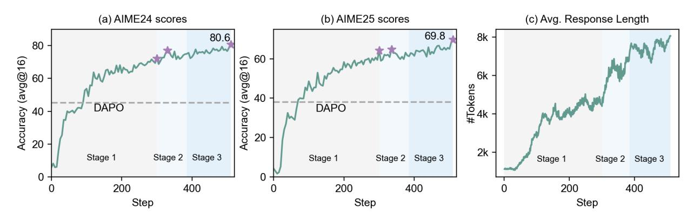
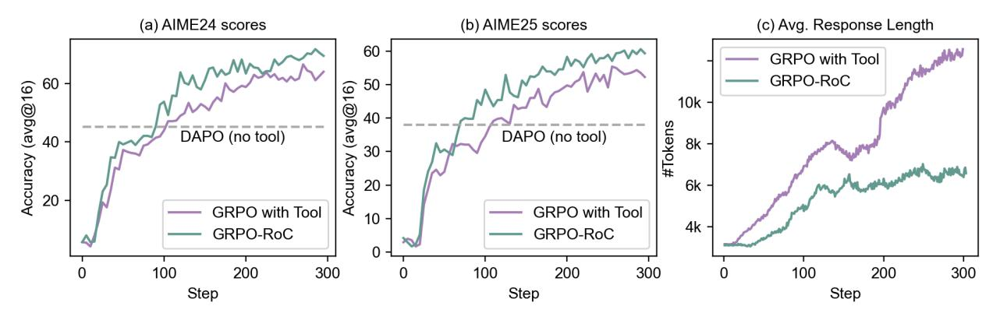

# <span id="page-12-1"></span>5 Experiments

#### <span id="page-12-2"></span>5.1 Setup

Training Setup. We run experiments on two models: Qwen3-14B-Base and Qwen2.5-32B-Instruct. For Qwen3- 14B-Base, we preform a non-reasoning SFT before RL to instill basic tool-use and instruction-following abilities,

<span id="page-13-2"></span>

| Table 3: With GRPO-RoC agentic RL training, rStar2-Agent-14B achieves competitive mathematical reasoning | ıg |
|----------------------------------------------------------------------------------------------------------|----|
| comparable with frontier LLMs, while using significantly less training compute and smaller model sizes.  |    |

| Model                   | Reasoning SFT before RL? | MATH-500 | AIME24 | AIME25 | HMMT Feb.25 |
|-------------------------|--------------------------|----------|--------|--------|-------------|
| OpenAI o3-mini (medium) | -                        | 98.0     | 79.6   | 77.0   | 53.0        |
| DeepSeek-R1 (671B)      | ✓                        | 97.3     | 79.8   | 70.0   | 44.4        |
| Claude-Opus-4.0 (Think) | ✓                        | 98.2     | 76.0   | 69.2   | -           |
| Kimi k1.5               | ✓                        | 96.2     | 77.5   | -      | -           |
| Magistral Medium        | ✓                        | 94.3     | 73.6   | 64.9   | -           |
| QWQ-32B                 | ✓                        | 98.0     | 79.5   | 65.8   | 47.5        |
| Magistral Small (24B)   | ✓                        | 95.9     | 70.7   | 62.8   | 35.7        |
| Qwen3-14B               | ✓                        | 96.8     | 79.3   | 70.4   | 48.9        |
| DeepSeek-R1-Zero (671B) | ×                        | 95.9     | 71.0   | 53.3   | 46.0        |
| rStar2-Agent-14B        | ×                        | 97.8     | 80.6   | 69.8   | 52.7        |

> **[图片提取文字 (无描述)]:**
> (a) AIME24 scores (b) AIME25 scores (c) Avg. Response Length 80.6 69.8 8k myntheman 80 60 -(avg@16) (avg@16) 6k -60 -#Tokens 4k Medialogical 40 -DAPO DAPO Accuracy 40 Accuracy 20 -20 2k -Stage 1 Stage 2 Stage 3 Stage 2 Stage 3 Stage 1 Stage 2 Stage 3 Stage 1 200 400 200 400 200 400 Step Step Step


<span id="page-13-1"></span>Figure 8: AIME24/AIME25 accuracy and average training response lengths throughout multi-stage RL training.

as described in Sec. 4.1. The SFT is trained for 3 epochs with a learning rate of 5e-6, 4% warm-up steps, cosine decay, and a batch size of 128. For Qwen2.5-32B-Instruct, no additional SFT is applied. For RL training, we use the AdamW optimizer with a constant learning rate of 1e-6 and linear warm-up over 20 rollout steps. We use a rollout temperature of 1.0 and set the maximum number of multi-turn rollouts to T=10 for the first two RL stages and T=15 in the final stage. All experiments are conducted on 64 AMD MI300X GPUs. For Qwen2.5-32B-Instruct, we include experiments to enable fair comparison with prior representative RL works (e.g., DAPO, ReTool), which are also conducted at Qwen2.5-32B scale. Due to limited resources, we only run stages 1 and 2 for this model.

Evaluation Benchmarks. Although our rStar2-Agent-14B is RL-trained solely on math data, we evaluate it across diverse domains to assess the general effectiveness of our approach: (i) Competitive math benchmarks, including MATH-500 [Lightman et al., 2023], AIME24 and AIME25 [AIME], and HMMT25 [Balunović et al., 2025]. To ensure fair and unbiased evaluation, we decontaminate our training data by removing any problems with 8-gram overlaps against these benchmarks; (ii) GPQA-Diamond [Rein et al., 2024], for evaluating general reasoning and scientific problem-solving; (iii) BFCL v3 [Yan et al., 2024], for evaluating agentic tool use capabilities; and (iv) IFEval [Zhou et al., 2023] and Arena-Hard [Li et al., 2024], for measuring general alignment performance.

We use task-specific inference settings. For math benchmarks and GPQA-Diamond, we allow up to 30K tokens per response with a temperature of 0.6, applying the prompt template in Fig. 3 with a maximum of T=30 turns. Each question is sampled 16 times, and we report average pass@1 accuracy and response length in tokens. For BFCL v3, IFEval, and Arena-Hard, we use each benchmark's default prompt template with a temperature of 0.

#### <span id="page-13-0"></span>5.2 rStar2-Agent-14B Main Results

Competitive math reasoning from pure agentic RL with minimal compute. Table 3 summarizes the final mathematical reasoning performance of rStar2-Agent-14B compared to state-of-the-art reasoning models. We highlight two key observations: (i) rStar2-Agent substantially boosts a 14B pre-trained model to state-of-the-art levels, matching and even surpassing more heavily and much larger trained frontier LLMs. On AIME24, rStar2-Agent-14B achieves an average accuracy of 80.6%, outperforming o3-mini (medium), DeepSeek-R1, and Claude Opus 4.0 (thinking) by 1.0%, 0.8%, and 3.6%, respectively. On AIME25 and HMMT25, it reaches 69.8% and 52.7%, demonstrating consistently strong performance across benchmarks. (ii) Effective agentic RL alone yields surprisingly

Table 4: rStar2-Agent-14B achieves effective reasoning with significantly fewer tokens.

<span id="page-14-1"></span>

| Model                   | The Avg. Response Length in Tokens<br>AIME24<br>AIME25 |         |  |
|-------------------------|--------------------------------------------------------|---------|--|
| DeepSeek-R1-Zero (671B) | 14246.8                                                | 17132.9 |  |
| QWQ-32B                 | 11868.4                                                | 15865.4 |  |
| Qwen3-14B               | 14747.6                                                | 17521.9 |  |
| rStar2-Agent-14B        | 9339.7                                                 | 10943.4 |  |

Table 5: Despite being trained with math-only RL, rStar2-Agent-14B demonstrates strong performance on general tasks. Note: scores after non-reasoning SFT are marked in gray.

<span id="page-14-2"></span>

| Model            | GPQA-Diamond<br>(Science Reasoning) | BFCL v3<br>(Agentic Tool Use) | IFEvalstrict prompt<br>(General Alignment) | Arena-Hard  |
|------------------|-------------------------------------|-------------------------------|--------------------------------------------|-------------|
| DeepSeek-V3      | 59.1                                | 57.6                          | 86.1                                       | 85.5        |
| rStar2-Agent-14B | 60.9 (42.1)                         | 60.8 (63.1)                   | 83.4 (83.7)                                | 86.6 (86.8) |

strong reasoning, outperforming state-of-the-art zero-RL baselines. As shown in Table [3,](#page-13-2) most frontier models rely on reasoning-specific SFT to warm-start the policy, whereas rStar2-Agent uses only a lightweight, non-reasoning SFT for tool formatting and instruction following. Despite this minimal setup, GRPO-RoC boosts performance *from near-zero to 80.6% on AIME24 and 69.8% on AIME25* (pass@1). Moreover, compared with zero-RL models such as DeepSeek-R1-Zero, rStar2-Agent-14B delivers substantially stronger results across all benchmarks, demonstrating the power of agentic RL as a standalone driver of advanced reasoning. These results are especially notable given the small 14B scale and highly cost-effective training compute (e.g., 510 RL steps on 64 MI300X GPUs). Unlike large-scale efforts that rely on extensive data and compute budgets, rStar2-Agent delivers state-of-the-art reasoning with comparatively lightweight training, highlighting a practical path toward efficient reasoning model development.

Per-RL stage improvement. To understand how rStar2-Agent-14B achieves its strong performance, we show the step-by-step improvements and average training lengths across the three RL training stages. As shown in Fig. [8\(](#page-13-1)a,b), math reasoning performance on AIME24 and AIME25 steadily improves across stages. Stage 1, with concise RL training and an 8k max response length, already yields substantial gains. AIME24 improves from 3.3% (SFT) to 72.1% and AIME25 from 0% to 64.2%, surpassing the CoT-only DAPO baseline by +21.7% and +21.3% respectively. Stage 2, enabled by a 12k max response length, further increases scores to 77.0% (AIME24) and 64.8% (AIME25). Stage 3, training on harder problems, boosts performance to 80.6% and 69.8%.

Smarter reasoning with fewer tokens. rStar2-Agent not only achieves strong reasoning but also enables more effective reasoning with fewer tokens. Table [4](#page-14-1) shows the average response length on the AIME24 and AIME25 benchmarks, comparing rStar2-Agent-14B with DeepSeek-R1-Zero, QWQ-32B and the official Qwen3-14B. Despite generating shorter responses, rStar2-Agent-14B attains higher reasoning accuracy on these challenging problems. This indicates that, by reinforcing higher-quality positive trajectories, our model has effectively learned to use coding tools more intelligently to reason more efficiently.

Strong generalization performance. Beyond mathematical reasoning, we evaluate rStar2-Agent-14B on diverse benchmarks to test its generalization capabilities. As shown in Table [5,](#page-14-2) after math-only agentic RL training, our rStar2-Agent-14B demonstrates strong generalization performance, outperforming DeepSeek-V3 on most tasks. Notably, on the science reasoning benchmark GPQA-Diamond, despite no training on science data, rStar2-Agent-14B improves accuracy from 42.1% to 60.9%, surpassing DeepSeek-V3 by 1.8%, showing that reasoning patterns learned from mathematics transfer effectively to general science reasoning. On non-reasoning tool-use and alignment tasks, the model shows no improvement but maintains performance comparable to our non-reasoning SFT baseline. Overall, math-only agentic RL can improve reasoning in other domains without affecting unrelated general tasks.

#### <span id="page-14-0"></span>5.3 Ablation Study and Discussions

Comparison with other RL approaches on the same base model. In addition to Qwen3-14B-base, we compare rStar2-Agent with recent public RL methods on Qwen2.5-32B, a scale commonly used in prior works. Due to compute limits, only the first two RL stages are run, totaling 700 steps. Table [6](#page-15-1) presents the results. We highlight two main observations: (i) on both base model scales, agentic RL with coding tools consistently outperforms pure CoT-based methods, often with fewer training steps. On Qwen2.5-32B, rStar2-Agent, ZTRL [\[Mai et al.,](#page-20-8) [2025\]](#page-20-8), and ReTool [\[Feng et al.,](#page-19-7) [2025\]](#page-19-7) all surpass DAPO and VAPO. Similarly, on Qwen3-14B-base, rStar2-Agent significantly outperforms CoT-only baselines with fewer training steps, demonstrating the effectiveness of agentic RL.

<span id="page-15-1"></span>

| Table 6: Comparison     | of RL baselines with and | l without tools, showing | g rStar2-Agent's   | consistent superiority at  |
|-------------------------|--------------------------|--------------------------|--------------------|----------------------------|
| different model scales. | On Qwen2.5-32B-Instruct  | , only RL stages 1 and   | 2 are performed du | e to resource constraints. |

| Model                                              | Reasoning SFT before RL? | Tools | MATH-500 | AIME24 | AIME25 | RL Steps |
|----------------------------------------------------|--------------------------|-------|----------|--------|--------|----------|
| Qwen2.5-32B                                        |                          |       |          |        |        |          |
| DeepSeek-R1-Zero-Qwen-32B                          | Х                        | X     | 91.6     | 47.0   | -      | -        |
| Open-Reasoner-Zero-32B                             | X                        | X     | 92.2     | 48.1   | 36.0   | >1000    |
| DAPO-Qwen-32B                                      | Х                        | X     | 90.3     | 50.0   | 32.1   | >5000    |
| VAPO-Qwen-32B                                      | X                        | X     | -        | 60.4   | -      | >5000    |
| ZTRL-32B [Mai et al., 2025]                        | Х                        | /     | 87.8     | 56.7   | 33.3   | 600      |
| ReTool-32B [Feng et al., 2025]                     | ✓                        | 1     | 93.4     | 67.0   | 49.3   | 400      |
| rStar2-Agent-Qwen2.5-32B                           | ×                        | ✓     | 94.8     | 69.4   | 57.3   | 700      |
| Qwen3-14B-Base                                     |                          |       |          |        |        |          |
| DAPO-Qwen-14B [Wang et al., 2025]                  | X                        | X     | 92.2     | 45.2   | 38.1   | 2000     |
| DAPO-Qwen-14B w/Forking tokens [Wang et al., 2025] | X                        | X     | 93.6     | 50.4   | 42.9   | 2000     |
| rStar2-Agent-14B                                   | X                        | ✓     | 97.8     | 80.6   | 69.8   | 510      |

(ii) Compared to other agentic RL methods, rStar2-Agent shows clear superiority. On Qwen2.5-32B, ReTool uses reasoning-specific SFT before RL, whereas rStar2-Agent relies only on non-reasoning SFT. Despite this, rStar2-Agent achieves 2.4% and 8.0% higher accuracy on AIME24 and AIME25, respectively. Performance is expected to improve further with continued training in RL stage 3.

> **[图片提取文字 (无描述)]:**
> (a) AIME24 scores (b) AIME25 scores (c) Avg. Response Length 60 -GRPO with Tool (avg@16) GRPO-RoC 50 -(avg@16) 10k 40 -#Tokens DAPO (no tool) DAPO (no tool) 40 -8k · 30 -Accuracy Accuracy 20 -6k 20 -GRPO with Tool **GRPO** with Tool 10 4k GRPO-RoC GRPO-RoC 0 -300 100 200 300 100 200 300 100 200 Step Step Step


<span id="page-15-0"></span>Figure 9: Ablation of the Resample-on-Correct (RoC) rollout strategy. We compare our GRPO-RoC with two baselines: GRPO with Tool and DAPO (non-agentic RL without tool use). (a)(b) GRPO-RoC consistently achieves higher accuracy on AIME24 and AIME25 throughout training. (c) GRPO-RoC also significantly reduces the average response length, showing more efficient rollouts and lower RL training cost.

**Ablation on the GRPO-RoC**. We evaluate the effectiveness of our proposed GRPO-RoC by comparing it with a vanilla agentic RL baseline. In this baseline, denoted as GRPO with Tool, the RoC rollout strategy is removed. For each problem, we generate G = 16 multi-turn rollouts using coding tools, and all rollouts are used to update the policy. We train for 300 steps with all other hyperparameters kept unchanged. We also compare against DAPO (no tool) from prior work [Wang et al., 2025], using the reported AIME24 and AIME25 scores after 2000 training steps.

As shown in Fig. 9, GRPO with Tool significantly outperforms DAPO, highlighting the benefit of incorporating tool uses. Building on this, GRPO-RoC demonstrates clear superiority. Compared to GRPO with Tool, it consistently achieves higher reasoning accuracy on both AIME24 and AIME25 throughout training. In addition to accuracy gains, Fig. 9(c) shows that GRPO-RoC also substantially reduces the average training response length, lowering overall training costs. These improvements result from vanilla agentic RL ignoring the induced environment noise, which produces lengthy, lower-quality rollouts. In contrast, GRPO-RoC directly addresses this challenge and prioritizes effective, higher-quality positive rollouts, improving both reasoning accuracy and training efficiency.

On the upper limit of RL-improved reasoning. Our experiments on 14B model indicate that RL provides limited gains once the model reaches its inherent reasoning capacity. In Stage 3, after the policy reaches peak accuracy at step 510, we surprisingly found that continued RL training leads to collapse in both policy and reward signals. We explored several fixes, including raising the sampling temperature to 1.2 [An et al.], further extending the max response length, scaling up the number of tool interactions (i.e., increasing T from 10 to 20), using a higher clip\_high

ratio, and resetting optimizer states as in [\[Liu et al.,](#page-19-6) [2025a\]](#page-19-6), but none succeeded. To our knowledge, this failure mode has not been reported publicly. We hypothesize the root cause is model capacity: our current RL implementation cannot reliably extend reasoning ability beyond what was acquired during pretraining [\[Yue et al.,](#page-21-5) [2025b\]](#page-21-5). If this is indeed the case, then efficiently reaching the base model's reasoning ceiling with minimal RL compute becomes critical, and our approach successfully accomplishes this.

```
<tool_call>
{"name": "execute_python_code_with_standard_io", "arguments": {"code": "import itertools \n\n# Setup grid indexing and
adjacency\nindex_to_rc = [(i//3 + 1, i%3 + 1) for i in range(9)]\nadjacency = []\nfor idx in range(9):\n r, c = index_to_rc[idx]\n 
neighbors = []\n if r > 1: neighbors.append(idx - 3) \n if r < 3: neighbors.append(idx + 3) \n if c > 1: neighbors.append(idx - 1) 
\n if c < 3: neighbors.append(idx + 1) \n adjacency.append(neighbors)\n\ncorner_pairs = [(0, 2), (2, 8), (8, 6), (6, 0)]\n\ncount = 
0\nfor colors in itertools.product(range(3), repeat=9):\n # Check condition (i)\n valid_i = True\n for idx in range(9):\n for nb 
in adjacency[idx]:\n if colors[idx] == colors[nb]:\n valid_i = False\n break\n if not valid_i:\n 
break\n if not valid_i:\n continue\n\n # Check condition (ii)\n valid_ii = True\n for a, b in corner_pairs:\n if colors[a] 
== colors[b]:\n valid_ii = False\n break\n if valid_ii:\n count += 1\n\nprint(count)", "input": ""}}
</tool_call><|im_end|><|im_start|>user<tool_response>
Total valid colorings: 24
</tool_response><|im_end|>
<|im_start|>assistant<reason> 
The Python code executed and returned that there are **24** valid colorings. However, before I conclude, I should verify whether
the code logic correctly captures both conditions:
1. **Condition (i):** It checks for every grid adjacency (the four-edge adjacency for each square) and ensures neighboring squares
have different colors. 
2. **Condition (ii):** It explicitly enforces the four corner-edge pairs to have different colors.
But I want to double-check:
- **Grid adjacency:** I built the adjacency list by considering up/down/left/right moves, which is correct for edge-sharing in a 3×3
grid. 
- **Corner pairs:** `(0,2)`, `(2,8)`, `(8,6)`, `(6,0)` correspond to the top, right, bottom, left edges respectively, and condition (ii)
requires these to differ. The code checks this. 
- **Color mapping:** Colors 0,1,2 mapped to red, green, blue—does not affect count. 
I ran the code once, got 24. To ensure no bugs, I should:
1. **Test a small case manually.** Suppose I take a simple coloring and see if the program's logic aligns. But that would be tedious. 
Alternatively, I can add print statements or re-execute. 
2. **Re-execute the code
** to ensure it wasn't a one-time anomaly. 
3. **Consider whether "corner squares on the same edge" might have been misinterpreted.** Maybe the problem wants only distinct
colors in corner squares that are on the boundary edge, not the four pairs I checked. Wait, it said "no two corner squares on the 
same edge of the grid have the same color," and there are four such edge-pairs, each a pair of squares. So my interpretation
seems correct.
Given that, for consistency, I'll rerun the Python code again to confirm the result of 24.
### Rerunning the code
</reason>
Everything seems to align. Thus, the final answer should be \boxed{24}.
But before finalizing,
I want to cross-verify by:
1. Ensuring no logical oversight. 
2. Confirming that the four corner pairs match exactly what's required.
According to the problem: "No two corner squares on the same edge of the grid have the same color." The four edges have two
corner squares each—it treats these pairs independently of standard adjacency. The code checks these four pairs additionally, 
which matches the problem.
Hence, I can confidently present:
\boxed{24}
```

<span id="page-16-1"></span>Figure 10: Example agentic RL trace#1 with coding tool use and self-reflection. (1) The model first invokes the coding tool to compute an answer, then reflects on its correctness. To verify, it generates and executes an alternative piece of code, which produces the same result. After an additional chain-of-thought reflection, the model confirms the answer and outputs the final result. (2) We highlight the top 20% high-entropy tokens in green. Most of these correspond to forking tokens (e.g., *check*, *But before*), as well as reflection tokens on tool-call responses.

#### <span id="page-16-0"></span>5.4 Analysis of Agentic Reasoning Behaviors

Finally, we further investigate the key factors contributing to the success of rStar2-Agent. We analyze reasoning trajectories from a token entropy perspective [\[Wang et al.,](#page-20-9) [2025,](#page-20-9) [Cui et al.,](#page-19-16) [2025,](#page-19-16) [Cheng et al.,](#page-19-9) [2025\]](#page-19-9). Low-entropy tokens indicate high model confidence and stable predictions, while high-entropy tokens reflect uncertainty, often

```
<tool_response>
tool call failed
reason:
error message: Traceback (most recent call last):
File "/tmp/tmpmxfk6u9t/source.py", line 69, in <module>
 if sp.Poly(rem).is_zero:
sympy.polys.polyerrors.GeneratorsNeeded: Cannot initialize from 'dict' without generators
</tool_response><|im_end|><|im_start|>assistant<reason>
The error occurred because `sp.Poly(rem).is_zero` was attempted without properly handling the remainder (it returned a symbolic 0
or an expression treated incorrectly). Instead of wrapping the remainder in `sp.Poly(...).is_zero`, I can simply check if the remainder
polynomial evaluates to zero by inspecting its terms directly or by substituting different values. However, an easier workaround is to
perform the polynomial division and explicitly check the remainder is the zero polynomial by evaluating if it simplifies to `0`. 
Alternatively, since we already know `rem` should be zero, we can just print or inspect `rem` manually to ensure.
But another approach is to use integer polynomial evaluation: if \( f(x) \) is divisible by \( (x-1)^2 \), then not only \( f(1)=0 \) but also
\( f'(1)=0 \), which we already encoded. Instead of risking symbolic issues, perhaps we can directly test coefficient remainder:
We will:
1. Compute \( f(x) = x^{100} - a x^k + b \) with \( a = 100/k \), \( b = a-1 \).
2. Perform polynomial division of \( f(x) \)
by \( (x-1)^2 = x^2 - 2x + 1 \).
3. Check that remainder is zero by comparing the degree (should be \( < 2 \), and after substitution confirm its coefficients are 0).
Since the core theoretical derivation indicated that any divisor \( k \) of 100 in 1–99 should satisfy this, I'll simplify: just compute \( a,
b \) and evaluate the remainders numerically or via a different method that avoids the `GeneratorsNeeded` issue.
Alternatively, I could fall back to evaluate \( f(r) \) and \( f'(r) \) at symbolic \( r \) under the condition \( r=1, r=1 \). But simplest: just 
confirm for each \( k \):
- \( a = 100//k \)
- \( b = a-1 \)
- Remainder when \( x^{100}-a x^k + b \) divided by \( (x-1)^2 \) should be zero.
I can use sympy.rem in a simpler way: perhaps force the domain to integers. Let me try a more straightforward print of the
remainder to debug, rather than abstractly check its "is_zero" property.
</reason><tool_call>
{"name": "execute_python_code_with_standard_io", "arguments": {"code": "import sympy as sp \n\nx = sp.symbols('x')\ndivisors = 
[1, 2, 4, 5, 10, 20, 25, 50]\nvalid_k = []\n\nfor k in divisors:\n a = 100 // k\n b = a - 1\n f = x**100 - a*x**k + b\n g = x**2 - 2*x + 
1\n rem = sp.rem(f, g, x)\n print(f\"k={k}, remainder=\", rem)\n if rem == 0:\n valid_k.append(k)\n\nprint(\"Valid ks:\",
valid_k)\nprint(\"Sum:\", sum(valid_k))", "input": ""}}
</tool_call><|im_end|><|im_start|>user<tool_response>
k=1, remainder= 0
k=2, remainder= 0
k=4, remainder= 0
k=5, remainder= 0
k=10, remainder= 0
k=20, remainder= 0
k=25, remainder= 0
k=50, remainder= 0
Valid ks: [1, 2, 4, 5, 10, 20, 25, 50]
Sum: 117
</tool_response><|im_end|><|im_start|>assistant<reason>
The code successfully verified that for each \(k\) in \(\{1,2,4,5,10,20,25,50\}\) (which are the divisors of \(100\) such that \(1 \leq k
\leq 99\)), the remainder when dividing \(x^{100} - a x^k + b\) by \(x^2 - 2x + 1\) is indeed zero. Therefore, these are exactly the valid
\(k\) values. The sum is reported as \(1 + 2 + 4 + 5 + 10 + 20 + 25 + 50 = 117\).
We can double-check the arithmetic:
\[
\begin{align*}
1 &+ 2 = 3, \\
3 &+ 4 = 7, \\
7 &+ 5 = 12, \\
12 &+ 10 = 22, \\
22 &+ 20 = 42, \\
42 &+ 25 = 67, \\
67 &+ 50 &= 117.
\end{align*}
\]
Everything aligns correctly with the program's output.
Thus, the sum of all such \(k\) is \(\boxed{117}\).
</reason> <answer> \boxed{117} </answer><|im_end|>
```

<span id="page-17-0"></span>Figure 11: Example agentic RL trace#2 with coding tool use and self-reflection. Top 20% high-entropy tokens are marked in green. The model initially attempts a tool call but encounters a code error. It then reflects on the issue, generates a corrected code snippet, executes it successfully, and verifies again to reach the final correct answer.

triggering further exploration and self-reflection, which are crucial for reasoning performance. For this analysis, we randomly sample 64 trajectories and highlight the top 20% high-entropy tokens in each trajectory. Fig. [10](#page-16-1) and Fig. [11](#page-17-0) show two representative examples. Interestingly, high-entropy tokens primarily follow two distinct patterns below, providing insight into how our rStar2-Agent-14B conducts smarter reasoning:

Forking tokens for exploration and self-reflection. The first pattern corresponds to *forking tokens*, which have also been widely observed in other pure CoT-based RL works [\[Wang et al.,](#page-20-9) [2025,](#page-20-9) [Cui et al.,](#page-19-16) [2025,](#page-19-16) [Cheng et al.,](#page-19-9) [2025,](#page-19-9) [Hu et al.,](#page-19-17) [2025\]](#page-19-17). As shown in Fig. [10](#page-16-1) and Fig. [11,](#page-17-0) these tokens introduce uncertainty, triggering the model to self-reflect (e.g., "But before", "double-check") and verify intermediate steps (e.g., "rerun", "re-evaluate"). These behaviors increases the likelihood of correcting possible errors and discovering correct solutions. Importantly, agentic RL with coding tools preserve these critical forking tokens.

Agentic RL introduces new explorations: reflection tokens on tool call responses. Beyond forking tokens, we identify a second high-entropy pattern that emerges specifically from agentic reasoning. Upon receiving feedback from code environment, the model generates sequences of high-entropy *reflection tokens*, which are used to analyze and interpret the coding execution results. For example, Fig. [10](#page-16-1) shows the model carefully validating a correct tool response, while Fig. [11](#page-17-0) demonstrates how the model handles a code execution error. In these cases, the model produces dense high-entropy tokens to diagnose inconsistencies, explore alternative solutions, refine its reasoning, and eventually generates correct code and reach the final solution. This behavior mirrors human-like reasoning in response to environment feedback, revealing more advanced cognitive capabilities than conventional long CoT.

In summary, these high-entropy tokens reveal how agentic RL not only preserves traditional self-reflective behaviors but also uniquely incentivizes adaptive, environment-driven reasoning, which is critical for solving complex reasoning tasks. Another interesting observation is that coding tool call tokens themselves, which include Python code and code comments, are usually low-entropy. A likely explanation is that the pre-trained model has already been extensively trained on a large corpus of Python code. How this phenomenon generalizes to other non-coding tools remains an open question for future work.

