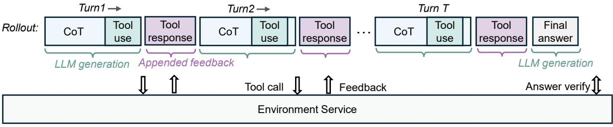

# <span id="page-3-0"></span>2 Agentic Reinforcement Learning Methodology

The long-horizon reasoning process with tool uses:

> **[图片提取文字 (无描述)]:**
> Turn1 → Turn2 → Turn T Tool Tool Tool Tool Final Tool Tool Rollout: CoT CoT CoT . . . response answer use use response use response LLM generation Appended feedback LLM generation Answer verify ] Tool call Feedback Environment Service


```
Turn1:

<reason> To solve this problem, I need to find the least prime number ( p ) such that there exists a positive integer ( n ) for which ( n^4 + 1 ) is divisible by ( p^2 ) ...

Let me write the Python code to find the prime ( p ) and the corresponding ( m ). </reason> <tool_call>{"name": "execute_python_code", "arguments": {"code": "def find_least_prime_and_m():" ...}}</tool_call> [EOS]

[BOS] user <tool_response>(17, 110) </tool_response>[EOS]

Turn2:

[BOS] assistant <reason> Based on the Python code execution, the least prime number ( p )...

To double-check, I will verify that ( 110^4 + 1 ) is indeed divisible by 289.</reason> <tool_call>{"name": "execute_python_code" "arguments": {"code": "def verify_divisibility(m, p):..}}</tool_call>[EOS]

[BOS] user <tool_response>True</tool_response>[EOS]

Turn3:

[BOS] assistant <reason> The verification confirms ....</reason><answer> (\boxed{110})</answer>[EOS]
```

<span id="page-3-2"></span>Figure 2: rStar2-Agent trains LLMs to natively use Python coding tools within the dedicated execution environment, enabling more advanced and effective reasoning for complex problem-solving.

#### <span id="page-3-1"></span>2.1 Smarter Reasoning in a Code Environment

Python code and its interpreter, along with scientific computing libraries such as Numpy for efficient numerical computation, Scipy for advanced scientific analysis, and SymPy for symbolic mathematics, can significantly improve the model's ability for math problem-solving. Ideally, the model demonstrates human-like cognitive behaviors in this Python code environment: (i) invoking tools at the right reasoning steps; (ii) writing logically correct and functional code, and (iii) carefully reflecting on execution results to guide subsequent reasoning steps. We cultivate this capability through agentic reinforcement learning, and in this section, we introduce our key design choices, including tool call interfaces and prompt templates.

Multi-turn Rollout. With coding tools, the model performs multi-turn rollouts that incorporate execution results from the code environment into reasoning, as illustrated in Fig. 2. Unlike standard RL rollouts, which generate a full trajectory until an EOS token, we produce full trajectories through multiple interactive turns with the code environment. Specifically, the first turn begins with a predefined system prompt (Fig. 3) and the given question. Then the model generates an initial reasoning trajectory in the role of assistant, ending at the EOS token. If

#### <|im\_start|>system

A conversation between User and Assistant. The user asks a question, and the Assistant solves it. The Assistant first thinks about the reasoning process in the mind and then provides the user with the answer. The reasoning process and answer are enclosed within <reason> </reason> and <answer> </answer> tags, respectively, i.e., <reason> reasoning process here </reason><answer> answer here </answer>.

