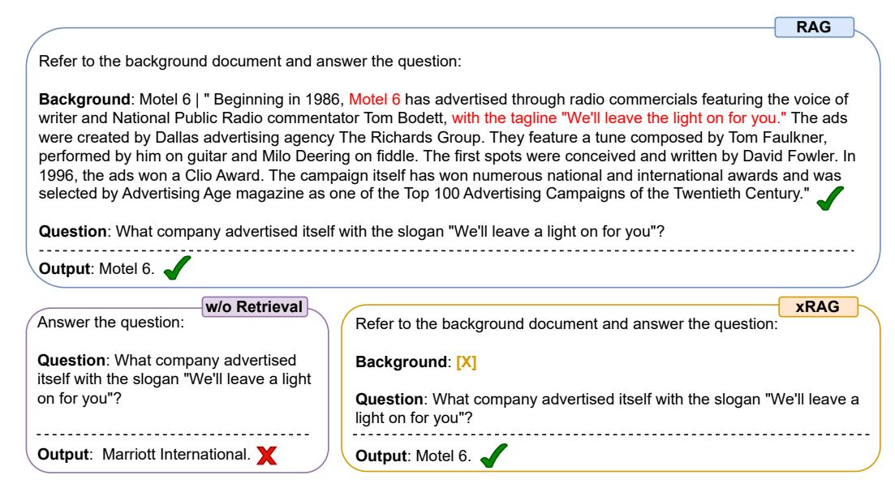

# 1 Introduction

Retrieval-Augmented Language Models (RALMs) [\[41,](#page-11-0) [21,](#page-10-0) [8,](#page-9-0) [13,](#page-10-1) [70\]](#page-13-0) have shown exceptional performance in a variety of knowledge-intensive tasks. By retrieving domain-specific, long-tailed, and up-to-date knowledge from a non-parametric datastore, RALMs significantly extend the boundaries of parametric Large Language Models (LLMs). However, the integration of entire documents into prompts can significantly increase inference costs and may surpass the context limit of LLMs [\[28,](#page-11-1) [79\]](#page-13-1). As illustrated in Figure [1,](#page-1-0) while the inclusion of a relevant document enables the LLM to generate accurate responses, it does so at the expense of processing documents that expand the original query by more than tenfold.

How might we mitigate the costs associated with extended context while maintaining the benefits of retrieval augmentation? Recent research interest has converged on a promising direction: Context Compression. This concept is pursued through two primary strategies: soft-prompting methods, such as Gist [\[58\]](#page-12-0), AutoCompressor [\[14\]](#page-10-2), and ICAE [\[19\]](#page-10-3), which compress the context into dense memory slots, and hard-prompting methods, such as LLMLingua [\[28\]](#page-11-1) and RECOMP [\[79\]](#page-13-1), where

∗Work done during internship at Microsoft, corresponding to Xun Wang, Huishuai Zhang and Dongyan Zhao

> **[图片提取文字 (无描述)]:**
> RAG Refer to the background document and answer the question: Background: Motel 6 | " Beginning in 1986, Motel 6 has advertised through radio commercials featuring the voice of writer and National Public Radio commentator Tom Bodett, with the tagline "We'll leave the light on for you." The ads were created by Dallas advertising agency The Richards Group. They feature a tune composed by Tom Faulkner, performed by him on guitar and Milo Deering on fiddle. The first spots were conceived and written by David Fowler. In 1996, the ads won a Clio Award. The campaign itself has won numerous national and international awards and was selected by Advertising Age magazine as one of the Top 100 Advertising Campaigns of the Twentieth Century." Question: What company advertised itself with the slogan "We'll leave a light on for you"? Output: Motel 6. w/o Retrieval xRAG Answer the question: Refer to the background document and answer the question: Question: What company advertised Background: [X] itself with the slogan "We'll leave a light on for you"? Question: What company advertised itself with the slogan "We'll leave a light on for you"? Output: Motel 6. Output: Marriott International.

Figure 1: xRAG enables efficient retrieval augmentation by adding one document token [X].

compression is applied on the surface form. These approaches, however, either require significant memory for storing LLM activations (e.g., 1.05 MB per token as reported by [\[58\]](#page-12-0)) or suffer from relatively low compression rates. More critically, these methods overlook a crucial characteristic of RALMs: through large-scale contrastive learning with question-document pairs, modern dense retrieval systems already distill document content into a single high-dimensional embedding, and *this embedding reveals (almost) as much information as the text* [\[57,](#page-12-1) [43\]](#page-12-2).

In this paper, we pioneer an innovative approach to retrieval augmentation and context compression through the lens of modality fusion. Drawing from multimodal research, where text-only language models are taught to "perceive" and "listen," a pretrained modality encoder like CLIP [\[64\]](#page-13-2) is typically used to extract modality features. These features are then integrated into language models using a modality fusion bridge [\[44,](#page-12-3) [51,](#page-12-4) [33\]](#page-11-2). Building on the conceptual overlap between the retriever encoder and modality encoder, we introduce xRAG. This model redefines document embeddings from dense retrieval—traditionally solely for retrieval purposes—as retrieval modality features. xRAG employs a modality fusion methodology to seamlessly integrate these embeddings into the language model's representation space, thus obviating the need for textual counterparts and achieving significant context compression. In xRAG, the modality bridge is the only trainable component, while both the retriever and the LLM are kept frozen. This design decision facilitates the reuse of pre-constructed document embeddings and maintains the plug-and-play nature of retrieval augmentation—two essential factors for a functional RAG system.

To verify the effectiveness and versatility of our framework, we conducted comprehensive experiments with different LLM backbones, ranging from a dense 7B model to an 8x7B Mixture of Experts model. Our results reveal that adding just one document token could lead to over a 10% improvement across six knowledge-intensive tasks, significantly surpassing previous compression methods. xRAG also delivers results comparable to uncompressed models on several benchmarks. This is remarkable considering that the only trainable component constitutes less than 0.1% of the LLM's parameters. In terms of efficiency, xRAG reduces total FLOPs by a factor of 3.53 compared to the uncompressed RAG model. We further provide detailed analyses of xRAG, examining various training strategies, data blends, and component selections for the retrieval system. We believe this research sets a strong foundation for the development of future efficient and scalable retrieval-augmented systems.

