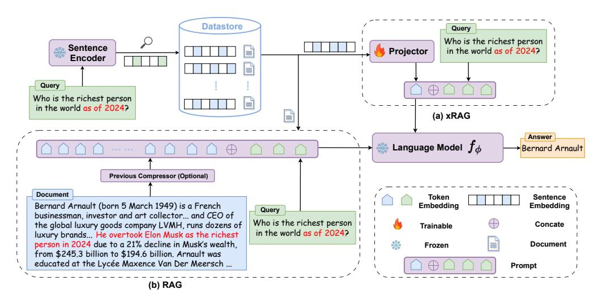
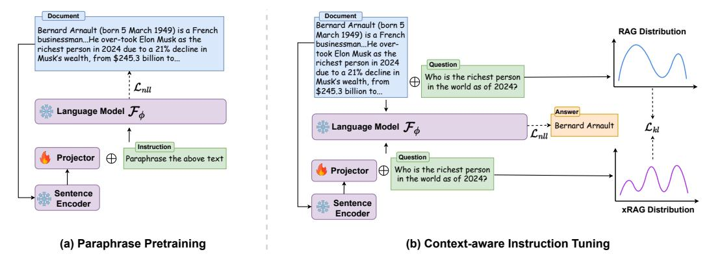

# 2 Related Work

Retrieval-augmented Generation Equipping a parametric language model with a non-parametric datastore has proven effective for a range of NLP tasks, including language modeling [\[36,](#page-11-3) [56,](#page-12-5) [87\]](#page-14-0),

> **[图片提取文字 (无描述)]:**
> Datastore Query Who is the richest person Sentence Projector in the world as of 2024? Encoder Query Who is the richest person in the world as of 2024? 100 (a) xRAG Answer Language Model  $f_{\phi}$ Bernard Arnault Previous Compressor (Optional) Document Token Sentence Embeddina Bernard Arnault (born 5 March 1949) is a French Embedding Query businessman, investor and art collector... and CEO of Who is the richest person the global luxury goods company LVMH, runs dozens of Concate Trainable in the world as of 2024? luxury brands... He overtook Elon Musk as the richest person in 2024 due to a 21% decline in Musk's wealth, Document Frozen from \$245.3 billion to \$194.6 billion. Arnault was educated at the Lycée Maxence Van Der Meersch ... Prompt (b) RAG

Figure 2: Overview of xRAG (a) and RAG (b). For a given query, RAG typically concatenates the retrieved document with the query, significantly extending the context length. In contrast, xRAG addresses this issue through modality fusion by directly projecting the document embedding into the LLM's representation space. This allows for efficient retrieval-augmentation with the addition of only one token.

open-domain question answering [24, 41, 70, 86], domain adaptation [6] and machine translation [35, 11], among others. Given the vast design space of this generation paradigm, numerous approaches with different focuses have been proposed. For instance, RETRO [8] and PlugLM [12] introduce architectural innovations for enhanced integration with the non-parametric datastore. REALM [21] pioneers an end-to-end approach for simultaneous optimization of the language model and retriever. REPLUG [70] and RA-DIT [50] improve retriever alignment using feedback from LLMs. DSP [37] and InteR [17] investigate complex interactions between the retriever and the language model. Selfmem [13] utilizes a reward model to refine retrieval and generation iteratively. Self-RAG [3] incorporates a self-reflection mechanism to enhance the quality and factuality of language model outputs. For a detailed overview, see [18, 4, 2]. Our contribution, xRAG, stands out by implementing a modality fusion approach to retrieval augmentation, creating an effective and efficient RAG system.

Context Compression Context compression, aimed at reducing the input length for LLMs while retaining essential information, has recently attracted substantial interest [46]. Gist [58] achieves a compression rate of up to 26x by modifying the attention mask and caching soft gist token activations. ICAE [19]AutoCompressor [14], and 500xCompressor [47] condense lengthy contexts into succinct, compact memory slots, which are directly utilizable by LLMs for diverse functions. LLMLingua [28, 29, 62] and CompAct [82] introduces a coarse-to-fine prompt compression technique based on perplexity scores and distilled token-level score. While these methods are generally applicable, others are tailored specifically for RAG systems, such as FilCo [76] and RECOMP [79]. A concurrent work directly employs passage embeddings for efficient listwise reranking [52]. For an in-depth comparison of these compression methods regarding memory efficiency, compression rates, and adaptability, refer to Appendix A.

#### 3 Methods

**Problem Formulation** In retrieval-augmented generation, a non-parametric datastore  $\mathbb{D} = \{(E_i, D_i)\}_{i=1}^{|\mathbb{D}|}$  consists of pairs where each  $D_i$  represents a document chunk as a sequence of  $L_i$  tokens  $D_i = \{d_1^i, \ldots, d_{L_i}^i\}$ . Correspondingly,  $E_i$  is the dense representation derived from a sentence embedding model  $\mathbf{SE}_{\theta}(\cdot)$  with input  $D_i$ . For an input query q, its dense representation  $\mathbf{SE}_{\theta}(q)$  is used to find the relevant documents by matching against the collection  $\{E_i\}_{i=1}^{|\mathbb{D}|}$  with certain similarity search algorithm such as MIPS. After retrieval, the system selects a relevant pair (E, D) from  $\mathbb{D}$ , concatenates the chosen document D with q, and processes the combined input with a language model

> **[图片提取文字 (无描述)]:**
> Document Document Bernard Arnault (born 5 Bernard Arnault (born 5 March 1949) is a French RAG Distribution March 1949) is a French businessman...He over-took Elon Musk as the businessman...He overrichest person in 2024 due to a 21% decline in took Elon Musk as the Musk's wealth, from \$245.3 billion to... richest person in 2024 Question due to a 21% decline in Who is the richest person Musk's wealth, from in the world as of 2024?  $\mathcal{L}_{nll}$ \$245.3 billion to... Language Model  $\mathcal{F}_{\phi}$ Answer -> Bernard Arnault Eanguage Model  $\mathcal{F}_{\phi}$ Instruction Question Projector Paraphrase the above text Who is the richest person Projector in the world as of 2024? Sentence Sentence Encoder xRAG Distribution Encoder (a) Paraphrase Pretraining (b) Context-aware Instruction Tuning

Figure 3: Two-stage training strategy of xRAG including (a) Paraphrase Pre-training on unlabeled corpus and (b) Context-aware Instruction Tuning optimized with labeled data and self-distillation.

 $\mathcal{F}_{\phi}(D \oplus q)$ . Optionally, a context compression module  $\mathcal{C}$  can be integrated to reduce the length of D from L to a more concise l, achieving a compression ratio of  $\frac{L}{l}$ .

#### 3.1 xRAG Architecture

Traditional methods for document compression typically focus on surface form of the document [28, 76, 79]. In contrast xRAG tackle the problem from a modality fusion view. Concretely, we introduce a modality projector  $\mathbf{W}$ , which is trained to directly project the retrieval features E into the LLM representation space. Our proposed framework is visually contrasted with the traditional RAG system in Figure 2. In the standard RAG, the input to the LLM comprises the embeddings  $\mathrm{Emb}(\mathrm{D} \oplus q)$  of length  $|\mathrm{D}| + |q|$ , where  $\mathrm{Emb}$  signifies the embedding layer of the LLM. Conversely, with xRAG, the modified input is represented as  $\mathbf{W}(\mathrm{E}) \oplus \mathrm{Emb}(q)$ , which yields a substantially reduced length of 1 + |q|. In this framework, the challenges come from the modality fusion: How can a text-only language model understand features from retrieval modality? To achieve this, we explore a two-stage training strategy: Paraphrase Pretraining followed by Context-aware Instruction Tuning.

### 3.2 Paraphrase Pretraining

Similar to the pretraining strategies employed in vision-language models that use image-captioning data to align two modalities [51, 15, 53], the primary objective of our paraphrase pretraining is to build a compatible representation between the extracted retrieval feature and the corresponding document. Illustrated in Figure 3(a), for each pair (E,D) in a retrieval corpus  $\mathbb D$ , we employ a natural language instruction  $\mathbf X_{\mathtt{instruct}}$  to prompt the LLM to undertake a paraphrasing task (e.g. "[X] The above text could be paraphrased as: [D]", where [X] and [D] are placeholders for  $\mathbf W(E)$  and document  $\mathbf D)^2$ . In this setup, the model learns to connect  $\mathbf W(E)$  and D by recovering D on the condition of  $\mathbf W(E)$  and the model is optimized by:

$$\mathcal{L}_{\text{nll}} = -\sum_{i=1} \log p_{\phi}(d_i | \mathbf{W}(\mathbf{E}), \mathbf{X}_{\text{instruct}}, d_{< i})$$
 (1)

where  $p_{\phi}$  is given by the softmax distribution of LLM  $\mathcal{F}_{\phi}$ , and  $d_{< i}$  denotes the document token before current prediction token  $d_i$ , achieved by casual attention mask in auto-regressive LMs.

### 3.3 Context-aware Instruction Tuning

After the pretraining phase, although the language model  $\mathcal{F}_{\phi}$  has developed an internally compatible representation, it has never been explicitly trained to utilize these features for downstream tasks. To address this gap, we proceed to instruct the model in harnessing the fused feature  $\mathbf{W}(E)$  by continually training the model on data where the answer is closely associated with the given context, including reading comprehension, summarization, and open domain question answering data. We

&lt;sup>2To maintain diversity, we sample from an instruction pool, which could be found in Appendix B.

constructed an mixed dataset, containing approximately 1 million entries from open-source datasets, as detailed in Appendix [C.](#page-16-0) For each triplet in the dataset, (Xcontext, Xquestion, Xanswer), we initially obtain the sentence representation for Xcontext via the embedding model Econtext = SEθ(Xcontext). Subsequently, we refine the optimization of on two directions:

Optimization I: Language Modeling. Aligned with established instruction tuning methodologies [\[75,](#page-13-5) [23,](#page-10-10) [50,](#page-12-6) [42\]](#page-11-7), our objective is to finetune the model so that it generates the correct output when provided with a specific instruction, conditioned upon the given context information. Unlike traditional models that utilize the textual context Xcontext, our method employs a dense feature Econtext to encapsulate the context information:

$$\mathcal{L}_{\text{nll}} = -\sum_{i=1} \log p_{\phi}(\mathbf{X}_{\text{answer},i} | \mathbf{W}(\mathbf{E}_{\text{context}}), \mathbf{X}_{\text{question}}, \mathbf{X}_{\text{answer},< i})$$
(2)

Optimization II: Self-Distillation. The second trajectory of optimization aims to guide the xRAG in the effective utilization of contextual information, drawing from the principles of self-distillation [\[1,](#page-9-5) [71\]](#page-13-6) and imitation learning [\[61,](#page-12-11) [22\]](#page-10-11). By considering the RAG model as a "teacher" and xRAG as a "student", we endeavor to distill the knowledge from RAG, thereby enabling xRAG to emulate the RAG model's proficiency in handling the full, uncompressed documents. This approach enhances xRAG's resilience in scenarios where it encounters noisy or irrelevant context that may not directly lead to the correct answer, detailedly discussed in § [6.1.](#page-6-0) Concretely, for a language model Fϕ using either Xcontext or Econtext as the source of context, our objective is to minimize the divergence between the two resulting output distributions. This discrepancy is measured using the Kullback-Leibler (KL) divergence:

$$\mathcal{L}_{kl} = D_{KL}(p_{\phi}(\mathbf{X}_{\mathtt{answer}}|\mathbf{X}_{\mathtt{context}}, \cdot) \mid\mid p_{\phi}(\mathbf{X}_{\mathtt{answer}}|\mathbf{W}(\mathbf{E}_{\mathtt{context}}), \cdot))$$
(3)

Here Xquestion is omitted for brevity and the final loss is the linear combination controlled by a hyperparameter: Lnll + αLkl.

### 3.4 Design Principle

In designing the projector W, our primary objective is to maintain the simplicity of the framework. We therefore opted for a two-layer MLP while other more sophisticated module such as Q-Former [\[44\]](#page-12-3) could also be considered. Notice that the projector is the only trainable component, accounting for only 0.46% of the total parameters in the Mistral-7b model and 0.07% in the Mixtral-8x7b model. Such a design choice departs from previous studies that necessitated full-parameter tuning to adapt LLMs for compressed contexts [\[58,](#page-12-0) [76,](#page-13-4) [14\]](#page-10-2). We believe this approach will likely be more accessible and practical because, fundamentally, the RAG itself functions as a plug-and-play module for LLMs, and so should its compressed version. This design also avoid the risk of compromising other core capabilities of LLM during full-parameter tuning, as observed in [\[54,](#page-12-12) [55\]](#page-12-13).

Moreover, in contrast to other compression methods that necessitate storing LLM activations for each compressed token [\[58,](#page-12-0) [19,](#page-10-3) [14\]](#page-10-2)—an impractical strategy in the RAG setting, given the millions of documents involved—our method introduces no additional memory overhead. Instead, it leverages offline-constructed document embeddings, originally designed for retrieval. To summarize, xRAG not only simplifies the integration process but also avoids unnecessary computational or memory expenses.

