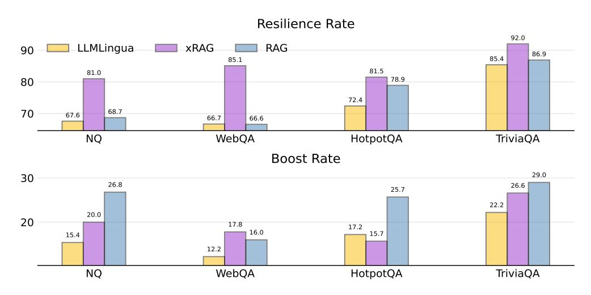
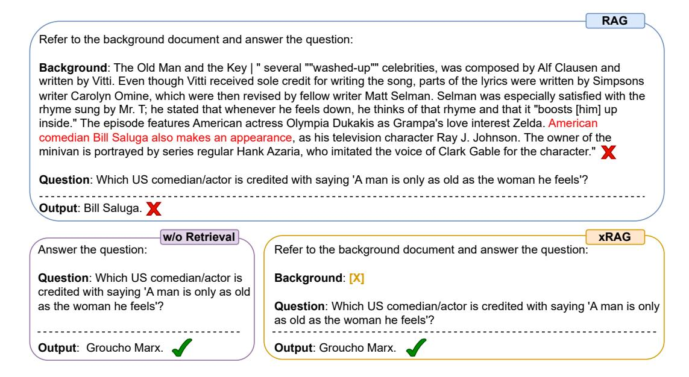

# 6 Analysis

### 6.1 Evaluation Beyond the Overall Score

Although retrieval augmentation generally boosts performance as shown by aggregate metrics, it may not uniformly benefit all instances. In certain cases, the retrieval system might provide irrelevant or even misleading information, leading to incorrect answers that were previously correct [\[83,](#page-14-5) [76,](#page-13-4) [4\]](#page-9-3). To enable a more fine-grained evaluation, we introduce two novel metrics: the Resilience Rate and the Boost Rate. The resilience rate quantifies the percentage of instances in which the system's responses remain correct both before and after retrieval augmentation, highlighting the system's stability and robustness. Conversely, the boost rate measures the percentage of instances that were initially answered incorrectly but were rectified following the introduction of a retrieved document, thereby assessing the efficacy of retrieval augmentation. An ideal RAG system should have both high resilience rate and boost rate.

In Figure [4,](#page-7-0) we display these metrics for the uncompressed RAG and two compression methods: LLMLingua and xRAG. Surprisingly, although retrieval augmentation generally enhances performance, the resilience rate for RAG averages only 75.2%, indicating that retrieval can adversely affect about one-quarter of previously correct answers. In contrast, xRAG demonstrates considerable

3 <https://pytorch.org/docs/stable/profiler.html#module-torch.profiler>

robustness across all evaluated datasets. This robustness largely stems from xRAG's ability to maintain an unbiased stance toward the internal knowledge representation of the LLM, especially when confronted with noisy retrieval content. Similar trends are noted in [50, 54], where search-augmented instruction learning is shown to bolster the robustness of language models. However, xRAG still lags behind RAG in boost rate, particularly in multi-hop reasoning tasks. It is crucial to note that a high resilience rate does not necessarily mean that the LLM disregards the provided information, which could potentially lead to a reduced boost rate. A comparative analysis with LLMLingua indicates that xRAG is not only more robust but also more effective.

> **[图片提取文字 (无描述)]:**
> Resilience Rate 92.0 LLMLingua xRAG RAG 90 86.9 85.4 85.1 81.5 81.0 78.9 80 72.4 70 68.7 67.6 66.7 66.6 NQ WebQA HotpotQA TriviaQA **Boost Rate** 29.0 30 26.8 26.6 25.7 22.2 20.0 20 17.8 17.2 16.0 15.7 15.4 12.2 WebQA TriviaQA NQ HotpotQA

Figure 4: Resilience rate and boost rate of three augmentation methods: LLMLinuga, xRAG and RAG over a Mixtral-8x7b baseline without retrieval augmentation.

#### **6.2** What makes xRAG effective?

Table 3: Ablation on different training strategy for xRAG.

|              | NO    | Tuinia O A | WakoA | HadmadOA | A           | veraged    |       |
|--------------|-------|------------|-------|----------|-------------|------------|-------|
|              | NQ    | TriviaQA   | WebQA | HotpotQA | Performance | Resilience | Boost |
| Mistral-7b   |       |            |       |          |             |            |       |
| xRAG         | 39.10 | 65.77      | 39.40 | 34.05    | 44.58       | 82.3%      | 22.2% |
| w/o finetune | 30.14 | 59.48      | 35.19 | 26.70    | 37.87       | 66.6%      | 20.8% |
| w/o pretrain | 31.25 | 59.07      | 41.19 | 24.32    | 38.95       | 79.8%      | 14.1% |
| w/o nll      | 35.46 | 65.27      | 39.57 | 31.80    | 43.02       | 83.7%      | 19.4% |
| w/o self-kd  | 34.99 | 64.33      | 39.22 | 27.45    | 41.49       | 76.2%      | 20.8% |
| w LoRA       | 35.71 | 60.14      | 40.45 | 22.91    | 39.80       | 76.0%      | 18.0% |
| Mixtral-8x7b | )     |            |       |          |             |            |       |
| xRAG         | 47.48 | 74.14      | 44.50 | 39.66    | 51.45       | 84.9%      | 20.0% |
| w/o finetune | 34.46 | 64.08      | 34.89 | 30.43    | 40.96       | 65.9%      | 17.8% |
| w/o pretrain | 42.54 | 71.17      | 47.44 | 31.23    | 48.09       | 85.0%      | 14.2% |
| w/o nll      | 45.10 | 72.85      | 45.03 | 37.11    | 50.02       | 84.8%      | 18.9% |
| w/o self-kd  | 42.38 | 72.26      | 44.73 | 32.41    | 47.94       | 79.8%      | 18.9% |

This section delves into a thorough evaluation of various elements that contribute to xRAG's overall performance, focusing on its training strategy, the blend of datasets used and the effect of different embedding models. Due to the space limit, we present the last factor in Appendix E.

1. Training Strategy We carefully ablate four optimization choices: pretraining, instruction tuning, and two optimization objectives—language modeling (nll) and self-distillation (self-kd). We also train a Mistral-7b with LoRA on our instruction tuning dataset to rule out the possibility that our improvement simply comes from tuning on more data. The outcomes are presented in Table 3. Our analysis reveals that the interplay of different training strategies significantly contributes to the

> **[图片提取文字 (无描述)]:**
> RAG Refer to the background document and answer the question: Background: The Old Man and the Key | " several ""washed-up" celebrities, was composed by Alf Clausen and written by Vitti. Even though Vitti received sole credit for writing the song, parts of the lyrics were written by Simpsons writer Carolyn Omine, which were then revised by fellow writer Matt Selman. Selman was especially satisfied with the rhyme sung by Mr. T; he stated that whenever he feels down, he thinks of that rhyme and that it "boosts [him] up inside." The episode features American actress Olympia Dukakis as Grampa's love interest Zelda. American comedian Bill Saluga also makes an appearance, as his television character Ray J. Johnson. The owner of the minivan is portrayed by series regular Hank Azaria, who imitated the voice of Clark Gable for the character." X Question: Which US comedian/actor is credited with saying 'A man is only as old as the woman he feels'? Output: Bill Saluga. X w/o Retrieval xRAG Refer to the background document and answer the question: Answer the question: Question: Which US comedian/actor is Background: [X] credited with saying 'A man is only as old as the woman he feels'? Question: Which US comedian/actor is credited with saying 'A man is only as old as the woman he feels'? Output: Groucho Marx. Output: Groucho Marx.

Figure 5: Given the misleading document, RAG model tend to generate a wrong answer based on the document, while xRAG demonstrate its robustness by leveraging the internal knowledge of LLM.

performance of our framework. In the case of Mistral-7b, pretraining and finetuning phases are of equal significance to the end results. However, for Mixtral-8x7b, the impact of pretraining is notably diminished, likely due to the larger model's enhanced capability to incorporate multi-modality information. Furthermore, we find that during finetuning, self-distillation is more important than language modeling. The primary advantage of self-distillation lies in bolstering the resilience rate of the xRAG system. Optimization with nll loss tends to cause an overreliance on context information, rendering the system more vulnerable when the retriever fails to fetch relevant documents.

Table 4: Abaltion results on different data selection strategy.

|                   | # Tr     | # Train NQ | NQ TriviaQA WebQA H | HotmotOA | Average  |             |            |       |
|-------------------|----------|------------|---------------------|----------|----------|-------------|------------|-------|
|                   | # 1raiii |            |                     | WebQA    | HotpotQA | Performance | Resilience | Boost |
| xRAG (Mistral-7b) | 955k     | 39.10      | 65.77               | 39.40    | 34.05    | 44.58       | 82.3%      | 22.2% |
| w RC only         | 488k     | 36.98      | 65.77               | 41.39    | 32.82    | 44.24       | 81.9%      | 22.4% |
| w QA only         | 385k     | 36.45      | 65.57               | 41.14    | 31.80    | 43.74       | 80.5%      | 22.1% |
| w Summ only       | 81k      | 36.37      | 64.95               | 40.40    | 31.98    | 43.42       | 78.8%      | 22.8% |

II. Instruction-tuning Dataset Blend As discussed in  $\S 3.3$ , our instruction-tuning dataset primarily comprises three categories: reading comprehension, open-domain QA, and text summarization. To explore the effects of different data blends, we instruction-tune three xRAG model variants, each using data from these distinct categories. The results are shown in Table4. Our analysis reveals that among the dataset blends, reading comprehension data most significantly enhances the xRAG model's performance, as evidenced by both high resilience and boost rates. Intriguingly, when tuned solely with summarization data, xRAG still manages to deliver strong performance on QA datasets it has never been exposed to. This finding underscores that the advantages of instruction tuning for xRAG are not rooted in task-specific knowledge. Instead, they derive from the model's improved ability to utilize projected context information effectively.

### 6.3 Case Study

In Figure 5, we show one interesting case about the robustness of xRAG. When retrieval system provide misleading content, standard RAG would overly rely on the document and generate answer that are faithful to the document while not factually true. Our xRAG model opt to rely on the internal

knowledge of LLM and being robust to the misleading content. In Appendix [H,](#page-21-0) we include more cases about xRAG including several error analysis.

