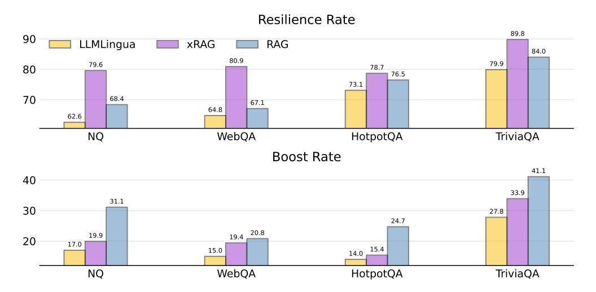

# F Analysis on Mistral-7b

In Figure [6,](#page-19-0) we list the Resilience rate and Boost Rate on Mistral-7b model, which exhibit same pattern with Mixtral-8x7b model.

> **[图片提取文字 (无描述)]:**
> Resilience Rate 89.8 90 LLMLingua xRAG RAG 84.0 80.9 79.9 79.6 78.7 80 76.5 73.1 70 68.4 67.1 64.8 62.6 WebQA HotpotQA TriviaQA NQ **Boost Rate** 41.1 40 33.9 31.1 30 27.8 24.7 20.8 19.9 19.4 20 17.0 15.4 15.0 14.0 WebQA TriviaQA NQ HotpotQA

Figure 6: Robustness and effectiveness analysis on 4 QA datasets with Mistral-7b model.

