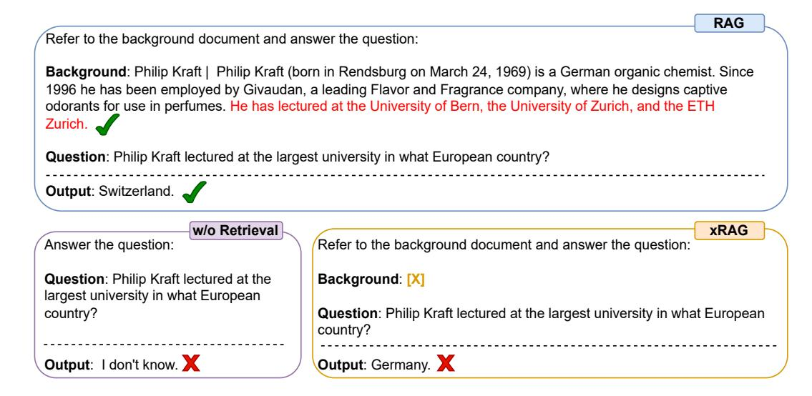
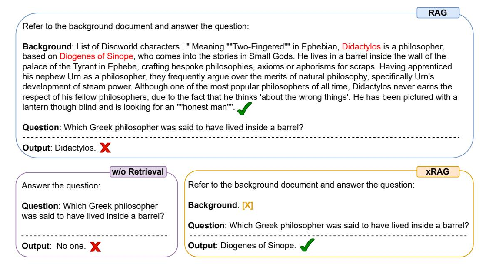
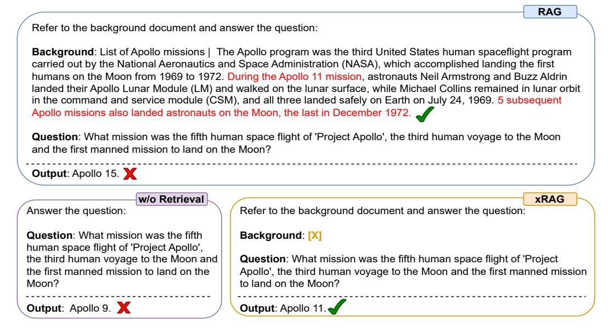
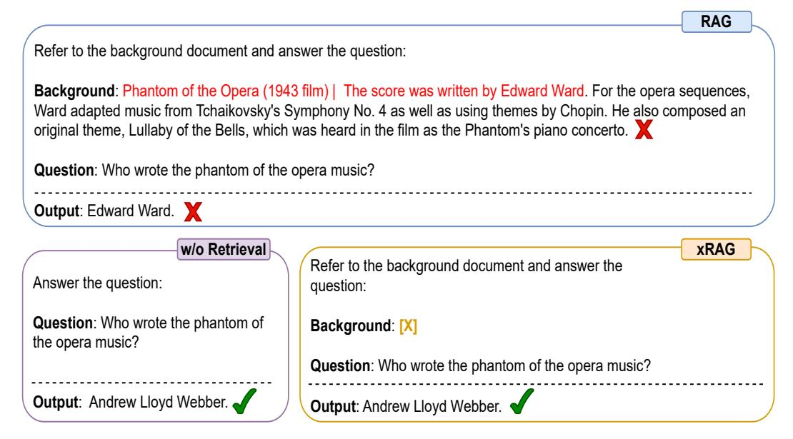

# H More interesting cases

- In Figure [7,](#page-21-1) we report a failure case of xRAG. In this case, retrieval alone is not enough to derive the final answer and the LLM is required to perform reasoning over retrieved document (the listed universities are all located in Switzerland).
- An interesting example is shown in Figure [8,](#page-22-0) when the retrieved document is a list of a characters in the book Discworld, the RAG model would respond with a fictional character, while xRAG generate the right answer by focusing on the relevant part of the document.
- In Figure [9,](#page-22-1) even when the retrieved document is relevant, RAG would still hallucinate while xRAG could generate the right answer based on the document.
- In Figure [10,](#page-23-0) the retriever mistakenly fetch the wrong document (Phantom of the Opera of interest is a music rather than a file) and RAG would be misled while xRAG remain robust to generate the correct answer.

> **[图片提取文字 (无描述)]:**
> RAG Refer to the background document and answer the question: Background: Philip Kraft | Philip Kraft (born in Rendsburg on March 24, 1969) is a German organic chemist. Since 1996 he has been employed by Givaudan, a leading Flavor and Fragrance company, where he designs captive odorants for use in perfumes. He has lectured at the University of Bern, the University of Zurich, and the ETH Zurich. Question: Philip Kraft lectured at the largest university in what European country? Output: Switzerland. w/o Retrieval xRAG Answer the question: Refer to the background document and answer the guestion: **Question**: Philip Kraft lectured at the Background: [X] largest university in what European country? **Question**: Philip Kraft lectured at the largest university in what European country? Output: I don't know. Output: Germany. X

Figure 7: Failure case of xRAG when reasoning is required to derive the final answer.

> **[图片提取文字 (无描述)]:**
> RAG Refer to the background document and answer the question: Background: List of Discworld characters | " Meaning ""Two-Fingered"" in Ephebian, Didactylos is a philosopher, based on Diogenes of Sinope, who comes into the stories in Small Gods. He lives in a barrel inside the wall of the palace of the Tyrant in Ephebe, crafting bespoke philosophies, axioms or aphorisms for scraps. Having apprenticed his nephew Urn as a philosopher, they frequently argue over the merits of natural philosophy, specifically Urn's development of steam power. Although one of the most popular philosophers of all time, Didactylos never earns the respect of his fellow philosophers, due to the fact that he thinks 'about the wrong things'. He has been pictured with a lantern though blind and is looking for an ""honest man"". Question: Which Greek philosopher was said to have lived inside a barrel? Output: Didactylos. X w/o Retrieval xRAG Refer to the background document and answer the question: Answer the question: Background: [X] **Question**: Which Greek philosopher was said to have lived inside a barrel? Question: Which Greek philosopher was said to have lived inside a barrel? Output: Diogenes of Sinope. Output: No one.

Figure 8: xRAG correctly locates the relevant part in a long document by selecting Diogenes of Sinope as the answer rather than Didactylos, a fictional character in the book Discworld.

> **[图片提取文字 (无描述)]:**
> RAG Refer to the background document and answer the question: Background: List of Apollo missions | The Apollo program was the third United States human spaceflight program carried out by the National Aeronautics and Space Administration (NASA), which accomplished landing the first humans on the Moon from 1969 to 1972. During the Apollo 11 mission, astronauts Neil Armstrong and Buzz Aldrin landed their Apollo Lunar Module (LM) and walked on the lunar surface, while Michael Collins remained in lunar orbit in the command and service module (CSM), and all three landed safely on Earth on July 24, 1969. 5 subsequent Apollo missions also landed astronauts on the Moon, the last in December 1972. Question: What mission was the fifth human space flight of 'Project Apollo', the third human voyage to the Moon and the first manned mission to land on the Moon? Output: Apollo 15. w/o Retrieval xRAG Refer to the background document and answer the question: Answer the question: Question: What mission was the fifth Background: [X] human space flight of 'Project Apollo', the third human voyage to the Moon and Question: What mission was the fifth human space flight of 'Project the first manned mission to land on the Apollo', the third human voyage to the Moon and the first manned mission to land on the Moon? Moon? Output: Apollo 9. X Output: Apollo 11.

Figure 9: xRAG correctly locates the relevant part in a long document while RAG would still hallucinate the wrong answer.

> **[图片提取文字 (无描述)]:**
> RAG Refer to the background document and answer the question: Background: Phantom of the Opera (1943 film) | The score was written by Edward Ward. For the opera sequences, Ward adapted music from Tchaikovsky's Symphony No. 4 as well as using themes by Chopin. He also composed an original theme, Lullaby of the Bells, which was heard in the film as the Phantom's piano concerto. 🗶 **Question**: Who wrote the phantom of the opera music? Output: Edward Ward. w/o Retrieval xRAG Refer to the background document and answer the Answer the question: question: **Question**: Who wrote the phantom of Background: [X] the opera music? **Question**: Who wrote the phantom of the opera music? Output: Andrew Lloyd Webber. Output: Andrew Lloyd Webber.

Figure 10: xRAG correctly locates the relevant part in a long document while RAG would still hallucinate the wrong answer.

