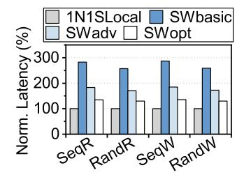
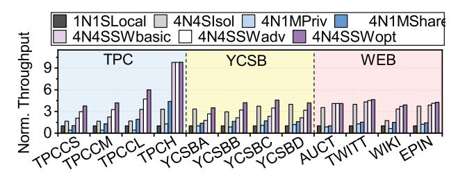
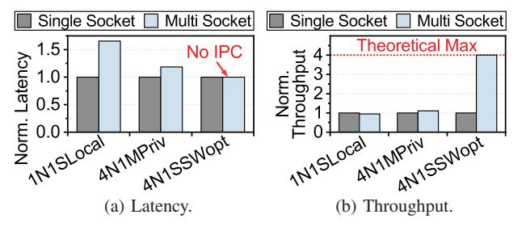

# *A. Evaluation Setup*

Silicon implementation. Figure 15 presents the silicon realization that forms the basis of our evaluation. The design integrates the controller blocks and the hardware-automated per-port pipeline, as shown in Figures 15a and 15b. Figure 15c provides the corresponding per-port chip micrograph of the switch, confirming that the pipeline and control logic are implemented as dedicated hardware structures rather than an architectural abstraction.

Hardware configuration and methodology. The evaluation system includes four compute nodes and a 10 TB shared storage node. Each node connects to the storage node via a 200 Gbps

| Parameter                | Specification | Notes / Methodology    |  |
|--------------------------|---------------|------------------------|--|
| Manufacturing Technology | 4 nm          | Actual silicon process |  |
| Clock Frequency          | 1.0 GHz       | Simulation-calibrated  |  |
| TDP                      | $\sim$ 20W    | Aggregate SoC power    |  |
| SerDes / PHY             | 64 Gbps PAM4  | PCIe 6.0 / CXL 3.2     |  |

TABLE II: Evaluation platform specification.

OSFP direct-attach interconnect [67] and uses a 3.6 GHz 128-core CPU, 512 GB DDR5-4800 DRAM, and a PCIe ×16 link. A distributed PostgreSQL 17 database [68] runs across the nodes, and each node maps CXL memory via daxctl and mmap for use as a cache.

The evaluation uses a cycle-accurate RTL-based emulation environment, where key latency components are cross-checked against silicon measurements where applicable. Although the design implements CXL 3.2 silicon, no commercial CPU supports the PCIe 6.0 physical layer required by this standard, and processors supporting CXL 2.0 lack full CXL.cache support, blocking multi-host and memory-sharing tests. Existing CXL expanders operate similarly to the modeled devices but are not publicly accessible for controlled comparison. Under these constraints, RTL-level emulation offers a reproducible platform that reflects silicon-level timing behavior without relying on unavailable hardware.

Timing parameters such as bus timing and pipeline depth were extracted from our silicon prototypes and incorporated into the evaluation model. Using these parameters, the RTL environment reproduces end-to-end latency behavior consistent with measured *round-trip time* (RTT) data from Intel's Memory Latency Checker (MLC [69]). Workload traces capturing memory-access and hierarchical interactions were used to model CXL transactions. We modified PostgreSQL to utilize hardware coherence provided by the CXL switch. Traditional deployments serialize writes at a single primary node to maintain coherence [70-72]. In contrast, our modified database supports concurrent writes across nodes, and inter-node cache sharing enables reuse of data cached by other nodes.

Table II summarizes the key hardware configurations and parameters. Because the platform adheres to the CXL 3.2 specification, the evaluation reflects the latency and bandwidth characteristics expected of real CXL systems.

**Evaluation baselines.** Figure 16 shows the seven baseline configurations used in the evaluation, representing stages in the evolution of CXL systems from direct node-to-device connections to scalable switch-based fabrics. The upper group presents direct-attached designs where compute nodes access CXL memory locally, and the lower group shows switch-attached systems where memory is accessed through legacy HBR or proposed PBR switches. Legacy components are shown in red and proposed components in blue.

The comparison focuses on two dimensions: attachment

|               |       | Hit  | Read |     |      | Hit  | Read                  |   |
|---------------|-------|------|------|-----|------|------|-----------------------|---|
|               |       | (%)  | (%)  |     |      | (%)  | (%)                   | _ |
|               | C-S   | 85.6 |      |     | A    |      | 88.1                  |   |
| $\mathcal{C}$ | C-M   | 48.1 | 52.4 | SB  | В    | 84.0 | 97.5                  | 0 |
| TP            | C-L   | 25.3 | 53.7 | YC  | C    | 85.8 | 100.0                 | - |
|               | Н     | 1.8  | 93.4 |     | D    | 84.2 | 97.5 100.0 95.7 |   |
| EΒ            | Auct  | 85.7 |      | WEB |      | 87.0 |                       | ş |
| 3             | Twitt | 14.0 | 99.9 | ×   | Epin | 46.8 | 97.8                  | 0 |

|   |       | Operation   | Hit (%) | Read (%) |
|---|-------|-------------|------------|-------------|
| = |       | Delivery    | 4.5        | 53.0        |
|   | ب     | NewOrder    | 6.0        | 53.6        |
|   | TPC-C | OrderStatus | 65.2       | 55.9        |
|   | Ξ     | Payment     | 35.7       | 55.0        |
| _ |       | StockLevel  | 96.1       | 63.9        |
|   | CSB   | Select      | 82.4       | 100         |
|   | YC    | Update      | -          | 0           |

TABLE III: Workload characteristics.

topology (direct versus switch) and device organization (single-headed versus multi-headed), allowing us to evaluate how connection structure and device composition influence latency, scalability, and memory-sharing efficiency.

The direct-attached group includes four configurations. 1N1S\_local is the baseline: a single node connected to one 128 GB SHD. In 4N4S\_isolated, four nodes attach to four SHDs; although this adds more processing cores and device capacity, additional coherence overhead appears across nodes. 4N1M\_private connects multiple nodes to a 512 GB MHD, with each head offering an independent address space, improving utilization but still without data sharing. 4N1M\_shared models partial sharing but without hardware coherence management. Therefore, the software on each node must manually flush its cache to keep data consistent across the system.

The switch-attached group includes three configurations examining how controller and switch design affect latency. 4N4S\_SWbasic uses a legacy HBR switch and controller, enabling pooling but with higher per-hop latency from conventional designs. Replacing the HBR switch with the proposed PBR version produces 4N4S\_SWadv, lowering hop latency and improving responsiveness for latency-sensitive workloads. 4N4S\_SWopt combines the proposed controller and PBR switch; by unifying routing and control in hardware, it achieves deterministic latency and high throughput.

Workloads and evaluation metrics. The evaluation uses seven representative workloads: TPC-C [25] and AuctionMark [23] for OLTP transactions; YCSB [24] for microservices; TPC-H

Fig. 16: Configuration of baselines and proposed architecture.

Fig. 17: Microbenchmark.

Fig. 18: Latency breakdown.

Fig. 19: Tail latency analysis.

[26] for OLAP; and Twitter, Wikipedia, and Epinions [23] for web workloads. Table III summarizes their hit rates and read ratios. TPC-C models a warehouse-scale system with diverse transaction types (NewOrder, Payment, Delivery), and three dataset scales (10K, 20K, 40K warehouses) evaluate scalability.

YCSB models key-value workloads with Select and Update operations. Among the four mixes (A–D), YCSB-B serves as the primary workload because it provides a balanced read/write pattern with a typical zipfian distribution. Performance metrics include throughput (QPS), latency, and bandwidth utilization to characterize the latency-deterministic behavior of the proposed design under realistic data-center environments.

#### B. Latency and Pipeline Behavior Analysis

Synthesis analysis. Figure 17 shows the average 64B access RTT across direct-attached and switch-attached configurations. The legacy 4N4S\_SWbasic configuration incurs hierarchical routing delays, resulting in 2.8× higher latency than 1N1S\_local. 4N4S\_SWadv reduces this latency by roughly 35% using our HBR switch. 4N4S\_SWopt which integrates both the proposed controller and switch, achieves the lowest latency overall, reducing it by approximately 53% compared to 4N4S\_SWbasic.

Latency breakdown. Figure 18 decomposes TPC-C latency by transaction type in low contention. Specifically, *Compute* represents the computation time spend on CPU, while *Memory* denotes the CXL memory access time. In addition, *Storage* indicates the time spent at the storage node, and *RDMA* shows the RDMA transfer time to the storage node. In the direct-attached configuration (1N1S\_local, 4N4S\_isolated, and 4N1M\_private), the Delivery and NewOrder workloads have low cache hit ratios (below 10%) that force frequent storage accesses. Consequently, storage access time and RDMA

Fig. 20: Overall throughput.

transfer time account for 41% of the total latency, resulting in end-to-end latencies of roughly 1–3 ms. The shared MHD configuration (4N1M\_shared) reduces latency by 60% for these workloads, and by 32% on average. This improvement occurs because 4N1M\_shared minimizes storage access by enabling cross-node data reuse through CXL memory sharing.

Switch-attached systems (4N4S\_SW) provide similar benefits. However, for 4N4S\_SWbasic, the latency of high hitrate workloads such as OrderStatus, Payment, and StockLevel actually increased by 41%. This is because the CXL memory access latency in legacy switch systems is 2.8× higher compared to direct-attached systems. In contrast, 4N4S\_SWadv and 4N4S\_SWopt, which incorporate the proposed switch, minimize storage access and maintain low CXL memory overhead, reducing average latency by 28% and 42% compared with 4N4S\_SWbasic.

Tail latency analysis. Figure 19 shows the tail latency analysis for the NewOrder and Payment queries, which account for 45% and 43% of the TPC-C workload. In the 1N1S\_local baseline, the p99 latency is  $1.9 \times$  higher than the p50 latency on average. Specifically, the NewOrder workload which has a low hit rate of 6%, causing multiple cache misses per query and make the p99 tail latency above 2 ms. Switch-attached systems mitigate this high tail latency through memory pooling. By utilizing a larger CXL memory capacity through memory pooling, 4N4S\_SWbasic resolves this cache miss problem and reduces p99 latency by 25% on average. However, the longer CXL memory access time increases the p50 latency by 31% compared to 1N1S\_local. Finally, 4N4S\_SWopt overcomes this overhead via the unified controller and PBR switch, which can deliver deterministic low latency, reducing the p50 latency by 29% while further dropping the p99 latency by 58%.

## C. System-Level Performance Scaling

Overall throughput. Figure 20 presents normalized throughput across the twelve workloads. In direct-attached systems ( $4N4S\_isolated$ ), throughput improves by only  $2.9\times$  over the single-node baseline ( $1N1S\_local$ ) because inter-node parallelism is limited by coherence overhead; only the primary node can handle writes to ensure cache coherence between multiple nodes. This issue is particularly evident in write-heavy workloads such as TPC-C and Wiki, where performance improves by only  $1.7\times$  despite a  $4\times$  increase in the number

Fig. 21: Node sensitivity.

Fig. 22: Memory balancing.

Fig. 23: Latency across varying instances.

of nodes. In contrast, 4N1M\_shared maintains software-based coherence through explicit cache flush, allowing all nodes to handle write requests. Furthermore, data sharing allows every node to utilize the entire capacity of the MHD device as a cache. As a result, for write-intensive and less cache-friendly workloads such as TPC-C large and TPC-H, 4N1M\_shared improves overall throughput by 23% compared to 4N4S\_isolated. However, limited per-host bandwidth due to PCIe bifurcation restricts gains for other workloads.

Switch-attached systems deliver the largest improvements.  $4\text{N}4\text{S}\_\text{SWbasic}$  yields a  $3.4\times$  improvement over  $1\text{N}1\text{S}\_\text{local}$ , while  $4\text{N}4\text{S}\_\text{SWadv}$  achieves  $4.1\times$  with the PBR switch. The optimized  $4\text{N}4\text{S}\_\text{SWopt}$ , combining the proposed controller and the PBR switch, reaches up to a  $4.8\times$  improvement by maintaining deterministic latency and reducing timing variation. These results confirm that MHD-based expansion solutions have scalability due to limited bandwidth, and that the proposed switch-based architecture provides consistent scalability across diverse workloads.

Node sensitivity. Figure 21 shows how performance scales from 1 to 64 nodes under YCSB-B workload. In SHD\_isolated, where each node connected to an individual SHD device, performance improves by only 3.7× compared to a single node when using 64 nodes. This is because to ensure inter-node coherence, only a single primary node can process write requests and these write requests from the primary node must be propagated to all other nodes. Consequently, there is a fundamental scalability limitation in workloads that involve writes. In MHD\_private, which uses MHD devices that do not support data sharing, this problem is further exacerbated;

Fig. 24: Intra-NUMA analysis.

using 4 nodes results in a 35% performance degradation compared to using a single node. This is because the per-host bandwidth decreases as MHD device connect to more nodes. In addition, the number of ports on a single MHD device is limited to around four due to die area constraints [73]. MHD\_shared supports inter-node data sharing, allowing all nodes to handle write requests. However, similar to MHD\_private, it is not a fundamentally scalable solution because the bandwidth available to a single node is still limited as the system scales to multiple nodes.

SWbasic represents a case of scaling using legacy HBR switch and controller. Because HBR switches do not support inter-switch connections, the maximum number of scalable nodes is limited to eight, based on a 256-lane configuration. In contrast, our proposed SWopt, which implements the CXL 3.2 standard which support PBR routing, maintains near-linear scaling up to 64 nodes through its fully connected topology and deterministic scheduling, utilizing multi-switch interconnection for configuration exceeding eight nodes. These results indicate that the unified controller and PBR switch sustain stable throughput and predictable latency as node count increases.

## D. Scalability and Stability Analysis of Memory Pooling

Port-based scheduling for memory balancing. Figure 22 evaluates throughput and resource utilization under the write-heavy YCSB-A workload. Because the primary node must handles all write requests to ensure coherence between nodes, MHD\_balanced (equivalent to 4N1M\_private) concentrates traffic on a single head, leaving read-only nodes underutilized with link usage below 6%. MHD\_unbalanced, which assigns more memory capacity and PCIe lanes to the primary node, improves throughput by 1.7× but still cannot eliminate the fundamental imbalance.

In contrast,  $4N4S\_SWopt$  increases throughput by  $4\times$  over  $4N1M\_private$ , reaching over 95% bandwidth utilization through port-based scheduling. This balanced flow control distributes write traffic across nodes, demonstrating efficient memory pooling at scale. This indicates that the dynamic capacity of MHD devices cannot fully resolve inter-node imbalance issues, highlighting the need for switch-based memory pooling.

Latency stability. Figure 23 illustrates how latency changes under the YCSB-B benchmark as the number of concurrent

instances increases. When comparing the baseline configurations, 4N1M\_shared outperforms 1N1S\_local at low instance counts because it reduces storage accesses by sharing cache data between nodes. Furthermore, as the workload scales, 1N1S\_local is limited to a maximum of only 128 concurrent instances due to its per-node core count constraints. While 4N1M\_shared can scale beyond this, the latency of 4N1M shared also spikes beyond 300 instances because PCIe bifurcation limits the bandwidth available to each host. Switchattached systems offer a solution to this problem; for example, 4N4S SWbasic handles up to 512 instances without any latency penalty, reducing latency by up to 2.3× compared to 1N1S\_local. The limitation of 4N4S\_SWbasic is that at low instance counts, due to high legacy HBR switch latency, latency increases by 1.7× compared to 1N1S\_local. Our proposed 4N4S\_SWopt can show lowerst latency in both low contetion and high contention senario, and demonstrates that our PBR switch can maintain deterministic latency even under high contention.

## E. NUMA Independence of the Deterministic Fabric

To demonstrate that the proposed CXL switch can effectively eliminate inter-NUMA communication overhead, we evaluated three additional configurations on a four-node NUMA system. In these setups, each logical node maps to a single CPU socket. The 1N1S\_local configuration serves as a conventional baseline, where a single SHD is attached to a specific NUMA node. Conversely, in the 4N1M\_private and 4N4S\_SWopt configurations, a CXL device connects directly to all NUMA nodes via a multi-port interface. Conventional NUMA systems incur inter-process communication overhead during remote memory access, increasing access distance and reducing bandwidth. In contrast, the proposed PBR switch consolidates socket-level memory paths into a shared CXL pool, eliminating inter-socket dependency and maintaining uniform latency across sockets.

Figure 24a compares normalized latency under YCSB-B. Conventional NUMA systems (1N1S\_local) show up to 1.7× higher latency than single-socket setups because the CXL device is attached to only one socket, forcing all memory accesses from other NUMA nodes to incur an intersocket hop. 4N1M\_private reduces latency by 28% by attaching separate MHD heads to each socket, but accessing CXL memory attached to other NUMA nodes still requires inter-socket communication. 4N4S\_SWopt maintains nearly identical latency across sockets. Figure 24b compares normalized throughput under YCSB-B. Because 1N1S\_local and 4N1M\_private need inter-socket communication, limited inter-socket bandwidth severely limits the throughput compared with single-socket setups. In contrast, 4N4S\_SWopt removes inter-socket communication and archive 4× higher throughput.

#### VIII. RELATED WORK

**Software-based memory management.** Prior CXL studies [53,56,74-76] examined page-level tiering for hierarchical

memory. [56] extended this by coupling the controller with hypervisor allocation for cacheline-granular migration. Although effective at small scale, these methods introduce scheduling variability and do not scale well in multi-tenant settings. Our work advances this direction with a unified controller and switch that integrate all protocol layers into a fixed-latency hardware pipeline, reducing software dependence and enabling deterministic operation across servers and virtualized systems. Software-managed virtualization. Recent CXL-enabled databases [11] replace RDMA-based disaggregated memory with a CXL switch to avoid page-level tiering, improving recovery and pooling but still relying on software buffering and synchronization. Systems such as Aurora [71], Socrates [70], and PolarFS [77] offload I/O but remain constrained by software control. Our design provides hardware-assisted virtualization through VCS and MHD, enabling address isolation, coherence, and dynamic port binding. Embedding composability in the data path ensures deterministic, firmware-free operation while preserving orchestration compatibility.

**CXL-assisted near-memory processing.** Beyond memory pooling, several works explore computation within the CXL fabric. [78] accelerates recommendation-model training using nearmemory processing, and [79,80] embed compute elements in CXL devices for genome analysis and DLRM inference. These studies demonstrate the benefits of combining computation and communication. Our work complements this direction with a deterministic, firmware-free routing substrate that enables parallelism without software scheduling.

Rack-scale disaggregation. At rack scale, [81] proposes a CXL-disaggregated design pooling NICs and memory across hosts to reduce inter-rack bottlenecks and replace ToR-centric systems with a load/store model. This shifts earlier ideas such as Aurora and PolarFS into hardware. Our siliconproven controller and switch advance this direction by enabling deterministic multi-hop CXL fabrics without firmware delays. Software-bound fabrics. Fabric-centric computing [82] envisions the interconnect as a computational substrate, but most implementations remain software-driven. Our work realizes this concept through silicon-level integration that unifies conversion, routing, and scheduling within a shared timing domain. This design ensures consistent low-latency operation while complementing existing frameworks, forming a foundation for composable data centers where hardware and interconnect jointly manage performance and scalability.

# *A. Evaluation Setup*

Silicon implementation. Figure 15 presents the silicon realization that forms the basis of our evaluation. The design integrates the controller blocks and the hardware-automated per-port pipeline, as shown in Figures 15a and 15b. Figure 15c provides the corresponding per-port chip micrograph of the switch, confirming that the pipeline and control logic are implemented as dedicated hardware structures rather than an architectural abstraction.

Hardware configuration and methodology. The evaluation system includes four compute nodes and a 10 TB shared storage node. Each node connects to the storage node via a 200 Gbps

| Parameter                | Specification | Notes / Methodology    |  |
|--------------------------|---------------|------------------------|--|
| Manufacturing Technology | 4 nm          | Actual silicon process |  |
| Clock Frequency          | 1.0 GHz       | Simulation-calibrated  |  |
| TDP                      | $\sim$ 20W    | Aggregate SoC power    |  |
| SerDes / PHY             | 64 Gbps PAM4  | PCIe 6.0 / CXL 3.2     |  |

TABLE II: Evaluation platform specification.

OSFP direct-attach interconnect [67] and uses a 3.6 GHz 128-core CPU, 512 GB DDR5-4800 DRAM, and a PCIe ×16 link. A distributed PostgreSQL 17 database [68] runs across the nodes, and each node maps CXL memory via daxctl and mmap for use as a cache.

The evaluation uses a cycle-accurate RTL-based emulation environment, where key latency components are cross-checked against silicon measurements where applicable. Although the design implements CXL 3.2 silicon, no commercial CPU supports the PCIe 6.0 physical layer required by this standard, and processors supporting CXL 2.0 lack full CXL.cache support, blocking multi-host and memory-sharing tests. Existing CXL expanders operate similarly to the modeled devices but are not publicly accessible for controlled comparison. Under these constraints, RTL-level emulation offers a reproducible platform that reflects silicon-level timing behavior without relying on unavailable hardware.

Timing parameters such as bus timing and pipeline depth were extracted from our silicon prototypes and incorporated into the evaluation model. Using these parameters, the RTL environment reproduces end-to-end latency behavior consistent with measured *round-trip time* (RTT) data from Intel's Memory Latency Checker (MLC [69]). Workload traces capturing memory-access and hierarchical interactions were used to model CXL transactions. We modified PostgreSQL to utilize hardware coherence provided by the CXL switch. Traditional deployments serialize writes at a single primary node to maintain coherence [70-72]. In contrast, our modified database supports concurrent writes across nodes, and inter-node cache sharing enables reuse of data cached by other nodes.

Table II summarizes the key hardware configurations and parameters. Because the platform adheres to the CXL 3.2 specification, the evaluation reflects the latency and bandwidth characteristics expected of real CXL systems.

**Evaluation baselines.** Figure 16 shows the seven baseline configurations used in the evaluation, representing stages in the evolution of CXL systems from direct node-to-device connections to scalable switch-based fabrics. The upper group presents direct-attached designs where compute nodes access CXL memory locally, and the lower group shows switch-attached systems where memory is accessed through legacy HBR or proposed PBR switches. Legacy components are shown in red and proposed components in blue.

The comparison focuses on two dimensions: attachment

|               |       | Hit  | Read |     |      | Hit  | Read                  |   |
|---------------|-------|------|------|-----|------|------|-----------------------|---|
|               |       | (%)  | (%)  |     |      | (%)  | (%)                   | _ |
|               | C-S   | 85.6 |      |     | A    |      | 88.1                  |   |
| $\mathcal{C}$ | C-M   | 48.1 | 52.4 | SB  | В    | 84.0 | 97.5                  | 0 |
| TP            | C-L   | 25.3 | 53.7 | YC  | C    | 85.8 | 100.0                 | - |
|               | Н     | 1.8  | 93.4 |     | D    | 84.2 | 97.5 100.0 95.7 |   |
| EΒ            | Auct  | 85.7 |      | WEB |      | 87.0 |                       | ş |
| 3             | Twitt | 14.0 | 99.9 | ×   | Epin | 46.8 | 97.8                  | 0 |

|   |       | Operation   | Hit (%) | Read (%) |
|---|-------|-------------|------------|-------------|
| = |       | Delivery    | 4.5        | 53.0        |
|   | ب     | NewOrder    | 6.0        | 53.6        |
|   | TPC-C | OrderStatus | 65.2       | 55.9        |
|   | Ξ     | Payment     | 35.7       | 55.0        |
| _ |       | StockLevel  | 96.1       | 63.9        |
|   | CSB   | Select      | 82.4       | 100         |
|   | YC    | Update      | -          | 0           |

TABLE III: Workload characteristics.

topology (direct versus switch) and device organization (single-headed versus multi-headed), allowing us to evaluate how connection structure and device composition influence latency, scalability, and memory-sharing efficiency.

The direct-attached group includes four configurations. 1N1S\_local is the baseline: a single node connected to one 128 GB SHD. In 4N4S\_isolated, four nodes attach to four SHDs; although this adds more processing cores and device capacity, additional coherence overhead appears across nodes. 4N1M\_private connects multiple nodes to a 512 GB MHD, with each head offering an independent address space, improving utilization but still without data sharing. 4N1M\_shared models partial sharing but without hardware coherence management. Therefore, the software on each node must manually flush its cache to keep data consistent across the system.

The switch-attached group includes three configurations examining how controller and switch design affect latency. 4N4S\_SWbasic uses a legacy HBR switch and controller, enabling pooling but with higher per-hop latency from conventional designs. Replacing the HBR switch with the proposed PBR version produces 4N4S\_SWadv, lowering hop latency and improving responsiveness for latency-sensitive workloads. 4N4S\_SWopt combines the proposed controller and PBR switch; by unifying routing and control in hardware, it achieves deterministic latency and high throughput.

Workloads and evaluation metrics. The evaluation uses seven representative workloads: TPC-C [25] and AuctionMark [23] for OLTP transactions; YCSB [24] for microservices; TPC-H

Fig. 16: Configuration of baselines and proposed architecture.

Fig. 17: Microbenchmark.

Fig. 18: Latency breakdown.

Fig. 19: Tail latency analysis.

[26] for OLAP; and Twitter, Wikipedia, and Epinions [23] for web workloads. Table III summarizes their hit rates and read ratios. TPC-C models a warehouse-scale system with diverse transaction types (NewOrder, Payment, Delivery), and three dataset scales (10K, 20K, 40K warehouses) evaluate scalability.

YCSB models key-value workloads with Select and Update operations. Among the four mixes (A–D), YCSB-B serves as the primary workload because it provides a balanced read/write pattern with a typical zipfian distribution. Performance metrics include throughput (QPS), latency, and bandwidth utilization to characterize the latency-deterministic behavior of the proposed design under realistic data-center environments.

#### B. Latency and Pipeline Behavior Analysis

Synthesis analysis. Figure 17 shows the average 64B access RTT across direct-attached and switch-attached configurations. The legacy 4N4S\_SWbasic configuration incurs hierarchical routing delays, resulting in 2.8× higher latency than 1N1S\_local. 4N4S\_SWadv reduces this latency by roughly 35% using our HBR switch. 4N4S\_SWopt which integrates both the proposed controller and switch, achieves the lowest latency overall, reducing it by approximately 53% compared to 4N4S\_SWbasic.

Latency breakdown. Figure 18 decomposes TPC-C latency by transaction type in low contention. Specifically, *Compute* represents the computation time spend on CPU, while *Memory* denotes the CXL memory access time. In addition, *Storage* indicates the time spent at the storage node, and *RDMA* shows the RDMA transfer time to the storage node. In the direct-attached configuration (1N1S\_local, 4N4S\_isolated, and 4N1M\_private), the Delivery and NewOrder workloads have low cache hit ratios (below 10%) that force frequent storage accesses. Consequently, storage access time and RDMA

Fig. 20: Overall throughput.

transfer time account for 41% of the total latency, resulting in end-to-end latencies of roughly 1–3 ms. The shared MHD configuration (4N1M\_shared) reduces latency by 60% for these workloads, and by 32% on average. This improvement occurs because 4N1M\_shared minimizes storage access by enabling cross-node data reuse through CXL memory sharing.

Switch-attached systems (4N4S\_SW) provide similar benefits. However, for 4N4S\_SWbasic, the latency of high hitrate workloads such as OrderStatus, Payment, and StockLevel actually increased by 41%. This is because the CXL memory access latency in legacy switch systems is 2.8× higher compared to direct-attached systems. In contrast, 4N4S\_SWadv and 4N4S\_SWopt, which incorporate the proposed switch, minimize storage access and maintain low CXL memory overhead, reducing average latency by 28% and 42% compared with 4N4S\_SWbasic.

Tail latency analysis. Figure 19 shows the tail latency analysis for the NewOrder and Payment queries, which account for 45% and 43% of the TPC-C workload. In the 1N1S\_local baseline, the p99 latency is  $1.9 \times$  higher than the p50 latency on average. Specifically, the NewOrder workload which has a low hit rate of 6%, causing multiple cache misses per query and make the p99 tail latency above 2 ms. Switch-attached systems mitigate this high tail latency through memory pooling. By utilizing a larger CXL memory capacity through memory pooling, 4N4S\_SWbasic resolves this cache miss problem and reduces p99 latency by 25% on average. However, the longer CXL memory access time increases the p50 latency by 31% compared to 1N1S\_local. Finally, 4N4S\_SWopt overcomes this overhead via the unified controller and PBR switch, which can deliver deterministic low latency, reducing the p50 latency by 29% while further dropping the p99 latency by 58%.

## C. System-Level Performance Scaling

Overall throughput. Figure 20 presents normalized throughput across the twelve workloads. In direct-attached systems ( $4N4S\_isolated$ ), throughput improves by only  $2.9\times$  over the single-node baseline ( $1N1S\_local$ ) because inter-node parallelism is limited by coherence overhead; only the primary node can handle writes to ensure cache coherence between multiple nodes. This issue is particularly evident in write-heavy workloads such as TPC-C and Wiki, where performance improves by only  $1.7\times$  despite a  $4\times$  increase in the number

Fig. 21: Node sensitivity.

Fig. 22: Memory balancing.

Fig. 23: Latency across varying instances.

of nodes. In contrast, 4N1M\_shared maintains software-based coherence through explicit cache flush, allowing all nodes to handle write requests. Furthermore, data sharing allows every node to utilize the entire capacity of the MHD device as a cache. As a result, for write-intensive and less cache-friendly workloads such as TPC-C large and TPC-H, 4N1M\_shared improves overall throughput by 23% compared to 4N4S\_isolated. However, limited per-host bandwidth due to PCIe bifurcation restricts gains for other workloads.

Switch-attached systems deliver the largest improvements.  $4\text{N}4\text{S}\_\text{SWbasic}$  yields a  $3.4\times$  improvement over  $1\text{N}1\text{S}\_\text{local}$ , while  $4\text{N}4\text{S}\_\text{SWadv}$  achieves  $4.1\times$  with the PBR switch. The optimized  $4\text{N}4\text{S}\_\text{SWopt}$ , combining the proposed controller and the PBR switch, reaches up to a  $4.8\times$  improvement by maintaining deterministic latency and reducing timing variation. These results confirm that MHD-based expansion solutions have scalability due to limited bandwidth, and that the proposed switch-based architecture provides consistent scalability across diverse workloads.

Node sensitivity. Figure 21 shows how performance scales from 1 to 64 nodes under YCSB-B workload. In SHD\_isolated, where each node connected to an individual SHD device, performance improves by only 3.7× compared to a single node when using 64 nodes. This is because to ensure inter-node coherence, only a single primary node can process write requests and these write requests from the primary node must be propagated to all other nodes. Consequently, there is a fundamental scalability limitation in workloads that involve writes. In MHD\_private, which uses MHD devices that do not support data sharing, this problem is further exacerbated;

Fig. 24: Intra-NUMA analysis.

using 4 nodes results in a 35% performance degradation compared to using a single node. This is because the per-host bandwidth decreases as MHD device connect to more nodes. In addition, the number of ports on a single MHD device is limited to around four due to die area constraints [73]. MHD\_shared supports inter-node data sharing, allowing all nodes to handle write requests. However, similar to MHD\_private, it is not a fundamentally scalable solution because the bandwidth available to a single node is still limited as the system scales to multiple nodes.

SWbasic represents a case of scaling using legacy HBR switch and controller. Because HBR switches do not support inter-switch connections, the maximum number of scalable nodes is limited to eight, based on a 256-lane configuration. In contrast, our proposed SWopt, which implements the CXL 3.2 standard which support PBR routing, maintains near-linear scaling up to 64 nodes through its fully connected topology and deterministic scheduling, utilizing multi-switch interconnection for configuration exceeding eight nodes. These results indicate that the unified controller and PBR switch sustain stable throughput and predictable latency as node count increases.

## D. Scalability and Stability Analysis of Memory Pooling

Port-based scheduling for memory balancing. Figure 22 evaluates throughput and resource utilization under the write-heavy YCSB-A workload. Because the primary node must handles all write requests to ensure coherence between nodes, MHD\_balanced (equivalent to 4N1M\_private) concentrates traffic on a single head, leaving read-only nodes underutilized with link usage below 6%. MHD\_unbalanced, which assigns more memory capacity and PCIe lanes to the primary node, improves throughput by 1.7× but still cannot eliminate the fundamental imbalance.

In contrast,  $4N4S\_SWopt$  increases throughput by  $4\times$  over  $4N1M\_private$ , reaching over 95% bandwidth utilization through port-based scheduling. This balanced flow control distributes write traffic across nodes, demonstrating efficient memory pooling at scale. This indicates that the dynamic capacity of MHD devices cannot fully resolve inter-node imbalance issues, highlighting the need for switch-based memory pooling.

Latency stability. Figure 23 illustrates how latency changes under the YCSB-B benchmark as the number of concurrent

instances increases. When comparing the baseline configurations, 4N1M\_shared outperforms 1N1S\_local at low instance counts because it reduces storage accesses by sharing cache data between nodes. Furthermore, as the workload scales, 1N1S\_local is limited to a maximum of only 128 concurrent instances due to its per-node core count constraints. While 4N1M\_shared can scale beyond this, the latency of 4N1M shared also spikes beyond 300 instances because PCIe bifurcation limits the bandwidth available to each host. Switchattached systems offer a solution to this problem; for example, 4N4S SWbasic handles up to 512 instances without any latency penalty, reducing latency by up to 2.3× compared to 1N1S\_local. The limitation of 4N4S\_SWbasic is that at low instance counts, due to high legacy HBR switch latency, latency increases by 1.7× compared to 1N1S\_local. Our proposed 4N4S\_SWopt can show lowerst latency in both low contetion and high contention senario, and demonstrates that our PBR switch can maintain deterministic latency even under high contention.

## E. NUMA Independence of the Deterministic Fabric

To demonstrate that the proposed CXL switch can effectively eliminate inter-NUMA communication overhead, we evaluated three additional configurations on a four-node NUMA system. In these setups, each logical node maps to a single CPU socket. The 1N1S\_local configuration serves as a conventional baseline, where a single SHD is attached to a specific NUMA node. Conversely, in the 4N1M\_private and 4N4S\_SWopt configurations, a CXL device connects directly to all NUMA nodes via a multi-port interface. Conventional NUMA systems incur inter-process communication overhead during remote memory access, increasing access distance and reducing bandwidth. In contrast, the proposed PBR switch consolidates socket-level memory paths into a shared CXL pool, eliminating inter-socket dependency and maintaining uniform latency across sockets.

Figure 24a compares normalized latency under YCSB-B. Conventional NUMA systems (1N1S\_local) show up to 1.7× higher latency than single-socket setups because the CXL device is attached to only one socket, forcing all memory accesses from other NUMA nodes to incur an intersocket hop. 4N1M\_private reduces latency by 28% by attaching separate MHD heads to each socket, but accessing CXL memory attached to other NUMA nodes still requires inter-socket communication. 4N4S\_SWopt maintains nearly identical latency across sockets. Figure 24b compares normalized throughput under YCSB-B. Because 1N1S\_local and 4N1M\_private need inter-socket communication, limited inter-socket bandwidth severely limits the throughput compared with single-socket setups. In contrast, 4N4S\_SWopt removes inter-socket communication and archive 4× higher throughput.

#### VIII. RELATED WORK

**Software-based memory management.** Prior CXL studies [53,56,74-76] examined page-level tiering for hierarchical

memory. [56] extended this by coupling the controller with hypervisor allocation for cacheline-granular migration. Although effective at small scale, these methods introduce scheduling variability and do not scale well in multi-tenant settings. Our work advances this direction with a unified controller and switch that integrate all protocol layers into a fixed-latency hardware pipeline, reducing software dependence and enabling deterministic operation across servers and virtualized systems. Software-managed virtualization. Recent CXL-enabled databases [11] replace RDMA-based disaggregated memory with a CXL switch to avoid page-level tiering, improving recovery and pooling but still relying on software buffering and synchronization. Systems such as Aurora [71], Socrates [70], and PolarFS [77] offload I/O but remain constrained by software control. Our design provides hardware-assisted virtualization through VCS and MHD, enabling address isolation, coherence, and dynamic port binding. Embedding composability in the data path ensures deterministic, firmware-free operation while preserving orchestration compatibility.

**CXL-assisted near-memory processing.** Beyond memory pooling, several works explore computation within the CXL fabric. [78] accelerates recommendation-model training using nearmemory processing, and [79,80] embed compute elements in CXL devices for genome analysis and DLRM inference. These studies demonstrate the benefits of combining computation and communication. Our work complements this direction with a deterministic, firmware-free routing substrate that enables parallelism without software scheduling.

Rack-scale disaggregation. At rack scale, [81] proposes a CXL-disaggregated design pooling NICs and memory across hosts to reduce inter-rack bottlenecks and replace ToR-centric systems with a load/store model. This shifts earlier ideas such as Aurora and PolarFS into hardware. Our siliconproven controller and switch advance this direction by enabling deterministic multi-hop CXL fabrics without firmware delays. Software-bound fabrics. Fabric-centric computing [82] envisions the interconnect as a computational substrate, but most implementations remain software-driven. Our work realizes this concept through silicon-level integration that unifies conversion, routing, and scheduling within a shared timing domain. This design ensures consistent low-latency operation while complementing existing frameworks, forming a foundation for composable data centers where hardware and interconnect jointly manage performance and scalability.

