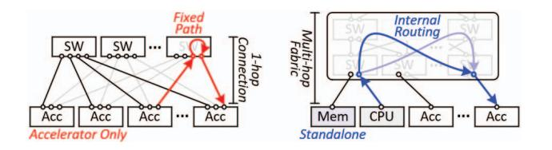
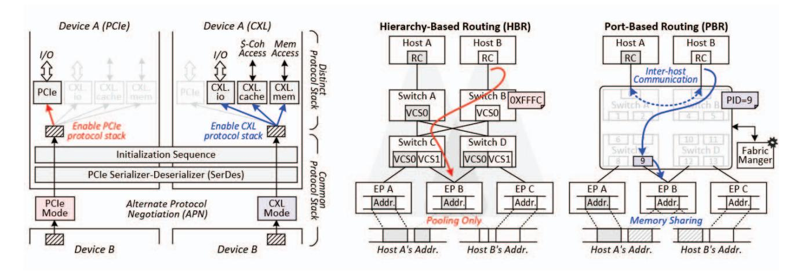

# *A. Interconnect Technologies*

Modern accelerator-based systems rely on interconnect technologies such as NVLink and UALink, designed for lowlatency, high-bandwidth connectivity among accelerators at rack scale [2,27-29]. These links support communication across a single rack or scale-up domain [27,30-32] and employ direct,

- (a) Accelerator-centric. (b) Fabric for heterogeneous systems.

Fig. 1: Comparison of emerging interconnect technologies.

point-to-point connections without internal routing. As a result, they form the one-hop Clos topology in Figure 1a [33-35], which minimizes latency but limits device-count scalability.

Although NVLink and UALink offer efficient peer-to-peer communication, their one-hop structure prevents scalable integration of standalone memory devices. Accelerator-oriented links may expose limited memory-semantic operations, but the accessible regions are small and non-cacheable, providing no support for shared or disaggregated memory architectures.

CXL introduces a broader capability. Beyond connecting accelerators and CPUs, it incorporates "standalone memory" devices as first-class components (Figure 1b). This enables pooled and expandable memory within a unified address domain that can be flexibly allocated across devices.

Because CXL devices may be physically distributed but logically unified, global coherence is essential. CXL implements hardware-managed cache coherence, allowing CPUs, accelerators, and memory expanders to access shared regions without software-mediated synchronization. In contrast to acceleratorcentric links, CXL supports multi-hop forwarding, enabling fabric-level scaling through retimers without additional Ethernet or InfiniBand layers. This capability allows memory capacity to be dynamically positioned near compute units, supporting flexible and memory-centric data-center architectures.

#### *B. Architectural Divergence between CXL and PCIe*

CXL and PCIe share a common physical foundation. As shown in Figure 2a, both protocols use the PCIe *Serializer-Deserializer* (SerDes) and follow the same initialization process, where devices negotiate protocol selection via *Alternate Protocol Negotiation* [36,37]. When CXL mode is selected, the link retains PCIe-style control and I/O operations via *CXL.io* while adding *CXL.mem* for memory access and *CXL.cache* for cache-coherent data exchange. A CXL controller therefore implements both PCIe and CXL protocol stacks.

Early CXL controllers were derived from PCIe *Intellectual Property* (IP), but the two protocols differ fundamentally in how transactions are processed. PCIe is an "I/O-oriented protocol" [38-41] that uses a request-completion model with multiple acknowledgment stages, resulting in round-trip latency of 200 ns to 1 μs [42-44]. CXL, designed as a "memorysemantic protocol", issues load and store operations directly on a lightweight path, removing completion packets and reducing acknowledgment stages. This reduces theoretical round-trip latency by four to ten times compared with PCIe [37,44,45].

- (a) PCIe and CXL architecture comparison. (b) Hierarchy- and port-based routing of CXL.

Fig. 2: CXL architecture and routing mechanisms.

A second divergence lies in data representation. PCIe uses variable-length *Transaction Layer Packets* (TLPs), which require replay buffers and strict ordering to ensure correctness [40,41,46]. CXL instead employs fixed-size *Flow Control Units* (Flits) [37,47-49], each embedding header, command, and payload fields as well as the information needed for both request and response. Error recovery is handled by the *Link Layer Retry* mechanism [12,37,47], avoiding PCIe's replay process. This bus-like behavior provides more deterministic latency and timing characteristics, making CXL well suited for memory-centric architectures.

# *A. Interconnect Technologies*

Modern accelerator-based systems rely on interconnect technologies such as NVLink and UALink, designed for lowlatency, high-bandwidth connectivity among accelerators at rack scale [2,27-29]. These links support communication across a single rack or scale-up domain [27,30-32] and employ direct,

- (a) Accelerator-centric. (b) Fabric for heterogeneous systems.

Fig. 1: Comparison of emerging interconnect technologies.

point-to-point connections without internal routing. As a result, they form the one-hop Clos topology in Figure 1a [33-35], which minimizes latency but limits device-count scalability.

Although NVLink and UALink offer efficient peer-to-peer communication, their one-hop structure prevents scalable integration of standalone memory devices. Accelerator-oriented links may expose limited memory-semantic operations, but the accessible regions are small and non-cacheable, providing no support for shared or disaggregated memory architectures.

CXL introduces a broader capability. Beyond connecting accelerators and CPUs, it incorporates "standalone memory" devices as first-class components (Figure 1b). This enables pooled and expandable memory within a unified address domain that can be flexibly allocated across devices.

Because CXL devices may be physically distributed but logically unified, global coherence is essential. CXL implements hardware-managed cache coherence, allowing CPUs, accelerators, and memory expanders to access shared regions without software-mediated synchronization. In contrast to acceleratorcentric links, CXL supports multi-hop forwarding, enabling fabric-level scaling through retimers without additional Ethernet or InfiniBand layers. This capability allows memory capacity to be dynamically positioned near compute units, supporting flexible and memory-centric data-center architectures.

#### *B. Architectural Divergence between CXL and PCIe*

CXL and PCIe share a common physical foundation. As shown in Figure 2a, both protocols use the PCIe *Serializer-Deserializer* (SerDes) and follow the same initialization process, where devices negotiate protocol selection via *Alternate Protocol Negotiation* [36,37]. When CXL mode is selected, the link retains PCIe-style control and I/O operations via *CXL.io* while adding *CXL.mem* for memory access and *CXL.cache* for cache-coherent data exchange. A CXL controller therefore implements both PCIe and CXL protocol stacks.

Early CXL controllers were derived from PCIe *Intellectual Property* (IP), but the two protocols differ fundamentally in how transactions are processed. PCIe is an "I/O-oriented protocol" [38-41] that uses a request-completion model with multiple acknowledgment stages, resulting in round-trip latency of 200 ns to 1 μs [42-44]. CXL, designed as a "memorysemantic protocol", issues load and store operations directly on a lightweight path, removing completion packets and reducing acknowledgment stages. This reduces theoretical round-trip latency by four to ten times compared with PCIe [37,44,45].

- (a) PCIe and CXL architecture comparison. (b) Hierarchy- and port-based routing of CXL.

Fig. 2: CXL architecture and routing mechanisms.

A second divergence lies in data representation. PCIe uses variable-length *Transaction Layer Packets* (TLPs), which require replay buffers and strict ordering to ensure correctness [40,41,46]. CXL instead employs fixed-size *Flow Control Units* (Flits) [37,47-49], each embedding header, command, and payload fields as well as the information needed for both request and response. Error recovery is handled by the *Link Layer Retry* mechanism [12,37,47], avoiding PCIe's replay process. This bus-like behavior provides more deterministic latency and timing characteristics, making CXL well suited for memory-centric architectures.

