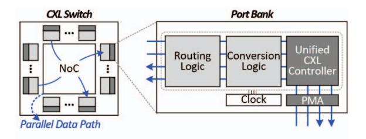

# *A. Switch Hardware Composition*

The switch incorporates multiple CXL controllers within a hardware-based fabric node, enabling real-time forwarding without firmware intervention. This alleviates the latency accumulation and topology constraints observed in conventional designs that rely on deep controller hierarchies or softwaremanaged paths. Figure 13 shows the overall switch structure. The design consists of port banks that combine a unified controller with dedicated conversion and routing logic. These port banks are interconnected via an internal *Network-on-Chip* (NoC), providing a high-bandwidth, parallel on-chip communication fabric without exposing microarchitectural details. The NoC enables simultaneous ingress and egress transfers and maintains timing consistency across processing paths.

Each port bank operates as a hardware endpoint that processes incoming packets, performs conversion and routing, and forwards traffic across the NoC to the target port. The

Fig. 13: Overall structure of CXL Switch.

switch scales with available link resources, allowing wide ports to function as a single high-bandwidth interface or to split into narrower ports as needed. Because all datapaths share one timing domain, latency stays stable across configurations.

This architecture removes the latency growth typically associated with traversing multiple controller layers. Each port uses a unified controller pipeline, and communication flows through the parallel NoC fabric, keeping end-to-end latency close to that of a single controller even as port count increases.

#### *B. Virtual CXL Switch (VCS) Architecture*

The proposed switch supports VCS operation in both singleand multi-host environments. VCS partitions a physical switch into isolated virtual root domains, allowing multiple hosts to share the same hardware resources while retaining independent address spaces. In a single-root VCS, one *upstream port* (USP) connects to a host and multiple *downstream ports* (DSPs) attach to devices within that domain. In a multi-root VCS, several USPs coexist within the same switch, each associated with a different host. Bandwidth and address-space allocation across virtual roots are managed in hardware through a *Dynamic Port* (DP) binding mechanism.

The multi-root VCS configuration in which each host connects through its own USP, while memory expanders or accelerators may be assigned to individual hosts or shared among them. This architecture implements the composable memory fabric model introduced earlier, enabling concurrent access to a shared memory pool without software mediation. Because latency is preserved across all virtual roots, the deterministic behavior of the controller extends uniformly to fabric scale. Building on the multi-root design, the switch adds hardware support for MHDs and multi-logical devices to broaden multi-host connectivity. Each MHD includes several logical heads, allowing distinct VCS instances to access the same physical device through independent attachment points. The switch treats each head as a separate logical endpoint, preserving ordering and coherence across hosts sharing MHDs.

DP binding coordinates these connections by mapping virtual ports to physical downstream ports, enabling hosts to allocate or share MHD resources in hardware. This mechanism extends composability beyond single-root deployments while preserving deterministic latency and isolation across domains.

- (a) Fabric operation mode. (b) Non-blocking NoC.

Fig. 14: Swtich operation mode and non-blocking feature.

# *A. Switch Hardware Composition*

The switch incorporates multiple CXL controllers within a hardware-based fabric node, enabling real-time forwarding without firmware intervention. This alleviates the latency accumulation and topology constraints observed in conventional designs that rely on deep controller hierarchies or softwaremanaged paths. Figure 13 shows the overall switch structure. The design consists of port banks that combine a unified controller with dedicated conversion and routing logic. These port banks are interconnected via an internal *Network-on-Chip* (NoC), providing a high-bandwidth, parallel on-chip communication fabric without exposing microarchitectural details. The NoC enables simultaneous ingress and egress transfers and maintains timing consistency across processing paths.

Each port bank operates as a hardware endpoint that processes incoming packets, performs conversion and routing, and forwards traffic across the NoC to the target port. The

Fig. 13: Overall structure of CXL Switch.

switch scales with available link resources, allowing wide ports to function as a single high-bandwidth interface or to split into narrower ports as needed. Because all datapaths share one timing domain, latency stays stable across configurations.

This architecture removes the latency growth typically associated with traversing multiple controller layers. Each port uses a unified controller pipeline, and communication flows through the parallel NoC fabric, keeping end-to-end latency close to that of a single controller even as port count increases.

#### *B. Virtual CXL Switch (VCS) Architecture*

The proposed switch supports VCS operation in both singleand multi-host environments. VCS partitions a physical switch into isolated virtual root domains, allowing multiple hosts to share the same hardware resources while retaining independent address spaces. In a single-root VCS, one *upstream port* (USP) connects to a host and multiple *downstream ports* (DSPs) attach to devices within that domain. In a multi-root VCS, several USPs coexist within the same switch, each associated with a different host. Bandwidth and address-space allocation across virtual roots are managed in hardware through a *Dynamic Port* (DP) binding mechanism.

The multi-root VCS configuration in which each host connects through its own USP, while memory expanders or accelerators may be assigned to individual hosts or shared among them. This architecture implements the composable memory fabric model introduced earlier, enabling concurrent access to a shared memory pool without software mediation. Because latency is preserved across all virtual roots, the deterministic behavior of the controller extends uniformly to fabric scale. Building on the multi-root design, the switch adds hardware support for MHDs and multi-logical devices to broaden multi-host connectivity. Each MHD includes several logical heads, allowing distinct VCS instances to access the same physical device through independent attachment points. The switch treats each head as a separate logical endpoint, preserving ordering and coherence across hosts sharing MHDs.

DP binding coordinates these connections by mapping virtual ports to physical downstream ports, enabling hosts to allocate or share MHD resources in hardware. This mechanism extends composability beyond single-root deployments while preserving deterministic latency and isolation across domains.

- (a) Fabric operation mode. (b) Non-blocking NoC.

Fig. 14: Swtich operation mode and non-blocking feature.

