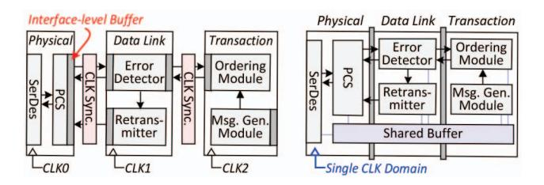

# *C. Challenges in Switchless Fabric*

Despite their benefits, MHDs face several limitations, particularly in scalability and data coherence. Architecturally, an MHD resembles multiple small memory expanders aggregated within a single device, with each head requiring a dedicated controller interface. This increases hardware complexity and consumes valuable port resources, inherently limiting the number of hosts a single device can support. The specification presents example configurations with up to four heads, which reflects the scale commonly illustrated in the standard. Practical MHDs adopting an expander-like form factor tend to implement a similar number of heads, which is generally adequate for a single compute node but not for distributed processing [57,60]. As a result, operations beyond the node still rely on RDMAbased data exchange, additional overhead.

Even within a node, important restrictions remain. Although multiple hosts can attach to the same physical device, MHDs do not support cache coherence across heads. Each head operates as an independent logical endpoint with its own *CXL.io* and *CXL.mem* stacks and a separate address space. Consequently,

- (a) PCI-derived architecture. (b) Unified architecture.

Fig. 4: Overview of PCI-derived and unified CXL controller.

memory regions managed by different heads are isolated, and accessing another head's data requires NUMA-based transactions. Even though global fabric-attached memory or dynamic capacity devices support sharable region, but coherent data sharing is not explicitly guaranteed [47]. Thus, without a coherence domain spanning heads, processors cannot share or concurrently update common data blocks.

To mitigate these restrictions, some advanced, non-standard or implementation-specific designs may embed tag-based metadata or hint information into memory transactions to enable selective sharing with custom back-invalidation support. However, such advanced mechanisms add tag-tracking and consistency-management overhead. Because an MHD connects multiple hosts to one device without an intermediate switch, architectural limits also remain: total device bandwidth is divided among active heads, reducing per-host bandwidth as the number of hosts grows. As a result, MHDs serve as a transitional design rather than a scalable option for disaggregated or shared-memory CXL fabrics.

# *C. Challenges in Switchless Fabric*

Despite their benefits, MHDs face several limitations, particularly in scalability and data coherence. Architecturally, an MHD resembles multiple small memory expanders aggregated within a single device, with each head requiring a dedicated controller interface. This increases hardware complexity and consumes valuable port resources, inherently limiting the number of hosts a single device can support. The specification presents example configurations with up to four heads, which reflects the scale commonly illustrated in the standard. Practical MHDs adopting an expander-like form factor tend to implement a similar number of heads, which is generally adequate for a single compute node but not for distributed processing [57,60]. As a result, operations beyond the node still rely on RDMAbased data exchange, additional overhead.

Even within a node, important restrictions remain. Although multiple hosts can attach to the same physical device, MHDs do not support cache coherence across heads. Each head operates as an independent logical endpoint with its own *CXL.io* and *CXL.mem* stacks and a separate address space. Consequently,

- (a) PCI-derived architecture. (b) Unified architecture.

Fig. 4: Overview of PCI-derived and unified CXL controller.

memory regions managed by different heads are isolated, and accessing another head's data requires NUMA-based transactions. Even though global fabric-attached memory or dynamic capacity devices support sharable region, but coherent data sharing is not explicitly guaranteed [47]. Thus, without a coherence domain spanning heads, processors cannot share or concurrently update common data blocks.

To mitigate these restrictions, some advanced, non-standard or implementation-specific designs may embed tag-based metadata or hint information into memory transactions to enable selective sharing with custom back-invalidation support. However, such advanced mechanisms add tag-tracking and consistency-management overhead. Because an MHD connects multiple hosts to one device without an intermediate switch, architectural limits also remain: total device bandwidth is divided among active heads, reducing per-host bandwidth as the number of hosts grows. As a result, MHDs serve as a transitional design rather than a scalable option for disaggregated or shared-memory CXL fabrics.

