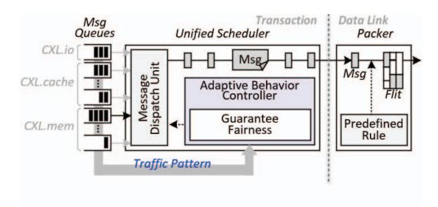

# IV. UNIFIED LOW-LATENCY CXL CONTROLLER

Figures 4a and 4b provide a high-level comparison between a conventional PCIe-derived controller and the proposed unified CXL controller. A conventional controller consists of three layers: the physical layer, comprising the SerDes and the *Physical Coding Sublayer* (PCS); the data link layer, ensuring reliable transfer through error detection and retransmission; and the transaction layer, which generates protocol messages, manages ordering, and governs end-to-end data flow.

Unlike this modular PCIe-based structure, the proposed controller integrates these layers into a unified pipeline with a shared latency target. As shown in Figure 4b, the design minimizes layer boundaries and employs shared buffering and a unified timing path to remove interface-level staging and clock synchronization overhead. Operating all layers within a single clock domain reduces timing dependencies and ensures uniform propagation delay throughout the pipeline.

#### *A. Physical Layer Rearchitecture*

The physical layer forms the base of the transmission path and determines the lower bound of link latency. Highspeed signaling requires encoding, clock recovery, and buffer management, and inefficiencies in these operations accumulate into tens of nanoseconds. To reduce this structural overhead,

- (a) Half-full design. (b) Nominal-empty design.

Fig. 5: Rearchitecting the PCS for latency optimization.

the proposed controller incorporates several latency-oriented refinements within PCS while preserving its core architecture.

Figures 5a and 5b show a representative difference between conventional PCIe-derived PCS and the proposed designs. Traditional PCIe controllers use half-full elastic buffers to manage asynchronous transmitter-receiver clocks (Figure 5a), adding fixed staging even when data is ready and introducing idle cycles that accumulate delay across transactions.

As an example of the broader optimization strategy, the proposed controller adopts a nominal-empty elastic buffer design (Figure 5b). In this scheme, an empty buffer is treated as a valid state, enabling real-time clock alignment and eliminating unnecessary intermediate staging. This reduces average latency by 15∼20 ns, which account for a substantial portion of the controller-level improvement.

Additional latency reduction is achieved through selective optimization of the *Forward Error Correction* (FEC [61-63]) process. When link quality is sufficiently high, as in high signal-to-noise ratio environments [64-66], a bypass mode minimizes decode latency while maintaining link integrity. These mechanisms allow the physical layer to sustain signal robustness while significantly reducing data-path delay, forming the foundation for low-latency end-to-end operation.

#### *B. Data Link Layer Streamlining*

The data link layer is responsible for reliable packet delivery above the physical layer. Error handling in conventional PCIe-derived designs typically incurs additional buffering and handshake cycles, increasing latency under load. PCIe-based controllers commonly employ fixed-size flits composed of multiple smaller segments, which preserve link integrity but

- (a) Structural difference. (b) End-to-end transmission timeline.

Fig. 6: Latency-oriented 256-byte flit design.

Fig. 7: Unified scheduler for continuous data packing.

introduce additional pipeline stages and control overhead, affecting performance under bursty or sustained traffic.

To address these, the proposed controller refines the flit and pipeline structures to reduce per-hop overhead while maintaining reliability. By adopting a larger 256B flit format that reduces header and control overhead (Figure 6a), the frame layout is organized to permit early validation of partial data units (Figure 6b). This early-release mechanism allows the receiver to process validated data without waiting for full-frame arrival, shortening the transmission and pipeline latency.

Additional timing improvements are achieved through targeted optimizations within the CRC computation and validation path, allowing more predictable lane-level timing behavior without altering the error coverage model. These refinements collectively enable the link layer to stream validated data upward rather than behaving as a passive reliability stage.

Silicon measurements in a 4 nm process show that the streamlined link layer improves per-lane timing margins and reduces average latency by 5∼10 ns compared with conventional 256B flit implementations. The resulting design preserves end-to-end correctness while supporting deterministic, low-latency operation across diverse traffic conditions.

# IV. UNIFIED LOW-LATENCY CXL CONTROLLER

Figures 4a and 4b provide a high-level comparison between a conventional PCIe-derived controller and the proposed unified CXL controller. A conventional controller consists of three layers: the physical layer, comprising the SerDes and the *Physical Coding Sublayer* (PCS); the data link layer, ensuring reliable transfer through error detection and retransmission; and the transaction layer, which generates protocol messages, manages ordering, and governs end-to-end data flow.

Unlike this modular PCIe-based structure, the proposed controller integrates these layers into a unified pipeline with a shared latency target. As shown in Figure 4b, the design minimizes layer boundaries and employs shared buffering and a unified timing path to remove interface-level staging and clock synchronization overhead. Operating all layers within a single clock domain reduces timing dependencies and ensures uniform propagation delay throughout the pipeline.

#### *A. Physical Layer Rearchitecture*

The physical layer forms the base of the transmission path and determines the lower bound of link latency. Highspeed signaling requires encoding, clock recovery, and buffer management, and inefficiencies in these operations accumulate into tens of nanoseconds. To reduce this structural overhead,

- (a) Half-full design. (b) Nominal-empty design.

Fig. 5: Rearchitecting the PCS for latency optimization.

the proposed controller incorporates several latency-oriented refinements within PCS while preserving its core architecture.

Figures 5a and 5b show a representative difference between conventional PCIe-derived PCS and the proposed designs. Traditional PCIe controllers use half-full elastic buffers to manage asynchronous transmitter-receiver clocks (Figure 5a), adding fixed staging even when data is ready and introducing idle cycles that accumulate delay across transactions.

As an example of the broader optimization strategy, the proposed controller adopts a nominal-empty elastic buffer design (Figure 5b). In this scheme, an empty buffer is treated as a valid state, enabling real-time clock alignment and eliminating unnecessary intermediate staging. This reduces average latency by 15∼20 ns, which account for a substantial portion of the controller-level improvement.

Additional latency reduction is achieved through selective optimization of the *Forward Error Correction* (FEC [61-63]) process. When link quality is sufficiently high, as in high signal-to-noise ratio environments [64-66], a bypass mode minimizes decode latency while maintaining link integrity. These mechanisms allow the physical layer to sustain signal robustness while significantly reducing data-path delay, forming the foundation for low-latency end-to-end operation.

#### *B. Data Link Layer Streamlining*

The data link layer is responsible for reliable packet delivery above the physical layer. Error handling in conventional PCIe-derived designs typically incurs additional buffering and handshake cycles, increasing latency under load. PCIe-based controllers commonly employ fixed-size flits composed of multiple smaller segments, which preserve link integrity but

- (a) Structural difference. (b) End-to-end transmission timeline.

Fig. 6: Latency-oriented 256-byte flit design.

Fig. 7: Unified scheduler for continuous data packing.

introduce additional pipeline stages and control overhead, affecting performance under bursty or sustained traffic.

To address these, the proposed controller refines the flit and pipeline structures to reduce per-hop overhead while maintaining reliability. By adopting a larger 256B flit format that reduces header and control overhead (Figure 6a), the frame layout is organized to permit early validation of partial data units (Figure 6b). This early-release mechanism allows the receiver to process validated data without waiting for full-frame arrival, shortening the transmission and pipeline latency.

Additional timing improvements are achieved through targeted optimizations within the CRC computation and validation path, allowing more predictable lane-level timing behavior without altering the error coverage model. These refinements collectively enable the link layer to stream validated data upward rather than behaving as a passive reliability stage.

Silicon measurements in a 4 nm process show that the streamlined link layer improves per-lane timing margins and reduces average latency by 5∼10 ns compared with conventional 256B flit implementations. The resulting design preserves end-to-end correctness while supporting deterministic, low-latency operation across diverse traffic conditions.

