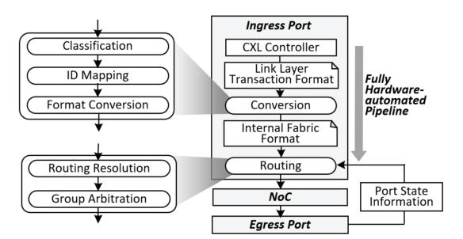
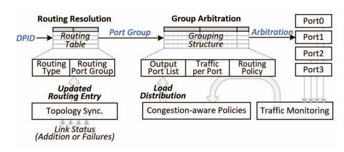

# V. END-TO-END HARDWARE FLOW OF THE AUTOMATED CONVERSION AND ROUTING PIPELINE

The CXL switch integrates a hardware-driven conversion and routing pipeline that connects the controller to CPUs, GPUs, memory expanders, and other switches. Protocol conversion, coherency handling, transaction control, and routing are performed entirely in hardware, without relying on firmwaremanaged paths. By executing these functions in structured and

Fig. 9: Overview of hardware-automated pipeline.

timing-predictable stages, the switch maintains deterministic behavior across ports and fabric hops.

Each ingress port includes a hardware pipeline that adapts incoming link-layer transactions from the controller into the internal fabric format. Messages are interpreted according to protocol type and destination information and then transformed into a representation suitable for forwarding within the switch. Figure 9 shows the overall organization of this automated conversion and routing pipeline, which sustains continuous line-rate operation and preserves protocol transparency across heterogeneous devices.

#### *A. Hardware-Based HBR-PBR Translation*

Unlike PCIe-based hierarchical routing, which relies on host-controlled topology, the proposed switch performs HBRto-PBR translation directly in hardware. As shown in Figure 10, each ingress message is interpreted by a hardware classifier that determines whether it originates from an HBR or PBR domain. For HBR traffic, the conversion logic derives the necessary routing identifiers and consults an on-chip routing structure to obtain the appropriate *Source Port ID* (SPID) and *Destination Port ID* (DPID). The packet is then reformatted into the internal PBR representation for fabric-level forwarding. These operations are implemented as a pipelined hardware sequence, providing predictable low latency while maintaining protocol correctness.

The translation pipeline overlaps classification, identifier mapping, and format conversion so that rebuilt packets enter the routing stage with consistent ordering metadata, ensuring protocol transparency across heterogeneous CXL environments. In the reverse direction, packets destined for HBR domains are mapped back to PCIe-compatible identifiers through a

Fig. 10: Hardware-automated protocol conversion.

Fig. 11: Hardware-automated protocol routing.

deterministic lookup of stored topology information. This bidirectional conversion preserves compatibility with legacy hosts while maintaining the timing behaviors required for lowlatency port-based routing.

# V. END-TO-END HARDWARE FLOW OF THE AUTOMATED CONVERSION AND ROUTING PIPELINE

The CXL switch integrates a hardware-driven conversion and routing pipeline that connects the controller to CPUs, GPUs, memory expanders, and other switches. Protocol conversion, coherency handling, transaction control, and routing are performed entirely in hardware, without relying on firmwaremanaged paths. By executing these functions in structured and

Fig. 9: Overview of hardware-automated pipeline.

timing-predictable stages, the switch maintains deterministic behavior across ports and fabric hops.

Each ingress port includes a hardware pipeline that adapts incoming link-layer transactions from the controller into the internal fabric format. Messages are interpreted according to protocol type and destination information and then transformed into a representation suitable for forwarding within the switch. Figure 9 shows the overall organization of this automated conversion and routing pipeline, which sustains continuous line-rate operation and preserves protocol transparency across heterogeneous devices.

#### *A. Hardware-Based HBR-PBR Translation*

Unlike PCIe-based hierarchical routing, which relies on host-controlled topology, the proposed switch performs HBRto-PBR translation directly in hardware. As shown in Figure 10, each ingress message is interpreted by a hardware classifier that determines whether it originates from an HBR or PBR domain. For HBR traffic, the conversion logic derives the necessary routing identifiers and consults an on-chip routing structure to obtain the appropriate *Source Port ID* (SPID) and *Destination Port ID* (DPID). The packet is then reformatted into the internal PBR representation for fabric-level forwarding. These operations are implemented as a pipelined hardware sequence, providing predictable low latency while maintaining protocol correctness.

The translation pipeline overlaps classification, identifier mapping, and format conversion so that rebuilt packets enter the routing stage with consistent ordering metadata, ensuring protocol transparency across heterogeneous CXL environments. In the reverse direction, packets destined for HBR domains are mapped back to PCIe-compatible identifiers through a

Fig. 10: Hardware-automated protocol conversion.

Fig. 11: Hardware-automated protocol routing.

deterministic lookup of stored topology information. This bidirectional conversion preserves compatibility with legacy hosts while maintaining the timing behaviors required for lowlatency port-based routing.

