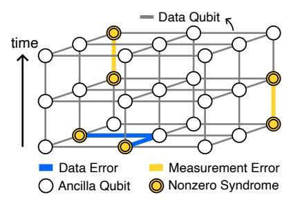

# *B. Superconductor electronics*

Beyond qubits, superconductors can be employed for classical computation. Their switching element, the Josephson junction (JJ), exhibits switching latencies on the order of 1 ps while consuming 0.2 aJ in energy while operating at 4 K. Traditional logic families, such as rapid single flux quantum (RSFQ) [39] and its variants [33], provide a range of clocked logic gates based on JJs. Alternatives such as alternating SFQ (xSFQ) [69] and dynamic SFQ (DSFQ) [56] remove the clock from gate semantics, through data-encoding or circuit modifications, enabling greater architectural flexibility.

Fig. 3. Decoding graph of surface codes in three dimensions. Highlighted nodes signify nonzero syndromes, highlighted horizontal edges denote data qubit errors, and highlighted vertical edges indicate measurement errors. Data errors result in nonzero syndromes in the initial measurement round, whereas measurement errors produce nonzero syndromes in consecutive rounds.

On the memory side, implementations with sequential readout are generally preferred when possible, due to their lower controller complexity and reduced fanout cost. A baseline implementation of such storage is the circular shift register, which has been experimentally demonstrated to operate at 16 GHz with bit-error rates below 10−10 [26]. Another type of circular storage structure with reduced energy and hardware requirements can be constructed with passive transmission lines (PTLs) [75]. In Section VI-B, we present fabrication results that complement prior publications, demonstrating correct functionality at 33 GHz.

The following articles cover the technology fundamentals and superconductor fabrication capabilities in more detail [29], [50]. The IEEE IRDS report summarizes recent advances [28].

# *B. Superconductor electronics*

Beyond qubits, superconductors can be employed for classical computation. Their switching element, the Josephson junction (JJ), exhibits switching latencies on the order of 1 ps while consuming 0.2 aJ in energy while operating at 4 K. Traditional logic families, such as rapid single flux quantum (RSFQ) [39] and its variants [33], provide a range of clocked logic gates based on JJs. Alternatives such as alternating SFQ (xSFQ) [69] and dynamic SFQ (DSFQ) [56] remove the clock from gate semantics, through data-encoding or circuit modifications, enabling greater architectural flexibility.

Fig. 3. Decoding graph of surface codes in three dimensions. Highlighted nodes signify nonzero syndromes, highlighted horizontal edges denote data qubit errors, and highlighted vertical edges indicate measurement errors. Data errors result in nonzero syndromes in the initial measurement round, whereas measurement errors produce nonzero syndromes in consecutive rounds.

On the memory side, implementations with sequential readout are generally preferred when possible, due to their lower controller complexity and reduced fanout cost. A baseline implementation of such storage is the circular shift register, which has been experimentally demonstrated to operate at 16 GHz with bit-error rates below 10−10 [26]. Another type of circular storage structure with reduced energy and hardware requirements can be constructed with passive transmission lines (PTLs) [75]. In Section VI-B, we present fabrication results that complement prior publications, demonstrating correct functionality at 33 GHz.

The following articles cover the technology fundamentals and superconductor fabrication capabilities in more detail [29], [50]. The IEEE IRDS report summarizes recent advances [28].

