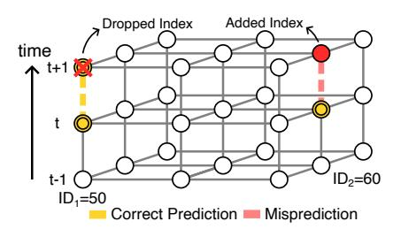

# *B. Temporal nonzero syndrome clusters*

Isolated nonzero syndromes can result from either single measurement errors or error chains. Distinguishing between the two requires temporal analysis (Section II-A). In this section, we focus on compressing temporal clusters. Similar to Section IV-A, the objective is to minimize the number of communicated nonzero syndrome indices.

A naive approach would mimic the spatial clustering discussed earlier, storing the first index with opcode 0 and waiting for the next measurement round to determine whether it belongs to a measurement error. However, this would introduce a latency penalty of one measurement round, akin to hierarchical decoders. Instead, IcePack exploits the fact that measurement errors are statistically much more common than error chains (when a new opcode 0 appears, the next round is likely to contain another opcode 0 at the same position, forming a measurement error pair) [15]. A single index is used for the pair and speculatively communicated

Fig. 6. Isolated nonzero syndromes (opcode = 0) are more likely to result from measurement errors rather than being part of an error chain. Based on this, we predict that both highlighted nonzero syndromes at round t are caused by measurement errors. The first prediction (ID1=50) is confirmed at t + 1; the second (ID2=60) lacks a repeat, so we flag it by encoding an additional index with a 0 opcode.

Fig. 7. Adding temporal compression (squares) to spatial compression (rhombuses) increases nonzero syndrome index reduction from 32–35% to 51–55% (a 1.6× improvement) for error rates of 0.01% and 0.1%. At higher physical error rates, like 1%, the index reduction rises to 41–44% (a 1.3× increase). This boost is constrained by the higher rate of error chains, which leads to more mispredictions. Existing methods like AFS ignore nonzero syndromes, yielding an index-reduction rate of 0.0.

upon prediction, avoiding the additional measurement-cycle latency of hierarchical decoders.

In the case of a misprediction, a straightforward correction mechanism to ensure lossless syndrome recovery applies. If the predicted second nonzero syndrome does not appear, an index is encoded at the position of the failed prediction using the same opcode 0. Because the decoder infers a nonzero syndrome at this position when no index is received, the explicit receipt of an index signals the absence of the syndrome. Misprediction only increases the transmitted data by a single index, without affecting decoding accuracy or latency.

Figure 6 illustrates our temporal clustering with a simple example. Suppose two opcode 0 (isolated) syndromes appear at measurement round t: one at ID1 = 50 and another at ID2 = 60. In both cases, it predicts that a matching syndrome will appear at the same location in round t + 1. In the first case, the prediction is correct and the index at ID1 = 50 (round t + 1) gets dropped. In the second case, the prediction is incorrect; thus, an opcode 0 and the respective index are added for ID2 = 60 (round t + 1) to indicate the misprediction.

To quantify this method's effectiveness, the results in Figure 5 were revisited. Simulations were rerun under the same assumptions, with updated results summarized in Figure 7. When compressing temporal clusters, the reduction in nonzero syndrome indices improved from 32-35% to 51–55% (1.6×) for physical error rates between 0.1% and 0.01%. At a 1% error rate, the reduction rose from 32–34% to 41–44% (1.3×), limited by the higher frequency of error chains.

# *B. Temporal nonzero syndrome clusters*

Isolated nonzero syndromes can result from either single measurement errors or error chains. Distinguishing between the two requires temporal analysis (Section II-A). In this section, we focus on compressing temporal clusters. Similar to Section IV-A, the objective is to minimize the number of communicated nonzero syndrome indices.

A naive approach would mimic the spatial clustering discussed earlier, storing the first index with opcode 0 and waiting for the next measurement round to determine whether it belongs to a measurement error. However, this would introduce a latency penalty of one measurement round, akin to hierarchical decoders. Instead, IcePack exploits the fact that measurement errors are statistically much more common than error chains (when a new opcode 0 appears, the next round is likely to contain another opcode 0 at the same position, forming a measurement error pair) [15]. A single index is used for the pair and speculatively communicated

Fig. 6. Isolated nonzero syndromes (opcode = 0) are more likely to result from measurement errors rather than being part of an error chain. Based on this, we predict that both highlighted nonzero syndromes at round t are caused by measurement errors. The first prediction (ID1=50) is confirmed at t + 1; the second (ID2=60) lacks a repeat, so we flag it by encoding an additional index with a 0 opcode.

Fig. 7. Adding temporal compression (squares) to spatial compression (rhombuses) increases nonzero syndrome index reduction from 32–35% to 51–55% (a 1.6× improvement) for error rates of 0.01% and 0.1%. At higher physical error rates, like 1%, the index reduction rises to 41–44% (a 1.3× increase). This boost is constrained by the higher rate of error chains, which leads to more mispredictions. Existing methods like AFS ignore nonzero syndromes, yielding an index-reduction rate of 0.0.

upon prediction, avoiding the additional measurement-cycle latency of hierarchical decoders.

In the case of a misprediction, a straightforward correction mechanism to ensure lossless syndrome recovery applies. If the predicted second nonzero syndrome does not appear, an index is encoded at the position of the failed prediction using the same opcode 0. Because the decoder infers a nonzero syndrome at this position when no index is received, the explicit receipt of an index signals the absence of the syndrome. Misprediction only increases the transmitted data by a single index, without affecting decoding accuracy or latency.

Figure 6 illustrates our temporal clustering with a simple example. Suppose two opcode 0 (isolated) syndromes appear at measurement round t: one at ID1 = 50 and another at ID2 = 60. In both cases, it predicts that a matching syndrome will appear at the same location in round t + 1. In the first case, the prediction is correct and the index at ID1 = 50 (round t + 1) gets dropped. In the second case, the prediction is incorrect; thus, an opcode 0 and the respective index are added for ID2 = 60 (round t + 1) to indicate the misprediction.

To quantify this method's effectiveness, the results in Figure 5 were revisited. Simulations were rerun under the same assumptions, with updated results summarized in Figure 7. When compressing temporal clusters, the reduction in nonzero syndrome indices improved from 32-35% to 51–55% (1.6×) for physical error rates between 0.1% and 0.01%. At a 1% error rate, the reduction rose from 32–34% to 41–44% (1.3×), limited by the higher frequency of error chains.

