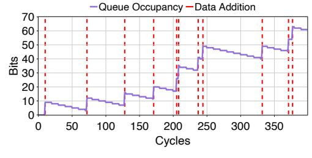

# *C. Error cluster index encoding*

The above two methods reduce the count of nonzero syndrome indices to transmit; here we focus on minimizing the bits needed to encode them. The proposed encoding approach is independent of earlier compression steps, but the removal of spatial and temporal correlations in those steps yields a more favorable distribution—one that closely mirrors the independent and identically distributed (IID) physical errors with fixed probability p, i.e., a Bernoulli process.

Fig. 8. With Rice-Golomb encoding (RGE, circles), total transmitted bits for 1,000 logical qubits drop by 2.4–4× compared to AFS. Without RGE (No RGE, squares), the savings come solely from spatial and temporal compression. Reductions in bit count saturate at d = 17; we restrict the analysis to d ≤ 21 so simulated syndromes remain under one million.

The geometric distribution of gaps between nonzero syndrome indices in this Bernoulli process is well suited to Golomb coding [23]. In Golomb codes, a parameter m, optimally selected based on the error probability p, encodes each gap value n in two parts: (1) a quotient q = ⌊n/m⌋ and (2) a remainder r = n mod m. The quotient is represented in unary (q ones followed by a zero) and the remainder is represented in truncated binary (log2 (m) bits).

Golomb coding can be illustrated with an example. For m = 4, consider a gap of 11 between two error indices (ID1 = 632, ID2 = 643) in a stream of 1,000 events. Without Golomb coding, representing the second index requires log2 (1, 000) ≈ 10 bits. Using Golomb coding, the gap 11 is encoded with quotient q = 2 and remainder r = 3; the quotient in unary is 3'b110 and the remainder in binary is 2'b11, yielding a 5-bit code 5'b11011, halving the bit requirement.

In our evaluation, we opt for Rice-Golomb encoding (RGE) [55] over the original Golomb codes. In RGE, m is restricted to powers of 2 (m = 2k ), which trades off theoretical optimality for hardware simplicity. The quotient-remainder division becomes a simple bit-shifting operation. We apply RGE collectively across all logical qubits, as the error statistics do not differentiate between logical qubits.

Figure 8 presents final results, showing a 2.4−4× reduction in bit count compared to AFS's leading sparse representation, corresponding to up to a 300× reduction relative to uncompressed digital readout, which itself exceeds the efficiency of current RF implementations. RGE has the strongest impact at p = 1%. At p = 0.01%, its contribution is smaller than

TABLE II DATA-REDUCTION BREAKDOWN OF SPATIAL AND TEMPORAL CLUSTERING VS. RICE–GOLOMB ENCODING (RGE) ACROSS ERROR RATES FOR d = 21. RESULTS NORMALIZED TO AFS.

| Error rate | Clustering | RGE   | Total |  |
|------------|------------|-------|-------|--|
| 10−4       | 1.99×      | 1.40× | 2.79× |  |
| 10−3       | 1.94×      | 1.78× | 3.45× |  |
| 10−2       | 1.61×      | 2.50× | 4.03× |  |

Fig. 9. IcePack processing unit (PU) consisting of a spatial clustering unit (SCU) and a temporal clustering unit (TCU). The SCU receives a sequential bitstream of syndromes as input. Highlighted indices are detailed in Figure 11. Row buffers generate a sliding search window over the surface code lattice for spatial pattern recognition. SCU's output is a 3-bit vector: 2-bit opcode and 1-bit for valid indication. The TCU processes the SCU's outputs alongside a stream of predictions from the previous round to generate index/opcode entries for the queue and predictions for the next round of measurements.

that of clustering, as shown in Table II. This happens because nonzero syndrome sparsity depends on the physical error rate, which can vary by two orders of magnitude across qubit implementations.

#### V. ICEPACK: ARCHITECTURE

This section describes the implementation of the compression methods from Section IV in digital superconducting hardware. The objective is to develop an architecture that (a) allows the compressed syndromes to be transmitted to the decoder within the same measurement cycle and (b) is lightweight enough for manufacturability using existing and near-term fabrication processes [24], [67], while preserving as much resource and thermal budget as possible for other functionalities that are required at the 4 K layer. Figure 9 shows an overview of the proposed design.

## A. Processing

We first argue for a streaming microarchitecture over fully parallel designs such as NISQ+ [27], QECOOL [71], and Clique [54], and then present implementations for the three compression methods introduced in Section IV, which exploit SFQ's high-speed gates and low-attenuation interconnects.

1) Parallel vs. Streaming: SFQ circuits routinely operate at tens of GHz [19], whereas 4 K-to-300 K cables typically transmit data at 1 Gb/s [36], [70]. A fully parallel implementation would minimize processing delay, but the benefit

Fig. 10. Queue occupancy over processing cycles, with index entry times marked by vertical red lines. The queue is written sporadically at index granularity by the processing unit and read continuously at bit granularity. Because the input rate exceeds the output rate, the queue always contains data to transmit. A physical error rate of 1% is assumed for the shown simulations.

Fig. 11. Panel (a): Syndrome values are read serially from a two-dimensional lattice in row-major order, providing inputs to the SCU. Nonzero syndromes appear at indices 42, 45, and 51. Indices 42 and 51 form a vertical pair, leading the SCU to return OP=2'b10 (opcode) and V=1'b1 (valid bit, indicating a successful match). The syndrome at index 45 is isolated, so the SCU returns OP=2'b00 and V=1'b1. Panel (b): Truth table defining the SCU logic over the syndrome values within the five ancilla qubit search window. The output consists of a valid bit and a 2-bit opcode. Panel (c): Truth table defining the TCU logic.  $V_{in}$  and  $OP_{in}$  represent the SCU's outputs.  $P_{in}$  is the prediction from the previous round, and  $V_o$  is the predicted value for the next round.  $V_o$  and  $OP_o$  denote the updated valid and opcode values for this index. When the prediction is correct, the index is discarded.

to total system delay is negligible—the cable's serialization bottleneck dominates, making the hardware cost of parallelism far outweigh any benefit. For instance, parallel designs with dedicated hardware per physical qubit complete processing in under 0.3 ns [54], yet assume  $1~\mu s$  serialization time.

We propose a streaming microarchitecture. Our motivation is twofold: to reduce hardware by eliminating parallel processing units and to shrink queue size by changing from parallel-write/serial-read to serial-write/serial-read. The latency overhead of streaming is minimal (see Section V-B1), as the processing time is hidden by the longer serialization latency. Longer pipelines, such as those in RSFQ implementations, are advantageous for maximizing throughput.

Figure 10 illustrates how processing-syndrome transmission pipelining operates. To prevent transmission stalls (e.g., pipeline bubbles), it is sufficient that the queue does not become empty before new data is loaded. Note that although input data entry times are irregular due to the unpredictable occurrence of nonzero syndromes, the queue consistently

maintains buffered data to transmit.

2) Spatial Compression Implementation: The internal pipeline in an IcePack processing unit (PU) consists of a spatial clustering unit (SCU) and a temporal clustering unit (TCU), as depicted in Figure 9. The SCU, discussed here, sequentially receives a bitstream of syndrome indices in row-major order. In this representation, positional relationships in the two-dimensional lattice are mapped onto the temporal domain. For example, the ancilla qubit to the right of the current index (conceptually forming a horizontal pair pattern, see Figure 4) is sampled in the next clock cycle, while the one below it (forming a vertical pair pattern) is sampled after a delay of 2d-1 cycles, where d is the surface code distance. Figure 11a provides a visualization.

The input bitstream is buffered with fixed delays to create a temporal search window, resembling the operation of streaming cellular automata machines, such as CAM8 [41]. A straightforward way to implement fixed delays is through a shift register with readout taps positioned according to the desired offsets, based on the search window structure (group of five ancilla qubits, superset of our four spatial patterns, highlighted in orange in Figure 11). This implementation is well-suited for SFQ technology, where shift registers are among the most well-studied circuit designs [45]. An alternative to shift registers is passive transmission lines (PTLs), which serve as analog delay elements that can be synchronized through read/write control signals. If composed of high kinetic inductance, PTLs exhibit extremely high delay per unit length, which enables high data density [75].

From a logical perspective, only a combinational circuit is required to implement the truth table shown in Figure 11b. This circuit checks the syndrome bits within the search window to identify any of the patterns in Figure 4. The output is one of four associated opcodes (OP): 3 for cross, 2 for vertical pair, 1 for horizontal pair, and 0 for isolated syndrome. A separate valid bit (V) is used to indicate the presence of a match. In case of a successful match, the input bits associated with the match are cleared from the row buffer. False positives may arise in edge cases where nonzero syndromes appear at opposite boundaries of the lattice. These false positives are losslessly reversed during decompression, without requiring support at the compression stage (detailed in Section VI). Additionally, they do not require extra bits for encoding compared to correctly detected boundary cases; thus, they do not affect the compression rate.

3) Temporal Compression Implementation: The temporal clustering unit (TCU) processes the SCU's output data  $(V_{in}, OP_{in})$  together with a stream of predictions from the previous round  $(P_{in})$  to update valid and opcode values  $(V_o, OP_o)$  by dropping correctly predicted indices and adding mispredicted ones, while generating new predictions  $(P_o)$ .

When  $P_{in}=0$ , the TCU sets  $P_o=1$  for a valid isolated nonzero syndrome ( $V_{in}=1,\ OP_{in}=0$ ). If  $P_{in}=1$ , the TCU either drops the corresponding syndrome index ( $V_o=0$ ) if the prediction succeeds ( $V_{in}=1,\ OP_{in}=0$ ) or inserts a

Fig. 12. An IcePack PPU consists of K block units (BUs), each using a DRO cell to detect if all incoming syndrome bits are zero and skip the block if so. The priority selector activates the remaining blocks sequentially from left to right, with an NDRO cell masking data from unselected blocks.

new one  $(V_o=1,\,OP_o=0)$  if the prediction fails  $(V_{in}=0)$ . Predictions for multi-syndrome clusters  $(OP_{in}\in[1,3])$  are ignored to prevent data loss. Figure 11c summarizes this.

The TCU tracks the bitstream's running index by sampling a shared counter and entering both the index and opcode into the queue whenever a valid index is encountered. Figure 9 illustrates an example where V=1 and OP=0 appears at index 45 in round t-1, triggering a prediction, marked by 1'b1 in the previous prediction stream. In round t, the SCU returns V=1 and OP=0 for the same index, confirming the prediction according to the TCU logic, which invalidates the entry by excluding its index and opcode from the queue.

The final TCU component to discuss is memory. For its implementation, similar structures to those used for SCU's row buffers can be applied. However, in the SCU, the delay corresponds to the time between two subsequent indices within the same measurement round, whereas in the TCU, the delay for predictions is equal to the longer measurement round duration. To avoid excessively long shift registers or feedforward PTLs, we use PTL-based circular delay structures, interfaced to with a simple controller. Our experimentally-verified prototype (Section VI-B) demonstrates the feasibility of this approach and complements prior theoretical studies [75].

## B. Preprocessing

The preprocessing unit (PPU) receives newly generated syndrome data from raw qubit measurements and streams them to the PU. We introduce all-zero block filtering, which partitions the syndrome bitstream into blocks and discards those containing only zeros. By doing so, it reduces the number of bits processed serially, accelerates queue filling, and prevents pipeline bubbles (as discussed in Section V-A1).

We implement this using a single destructive readout (DRO) cell, functionally equivalent to a D flip-flop, per block as a filter. All syndrome bits in a block are serially sent to its data port. If any bit is nonzero, the DRO gets loaded; otherwise,

it remains unloaded. At the end of the block, an end-of-block (EOB) signal clocks the DRO. A loaded DRO outputs 1'b1, indicating the block should not be skipped, while an unloaded DRO outputs 1'b0, allowing the block to be safely skipped. Figure 12 provides an illustration.

The PPU includes one block unit (BU) for each block. Within each BU, the incoming syndrome data are stored in a sequential memory, implemented using PTLs as delay mediums [75]. These memories are read in ascending order of nonzero blocks, facilitated by a shared priority selector (which chooses the block to read), a non-destructive readout (NDRO) cell per BU (acting as a filter similar to the DRO), and a merger tree (which consolidates data from multiple inputs into a single output, analogous to an asynchronous OR-tree). The mergers' outputs are forwarded to the PU (Section V-A) for processing.

1) Block size selection: The optimal block size depends on two factors that determine nonzero syndrome indices and queue occupancy: the speed disparity between processing (producer) and cable transmission (consumer), and the physical error rate. Here, we assume a 10× difference—10 GHz operation for SFQ (a conservative estimate, compared to prior demonstrations [19], [26] and experimental results in Section VI-B) versus a 1 Gb/s stainless-steel coaxial cable [36], [70]—and consider error rates from 0.01% to 1%. The results for the 99th-percentile latencies are shown in Figure 13. For a 1% error rate, latency remains consistent across all block sizes within the tested range. For error rates below 1%, latency is stable for block sizes up to 128. Beyond this point, the indices are too sparse to keep the data buffer consistently full for transmission, resulting in pipeline bubbles.

#### C. Encoding

Golomb codes encode the gap between two indices rather than the index values themselves (Section IV-C). Accordingly, we use a subtractor circuit to compute this gap. To extract the quotient  $(q = \lfloor n/2^k \rfloor = n \gg k)$ , as simplified in the Rice-Golomb variant) and remainder  $(r = n \mod 2^k = n[k:0])$ , a hardwired bit shift suffices, incurring no hardware cost. A counter is used to convert the quotient from binary to unary.

# *C. Error cluster index encoding*

The above two methods reduce the count of nonzero syndrome indices to transmit; here we focus on minimizing the bits needed to encode them. The proposed encoding approach is independent of earlier compression steps, but the removal of spatial and temporal correlations in those steps yields a more favorable distribution—one that closely mirrors the independent and identically distributed (IID) physical errors with fixed probability p, i.e., a Bernoulli process.

Fig. 8. With Rice-Golomb encoding (RGE, circles), total transmitted bits for 1,000 logical qubits drop by 2.4–4× compared to AFS. Without RGE (No RGE, squares), the savings come solely from spatial and temporal compression. Reductions in bit count saturate at d = 17; we restrict the analysis to d ≤ 21 so simulated syndromes remain under one million.

The geometric distribution of gaps between nonzero syndrome indices in this Bernoulli process is well suited to Golomb coding [23]. In Golomb codes, a parameter m, optimally selected based on the error probability p, encodes each gap value n in two parts: (1) a quotient q = ⌊n/m⌋ and (2) a remainder r = n mod m. The quotient is represented in unary (q ones followed by a zero) and the remainder is represented in truncated binary (log2 (m) bits).

Golomb coding can be illustrated with an example. For m = 4, consider a gap of 11 between two error indices (ID1 = 632, ID2 = 643) in a stream of 1,000 events. Without Golomb coding, representing the second index requires log2 (1, 000) ≈ 10 bits. Using Golomb coding, the gap 11 is encoded with quotient q = 2 and remainder r = 3; the quotient in unary is 3'b110 and the remainder in binary is 2'b11, yielding a 5-bit code 5'b11011, halving the bit requirement.

In our evaluation, we opt for Rice-Golomb encoding (RGE) [55] over the original Golomb codes. In RGE, m is restricted to powers of 2 (m = 2k ), which trades off theoretical optimality for hardware simplicity. The quotient-remainder division becomes a simple bit-shifting operation. We apply RGE collectively across all logical qubits, as the error statistics do not differentiate between logical qubits.

Figure 8 presents final results, showing a 2.4−4× reduction in bit count compared to AFS's leading sparse representation, corresponding to up to a 300× reduction relative to uncompressed digital readout, which itself exceeds the efficiency of current RF implementations. RGE has the strongest impact at p = 1%. At p = 0.01%, its contribution is smaller than

TABLE II DATA-REDUCTION BREAKDOWN OF SPATIAL AND TEMPORAL CLUSTERING VS. RICE–GOLOMB ENCODING (RGE) ACROSS ERROR RATES FOR d = 21. RESULTS NORMALIZED TO AFS.

| Error rate | Clustering | RGE   | Total |  |
|------------|------------|-------|-------|--|
| 10−4       | 1.99×      | 1.40× | 2.79× |  |
| 10−3       | 1.94×      | 1.78× | 3.45× |  |
| 10−2       | 1.61×      | 2.50× | 4.03× |  |

Fig. 9. IcePack processing unit (PU) consisting of a spatial clustering unit (SCU) and a temporal clustering unit (TCU). The SCU receives a sequential bitstream of syndromes as input. Highlighted indices are detailed in Figure 11. Row buffers generate a sliding search window over the surface code lattice for spatial pattern recognition. SCU's output is a 3-bit vector: 2-bit opcode and 1-bit for valid indication. The TCU processes the SCU's outputs alongside a stream of predictions from the previous round to generate index/opcode entries for the queue and predictions for the next round of measurements.

that of clustering, as shown in Table II. This happens because nonzero syndrome sparsity depends on the physical error rate, which can vary by two orders of magnitude across qubit implementations.

#### V. ICEPACK: ARCHITECTURE

This section describes the implementation of the compression methods from Section IV in digital superconducting hardware. The objective is to develop an architecture that (a) allows the compressed syndromes to be transmitted to the decoder within the same measurement cycle and (b) is lightweight enough for manufacturability using existing and near-term fabrication processes [24], [67], while preserving as much resource and thermal budget as possible for other functionalities that are required at the 4 K layer. Figure 9 shows an overview of the proposed design.

## A. Processing

We first argue for a streaming microarchitecture over fully parallel designs such as NISQ+ [27], QECOOL [71], and Clique [54], and then present implementations for the three compression methods introduced in Section IV, which exploit SFQ's high-speed gates and low-attenuation interconnects.

1) Parallel vs. Streaming: SFQ circuits routinely operate at tens of GHz [19], whereas 4 K-to-300 K cables typically transmit data at 1 Gb/s [36], [70]. A fully parallel implementation would minimize processing delay, but the benefit

Fig. 10. Queue occupancy over processing cycles, with index entry times marked by vertical red lines. The queue is written sporadically at index granularity by the processing unit and read continuously at bit granularity. Because the input rate exceeds the output rate, the queue always contains data to transmit. A physical error rate of 1% is assumed for the shown simulations.

Fig. 11. Panel (a): Syndrome values are read serially from a two-dimensional lattice in row-major order, providing inputs to the SCU. Nonzero syndromes appear at indices 42, 45, and 51. Indices 42 and 51 form a vertical pair, leading the SCU to return OP=2'b10 (opcode) and V=1'b1 (valid bit, indicating a successful match). The syndrome at index 45 is isolated, so the SCU returns OP=2'b00 and V=1'b1. Panel (b): Truth table defining the SCU logic over the syndrome values within the five ancilla qubit search window. The output consists of a valid bit and a 2-bit opcode. Panel (c): Truth table defining the TCU logic.  $V_{in}$  and  $OP_{in}$  represent the SCU's outputs.  $P_{in}$  is the prediction from the previous round, and  $V_o$  is the predicted value for the next round.  $V_o$  and  $OP_o$  denote the updated valid and opcode values for this index. When the prediction is correct, the index is discarded.

to total system delay is negligible—the cable's serialization bottleneck dominates, making the hardware cost of parallelism far outweigh any benefit. For instance, parallel designs with dedicated hardware per physical qubit complete processing in under 0.3 ns [54], yet assume  $1~\mu s$  serialization time.

We propose a streaming microarchitecture. Our motivation is twofold: to reduce hardware by eliminating parallel processing units and to shrink queue size by changing from parallel-write/serial-read to serial-write/serial-read. The latency overhead of streaming is minimal (see Section V-B1), as the processing time is hidden by the longer serialization latency. Longer pipelines, such as those in RSFQ implementations, are advantageous for maximizing throughput.

Figure 10 illustrates how processing-syndrome transmission pipelining operates. To prevent transmission stalls (e.g., pipeline bubbles), it is sufficient that the queue does not become empty before new data is loaded. Note that although input data entry times are irregular due to the unpredictable occurrence of nonzero syndromes, the queue consistently

maintains buffered data to transmit.

2) Spatial Compression Implementation: The internal pipeline in an IcePack processing unit (PU) consists of a spatial clustering unit (SCU) and a temporal clustering unit (TCU), as depicted in Figure 9. The SCU, discussed here, sequentially receives a bitstream of syndrome indices in row-major order. In this representation, positional relationships in the two-dimensional lattice are mapped onto the temporal domain. For example, the ancilla qubit to the right of the current index (conceptually forming a horizontal pair pattern, see Figure 4) is sampled in the next clock cycle, while the one below it (forming a vertical pair pattern) is sampled after a delay of 2d-1 cycles, where d is the surface code distance. Figure 11a provides a visualization.

The input bitstream is buffered with fixed delays to create a temporal search window, resembling the operation of streaming cellular automata machines, such as CAM8 [41]. A straightforward way to implement fixed delays is through a shift register with readout taps positioned according to the desired offsets, based on the search window structure (group of five ancilla qubits, superset of our four spatial patterns, highlighted in orange in Figure 11). This implementation is well-suited for SFQ technology, where shift registers are among the most well-studied circuit designs [45]. An alternative to shift registers is passive transmission lines (PTLs), which serve as analog delay elements that can be synchronized through read/write control signals. If composed of high kinetic inductance, PTLs exhibit extremely high delay per unit length, which enables high data density [75].

From a logical perspective, only a combinational circuit is required to implement the truth table shown in Figure 11b. This circuit checks the syndrome bits within the search window to identify any of the patterns in Figure 4. The output is one of four associated opcodes (OP): 3 for cross, 2 for vertical pair, 1 for horizontal pair, and 0 for isolated syndrome. A separate valid bit (V) is used to indicate the presence of a match. In case of a successful match, the input bits associated with the match are cleared from the row buffer. False positives may arise in edge cases where nonzero syndromes appear at opposite boundaries of the lattice. These false positives are losslessly reversed during decompression, without requiring support at the compression stage (detailed in Section VI). Additionally, they do not require extra bits for encoding compared to correctly detected boundary cases; thus, they do not affect the compression rate.

3) Temporal Compression Implementation: The temporal clustering unit (TCU) processes the SCU's output data  $(V_{in}, OP_{in})$  together with a stream of predictions from the previous round  $(P_{in})$  to update valid and opcode values  $(V_o, OP_o)$  by dropping correctly predicted indices and adding mispredicted ones, while generating new predictions  $(P_o)$ .

When  $P_{in}=0$ , the TCU sets  $P_o=1$  for a valid isolated nonzero syndrome ( $V_{in}=1,\ OP_{in}=0$ ). If  $P_{in}=1$ , the TCU either drops the corresponding syndrome index ( $V_o=0$ ) if the prediction succeeds ( $V_{in}=1,\ OP_{in}=0$ ) or inserts a

Fig. 12. An IcePack PPU consists of K block units (BUs), each using a DRO cell to detect if all incoming syndrome bits are zero and skip the block if so. The priority selector activates the remaining blocks sequentially from left to right, with an NDRO cell masking data from unselected blocks.

new one  $(V_o=1,\,OP_o=0)$  if the prediction fails  $(V_{in}=0)$ . Predictions for multi-syndrome clusters  $(OP_{in}\in[1,3])$  are ignored to prevent data loss. Figure 11c summarizes this.

The TCU tracks the bitstream's running index by sampling a shared counter and entering both the index and opcode into the queue whenever a valid index is encountered. Figure 9 illustrates an example where V=1 and OP=0 appears at index 45 in round t-1, triggering a prediction, marked by 1'b1 in the previous prediction stream. In round t, the SCU returns V=1 and OP=0 for the same index, confirming the prediction according to the TCU logic, which invalidates the entry by excluding its index and opcode from the queue.

The final TCU component to discuss is memory. For its implementation, similar structures to those used for SCU's row buffers can be applied. However, in the SCU, the delay corresponds to the time between two subsequent indices within the same measurement round, whereas in the TCU, the delay for predictions is equal to the longer measurement round duration. To avoid excessively long shift registers or feedforward PTLs, we use PTL-based circular delay structures, interfaced to with a simple controller. Our experimentally-verified prototype (Section VI-B) demonstrates the feasibility of this approach and complements prior theoretical studies [75].

## B. Preprocessing

The preprocessing unit (PPU) receives newly generated syndrome data from raw qubit measurements and streams them to the PU. We introduce all-zero block filtering, which partitions the syndrome bitstream into blocks and discards those containing only zeros. By doing so, it reduces the number of bits processed serially, accelerates queue filling, and prevents pipeline bubbles (as discussed in Section V-A1).

We implement this using a single destructive readout (DRO) cell, functionally equivalent to a D flip-flop, per block as a filter. All syndrome bits in a block are serially sent to its data port. If any bit is nonzero, the DRO gets loaded; otherwise,

it remains unloaded. At the end of the block, an end-of-block (EOB) signal clocks the DRO. A loaded DRO outputs 1'b1, indicating the block should not be skipped, while an unloaded DRO outputs 1'b0, allowing the block to be safely skipped. Figure 12 provides an illustration.

The PPU includes one block unit (BU) for each block. Within each BU, the incoming syndrome data are stored in a sequential memory, implemented using PTLs as delay mediums [75]. These memories are read in ascending order of nonzero blocks, facilitated by a shared priority selector (which chooses the block to read), a non-destructive readout (NDRO) cell per BU (acting as a filter similar to the DRO), and a merger tree (which consolidates data from multiple inputs into a single output, analogous to an asynchronous OR-tree). The mergers' outputs are forwarded to the PU (Section V-A) for processing.

1) Block size selection: The optimal block size depends on two factors that determine nonzero syndrome indices and queue occupancy: the speed disparity between processing (producer) and cable transmission (consumer), and the physical error rate. Here, we assume a 10× difference—10 GHz operation for SFQ (a conservative estimate, compared to prior demonstrations [19], [26] and experimental results in Section VI-B) versus a 1 Gb/s stainless-steel coaxial cable [36], [70]—and consider error rates from 0.01% to 1%. The results for the 99th-percentile latencies are shown in Figure 13. For a 1% error rate, latency remains consistent across all block sizes within the tested range. For error rates below 1%, latency is stable for block sizes up to 128. Beyond this point, the indices are too sparse to keep the data buffer consistently full for transmission, resulting in pipeline bubbles.

#### C. Encoding

Golomb codes encode the gap between two indices rather than the index values themselves (Section IV-C). Accordingly, we use a subtractor circuit to compute this gap. To extract the quotient  $(q = \lfloor n/2^k \rfloor = n \gg k)$ , as simplified in the Rice-Golomb variant) and remainder  $(r = n \mod 2^k = n[k:0])$ , a hardwired bit shift suffices, incurring no hardware cost. A counter is used to convert the quotient from binary to unary.

