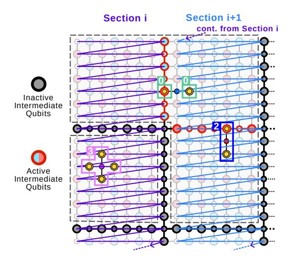

# VI. EVALUATION

#### A. Data Volume & Latency

Reductions in transmitted syndrome indices and bit count were evaluated using the QEC simulator Stim [20], employing its built-in surface code constructions for distances 11–21. For the main analysis, the phenomenological error model [15] was used, consistent with prior work. Error rates ranged from 0.01% to 1%, as in AFS and Predecoder [61]. For each distance–error rate pair, 20,000 independent runs spanning multiple measurement rounds were performed to capture measurement errors. The number of logical qubits was set to 1,000, matching the scale needed for fault-tolerant applications such as RSA factoring [21]. Results comparing IcePack to AFS [11] are shown in Figures 5, 7, and 8. AFS's syndrome compression does not handle nonzero syndromes, corresponding to an index reduction rate of 0.0 in Figures 5 and 7.

Fig. 13. Queueing analysis shows no latency dependence on block size at a 1% error rate. At 0.01%–0.1%, block sizes up to 128 bits avoid added latency; larger blocks increase latency due to sparse indices.

In summary, our spatial and temporal compression reduces transmitted syndrome indices by 41–55% compared to AFS. Combined with Rice-Golomb encoding (RGE), this lowers total transmitted bits by 2.4–4× (detailed breakdown in Table II) and up to  $300\times$  compared to a digital readout without 4 K processing. The reduction in serialization latency scales proportionally with data volume when cable count is fixed; for instance, a 500 ns serialization with IcePack would correspond to 1.2–2  $\mu s$  under AFS—beyond the 1  $\mu s$  measurement-round limit. Section VI-B3 discusses how reduced data volumes lead to thermal-load savings, subject to hardware implementation.

Lattice surgery: We extend our analysis to lattice surgery, a method for performing logical gates by merging and splitting adjacent patches through measurements on ancilla qubits along their shared boundaries (intermediate qubits) [30]. IcePack's compression is agnostic to these logical boundaries, operating instead on a continuous grid of syndrome measurements. This allows intermediate ancillas activated during surgery to be treated identically to standard ancillas, requiring no algorithmic changes. When intermediate ancillas are idle, their lack of measurement is represented as a zero syndrome. IcePack then omits the indices of these zero syndromes, effectively eliminating communication overhead from inactive regions of the lattice. On the host side, the predefined surgery schedule is used to distinguish between a zero result and a skipped measurement, ensuring reconstruction without extra signaling.

Architecturally, the only parameter tied to the geometry of the grid (the two-dimensional lattice) is the width of the section. We define a section to be a rectangular subselection of points on the grid from top to bottom. Within a section, syndromes get serialized in row-major order. Sections are serialized one after the other. Figure 14 provides an illustration: a purple arrow shows the row-major serialization in the first section, which is followed by the row-major serialization of the second section colored in blue. The section width dictates the SCU row-buffer size, which stores the input stream between vertically adjacent syndromes (Figure 9). Compression is unaffected when a section spans the full physical grid. Limiting the width of a section to reduce the SCU row-buffer size creates seams between adjacent sections. Patterns crossing these seams cannot be spatially clustered and are

Fig. 14. Lattice surgery example illustrating two rectangular sections serialized one after the other in row-major order (purple and blue arrows), similar to Figure 11. Bold qubits denote intermediate ancillas used for lattice surgery; these are shown as black/gray when inactive (no measurements) and red when active. Dashed outlines represent logical qubit patches, including an extended patch spanning three distance-d units via active intermediate qubits. A horizontal syndrome pair crossing a section seam is encoded as two separate indices due to the interruption of spatial clustering, but still communicated correctly. All other patterns, including those crossing active surgery boundaries within the same section, are clustered normally.

instead transmitted as individual indices (Figure 14).

The impact on compression efficiency is minimal. Because the seams align with patch boundaries, missed patterns only occur when intermediate qubits are active during surgery, a state that does not occur in most rounds [40]. During surgery, for distance d, the fraction of qubits at a patch boundary scales as O(1/d) and only horizontally spanning patterns can cross a seam, corresponding to 1.6-3% of errors for distances 11-21. This can be reduced by increasing the SCU row-buffer size.

Dynamic code distance: Recent architectures such as CaliQEC [16] and Q3DE [64] resize logical qubit patches at runtime. They borrow physical qubits from neighboring patches in response to runtime conditions, such as qubit calibration cycles or localized burst errors. This expansion (e.g., merging a 2 × 2 group of distance-d patches [64]) is executed by enabling additional parity measurements on intermediate ancilla qubits. Because this operation relies on the same fundamental mechanism as lattice surgery, it can be handled by IcePack without redesign. The lattice surgery analysis above covers this case.

*1) Circuit noise:* We extend the analysis to a circuit noise model, where errors can occur mid-measurement. Using Stim's circuit noise framework, we analyze two configurations: (i) 5p measurement noise with 2p reset noise, and (ii) 2p measurement noise with 1p reset noise. The first configuration is commonly used in device-agnostic circuit noise studies, including transformer-based decoder pretraining [6], recent surface code analyses [13], [22], and community decoder benchmarks [42]. The second configuration provides an ad-

Fig. 15. IcePack's data reduction under circuit-level (stars, solid line) and phenomenological (circles, dashed line) noise (Figure 8), normalized to AFS. Results for p = 10−2 are excluded because this error rate is above the circuitlevel noise threshold and thus not operationally meaningful [17].

ditional point of comparison from recent measurements [1].

IcePack remains highly effective with a simple adjustment: recording opcode 0 predictions only when all neighboring syndromes are inactive to avoid mispredictions. For the 5p/2p configuration, spatial and temporal clustering removes 34% of indices without increasing implementation complexity. Combined with RGE, this yields a 2.1 − 3.1× data reduction compared to AFS (Figure 15), close to the 3.4× achieved under phenomenological noise at p = 10−3 . For the 2p/1p configuration, data reduction relative to AFS reaches 1.9–2.8× at the same operating point.

- *2) Non-IID qubits:* Results from Google's Willow processor [1] indicate significant hardware non-uniformity, with some ancilla qubits exhibiting more than twice the probability of detecting a nonzero syndrome compared to the average. This high local error rate produces a non-homogeneous distribution of detected errors (nonzero syndromes). To evaluate IcePack's, and in particular RGE's, compression effectiveness, we generated 10 configurations of 100,000 ancilla qubits using detection probabilities sampled from Willow's empirical distribution. RGE, tuned to the mean probability pmean, was tested on both a uniform (ideal) configuration and the 10 variable configurations. Despite local variations, gap length distributions remained geometric as differences averaged out over distance, and compression rates stayed within 1% of the ideal, confirming RGE's robustness to hardware variability.
- *3) Error-rate drift:* Spatial and temporal clustering are naturally robust to error drift. Neither depends on error-ratespecific parameters. Spatial clustering uses the fixed geometry of the lattice. Temporal prediction works the same at all error rates. It provides benefits as long as measurement errors happen more often than error chains, a condition that holds across the operationally viable range.

The only error-rate-dependent parameter in IcePack is the Rice-Golomb parameter k (where m = 2k ), which determines the bit position separating the unary quotient from the binary remainder during encoding (Section IV-C). At the system level, cable allocation must support the worst-case bandwidth corresponding to the highest error rate. When error rates are lower, the data volume is smaller. This does not compromise functionality, but the unused bandwidth cannot be reclaimed to reduce thermal cost because the cable count is fixed.

To evaluate, we consider a scenario where the physical error rate drifts by a factor of 10, from 10−3 to 10−2 , with k tuned for the 10−2 endpoint. We examine the impact of this parameter mismatch across the entire drift range for distance d = 21. Throughout the transition, the data volume stays consistently below the allocated bandwidth, confirming that IcePack functions correctly without any online adjustments. At p = 10−3 , the point of maximum mismatch, IcePack achieves a 1.9× compression ratio over sparse representation while using only 21% of the available bandwidth.

To maintain optimal compression of 3.5× over sparse representation at the same point (Figure 8), the ENC module must be able to adjust k by up to 3 bits for the unary–binary split. In hardware, this can be implemented with a simple barrel shifter, which requires two multiplexers per bit. This adds only a small overhead to the ENC module, which is shared among thousands of qubits (Table III). Because physical error rates in superconducting qubits drift over timescales of minutes to hours [16], [34], k can be determined offline without any runtime tracking overhead.

*4) Multi-bit burst errors:* Multi-bit burst errors (MBBEs), such as those caused by cosmic rays, appear as elevated error rates in small regions across multiple rounds. Prior work [44], [64] reports that the largest affected region spans 16 ancilla syndromes, corresponding to about 8 nonzero syndromes per round on average, or roughly 2 to 4 independent singlequbit errors. Results from Google's Willow below-threshold experiment [1] corroborate this scale and show that such events are extremely rare, occurring about once every 3 billion rounds. Their frequency is therefore many orders of magnitude lower than that of intrinsic errors, which is nevertheless a prerequisite for fault-tolerant quantum computing.

IcePack's compression ratio is determined by aggregate syndrome statistics across all logical qubits. Rare, localized spikes therefore have negligible impact on overall data volume reduction and the small number of additional nonzero syndromes does not stress the queue's operating capacity.

Note that SFQ circuits, such as those used in IcePack, are far more robust to environmental noise than superconducting qubits. Although both rely on JJs, they operate in fundamentally different regimes: SFQ circuits function as classical, quantized-flux switching networks, whereas superconducting qubits rely on quantum coherent states.

*5) Leakage:* Unmitigated leakage—qubit excitation to noncomputational states (e.g., |2⟩)—can propagate through twoqubit gates, introducing correlated errors. Leakage reduction circuits (LRCs) [7], [63] mitigate this by removing leakage every measurement round or within rounds. With LRCs, the resulting syndrome signatures resemble those produced by circuit noise (Section VI-A1). IcePack can therefore compress these signatures effectively, using the same methods as for circuit-noise syndromes.

# VI. EVALUATION

#### A. Data Volume & Latency

Reductions in transmitted syndrome indices and bit count were evaluated using the QEC simulator Stim [20], employing its built-in surface code constructions for distances 11–21. For the main analysis, the phenomenological error model [15] was used, consistent with prior work. Error rates ranged from 0.01% to 1%, as in AFS and Predecoder [61]. For each distance–error rate pair, 20,000 independent runs spanning multiple measurement rounds were performed to capture measurement errors. The number of logical qubits was set to 1,000, matching the scale needed for fault-tolerant applications such as RSA factoring [21]. Results comparing IcePack to AFS [11] are shown in Figures 5, 7, and 8. AFS's syndrome compression does not handle nonzero syndromes, corresponding to an index reduction rate of 0.0 in Figures 5 and 7.

Fig. 13. Queueing analysis shows no latency dependence on block size at a 1% error rate. At 0.01%–0.1%, block sizes up to 128 bits avoid added latency; larger blocks increase latency due to sparse indices.

In summary, our spatial and temporal compression reduces transmitted syndrome indices by 41–55% compared to AFS. Combined with Rice-Golomb encoding (RGE), this lowers total transmitted bits by 2.4–4× (detailed breakdown in Table II) and up to  $300\times$  compared to a digital readout without 4 K processing. The reduction in serialization latency scales proportionally with data volume when cable count is fixed; for instance, a 500 ns serialization with IcePack would correspond to 1.2–2  $\mu s$  under AFS—beyond the 1  $\mu s$  measurement-round limit. Section VI-B3 discusses how reduced data volumes lead to thermal-load savings, subject to hardware implementation.

Lattice surgery: We extend our analysis to lattice surgery, a method for performing logical gates by merging and splitting adjacent patches through measurements on ancilla qubits along their shared boundaries (intermediate qubits) [30]. IcePack's compression is agnostic to these logical boundaries, operating instead on a continuous grid of syndrome measurements. This allows intermediate ancillas activated during surgery to be treated identically to standard ancillas, requiring no algorithmic changes. When intermediate ancillas are idle, their lack of measurement is represented as a zero syndrome. IcePack then omits the indices of these zero syndromes, effectively eliminating communication overhead from inactive regions of the lattice. On the host side, the predefined surgery schedule is used to distinguish between a zero result and a skipped measurement, ensuring reconstruction without extra signaling.

Architecturally, the only parameter tied to the geometry of the grid (the two-dimensional lattice) is the width of the section. We define a section to be a rectangular subselection of points on the grid from top to bottom. Within a section, syndromes get serialized in row-major order. Sections are serialized one after the other. Figure 14 provides an illustration: a purple arrow shows the row-major serialization in the first section, which is followed by the row-major serialization of the second section colored in blue. The section width dictates the SCU row-buffer size, which stores the input stream between vertically adjacent syndromes (Figure 9). Compression is unaffected when a section spans the full physical grid. Limiting the width of a section to reduce the SCU row-buffer size creates seams between adjacent sections. Patterns crossing these seams cannot be spatially clustered and are

Fig. 14. Lattice surgery example illustrating two rectangular sections serialized one after the other in row-major order (purple and blue arrows), similar to Figure 11. Bold qubits denote intermediate ancillas used for lattice surgery; these are shown as black/gray when inactive (no measurements) and red when active. Dashed outlines represent logical qubit patches, including an extended patch spanning three distance-d units via active intermediate qubits. A horizontal syndrome pair crossing a section seam is encoded as two separate indices due to the interruption of spatial clustering, but still communicated correctly. All other patterns, including those crossing active surgery boundaries within the same section, are clustered normally.

instead transmitted as individual indices (Figure 14).

The impact on compression efficiency is minimal. Because the seams align with patch boundaries, missed patterns only occur when intermediate qubits are active during surgery, a state that does not occur in most rounds [40]. During surgery, for distance d, the fraction of qubits at a patch boundary scales as O(1/d) and only horizontally spanning patterns can cross a seam, corresponding to 1.6-3% of errors for distances 11-21. This can be reduced by increasing the SCU row-buffer size.

Dynamic code distance: Recent architectures such as CaliQEC [16] and Q3DE [64] resize logical qubit patches at runtime. They borrow physical qubits from neighboring patches in response to runtime conditions, such as qubit calibration cycles or localized burst errors. This expansion (e.g., merging a 2 × 2 group of distance-d patches [64]) is executed by enabling additional parity measurements on intermediate ancilla qubits. Because this operation relies on the same fundamental mechanism as lattice surgery, it can be handled by IcePack without redesign. The lattice surgery analysis above covers this case.

*1) Circuit noise:* We extend the analysis to a circuit noise model, where errors can occur mid-measurement. Using Stim's circuit noise framework, we analyze two configurations: (i) 5p measurement noise with 2p reset noise, and (ii) 2p measurement noise with 1p reset noise. The first configuration is commonly used in device-agnostic circuit noise studies, including transformer-based decoder pretraining [6], recent surface code analyses [13], [22], and community decoder benchmarks [42]. The second configuration provides an ad-

Fig. 15. IcePack's data reduction under circuit-level (stars, solid line) and phenomenological (circles, dashed line) noise (Figure 8), normalized to AFS. Results for p = 10−2 are excluded because this error rate is above the circuitlevel noise threshold and thus not operationally meaningful [17].

ditional point of comparison from recent measurements [1].

IcePack remains highly effective with a simple adjustment: recording opcode 0 predictions only when all neighboring syndromes are inactive to avoid mispredictions. For the 5p/2p configuration, spatial and temporal clustering removes 34% of indices without increasing implementation complexity. Combined with RGE, this yields a 2.1 − 3.1× data reduction compared to AFS (Figure 15), close to the 3.4× achieved under phenomenological noise at p = 10−3 . For the 2p/1p configuration, data reduction relative to AFS reaches 1.9–2.8× at the same operating point.

- *2) Non-IID qubits:* Results from Google's Willow processor [1] indicate significant hardware non-uniformity, with some ancilla qubits exhibiting more than twice the probability of detecting a nonzero syndrome compared to the average. This high local error rate produces a non-homogeneous distribution of detected errors (nonzero syndromes). To evaluate IcePack's, and in particular RGE's, compression effectiveness, we generated 10 configurations of 100,000 ancilla qubits using detection probabilities sampled from Willow's empirical distribution. RGE, tuned to the mean probability pmean, was tested on both a uniform (ideal) configuration and the 10 variable configurations. Despite local variations, gap length distributions remained geometric as differences averaged out over distance, and compression rates stayed within 1% of the ideal, confirming RGE's robustness to hardware variability.
- *3) Error-rate drift:* Spatial and temporal clustering are naturally robust to error drift. Neither depends on error-ratespecific parameters. Spatial clustering uses the fixed geometry of the lattice. Temporal prediction works the same at all error rates. It provides benefits as long as measurement errors happen more often than error chains, a condition that holds across the operationally viable range.

The only error-rate-dependent parameter in IcePack is the Rice-Golomb parameter k (where m = 2k ), which determines the bit position separating the unary quotient from the binary remainder during encoding (Section IV-C). At the system level, cable allocation must support the worst-case bandwidth corresponding to the highest error rate. When error rates are lower, the data volume is smaller. This does not compromise functionality, but the unused bandwidth cannot be reclaimed to reduce thermal cost because the cable count is fixed.

To evaluate, we consider a scenario where the physical error rate drifts by a factor of 10, from 10−3 to 10−2 , with k tuned for the 10−2 endpoint. We examine the impact of this parameter mismatch across the entire drift range for distance d = 21. Throughout the transition, the data volume stays consistently below the allocated bandwidth, confirming that IcePack functions correctly without any online adjustments. At p = 10−3 , the point of maximum mismatch, IcePack achieves a 1.9× compression ratio over sparse representation while using only 21% of the available bandwidth.

To maintain optimal compression of 3.5× over sparse representation at the same point (Figure 8), the ENC module must be able to adjust k by up to 3 bits for the unary–binary split. In hardware, this can be implemented with a simple barrel shifter, which requires two multiplexers per bit. This adds only a small overhead to the ENC module, which is shared among thousands of qubits (Table III). Because physical error rates in superconducting qubits drift over timescales of minutes to hours [16], [34], k can be determined offline without any runtime tracking overhead.

*4) Multi-bit burst errors:* Multi-bit burst errors (MBBEs), such as those caused by cosmic rays, appear as elevated error rates in small regions across multiple rounds. Prior work [44], [64] reports that the largest affected region spans 16 ancilla syndromes, corresponding to about 8 nonzero syndromes per round on average, or roughly 2 to 4 independent singlequbit errors. Results from Google's Willow below-threshold experiment [1] corroborate this scale and show that such events are extremely rare, occurring about once every 3 billion rounds. Their frequency is therefore many orders of magnitude lower than that of intrinsic errors, which is nevertheless a prerequisite for fault-tolerant quantum computing.

IcePack's compression ratio is determined by aggregate syndrome statistics across all logical qubits. Rare, localized spikes therefore have negligible impact on overall data volume reduction and the small number of additional nonzero syndromes does not stress the queue's operating capacity.

Note that SFQ circuits, such as those used in IcePack, are far more robust to environmental noise than superconducting qubits. Although both rely on JJs, they operate in fundamentally different regimes: SFQ circuits function as classical, quantized-flux switching networks, whereas superconducting qubits rely on quantum coherent states.

*5) Leakage:* Unmitigated leakage—qubit excitation to noncomputational states (e.g., |2⟩)—can propagate through twoqubit gates, introducing correlated errors. Leakage reduction circuits (LRCs) [7], [63] mitigate this by removing leakage every measurement round or within rounds. With LRCs, the resulting syndrome signatures resemble those produced by circuit noise (Section VI-A1). IcePack can therefore compress these signatures effectively, using the same methods as for circuit-noise syndromes.

