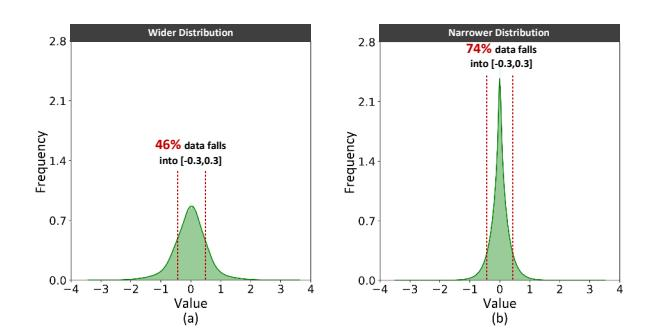
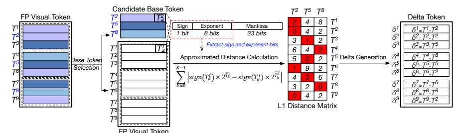

# *A. Vision-Language Model*

Vision-Language Models (VLMs) have proven its promise of integrating visual information from images and videos with natural language understanding. A visual encoder, such as ViT-L/14 [32], maps the raw input image/video pixels to a sequence of visual tokens, and the input texts are first tokenized as language tokens then mapped to a sequence of embeddings through an embedding lookup.

The visual token encoder essentially finds a homomorphism between the pixels and the visual tokens, which indicates that two similar pixels are still similar in visual tokens, as demonstrated in our profiling in Fig. 2. This figure captures pair-wise differences between visual tokens (a) and language

Fig. 2. Pair-wise differences among different token kinds.

tokens (b) using heatmaps. Token similarity is quantified by L1 distance, where lighter colors (yellow) indicate smaller distances and thus higher similarity. In Fig. 2(b), the colors are consistently dark, while Fig. 2(a) shows significantly lighter colors, highlighting the high similarity between visual tokens.

These visual and language token sequences are subsequently concatenated and fed into a large language model (LLM) [40] to enable multimodal reasoning. LLM inferences typically consist of two stages, prefilling and decoding. In the prefilling stage, the concatenated visual and language tokens are processed in parallel through multiple transformer layers to "fill" the key–value (KV) cache. Each transformer block includes three major components: the QKV projection, the selfattention mechanism, and the feed-forward network (FFN). The QKV projection maps the tokens into the Query (Q), Key (K), and Value (V ) matrices, usually implemented in General Matrix Multiplication (GEMM). Self-attention then produces the weighted output as O = softmax(Q · KT ) · V . The FFN generates the final output through linear transformations to the next transformer block or used as the final representation.

Prefilling and decoding stages exhibit very different compute/memory characteristics. A single image or video frame produces 0.5K-4K visual tokens. During prefilling, GEMMs in each component of a transformer block are applied to this long visual token sequence, making prefilling compute-bound.

In contrast, the decoding stage recurrently generate tokens one at a time. The dominated operation shifts from GEMM to matrix-vector multiplications (GEMV). With orders-ofmagnitude lower arithmetic intensive compared with prefilling, while keeping the same memory footprint on model weights and KV-caches, decoding is memory-bound.

Fig. 3. Data distribution of (a) visual tokens, and (b) deltas.

Motivation. Compared to the 0.5K-4K visual tokens for a single image or video frames, the text prompt description is typically around 40-60 tokens. Considering the visual tokens' dominance, this work targets to dynamic visual token quantization/compression by leveraging the token temporal and spatial (intra- and inter-frames, see below) similarity. By exploiting these similarities, more efficient quantization can be achieved, as subtracting similar visual tokens results in deltas with a narrower distribution, as manifested in Fig. 3.

## B. Video Encoding

Due to the massive data volume of raw video, practical systems almost never store or transmit uncompressed frames. Instead, modern video is encoded using standardized compression formats to take advantage of the spatial and temporal similarity to reduce the data traffic while retaining the video quality. In this section, the basics of H.265[7], [51], including the data format, as well as the three phases of the encoding algorithm, motion estimation, motion compensation, and quantization, will be explained.

Fig. 4. The definition of I-/P-/B-frames (a); the details of the ME phase (b)

**Hybrid Video Coding.** H.265/HEVC adopts a hybrid, two types of video frame encoding: intra-frame and inter-frame. As shown in Fig. 4(a), an I-frame (intra frame) is encoded by only using information from the same frame, whereas P-and B-frames are encoded by predicting residuals from the reference frames before and after the current frame, and only encoding the residuals (deltas). Conceptually, encoding both inter and intra frames are very similar, detecting the similarity, computing the residual, and quantizing the residual. In the rest of this section, we exemplify the inter-coded P/B frames, by explaining motion estimation, motion compensation, and residual quantization.

**Motion Estimation (ME).** H.265/HEVC partitions each frame into small, fixed-size regions to form the basic units of encoding. For simplicity, we refer to these basic coding blocks (e.g., CTUs/CUs in H.265) as *macroblocks*.

As illustrated in Fig. 4(b), for each macroblock in an interpredicted frame (P/B frame), the motion estimation (ME) phase searches a window in adjacent reference frames to find the most similar macroblock. Let  $M_{\rm current}$  denote the current macroblock and  $\{C_1, C_2, \ldots, C_K\}$  the candidate macroblocks in the search window. ME computes the L1 distance  $\|M_{\rm current} - C_k\|_1$  for all candidates and selects the one with minium distance as the reference macroblock,  $M_{\rm ref}$ .

**Motion Compensation (MC).** Given the reference macroblocks, the residual can be defined as  $\mathrm{Res} = M_{\mathrm{current}} - M_{\mathrm{ref}}$ . Because of the similarity, the generated residual can further be encoded in narrower bits by quantization.

**Quantization.** The quantization phase operates on the residuals Res to reduce bit width. A common form is an affine transform followed by a right shift and clamping:

$$\operatorname{Quant}(\operatorname{Res}) = \operatorname{Clamp}\left(\left(\frac{\operatorname{Res}}{\operatorname{Factor}} + \operatorname{Offset}\right) \gg b\right)$$

where Factor, Offset, and b are predefined parameters controlling the quantization step size and dynamic range. This step introduces controlled distortion while saving fewer bits.

Fig. 5. The hardware details of the ME module (a); details of the quantization module (b).

**Practice in Multimedia Systems.** In practical multimedia processing systems, these three phases are often implemented by specialized software or hardware units (a.k.a. CODEC). Fig. 5 shows a typical implementation of a CODEC unit, specializing ME, MC, and Quantization discussed above.

As shown in top of Fig. 5(a), a 8×8 mesh of process elements (PE) is integrated in the ME module to compute 64 pairs of L1 distances between the current macroblock and the candidate macroblocks in parallel. Within each PE, since each macroblock is 8×8, L1 distance computation is specialized by a 64-wide subtract-and-abs reduction tree. Each channel of image is INT8 and 64 pixels are accumulated. Thus, the addition is 16-bit. After the 64 L1 distances are computed, as shown in bottom of Fig. 5(a), these 64 L1 distances are fed to a comparison reduction tree to find the candidate macroblock with minium L1 distance (also the best similarity) as the reference macroblock. Then, the reference macroblock is fed to the quantization unit shown in Fig. 5(b) for a block-wise affine transformation, shifting, and clamping to reduce the bitwidth of the residual.

**Opportunities.** H265 encoding takes advantage of the similarity in inter- and intra-frame to compress the input/output for lower bitrate, and the CODEC unit can efficiently encode and decode the raw video. Such unit is often idle during VLM inference, which can be potentially made use of.

**Challenges.** However, such CODEC unit is specialized for integer-based video compression, while VLM inference often involves floating-point. Naively extending floating-point units may introduce expensive hardware overhead.

## C. CODEC-Acclerated LLM Systems

Prior works already recognized the opportunities of the idle CODEC unit [39], [43] to accelerate LLM inferences. However, few of them propose an end-to-end solution.

For example, CMC [39] leverages CODEC to accelerate the prefilling stage. CODEC is used to detect the similarity

Fig. 6. The details of the exponent-similarity detection operation. We use the same color to represent similar visual tokens.

among token sequences by computing the L1 distances. Too similar tokens are considered non-informative, and removed from the input matrices to skip the computation. This results in performance improvement during the prefilling stage, as redundant tokens are eliminated during matrix multiplications. Different from CMC that leverages CODEC motion estimation for integer-domain similarity detection, AQuant extends an integer-native CODEC to support floating-point token quantization and mixed-precision VLM inference. To bridge the representation gap between floating-point tokens and integer hardware, we introduce exponent-based similarity detection that approximates FP similarity without incurring full floating-point operations. Moreover, we propose lightweight microarchitectural extensions to the quantization datapath, enabling dynamic precision switching and floating-point scaling within the same CODEC hardware. Therefore, AQuant extends CODEC from an integer raw-video compression engine to a precision-aware co-processor for floating-point AI inference, architecturally different from CMC's matrix-condensing design.

LLM.265 [43] demonstrates that several stages in the video coding pipeline, including entropy coding, transform coding, and intra-frame prediction, can effectively compress tensors in LLMs, including model weights and KV-cache. During inference, the compressed data are first decompressed by CODEC and fed the GPU as normal. The decoding stage mainly benefits from this approach, because KV-cache is compressed before being loaded.

**Motivation.** Prior works on CODEC compression could only benefit a single aspect, either prefilling or decoding. A *unified* approach to accelerate *end-to-end* inference may fully exploit the potential of CODEC-based compression. *Unified* means all matrix multiplications, including QKV project, KV-cache, and FFN can all benefit from this approach. *End-to-end* means this approach accelerates both prefilling and decoding.

# *A. Vision-Language Model*

Vision-Language Models (VLMs) have proven its promise of integrating visual information from images and videos with natural language understanding. A visual encoder, such as ViT-L/14 [32], maps the raw input image/video pixels to a sequence of visual tokens, and the input texts are first tokenized as language tokens then mapped to a sequence of embeddings through an embedding lookup.

The visual token encoder essentially finds a homomorphism between the pixels and the visual tokens, which indicates that two similar pixels are still similar in visual tokens, as demonstrated in our profiling in Fig. 2. This figure captures pair-wise differences between visual tokens (a) and language

Fig. 2. Pair-wise differences among different token kinds.

tokens (b) using heatmaps. Token similarity is quantified by L1 distance, where lighter colors (yellow) indicate smaller distances and thus higher similarity. In Fig. 2(b), the colors are consistently dark, while Fig. 2(a) shows significantly lighter colors, highlighting the high similarity between visual tokens.

These visual and language token sequences are subsequently concatenated and fed into a large language model (LLM) [40] to enable multimodal reasoning. LLM inferences typically consist of two stages, prefilling and decoding. In the prefilling stage, the concatenated visual and language tokens are processed in parallel through multiple transformer layers to "fill" the key–value (KV) cache. Each transformer block includes three major components: the QKV projection, the selfattention mechanism, and the feed-forward network (FFN). The QKV projection maps the tokens into the Query (Q), Key (K), and Value (V ) matrices, usually implemented in General Matrix Multiplication (GEMM). Self-attention then produces the weighted output as O = softmax(Q · KT ) · V . The FFN generates the final output through linear transformations to the next transformer block or used as the final representation.

Prefilling and decoding stages exhibit very different compute/memory characteristics. A single image or video frame produces 0.5K-4K visual tokens. During prefilling, GEMMs in each component of a transformer block are applied to this long visual token sequence, making prefilling compute-bound.

In contrast, the decoding stage recurrently generate tokens one at a time. The dominated operation shifts from GEMM to matrix-vector multiplications (GEMV). With orders-ofmagnitude lower arithmetic intensive compared with prefilling, while keeping the same memory footprint on model weights and KV-caches, decoding is memory-bound.

Fig. 3. Data distribution of (a) visual tokens, and (b) deltas.

Motivation. Compared to the 0.5K-4K visual tokens for a single image or video frames, the text prompt description is typically around 40-60 tokens. Considering the visual tokens' dominance, this work targets to dynamic visual token quantization/compression by leveraging the token temporal and spatial (intra- and inter-frames, see below) similarity. By exploiting these similarities, more efficient quantization can be achieved, as subtracting similar visual tokens results in deltas with a narrower distribution, as manifested in Fig. 3.

## B. Video Encoding

Due to the massive data volume of raw video, practical systems almost never store or transmit uncompressed frames. Instead, modern video is encoded using standardized compression formats to take advantage of the spatial and temporal similarity to reduce the data traffic while retaining the video quality. In this section, the basics of H.265[7], [51], including the data format, as well as the three phases of the encoding algorithm, motion estimation, motion compensation, and quantization, will be explained.

Fig. 4. The definition of I-/P-/B-frames (a); the details of the ME phase (b)

**Hybrid Video Coding.** H.265/HEVC adopts a hybrid, two types of video frame encoding: intra-frame and inter-frame. As shown in Fig. 4(a), an I-frame (intra frame) is encoded by only using information from the same frame, whereas P-and B-frames are encoded by predicting residuals from the reference frames before and after the current frame, and only encoding the residuals (deltas). Conceptually, encoding both inter and intra frames are very similar, detecting the similarity, computing the residual, and quantizing the residual. In the rest of this section, we exemplify the inter-coded P/B frames, by explaining motion estimation, motion compensation, and residual quantization.

**Motion Estimation (ME).** H.265/HEVC partitions each frame into small, fixed-size regions to form the basic units of encoding. For simplicity, we refer to these basic coding blocks (e.g., CTUs/CUs in H.265) as *macroblocks*.

As illustrated in Fig. 4(b), for each macroblock in an interpredicted frame (P/B frame), the motion estimation (ME) phase searches a window in adjacent reference frames to find the most similar macroblock. Let  $M_{\rm current}$  denote the current macroblock and  $\{C_1, C_2, \ldots, C_K\}$  the candidate macroblocks in the search window. ME computes the L1 distance  $\|M_{\rm current} - C_k\|_1$  for all candidates and selects the one with minium distance as the reference macroblock,  $M_{\rm ref}$ .

**Motion Compensation (MC).** Given the reference macroblocks, the residual can be defined as  $\mathrm{Res} = M_{\mathrm{current}} - M_{\mathrm{ref}}$ . Because of the similarity, the generated residual can further be encoded in narrower bits by quantization.

**Quantization.** The quantization phase operates on the residuals Res to reduce bit width. A common form is an affine transform followed by a right shift and clamping:

$$\operatorname{Quant}(\operatorname{Res}) = \operatorname{Clamp}\left(\left(\frac{\operatorname{Res}}{\operatorname{Factor}} + \operatorname{Offset}\right) \gg b\right)$$

where Factor, Offset, and b are predefined parameters controlling the quantization step size and dynamic range. This step introduces controlled distortion while saving fewer bits.

Fig. 5. The hardware details of the ME module (a); details of the quantization module (b).

**Practice in Multimedia Systems.** In practical multimedia processing systems, these three phases are often implemented by specialized software or hardware units (a.k.a. CODEC). Fig. 5 shows a typical implementation of a CODEC unit, specializing ME, MC, and Quantization discussed above.

As shown in top of Fig. 5(a), a 8×8 mesh of process elements (PE) is integrated in the ME module to compute 64 pairs of L1 distances between the current macroblock and the candidate macroblocks in parallel. Within each PE, since each macroblock is 8×8, L1 distance computation is specialized by a 64-wide subtract-and-abs reduction tree. Each channel of image is INT8 and 64 pixels are accumulated. Thus, the addition is 16-bit. After the 64 L1 distances are computed, as shown in bottom of Fig. 5(a), these 64 L1 distances are fed to a comparison reduction tree to find the candidate macroblock with minium L1 distance (also the best similarity) as the reference macroblock. Then, the reference macroblock is fed to the quantization unit shown in Fig. 5(b) for a block-wise affine transformation, shifting, and clamping to reduce the bitwidth of the residual.

**Opportunities.** H265 encoding takes advantage of the similarity in inter- and intra-frame to compress the input/output for lower bitrate, and the CODEC unit can efficiently encode and decode the raw video. Such unit is often idle during VLM inference, which can be potentially made use of.

**Challenges.** However, such CODEC unit is specialized for integer-based video compression, while VLM inference often involves floating-point. Naively extending floating-point units may introduce expensive hardware overhead.

## C. CODEC-Acclerated LLM Systems

Prior works already recognized the opportunities of the idle CODEC unit [39], [43] to accelerate LLM inferences. However, few of them propose an end-to-end solution.

For example, CMC [39] leverages CODEC to accelerate the prefilling stage. CODEC is used to detect the similarity

Fig. 6. The details of the exponent-similarity detection operation. We use the same color to represent similar visual tokens.

among token sequences by computing the L1 distances. Too similar tokens are considered non-informative, and removed from the input matrices to skip the computation. This results in performance improvement during the prefilling stage, as redundant tokens are eliminated during matrix multiplications. Different from CMC that leverages CODEC motion estimation for integer-domain similarity detection, AQuant extends an integer-native CODEC to support floating-point token quantization and mixed-precision VLM inference. To bridge the representation gap between floating-point tokens and integer hardware, we introduce exponent-based similarity detection that approximates FP similarity without incurring full floating-point operations. Moreover, we propose lightweight microarchitectural extensions to the quantization datapath, enabling dynamic precision switching and floating-point scaling within the same CODEC hardware. Therefore, AQuant extends CODEC from an integer raw-video compression engine to a precision-aware co-processor for floating-point AI inference, architecturally different from CMC's matrix-condensing design.

LLM.265 [43] demonstrates that several stages in the video coding pipeline, including entropy coding, transform coding, and intra-frame prediction, can effectively compress tensors in LLMs, including model weights and KV-cache. During inference, the compressed data are first decompressed by CODEC and fed the GPU as normal. The decoding stage mainly benefits from this approach, because KV-cache is compressed before being loaded.

**Motivation.** Prior works on CODEC compression could only benefit a single aspect, either prefilling or decoding. A *unified* approach to accelerate *end-to-end* inference may fully exploit the potential of CODEC-based compression. *Unified* means all matrix multiplications, including QKV project, KV-cache, and FFN can all benefit from this approach. *End-to-end* means this approach accelerates both prefilling and decoding.

