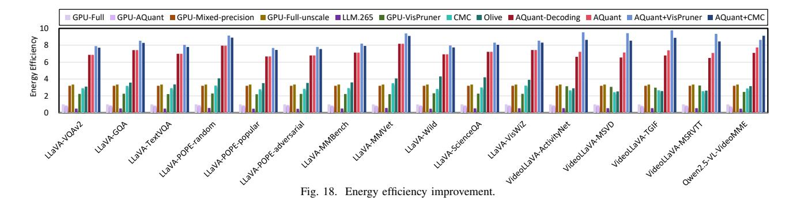
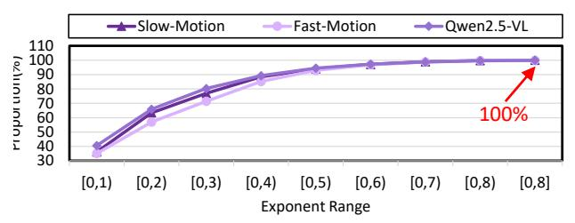
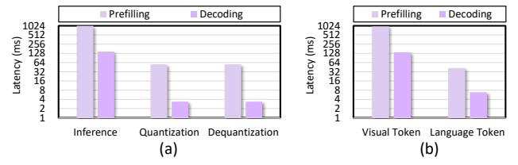
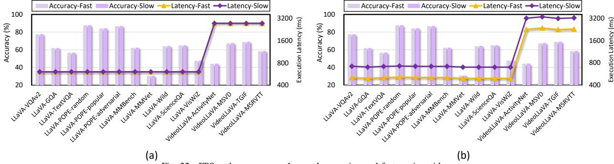

# D. Design Exploration

**Exploration of Exponent Distribution.** To examine whether visual token exponents are bounded within the range of [0,8], we conduct two analyses. First, we classify inputs based on visual complexity and motion intensity into slowmotion and fast-motion categories, and profile the exponent distribution of visual tokens under these conditions. Second,

Fig. 19. Exploration of the exponent distribution

we repeat the analysis on another VLM, Qwen2.5-VL. Fig. 19 presents the cumulative distribution of exponents, showing that the values consistently concentrate within [0,8]. More than 99.7% of exponents fall within [0,7], while only 1.2% lie in the range of [7,8]. Importantly, even in high-motion scenes, the exponent range does not expand beyond this bound. Furthermore, profiling Qwen2.5-VL under different normalization schemes yields the same exponent range of [0,8], suggesting that this property is model-independent. To ensure robustness, we implement a fallback mechanism: tokens with exponents outside this range are treated as outliers, bypass similarity detection, and are directly processed using higher precision.

Exploration of Quantization and Dequantization Overhead. To analyze the overhead introduced by online quantization and dequantization required by AQuant, we evaluate their average latency across all benchmarks as shown in Fig. 20(a). Quantization and dequantization both account for 5.1% of the inference latency, while KV-cache dequantization during decoding averagely accounts for only 2.3%. Moreover, inference and quantization/dequantization are executed on independent hardware units (the NPU and the quantization module in the CODEC). Therefore, their execution can be overlapped, effectively hiding the quantization and dequantization latency. As a result, these operations do not become a performance bottleneck.

Exploration of Visual Token Benefit. Since AQuant primarily targets visual token computation, we analyze the average execution time breakdown of VLM inference across all benchmarks in Fig. 20(b), separating visual token and language token execution time. The results show that visual token computation averagely accounts for 95.8% of total latency, dominating the execution time. By reducing this portion by 85.7%, AQuant delivers substantial end-to-end speedup,

Fig. 20. Exploration of quantization and dequantization overhead (a); Exploration of visual token benefit (b).

Fig. 21. Exploration of the interval F.

demonstrating that optimizing visual token computation is critical for improving VLM inference performance.

**Exploration of Interval Parameter** F. The goal of the AQuant algorithm is to strike a balance between optimizing system efficiency and maintaining high-quality outcomes by assigning a suitable number of tokens as candidate base tokens, where the interval F matters. Generally speaking, a larger F means fewer tokens serving as the candidate base tokens, leading to higher speedup but lower accuracy. To explore the impact of F, we vary F from 12 to 24 and see the accuracy and computational savings of the VideoLLaVA model on the MSVD dataset. As in Fig. 21, increasing F from 12 to 18 reduces the number of base tokens, leading to more deltas waiting to be quantized, which increases speedup. But when we keep increasing F to 24, the accuracy drops severely. Therefore, we set F = 18 to balance performance and accuracy. Since F determines the number of base tokens, F=18 corresponds to 7.4% INT8 base tokens.

Analysis of F Robustness. To evaluate the sensitivity of F, we apply a fixed configuration F=18 to previously classified inputs, including both slow- and fast-motion scenes. As illustrated in Fig. 22(a), AQuant incurs only 0.83% accuracy loss even for fast-motion videos. We further explore adaptive tuning of F by setting F=F-4 for fast-motion inputs and F=F+4 for slow-motion inputs. As shown in Fig. 22(b),

Fig. 22. FPS and accuracy results on slow-motion and fast-motion videos.

Fig. 23. Exploration of the input characteristics.

although this adaptive strategy reduces latency for slow-motion inputs, it yields only a marginal accuracy improvement of 0.02% compared to the fixed-F configuration. Therefore, we tune F on a single representative benchmark (VideoLLaVA-MSVD) and reuse it across all benchmarks without per-video tuning.

Effectiveness of AQuant on input characteristics. To evaluate AQuant under different input characteristics, we study the correlation between token similarity and accuracy. We use the inter-frame L1 distance as the similarity metric, bucket test samples accordingly, and measure the accuracy for each bucket. We set p=25% and F=18 in the experiment. Fig. 23 shows that even when the L1 distance falls within [350,400), AQuant incurs only 0.92% accuracy loss, indicating that AQuant remains effective even under highly dynamic scenes.

## VI. RELATED WORK

This section shows related works on quantization accelerators and input similarity-aware accelerators, which are the focus of our work.

## A. Quantization Accelerator

In pursuit of ultra-high execution performance with accuracy trade-offs, researchers have focused on low-bit quantization. Quantization methods can be broadly classified into fixed-length and mixed-precision. Fixed-length quantization requires minimal architectural changes, substituting high-precision PEs with low-precision ones. Extremely low-bit quantization, like binary quantization [1], is implemented using simple XNOR operations [6], but may suffer from accuracy loss.

Attracted by the benefits of mixed-precision quantization for both accuracy and performance, numerous accelerators have been proposed. BitFusion [35] and DRQ [38] enable support for different bit-width through a combination of lowprecision PEs at the bit-level and value-level, respectively. ANT [12] takes a more aggressive approach, necessitating substantial architectural modifications. On the other hand, OliVe [11] is an outlier-aware quantization accelerator design, which incorporates value pruning to address outliers. Despite their considerable success, existing quantization accelerators have been constrained to designs within the NPU and have yet to consider opportunities that may arise from integrating other hardware components of SoC devices, making them struggle for peak performance in VLMs. In contrast, our proposed method, AQuant, leverages data similarities with the assistance of the video CODEC to quantize VLMs effectively.

## B. Input-Importance-Aware Accelerator

To achieve high execution performance, researchers have explored input-importance-aware acceleration methods. Deep-Reuse [29] and MERCURY [17] exploit input vector similarities to reuse previously computed results, enhancing convolutional neural network (CNN) performance. DeepReuse uses Locality Sensitive Hashing (LSH) to assess similarity, while MERCURY employs Random Projection with Quantization (RPQ) to estimate the similarity of high-dimensional data. Euphrates [52], an algorithm-hardware co-design solution, accelerates video object detection and tracking by leveraging motion vectors from the image signal processor (ISP) to reconstruct bounding boxes of non-key frames, skipping the complete CNN processing for those frames. However, these methods are primarily limited to CNN models. In contrast, AQuant offers a more generalized approach that can be applied to a wide range of models as long as they process vision (image/video) data.

## VII. CONCLUSION

This paper introduces AQuant, an algorithm-architecture codesign framework poised to facilitate efficient VLM inference. The key idea of AQuant is to intelligently utilize the video CODEC for effectively quantizing deltas with low costs. Extensive experiments show that AQuant can deliver satisfactory performance gain with trivial accuracy loss.

## REFERENCES

- [1] H. Bai, W. Zhang, L. Hou, L. Shang, J. Jin, X. Jiang, Q. Liu, M. Lyu, and I. King, "Binarybert: Pushing the limit of bert quantization," *arXiv preprint arXiv:2012.15701*, 2020.
- [2] S. Bai, K. Chen, X. Liu, J. Wang, W. Ge, S. Song, K. Dang, P. Wang, S. Wang, J. Tang, H. Zhong, Y. Zhu, M. Yang, Z. Li, J. Wan, P. Wang, W. Ding, Z. Fu, Y. Xu, J. Ye, X. Zhang, T. Xie, Z. Cheng, H. Zhang, Z. Yang, H. Xu, and J. Lin, "Qwen2.5-vl technical report," 2025. [Online]. Available: https://arxiv.org/abs/2502.13923
- [3] R. Balasubramonian, A. B. Kahng, N. Muralimanohar, A. Shafiee, and V. Srinivas, "Cacti 7: New tools for interconnect exploration in innovative off-chip memories," *ACM Transactions on Architecture and Code Optimization (TACO)*, vol. 14, no. 2, pp. 1–25, 2017.
- [4] D. Chen and W. B. Dolan, "Collecting highly parallel data for paraphrase evaluation," in *Proceedings of the 49th annual meeting of the association for computational linguistics: human language technologies*, 2011, pp. 190–200.
- [5] X. Chen, X. Wang, L. Beyer, A. Kolesnikov, J. Wu, P. Voigtlaender, B. Mustafa, S. Goodman, I. Alabdulmohsin, P. Padlewski *et al.*, "Pali-3 vision language models: Smaller, faster, stronger," *arXiv preprint arXiv:2310.09199*, 2023.
- [6] F. Conti, P. D. Schiavone, and L. Benini, "Xnor neural engine: A hardware accelerator ip for 21.6-fj/op binary neural network inference," *IEEE Transactions on Computer-Aided Design of Integrated Circuits and Systems*, vol. 37, no. 11, pp. 2940–2951, 2018.
- [7] L.-F. Ding, W.-Y. Chen, P.-K. Tsung, T.-D. Chuang, P.-H. Hsiao, Y.- H. Chen, H.-K. Chiu, S.-Y. Chien, and L.-G. Chen, "A 212 mpixels/s 4096×2160p multiview video encoder chip for 3d/quad full hdtv applications," *IEEE Journal of solid-state circuits*, vol. 45, no. 1, pp. 46–58, 2009.
- [8] Y. Fan and et al., "H.265/hevc encoder ip core v2.0," [Online]. Available: http://openasic.org/topic/71/h265-video-encoder-rtl-ip-core-version-2-0.
- [9] C. Fu, Y. Dai, Y. Luo, L. Li, S. Ren, R. Zhang, Z. Wang, C. Zhou, Y. Shen, M. Zhang *et al.*, "Video-mme: The first-ever comprehensive evaluation benchmark of multi-modal llms in video analysis," in *Proceedings of the IEEE/CVF conference on computer vision and pattern recognition*, 2025, pp. 24 108–24 118.
- [10] Y. Goyal, T. Khot, D. Summers-Stay, D. Batra, and D. Parikh, "Making the v in vqa matter: Elevating the role of image understanding in visual question answering," in *Proceedings of the IEEE conference on computer vision and pattern recognition*, 2017, pp. 6904–6913.
- [11] C. Guo, J. Tang, W. Hu, J. Leng, C. Zhang, F. Yang, Y. Liu, M. Guo, and Y. Zhu, "Olive: Accelerating large language models via hardwarefriendly outlier-victim pair quantization," in *Proceedings of the 50th Annual International Symposium on Computer Architecture*, 2023, pp. 1–15.
- [12] C. Guo, C. Zhang, J. Leng, Z. Liu, F. Yang, Y. Liu, M. Guo, and Y. Zhu, "Ant: Exploiting adaptive numerical data type for low-bit deep neural network quantization," in *2022 55th IEEE/ACM International Symposium on Microarchitecture (MICRO)*. IEEE, 2022, pp. 1414– 1433.
- [13] D. Gurari, Q. Li, A. J. Stangl, A. Guo, C. Lin, K. Grauman, J. Luo, and J. P. Bigham, "Vizwiz grand challenge: Answering visual questions from blind people," in *Proceedings of the IEEE conference on computer vision and pattern recognition*, 2018, pp. 3608–3617.
- [14] I. Hartsock and G. Rasool, "Vision-language models for medical report generation and visual question answering: A review," *Frontiers in artificial intelligence*, vol. 7, p. 1430984, 2024.
- [15] W. Hu, H. Zhang, C. Guo, Y. Feng, R. Guan, Z. Hua, Z. Liu, Y. Guan, M. Guo, and J. Leng, "M-ant: Efficient low-bit group quantization for llms via mathematically adaptive numerical type," in *2025 IEEE International Symposium on High Performance Computer Architecture (HPCA)*. IEEE, 2025, pp. 1112–1126.
- [16] D. A. Hudson and C. D. Manning, "Gqa: A new dataset for real-world visual reasoning and compositional question answering," in *Proceedings of the IEEE/CVF conference on computer vision and pattern recognition*, 2019, pp. 6700–6709.
- [17] V. Janfaza, K. Weston, M. Razavi, S. Mandal, F. Mahmud, A. Hilty, and A. Muzahid, "Mercury: Accelerating dnn training by exploiting input similarity," in *2023 IEEE International Symposium on High-Performance Computer Architecture (HPCA)*. IEEE, 2023, pp. 638– 650.

- [18] Y. Jang, Y. Song, Y. Yu, Y. Kim, and G. Kim, "Tgif-qa: Toward spatiotemporal reasoning in visual question answering," in *Proceedings of the IEEE conference on computer vision and pattern recognition*, 2017, pp. 2758–2766.
- [19] W. Kim, C. Choi, W. Lee, and W. Rhee, "An image grid can be worth a video: Zero-shot video question answering using a vlm," *IEEE Access*, 2024.
- [20] Y. Kim, W. Yang, and O. Mutlu, "Ramulator: A fast and extensible dram simulator," *IEEE Computer architecture letters*, vol. 15, no. 1, pp. 45–49, 2015.
- [21] J. Lee, W. Lee, and J. Sim, "Tender: Accelerating large language models via tensor decomposition and runtime requantization," in *2024 ACM/IEEE 51st Annual International Symposium on Computer Architecture (ISCA)*. IEEE, 2024, pp. 1048–1062.
- [22] B. Li, Y. Zhang, D. Guo, R. Zhang, F. Li, H. Zhang, K. Zhang, P. Zhang, Y. Li, Z. Liu *et al.*, "Llava-onevision: Easy visual task transfer," *arXiv preprint arXiv:2408.03326*, 2024.
- [23] S. Li, Z. Yang, D. Reddy, A. Srivastava, and B. Jacob, "Dramsim3: A cycle-accurate, thermal-capable dram simulator," *IEEE Computer Architecture Letters*, vol. 19, no. 2, pp. 106–109, 2020.
- [24] Y. Li, Y. Du, K. Zhou, J. Wang, W. X. Zhao, and J.-R. Wen, "Evaluating object hallucination in large vision-language models," *arXiv preprint arXiv:2305.10355*, 2023.
- [25] B. Lin, Y. Ye, B. Zhu, J. Cui, M. Ning, P. Jin, and L. Yuan, "Video-llava: Learning united visual representation by alignment before projection," in *Proceedings of the 2024 Conference on Empirical Methods in Natural Language Processing*, 2024, pp. 5971–5984.
- [26] H. Liu, C. Li, Q. Wu, and Y. J. Lee, "Visual instruction tuning," *Advances in neural information processing systems*, vol. 36, pp. 34 892– 34 916, 2023.
- [27] Y. Liu, H. Duan, Y. Zhang, B. Li, S. Zhang, W. Zhao, Y. Yuan, J. Wang, C. He, Z. Liu *et al.*, "Mmbench: Is your multi-modal model an all-around player?" in *European conference on computer vision*. Springer, 2024, pp. 216–233.
- [28] P. Lu, S. Mishra, T. Xia, L. Qiu, K.-W. Chang, S.-C. Zhu, O. Tafjord, P. Clark, and A. Kalyan, "Learn to explain: Multimodal reasoning via thought chains for science question answering," *Advances in Neural Information Processing Systems*, vol. 35, pp. 2507–2521, 2022.
- [29] L. Ning and X. Shen, "Deep reuse: Streamline cnn inference on the fly via coarse-grained computation reuse," in *Proceedings of the ACM International Conference on Supercomputing*, 2019, pp. 438–448.
- [30] NVIDIA, "Nvidia xavier system-on-chip," in *HotChips 30*, 2018.
- [31] A. Paszke, S. Gross, F. Massa, A. Lerer, J. Bradbury, G. Chanan, T. Killeen, Z. Lin, N. Gimelshein, L. Antiga *et al.*, "Pytorch: An imperative style, high-performance deep learning library," *Advances in neural information processing systems*, vol. 32, 2019.
- [32] A. Radford, J. W. Kim, C. Hallacy, A. Ramesh, G. Goh, S. Agarwal, G. Sastry, A. Askell, P. Mishkin, J. Clark *et al.*, "Learning transferable visual models from natural language supervision," in *International conference on machine learning*. PmLR, 2021, pp. 8748–8763.
- [33] M. Rathor, "Aloha-fp2i: Efficient algorithms and hardware for multimode rounding of floating point to integer," *ACM Transactions on Embedded Computing Systems*, vol. 24, no. 1, pp. 1–26, 2024.
- [34] A. Samajdar, Y. Zhu, P. Whatmough, M. Mattina, and T. Krishna, "Scale-sim: Systolic cnn accelerator simulator," *arXiv preprint arXiv:1811.02883*, 2018.
- [35] H. Sharma, J. Park, N. Suda, L. Lai, B. Chau, J. K. Kim, V. Chandra, and H. Esmaeilzadeh, "Bit fusion: Bit-level dynamically composable architecture for accelerating deep neural network," in *2018 ACM/IEEE 45th Annual International Symposium on Computer Architecture (ISCA)*. IEEE, 2018, pp. 764–775.
- [36] C. Sima, K. Renz, K. Chitta, L. Chen, H. Zhang, C. Xie, J. Beißwenger, P. Luo, A. Geiger, and H. Li, "Drivelm: Driving with graph visual question answering," in *European conference on computer vision*. Springer, 2024, pp. 256–274.
- [37] A. Singh, V. Natarajan, M. Shah, Y. Jiang, X. Chen, D. Batra, D. Parikh, and M. Rohrbach, "Towards vqa models that can read," in *Proceedings of the IEEE/CVF conference on computer vision and pattern recognition*, 2019, pp. 8317–8326.
- [38] Z. Song, B. Fu, F. Wu, Z. Jiang, L. Jiang, N. Jing, and X. Liang, "Drq: dynamic region-based quantization for deep neural network acceleration," in *2020 ACM/IEEE 47th Annual International Symposium on Computer Architecture (ISCA)*. IEEE, 2020, pp. 1010–1021.

- [39] Z. Song, C. Qi, F. Liu, N. Jing, and X. Liang, "Cmc: Video transformer acceleration via codec assisted matrix condensing," in *Proceedings of the 29th ACM International Conference on Architectural Support for Programming Languages and Operating Systems, Volume 2*, 2024, pp. 201–215.
- [40] H. Touvron, T. Lavril, G. Izacard, X. Martinet, M.-A. Lachaux, T. Lacroix, B. Roziere, N. Goyal, E. Hambro, F. Azhar ` *et al.*, "Llama: Open and efficient foundation language models," *arXiv preprint arXiv:2302.13971*, 2023.
- [41] H. Wang, Z. Zhang, and S. Han, "Spatten: Efficient sparse attention architecture with cascade token and head pruning," in *2021 IEEE International Symposium on High-Performance Computer Architecture (HPCA)*. IEEE, 2021, pp. 97–110.
- [42] R. Xiao, S. Kim, M.-I. Georgescu, Z. Akata, and S. Alaniz, "Flair: Vlm with fine-grained language-informed image representations," in *Proceedings of the Computer Vision and Pattern Recognition Conference*, 2025, pp. 24 884–24 894.
- [43] C. Xu, Y. Wu, X. Yang, B. Chen, M. Lentz, D. Zhuo, and L. W. Wills, "Llm. 265: Video codecs are secretly tensor codecs," in *Proceedings of the 58th IEEE/ACM International Symposium on Microarchitecture®*, 2025, pp. 445–460.
- [44] J. Xu, T. Mei, T. Yao, and Y. Rui, "Msr-vtt: A large video description dataset for bridging video and language," in *Proceedings of the IEEE conference on computer vision and pattern recognition*, 2016, pp. 5288– 5296.
- [45] L. Xu, Y. Zhao, D. Zhou, Z. Lin, S. K. Ng, and J. Feng, "Pllava: Parameter-free llava extension from images to videos for video dense captioning," *arXiv preprint arXiv:2404.16994*, 2024.
- [46] X. Yang, Y. Wu, M. Yang, H. Chen, and X. Geng, "Exploring diverse in-context configurations for image captioning," *Advances in Neural Information Processing Systems*, vol. 36, pp. 40 924–40 943, 2023.
- [47] W. Yu, Z. Yang, L. Li, J. Wang, K. Lin, Z. Liu, X. Wang, and L. Wang, "Mm-vet: Evaluating large multimodal models for integrated capabilities," *arXiv preprint arXiv:2308.02490*, 2023.
- [48] Z. Yu, D. Xu, J. Yu, T. Yu, Z. Zhao, Y. Zhuang, and D. Tao, "Activitynetqa: A dataset for understanding complex web videos via question answering," in *Proceedings of the AAAI Conference on Artificial Intelligence*, vol. 33, no. 01, 2019, pp. 9127–9134.
- [49] Q. Zhang, A. Cheng, M. Lu, R. Zhang, Z. Zhuo, J. Cao, S. Guo, Q. She, and S. Zhang, "Beyond text-visual attention: Exploiting visual cues for effective token pruning in vlms," in *Proceedings of the IEEE/CVF International Conference on Computer Vision*, 2025, pp. 20 857–20 867.
- [50] H. Zhao, W. Cui, Q. Chen, J. Zhao, J. Leng, and M. Guo, "Exploiting intra-sm parallelism in gpus via persistent and elastic blocks," in *2021 IEEE 39th International Conference on Computer Design (ICCD)*. IEEE, 2021, pp. 290–298.
- [51] D. Zhou, S. Wang, H. Sun, J. Zhou, J. Zhu, Y. Zhao, J. Zhou, S. Zhang, S. Kimura, T. Yoshimura *et al.*, "An 8k h. 265/hevc video decoder chip with a new system pipeline design," *IEEE Journal of Solid-State Circuits*, vol. 52, no. 1, pp. 113–126, 2016.
- [52] Y. Zhu, A. Samajdar, M. Mattina, and P. Whatmough, "Euphrates: Algorithm-soc co-design for low-power mobile continuous vision," *arXiv preprint arXiv:1803.11232*, 2018.# D. Design Exploration

**Exploration of Exponent Distribution.** To examine whether visual token exponents are bounded within the range of [0,8], we conduct two analyses. First, we classify inputs based on visual complexity and motion intensity into slowmotion and fast-motion categories, and profile the exponent distribution of visual tokens under these conditions. Second,

Fig. 19. Exploration of the exponent distribution

we repeat the analysis on another VLM, Qwen2.5-VL. Fig. 19 presents the cumulative distribution of exponents, showing that the values consistently concentrate within [0,8]. More than 99.7% of exponents fall within [0,7], while only 1.2% lie in the range of [7,8]. Importantly, even in high-motion scenes, the exponent range does not expand beyond this bound. Furthermore, profiling Qwen2.5-VL under different normalization schemes yields the same exponent range of [0,8], suggesting that this property is model-independent. To ensure robustness, we implement a fallback mechanism: tokens with exponents outside this range are treated as outliers, bypass similarity detection, and are directly processed using higher precision.

Exploration of Quantization and Dequantization Overhead. To analyze the overhead introduced by online quantization and dequantization required by AQuant, we evaluate their average latency across all benchmarks as shown in Fig. 20(a). Quantization and dequantization both account for 5.1% of the inference latency, while KV-cache dequantization during decoding averagely accounts for only 2.3%. Moreover, inference and quantization/dequantization are executed on independent hardware units (the NPU and the quantization module in the CODEC). Therefore, their execution can be overlapped, effectively hiding the quantization and dequantization latency. As a result, these operations do not become a performance bottleneck.

Exploration of Visual Token Benefit. Since AQuant primarily targets visual token computation, we analyze the average execution time breakdown of VLM inference across all benchmarks in Fig. 20(b), separating visual token and language token execution time. The results show that visual token computation averagely accounts for 95.8% of total latency, dominating the execution time. By reducing this portion by 85.7%, AQuant delivers substantial end-to-end speedup,

Fig. 20. Exploration of quantization and dequantization overhead (a); Exploration of visual token benefit (b).

Fig. 21. Exploration of the interval F.

demonstrating that optimizing visual token computation is critical for improving VLM inference performance.

**Exploration of Interval Parameter** F. The goal of the AQuant algorithm is to strike a balance between optimizing system efficiency and maintaining high-quality outcomes by assigning a suitable number of tokens as candidate base tokens, where the interval F matters. Generally speaking, a larger F means fewer tokens serving as the candidate base tokens, leading to higher speedup but lower accuracy. To explore the impact of F, we vary F from 12 to 24 and see the accuracy and computational savings of the VideoLLaVA model on the MSVD dataset. As in Fig. 21, increasing F from 12 to 18 reduces the number of base tokens, leading to more deltas waiting to be quantized, which increases speedup. But when we keep increasing F to 24, the accuracy drops severely. Therefore, we set F = 18 to balance performance and accuracy. Since F determines the number of base tokens, F=18 corresponds to 7.4% INT8 base tokens.

Analysis of F Robustness. To evaluate the sensitivity of F, we apply a fixed configuration F=18 to previously classified inputs, including both slow- and fast-motion scenes. As illustrated in Fig. 22(a), AQuant incurs only 0.83% accuracy loss even for fast-motion videos. We further explore adaptive tuning of F by setting F=F-4 for fast-motion inputs and F=F+4 for slow-motion inputs. As shown in Fig. 22(b),

Fig. 22. FPS and accuracy results on slow-motion and fast-motion videos.

Fig. 23. Exploration of the input characteristics.

although this adaptive strategy reduces latency for slow-motion inputs, it yields only a marginal accuracy improvement of 0.02% compared to the fixed-F configuration. Therefore, we tune F on a single representative benchmark (VideoLLaVA-MSVD) and reuse it across all benchmarks without per-video tuning.

Effectiveness of AQuant on input characteristics. To evaluate AQuant under different input characteristics, we study the correlation between token similarity and accuracy. We use the inter-frame L1 distance as the similarity metric, bucket test samples accordingly, and measure the accuracy for each bucket. We set p=25% and F=18 in the experiment. Fig. 23 shows that even when the L1 distance falls within [350,400), AQuant incurs only 0.92% accuracy loss, indicating that AQuant remains effective even under highly dynamic scenes.

## VI. RELATED WORK

This section shows related works on quantization accelerators and input similarity-aware accelerators, which are the focus of our work.

## A. Quantization Accelerator

In pursuit of ultra-high execution performance with accuracy trade-offs, researchers have focused on low-bit quantization. Quantization methods can be broadly classified into fixed-length and mixed-precision. Fixed-length quantization requires minimal architectural changes, substituting high-precision PEs with low-precision ones. Extremely low-bit quantization, like binary quantization [1], is implemented using simple XNOR operations [6], but may suffer from accuracy loss.

Attracted by the benefits of mixed-precision quantization for both accuracy and performance, numerous accelerators have been proposed. BitFusion [35] and DRQ [38] enable support for different bit-width through a combination of lowprecision PEs at the bit-level and value-level, respectively. ANT [12] takes a more aggressive approach, necessitating substantial architectural modifications. On the other hand, OliVe [11] is an outlier-aware quantization accelerator design, which incorporates value pruning to address outliers. Despite their considerable success, existing quantization accelerators have been constrained to designs within the NPU and have yet to consider opportunities that may arise from integrating other hardware components of SoC devices, making them struggle for peak performance in VLMs. In contrast, our proposed method, AQuant, leverages data similarities with the assistance of the video CODEC to quantize VLMs effectively.

## B. Input-Importance-Aware Accelerator

To achieve high execution performance, researchers have explored input-importance-aware acceleration methods. Deep-Reuse [29] and MERCURY [17] exploit input vector similarities to reuse previously computed results, enhancing convolutional neural network (CNN) performance. DeepReuse uses Locality Sensitive Hashing (LSH) to assess similarity, while MERCURY employs Random Projection with Quantization (RPQ) to estimate the similarity of high-dimensional data. Euphrates [52], an algorithm-hardware co-design solution, accelerates video object detection and tracking by leveraging motion vectors from the image signal processor (ISP) to reconstruct bounding boxes of non-key frames, skipping the complete CNN processing for those frames. However, these methods are primarily limited to CNN models. In contrast, AQuant offers a more generalized approach that can be applied to a wide range of models as long as they process vision (image/video) data.

## VII. CONCLUSION

This paper introduces AQuant, an algorithm-architecture codesign framework poised to facilitate efficient VLM inference. The key idea of AQuant is to intelligently utilize the video CODEC for effectively quantizing deltas with low costs. Extensive experiments show that AQuant can deliver satisfactory performance gain with trivial accuracy loss.

## REFERENCES

- [1] H. Bai, W. Zhang, L. Hou, L. Shang, J. Jin, X. Jiang, Q. Liu, M. Lyu, and I. King, "Binarybert: Pushing the limit of bert quantization," *arXiv preprint arXiv:2012.15701*, 2020.
- [2] S. Bai, K. Chen, X. Liu, J. Wang, W. Ge, S. Song, K. Dang, P. Wang, S. Wang, J. Tang, H. Zhong, Y. Zhu, M. Yang, Z. Li, J. Wan, P. Wang, W. Ding, Z. Fu, Y. Xu, J. Ye, X. Zhang, T. Xie, Z. Cheng, H. Zhang, Z. Yang, H. Xu, and J. Lin, "Qwen2.5-vl technical report," 2025. [Online]. Available: https://arxiv.org/abs/2502.13923
- [3] R. Balasubramonian, A. B. Kahng, N. Muralimanohar, A. Shafiee, and V. Srinivas, "Cacti 7: New tools for interconnect exploration in innovative off-chip memories," *ACM Transactions on Architecture and Code Optimization (TACO)*, vol. 14, no. 2, pp. 1–25, 2017.
- [4] D. Chen and W. B. Dolan, "Collecting highly parallel data for paraphrase evaluation," in *Proceedings of the 49th annual meeting of the association for computational linguistics: human language technologies*, 2011, pp. 190–200.
- [5] X. Chen, X. Wang, L. Beyer, A. Kolesnikov, J. Wu, P. Voigtlaender, B. Mustafa, S. Goodman, I. Alabdulmohsin, P. Padlewski *et al.*, "Pali-3 vision language models: Smaller, faster, stronger," *arXiv preprint arXiv:2310.09199*, 2023.
- [6] F. Conti, P. D. Schiavone, and L. Benini, "Xnor neural engine: A hardware accelerator ip for 21.6-fj/op binary neural network inference," *IEEE Transactions on Computer-Aided Design of Integrated Circuits and Systems*, vol. 37, no. 11, pp. 2940–2951, 2018.
- [7] L.-F. Ding, W.-Y. Chen, P.-K. Tsung, T.-D. Chuang, P.-H. Hsiao, Y.- H. Chen, H.-K. Chiu, S.-Y. Chien, and L.-G. Chen, "A 212 mpixels/s 4096×2160p multiview video encoder chip for 3d/quad full hdtv applications," *IEEE Journal of solid-state circuits*, vol. 45, no. 1, pp. 46–58, 2009.
- [8] Y. Fan and et al., "H.265/hevc encoder ip core v2.0," [Online]. Available: http://openasic.org/topic/71/h265-video-encoder-rtl-ip-core-version-2-0.
- [9] C. Fu, Y. Dai, Y. Luo, L. Li, S. Ren, R. Zhang, Z. Wang, C. Zhou, Y. Shen, M. Zhang *et al.*, "Video-mme: The first-ever comprehensive evaluation benchmark of multi-modal llms in video analysis," in *Proceedings of the IEEE/CVF conference on computer vision and pattern recognition*, 2025, pp. 24 108–24 118.
- [10] Y. Goyal, T. Khot, D. Summers-Stay, D. Batra, and D. Parikh, "Making the v in vqa matter: Elevating the role of image understanding in visual question answering," in *Proceedings of the IEEE conference on computer vision and pattern recognition*, 2017, pp. 6904–6913.
- [11] C. Guo, J. Tang, W. Hu, J. Leng, C. Zhang, F. Yang, Y. Liu, M. Guo, and Y. Zhu, "Olive: Accelerating large language models via hardwarefriendly outlier-victim pair quantization," in *Proceedings of the 50th Annual International Symposium on Computer Architecture*, 2023, pp. 1–15.
- [12] C. Guo, C. Zhang, J. Leng, Z. Liu, F. Yang, Y. Liu, M. Guo, and Y. Zhu, "Ant: Exploiting adaptive numerical data type for low-bit deep neural network quantization," in *2022 55th IEEE/ACM International Symposium on Microarchitecture (MICRO)*. IEEE, 2022, pp. 1414– 1433.
- [13] D. Gurari, Q. Li, A. J. Stangl, A. Guo, C. Lin, K. Grauman, J. Luo, and J. P. Bigham, "Vizwiz grand challenge: Answering visual questions from blind people," in *Proceedings of the IEEE conference on computer vision and pattern recognition*, 2018, pp. 3608–3617.
- [14] I. Hartsock and G. Rasool, "Vision-language models for medical report generation and visual question answering: A review," *Frontiers in artificial intelligence*, vol. 7, p. 1430984, 2024.
- [15] W. Hu, H. Zhang, C. Guo, Y. Feng, R. Guan, Z. Hua, Z. Liu, Y. Guan, M. Guo, and J. Leng, "M-ant: Efficient low-bit group quantization for llms via mathematically adaptive numerical type," in *2025 IEEE International Symposium on High Performance Computer Architecture (HPCA)*. IEEE, 2025, pp. 1112–1126.
- [16] D. A. Hudson and C. D. Manning, "Gqa: A new dataset for real-world visual reasoning and compositional question answering," in *Proceedings of the IEEE/CVF conference on computer vision and pattern recognition*, 2019, pp. 6700–6709.
- [17] V. Janfaza, K. Weston, M. Razavi, S. Mandal, F. Mahmud, A. Hilty, and A. Muzahid, "Mercury: Accelerating dnn training by exploiting input similarity," in *2023 IEEE International Symposium on High-Performance Computer Architecture (HPCA)*. IEEE, 2023, pp. 638– 650.

- [18] Y. Jang, Y. Song, Y. Yu, Y. Kim, and G. Kim, "Tgif-qa: Toward spatiotemporal reasoning in visual question answering," in *Proceedings of the IEEE conference on computer vision and pattern recognition*, 2017, pp. 2758–2766.
- [19] W. Kim, C. Choi, W. Lee, and W. Rhee, "An image grid can be worth a video: Zero-shot video question answering using a vlm," *IEEE Access*, 2024.
- [20] Y. Kim, W. Yang, and O. Mutlu, "Ramulator: A fast and extensible dram simulator," *IEEE Computer architecture letters*, vol. 15, no. 1, pp. 45–49, 2015.
- [21] J. Lee, W. Lee, and J. Sim, "Tender: Accelerating large language models via tensor decomposition and runtime requantization," in *2024 ACM/IEEE 51st Annual International Symposium on Computer Architecture (ISCA)*. IEEE, 2024, pp. 1048–1062.
- [22] B. Li, Y. Zhang, D. Guo, R. Zhang, F. Li, H. Zhang, K. Zhang, P. Zhang, Y. Li, Z. Liu *et al.*, "Llava-onevision: Easy visual task transfer," *arXiv preprint arXiv:2408.03326*, 2024.
- [23] S. Li, Z. Yang, D. Reddy, A. Srivastava, and B. Jacob, "Dramsim3: A cycle-accurate, thermal-capable dram simulator," *IEEE Computer Architecture Letters*, vol. 19, no. 2, pp. 106–109, 2020.
- [24] Y. Li, Y. Du, K. Zhou, J. Wang, W. X. Zhao, and J.-R. Wen, "Evaluating object hallucination in large vision-language models," *arXiv preprint arXiv:2305.10355*, 2023.
- [25] B. Lin, Y. Ye, B. Zhu, J. Cui, M. Ning, P. Jin, and L. Yuan, "Video-llava: Learning united visual representation by alignment before projection," in *Proceedings of the 2024 Conference on Empirical Methods in Natural Language Processing*, 2024, pp. 5971–5984.
- [26] H. Liu, C. Li, Q. Wu, and Y. J. Lee, "Visual instruction tuning," *Advances in neural information processing systems*, vol. 36, pp. 34 892– 34 916, 2023.
- [27] Y. Liu, H. Duan, Y. Zhang, B. Li, S. Zhang, W. Zhao, Y. Yuan, J. Wang, C. He, Z. Liu *et al.*, "Mmbench: Is your multi-modal model an all-around player?" in *European conference on computer vision*. Springer, 2024, pp. 216–233.
- [28] P. Lu, S. Mishra, T. Xia, L. Qiu, K.-W. Chang, S.-C. Zhu, O. Tafjord, P. Clark, and A. Kalyan, "Learn to explain: Multimodal reasoning via thought chains for science question answering," *Advances in Neural Information Processing Systems*, vol. 35, pp. 2507–2521, 2022.
- [29] L. Ning and X. Shen, "Deep reuse: Streamline cnn inference on the fly via coarse-grained computation reuse," in *Proceedings of the ACM International Conference on Supercomputing*, 2019, pp. 438–448.
- [30] NVIDIA, "Nvidia xavier system-on-chip," in *HotChips 30*, 2018.
- [31] A. Paszke, S. Gross, F. Massa, A. Lerer, J. Bradbury, G. Chanan, T. Killeen, Z. Lin, N. Gimelshein, L. Antiga *et al.*, "Pytorch: An imperative style, high-performance deep learning library," *Advances in neural information processing systems*, vol. 32, 2019.
- [32] A. Radford, J. W. Kim, C. Hallacy, A. Ramesh, G. Goh, S. Agarwal, G. Sastry, A. Askell, P. Mishkin, J. Clark *et al.*, "Learning transferable visual models from natural language supervision," in *International conference on machine learning*. PmLR, 2021, pp. 8748–8763.
- [33] M. Rathor, "Aloha-fp2i: Efficient algorithms and hardware for multimode rounding of floating point to integer," *ACM Transactions on Embedded Computing Systems*, vol. 24, no. 1, pp. 1–26, 2024.
- [34] A. Samajdar, Y. Zhu, P. Whatmough, M. Mattina, and T. Krishna, "Scale-sim: Systolic cnn accelerator simulator," *arXiv preprint arXiv:1811.02883*, 2018.
- [35] H. Sharma, J. Park, N. Suda, L. Lai, B. Chau, J. K. Kim, V. Chandra, and H. Esmaeilzadeh, "Bit fusion: Bit-level dynamically composable architecture for accelerating deep neural network," in *2018 ACM/IEEE 45th Annual International Symposium on Computer Architecture (ISCA)*. IEEE, 2018, pp. 764–775.
- [36] C. Sima, K. Renz, K. Chitta, L. Chen, H. Zhang, C. Xie, J. Beißwenger, P. Luo, A. Geiger, and H. Li, "Drivelm: Driving with graph visual question answering," in *European conference on computer vision*. Springer, 2024, pp. 256–274.
- [37] A. Singh, V. Natarajan, M. Shah, Y. Jiang, X. Chen, D. Batra, D. Parikh, and M. Rohrbach, "Towards vqa models that can read," in *Proceedings of the IEEE/CVF conference on computer vision and pattern recognition*, 2019, pp. 8317–8326.
- [38] Z. Song, B. Fu, F. Wu, Z. Jiang, L. Jiang, N. Jing, and X. Liang, "Drq: dynamic region-based quantization for deep neural network acceleration," in *2020 ACM/IEEE 47th Annual International Symposium on Computer Architecture (ISCA)*. IEEE, 2020, pp. 1010–1021.

- [39] Z. Song, C. Qi, F. Liu, N. Jing, and X. Liang, "Cmc: Video transformer acceleration via codec assisted matrix condensing," in *Proceedings of the 29th ACM International Conference on Architectural Support for Programming Languages and Operating Systems, Volume 2*, 2024, pp. 201–215.
- [40] H. Touvron, T. Lavril, G. Izacard, X. Martinet, M.-A. Lachaux, T. Lacroix, B. Roziere, N. Goyal, E. Hambro, F. Azhar ` *et al.*, "Llama: Open and efficient foundation language models," *arXiv preprint arXiv:2302.13971*, 2023.
- [41] H. Wang, Z. Zhang, and S. Han, "Spatten: Efficient sparse attention architecture with cascade token and head pruning," in *2021 IEEE International Symposium on High-Performance Computer Architecture (HPCA)*. IEEE, 2021, pp. 97–110.
- [42] R. Xiao, S. Kim, M.-I. Georgescu, Z. Akata, and S. Alaniz, "Flair: Vlm with fine-grained language-informed image representations," in *Proceedings of the Computer Vision and Pattern Recognition Conference*, 2025, pp. 24 884–24 894.
- [43] C. Xu, Y. Wu, X. Yang, B. Chen, M. Lentz, D. Zhuo, and L. W. Wills, "Llm. 265: Video codecs are secretly tensor codecs," in *Proceedings of the 58th IEEE/ACM International Symposium on Microarchitecture®*, 2025, pp. 445–460.
- [44] J. Xu, T. Mei, T. Yao, and Y. Rui, "Msr-vtt: A large video description dataset for bridging video and language," in *Proceedings of the IEEE conference on computer vision and pattern recognition*, 2016, pp. 5288– 5296.
- [45] L. Xu, Y. Zhao, D. Zhou, Z. Lin, S. K. Ng, and J. Feng, "Pllava: Parameter-free llava extension from images to videos for video dense captioning," *arXiv preprint arXiv:2404.16994*, 2024.
- [46] X. Yang, Y. Wu, M. Yang, H. Chen, and X. Geng, "Exploring diverse in-context configurations for image captioning," *Advances in Neural Information Processing Systems*, vol. 36, pp. 40 924–40 943, 2023.
- [47] W. Yu, Z. Yang, L. Li, J. Wang, K. Lin, Z. Liu, X. Wang, and L. Wang, "Mm-vet: Evaluating large multimodal models for integrated capabilities," *arXiv preprint arXiv:2308.02490*, 2023.
- [48] Z. Yu, D. Xu, J. Yu, T. Yu, Z. Zhao, Y. Zhuang, and D. Tao, "Activitynetqa: A dataset for understanding complex web videos via question answering," in *Proceedings of the AAAI Conference on Artificial Intelligence*, vol. 33, no. 01, 2019, pp. 9127–9134.
- [49] Q. Zhang, A. Cheng, M. Lu, R. Zhang, Z. Zhuo, J. Cao, S. Guo, Q. She, and S. Zhang, "Beyond text-visual attention: Exploiting visual cues for effective token pruning in vlms," in *Proceedings of the IEEE/CVF International Conference on Computer Vision*, 2025, pp. 20 857–20 867.
- [50] H. Zhao, W. Cui, Q. Chen, J. Zhao, J. Leng, and M. Guo, "Exploiting intra-sm parallelism in gpus via persistent and elastic blocks," in *2021 IEEE 39th International Conference on Computer Design (ICCD)*. IEEE, 2021, pp. 290–298.
- [51] D. Zhou, S. Wang, H. Sun, J. Zhou, J. Zhu, Y. Zhao, J. Zhou, S. Zhang, S. Kimura, T. Yoshimura *et al.*, "An 8k h. 265/hevc video decoder chip with a new system pipeline design," *IEEE Journal of Solid-State Circuits*, vol. 52, no. 1, pp. 113–126, 2016.
- [52] Y. Zhu, A. Samajdar, M. Mattina, and P. Whatmough, "Euphrates: Algorithm-soc co-design for low-power mobile continuous vision," *arXiv preprint arXiv:1803.11232*, 2018.