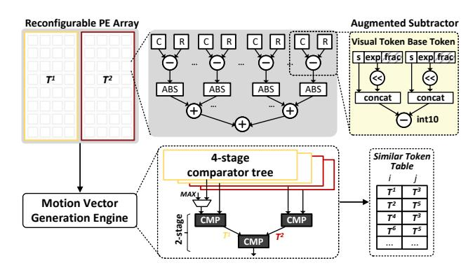
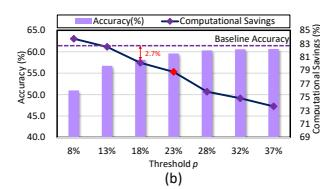
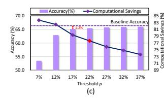
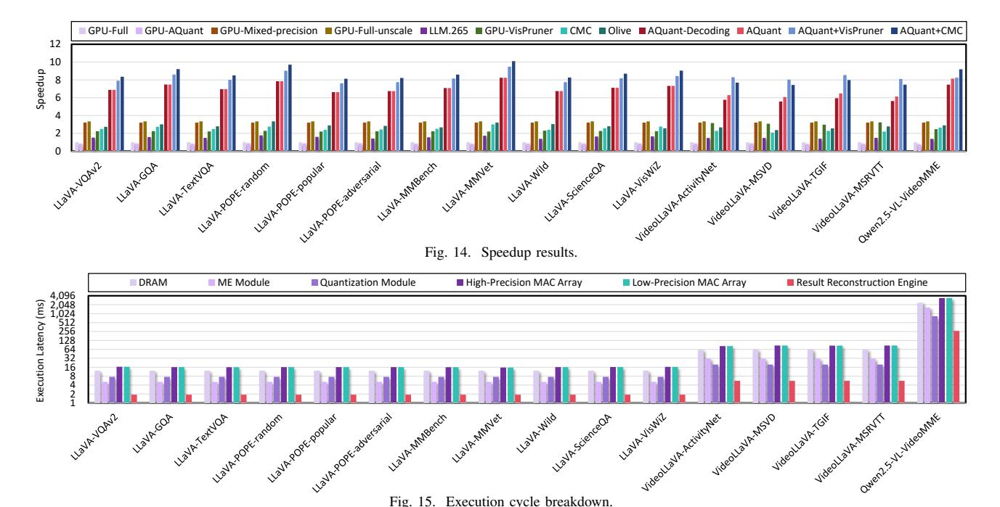
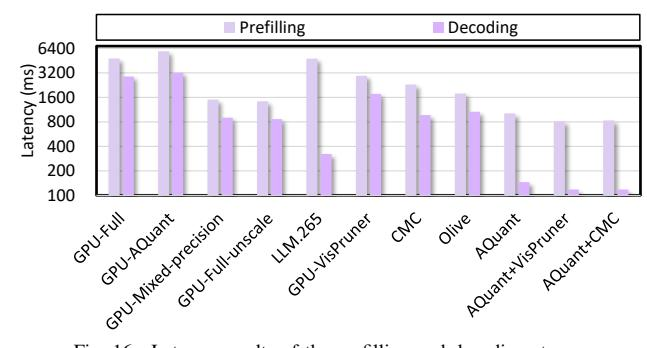
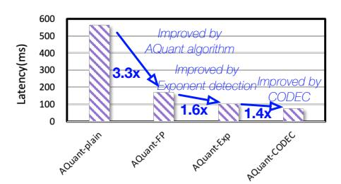

# D. Extending AQuant to the Decoding Stage

The key to achieving high-performance decoding lies in reducing the memory bandwidth consumption of the KV-cache. However, directly applying the procedures described above to the self-attention operation during decoding cannot effectively reduce the KV-cache loading cost, since K and V are floating-point matrices that must first undergo exponent-similarity detection. Therefore, after KV-matrix projection, instead of writing the reconstructed KV-cache back to memory, we re-quantize the KV-cache and then store it in off-chip memory for later use in decoding. Since these data occupy significantly less memory, the proposed design effectively reduces memory traffic per token. The KV-cache values are then reconstructed online when needed. This design decision trades off computing for memory bandwidth, and the benefit evaluation will be discussed in Section V.

## IV. AQUANT ARCHITECTURE

In this section, we explain the AQuant architecture, which specializes the quantization using CODEC and processing the quantized tokens using an NPU. As illustrated in Fig. 8, the input visual tokens are first read from off-chip memory and forwarded to the enhanced CODEC (step A) for similarity detection and base-delta quantization (step B). The resulting quantized data are then dispatched to the NPU (step C) according to their adaptive precision. The NPU consists of two MAC arrays (step D) that performs matrix multiplications on the high- and low-precision deltas. The partial sums from both precisions are forwarded to the accumulation engine to aggregate the results (step D), and the reconstruction engine then combines them with the precomputed base token results to reconstruct the final activations (step P).

## A. Enhanced CODEC Design

To realize our visual token quantization algorithm on a video CODEC with modest hardware overhead, we extend the CODEC in two aspects: (i) adding flexibility for similarity detection, and (ii) augmenting the datapath to process floating-point inputs. The specialized CODEC unit builds upon the design shown in Fig. 5 and described in Section II-B.

**Similarity Detection.** As shown in Fig. 9, we reuse the subtract—and-abs reduction tree in the motion-estimation (ME) module to implement similarity detection for visual tokens. To avoid expensive floating-point operations, we modify the subtract unit to support exponent-similarity detection, as introduced in Section III-A. The unit extracts the exponent field from each floating-point token, computes an approximate magnitude 2exponent via bit shifting, and concatenates it with the sign bit before subtraction. This subtraction is implemented as an INT10 operation.

To explain this design decision: In IEEE 754 single-precision, the exponent field has 8 bits and encodes an effective range of [-127, 128], which in principle could span a very large dynamic range if used directly. However, our profiling of LLM inference workloads shows that the exponents of visual tokens exhibit a much narrower range of [0,8]. Thus,  $2^{\text{exponent}}$  falls into [1,256], which can be represented within 9 bits. After concatenating the sign bit, we obtain a 10-bit value, leading to a compact 10-bit integer representation suitable for the similarity-detection datapath.

**Spatially Shared ME PE.** AQuant exposes a "knob", the number of candidate base tokens (M introduced in Section III-A), to tune the tradeoff between quantization cost and quality. More candidates generally improve similarity matching but also increase distance computation and comparison cost. However, as discussed in Section II-B, the original ME module is hard-wired to evaluate 64 candidate macroblocks using an  $8\times 8$  PE array, which leads to underutilization when we only need, for example, 16 or 32 candidate base tokens.

To support different numbers of base candidates efficiently, we make the ME PE array reconfigurable. We make a  $4\times4$  PE block as the basic reconfigurable block, and no finer granularity is supported. This design decision is made because: 1. fewer than 16 base candidates is over aggressive for quantization; 2. coarser granularity avoids the excessive power/area overhead. Given M candidates, the array allocates  $\lceil \frac{M}{16} \rceil$  such blocks and merges them to form a larger logical PE block, allowing the same  $8\times8$  mesh to serve varying base set sizes. As shown in Fig. 9, given that  $T^1$  and  $T^2$  both have 32 candidate base tokens, respectively, the reconfigurable PE array distributes two  $4\times8$  PE blocks (outlined in yellow and red) for them, occupying the whole PE array.

We similarly adapt the comparator tree in the ME engine to match this  $4\times 4$  granularity. A 4-stage comparator tree is used as the basic comparison unit, taking 16 distances from one  $4\times 4$  PE block and producing the minimum. Multiple such 16-input units can then be composed with an additional 2-stage comparator tree to select minima across several blocks. For each minimum, the corresponding visual token ID i and base token ID j are packed as  $(T^i, T^j)$  entries and written into the similar token table (bottom right of Fig. 9).

**Adaptive Quantization:** We extended the CODEC quantization data path for our adaptive quantization discussed in Section III-B. As shown in Fig. 10(a), the original circuit for INT16 quantization is implemented by an affine transform followed by a right shift and clamping.

Fig. 8. AQuant architecture overview.

Fig. 9. AQuant-extended motion estimation module.

Fig. 10. The details of the quantization module: (a) default mode; (b) adaptive quantization mode.

As illustrated in Fig. 10(b), unlike a full floating-point multiplier with expensive normalization, our quantization module first clamps the mantissa of deltas and the scaling factor from 23 bits down to 16 bits. The truncated mantissa and the exponent then reuse the existing multiplier and adder in the CODEC datapath, while the sign bit pass through an additional XOR gate. The resulting sign bit, exponent, and mantissa are concat and then fed directly into the fp-to-int unit [33] for data casting, without any further floating-point normalization. The cast precision is determined by a bitmask generated by the top-k unit [41], which identifies whether the absolute magnitude

of each delta element belongs to the top p values along the delta vector, as discussed in Section III-B.

The key components in the quantization module are the fpto-int unit and the top-k unit. Specifically, the fp-to-int unit performs floating-point to integer conversion using lightweight combinational logic derived from the rounding algorithm, where the exponent and mantissa fields determine the integer output. We implement it using two 2-to-1 multiplexers, one 7-to-1 multiplexer, one 32-to-1 multiplexer, an AND gate, and 16 registers. The top-k unit first employs a QuickSelect unit to identify the k-th largest element as a threshold, and then filters the input by comparing each element with this threshold to extract the top-k elements. The Quick Select unit follows a pivot-based iterative selection process inspired by the quicksort algorithm, progressively narrowing the candidate set until the k-th largest value is identified. The hardware of the top-k unit consists of three FIFOs, four groups of comparators, an OR gate, an XOR gate, and a 2-to-1 multiplexer.

Fig. 11. The details of MAC arrays.

## B. Sparsity-Supported MAC Array

To process mixed-precision deltas, we separate the quantized deltas into two mutually complementary sparse matrices: a high-precision delta matrix (INT4) and a low-precision delta matrix (INT2). A bitmask generated by the CODEC specifies, for each delta, the MAC array to which it should be routed.

As shown in Fig. 11, each MAC array adopts a row-wise product dataflow. A MAC line is responsible for one output row  $C_{i,:}$  and iteratively accumulates  $C_{i,:} = \sum_k d_{ik} W_{k,:}$ , by streaming one delta element  $\delta_k^i$  and the corresponding weight row  $W_{k,:}$  per cycle. In other words, during each cycle a MAC

Fig. 12. Exploration of the threshold ratio p.

line receives a delta from row i of the delta matrix and the k-th row of the weight matrix, computes  $W_{k,:}\delta_k^i$ , and adds it into the running partial sum for  $C_{i,:}$ . This row-wise product dataflow naturally matches the sparsity pattern of the delta matrices and allows the high- and low-precision arrays to run in parallel.

The key to achieve high hardware utilization is to have a proper hyperparameter p, the fraction of high-precision deltas, p, to avoid stalls on synchronization. If p is too large, the high-precision MAC array becomes the bottleneck; if p is too small, the accuracy of the VLMs may become unacceptable. Our workload-balanced adaptive quantization mechanism enforces a target high/low ratio p:q (with q=1-p) on a per-row basis by selecting the top p deltas in each row as high precision and marking the rest as low precision. The high- and low-precision MAC arrays are then configured to match this p:q ratio. This alignment ensures that both MAC arrays progress in lockstep, as illustrated in Fig. 11(b). We will empirically evaluate different choices of p and their impact on performance and accuracy in Section V.

## C. Result Reconstruction Engine

To support efficient reconstruction, we equip the reconstruction engine with three on-chip buffers and multiple adders. The base buffer stores the precomputed outputs for base tokens, the delta buffer holds the outputs produced from the delta matrices, and the recovery buffer accumulates the reconstructed visual token outputs, thereby reducing off-chip memory traffic. During reconstruction, multiple entries in the similar token table are processed in parallel. For each entry  $(T^i, T^j)$ , the engine reads the feature vector of the base token  $T^j$  from the base buffer and the corresponding delta feature for  $T^i$  from the delta buffer, using different banks to enable feature-level parallelism. The adders sum these features and write the reconstructed results back into the recovery buffer. After all entries have been processed, the recovery buffer contains the final activations for all visual tokens.

## V. EVALUATION

## A. Workloads

To validate the effectiveness of AQuant, we evaluate its performance on three VLM models, including LLaVA [26], VideoLLaVA [25], and Qwen2.5-VL 72B [2] across fourteen datasets. The datasets utilized for evaluation include VQAv2 [10], GQA [16], TextVQA [37], POPE [24], MM-Bench [27], MMVet [47], Wild [26], ScienceQA [28], VisWiZ [13], ActivityNet [48], MSVD [4], TGIF [18], MSRVTT [44], and Video-MME [9].

#### B. AQuant Algorithm Evaluation

**Methodology.** We adopt open-source implementations of the aforementioned VLM models, running on the PyTorch framework [31]. We implement the proposed AQuant algorithm in Python and integrate it into the models' implementations. Note that the AQuant algorithm does not require retraining, making our approach highly deployable without the need for extensive reconfiguration. The required calibration data for threshold selection is 10% of the training dataset. In the experiment, we use INT2 and INT4 for deltas, and INT8 for base tokens.

Accuracy and Selection of Threshold p. To determine the optimal threshold ratio p for adaptive quantization (see Section III-B), we vary p and measure its impact on accuracy and theoretical computational savings. Generally, a large p results in low computational savings but high accuracy, while a smaller p improves performance at the cost of accuracy. Fig. 12 reports the accuracy and computational savings across four benchmarks (VideoLLaVA-MSVD, LLaVA-GQA, LLaVA-ScienceQA, and Qwen2.5-VL-VideoMME) when varying p. These benchmarks are carefully chosen to cover diverse scenarios, including highly dynamic and complex scenes. For the VideoLLaVA-MSVD benchmark (Fig. 12(a)), setting p =20\% leads to a 2.1\% accuracy drop, which is unacceptable. Increasing p to 25% provides a better tradeoff, reducing theoretical computation by  $3.2\times$  compared to the full INT8 model while maintaining acceptable accuracy. For the LLaVA-GQA benchmark (Fig. 12(b)), p = 23% achieves a favorable balance between accuracy and computational savings. Across all benchmarks, p=25% consistently satisfies the accuracy constraint and is close to the hardware-optimal point, while smaller p values may cause noticeable accuracy degradation. Therefore, we set p=25% in the remaining experiments.

Fig. 13. Model accuracy results.

We further evaluate the accuracy of all workloads using p=25% in AQuant. As shown in Fig. 13, AQuant incurs an average accuracy drop of only 0.7% compared to the baseline. Moreover, to demonstrate the necessity of <code>INT2</code> delta quantization in AQuant, we keep p deltas in <code>INT4</code> precision and prune the remaining 1-p deltas (denoted as AQuant-Pruning). This results in an average accuracy degradation of 23% compared to the baseline.

#### C. AQuant Architecture Evaluation

Methodology. To evaluate the performance of the AQuant architecture, we develop a cycle-level simulator to collect the latency statistics of matrix multiplications and the number of buffer accesses for each workload. The simulator is integrated with Ramulator [20] for DRAM timing. We make efforts to ensure the accuracy of the simulator by following the widely adopted open-source simulator, Scale-Sim [34]. Moreover, we implement the proposed AQuant architecture in Verilog and synthesize it by Synopsys Design Compiler to get the chip area and total power under 28nm technology with a frequency of 500MHz. This synthesis process generates a comprehensive report containing the gate-level netlist, timing information, and area breakdown of various components within the AQuant architecture, including the enhanced video CODEC, NPU, and control logic. We also employ CACTI [3] to derive the energy and area of on-chip buffers based on parameters such as bus width, size, and the number of reads/writes. Additionally, we modify OpenASIC [8], an open-source tool for simulating the enhanced video CODEC. AQuant adopts LPDDR4x as the external memory, with 32GB capacity and a bandwidth of 136.5 GB/s, the same configuration as the NVIDIA Jetson AGX Xavier [30].

As shown in Table II, we compare AQuant with several platforms, including a representative edge GPU—NVIDIA Jetson AGX Xavier, a software-only token pruning method VisPruner [49] (denoted as GPU-VisPruner), and three accelerators: CMC [39], LLM.265 [43], and Olive [11].

For a fair comparison with GPUs, we construct three variants: (1) GPU-Full-unscale, the original GPU without any performance scaling; (2) GPU-Full, where the GPU is scaled in the number of compute cores to match the area budget of AQuant; and (3) GPU-Mixed-precision, a hypothetical GPU with native mixed-precision MAC support. For GPU-Fullunscale, we directly measure execution time by running fullprecision VLMs on Jetson AGX Xavier. For GPU-Full, we scale the execution time of GPU-Full-unscale according to the ratio between the number of GPU cores and the compute units in AQuant. We profile GPU execution across all workloads and observe memory bandwidth utilization ranging from 31.4% to 62.8%, indicating that memory is not saturated and the workloads remain primarily compute-bound. Therefore, scaling GPU time by the compute-core ratio does not distort memorybound behavior. According to Fig. 12, AQuant generates 75% INT2 and 25% INT4 deltas. Therefore, to compare with GPU-Mixed-precision, we construct an optimistic analytical upper bound by proportionally scaling throughput relative to a full INT8 model: Speedup=  $\frac{8}{4\times0.25+2\times0.75}=3.2\times$ . This model assumes ideal mixed-precision execution on the GPU without overheads from precision switching or additional control complexity. For CMC, LLM.265, and Olive, we reproduce their algorithms and try our best to build cycle-accurate simulators.

**Speedup.** Fig. 14 reports the performance of the AQuant architecture and several baselines, including GPU-Full, GPU-Full-unscale, GPU-Mixed-precision, GPU running the AQuant algorithm (GPU-AQuant), GPU running Vis-Pruner (GPU-VisPruner), AQuant integrated with VisPruner (AQuant+VisPruner), LLM.265, CMC, Olive, and AQuant integrated with CMC (AQuant+CMC). All results are normalized to GPU-Full. On average, the AQuant architecture achieves  $6.9\times$ ,  $2.1\times$ , and  $2.2\times$  speedup over GPU-Full, GPU-Full-unscale, and GPU-Mixed-precision. The performance improvement stems from several factors: 1) The AQuant algorithm reduces computations and lessens stress on the main memory by lowering the bit-width of deltas. 2) The collaboration between the NPU and the enhanced CODEC enables highly parallelized operations such as Exponent-similarity detection and matrix multiplications. In contrast, the GPU executes kernels serially. 3) The sparsity-supported MAC array along with the workload-balanced adaptive quantization in AQuant can fully exploit the mixed-precision deltas while achieving high hardware utilization.

Additionally, AQuant outperforms GPU-VisPruner, Olive, LLM.265, and CMC by  $2.8\times$ ,  $2.5\times$ ,  $4.6\times$ , and  $2.8\times$  in performance. AQuant is superior to VisPruner for two reasons. First, VisPruner prunes 61.1% visual tokens but still processes the rest in FP16, while AQuant converts tokens to mixed-precision (75% INT2, 25% INT4 deltas, 7.4% INT8 bases), yielding  $2.16\times$  compute reduction. Moreover, the repurposed CODEC and dedicated NPU in AQuant enable more efficient similarity detection and mixed-precision GEMM. AQuant is orthogonal to token pruning method. When combined with VisPruner (denoted as AQuant+VisPruner), we observe  $8.3\times$  speedup over GPU-Full.

AQuant surpasses Olive, LLM.265, and CMC because AQuant provides an end-to-end unified approach for VLM acceleration, while other accelerators optimize only one of the prefilling or decoding stages. AQuant can also be integrated with CMC (denoted as AQuant+CMC), and experimental results show that AQuant+CMC achieves an additional  $3.4\times$  speedup over CMC.

Fig. 14 also evaluates the performance of AQuant when the CODEC is actively decoding videos, during which AQuant cannot be executed simultaneously. To quantify this scenario, we measure the video decoding latency and add it to the AQuant latency (denoted as AQuant-Decoding). Since the CODEC is only used for video processing, this constraint affects VideoLLaVA and Qwen2.5-VL models, but not LLaVA. The results show that video decoding accounts for only 8.3% of the end-to-end VLM inference time, and AQuant-Decoding still achieves  $6.8\times$  speedup over GPU-Full. This indicates that video decoding does not become a performance bottleneck

TABLE II DESCRIPTIONS OF BASELINES.

| Platform    | GPU-Full-unscale       | GPU-Full               | GPU- Mixed-precision | GPU- VisPruner       | CMC         | LLM.265     | Olive        |
|-------------|------------------------|------------------------|-------------------------|-------------------------|-------------|-------------|--------------|
| Category    | Edge GPU               | Edge GPU               | Hypothetical GPU        | Software                | Accelerator | Accelerator | Accelerator  |
| Measurement | PyTorch on Xavier      | Scaled GPU             | Scaled GPU              | Scaled GPU              | Simulation  | Simulation  | Simulation   |
| Description | Baseline VLM on GPU | Baseline VLM on GPU | Baseline VLM on GPU  | Token Pruning on GPU | CODEC+NPU   | CODEC+NPU   | Quantization |

Fig. 15. Execution cycle breakdown.

even when the CODEC is occupied during VLM inference.

Moreover, Fig. 14 validates the necessity of our AQuant architecture, showing that GPU-AQuant suffers from a 15.7% performance loss compared to GPU-Full. Two fundamental limitations contribute to this performance degradation: 1) The AQuant algorithm requires INT2 operations on deltas, which current GPUs cannot support. Consequently, INT2 values must be padded to INT4, diminishing the benefits of low-precision quantization. 2) The matrix multiplications in AQuant involve INT4×INT16 multiplications, leading to mismatched bit-widths of the operands. Current GPUs cannot support this directly through highly optimized APIs; thus, a INT4×INT16 matrix multiplication must be decomposed into four INT4×INT4 matrix multiplications. Although CUDA supports concurrent kernel execution, we have observed that it is difficult to effectively overlap these decomposed kernels, as discussed in previous works[50].

Execution Cycle Breakdown. Fig. 15 illustrates the execution cycle breakdown across hardware components and data movement between modules and DRAM. As stages are pipelined, overall latency is determined by the longest stage latency-the latency of MAC arrays. The results show that the execution times of the high- and low-precision MAC arrays are aligned, demonstrating the effectiveness of our workload-balanced adaptive quantization, which ensures balanced workloads across the two MAC arrays. Moreover, the ME module, quantization module, and result reconstruction engine are 47.8%, 24.3%, and 7.8% of the MAC arrays, respectively. Fortunately, leveraging independent hardware components allows for complete concealment of the execution time of the result reconstruction, exponent-similarity detection, and adaptive quantization by pipelining them with the highand low-precision matrix multiplications.

Fig. 16. Latency results of the prefilling and decoding stages.

**End-to-end Results.** To evaluate the latency reduction of AQuant during the prefilling and decoding stages, we compare the performance of GPU-Full, GPU-Full-unscale, GPU-Mixed-precision, GPU-AQuant, GPU-VisPruner, AQuant+VisPruner, LLM.265, CMC, Olive, AQuant, and AQuant+CMC, as shown in Fig. 16. The results confirm that AQuant achieves a higher speedup than CMC in the decoding stage and a higher speedup than LLM.265 in the prefilling stage, reflecting the specialized roles of CMC and LLM.265, which are primarily optimized for the prefilling and decoding stages, respectively. In contrast, AQuant provides an end-toend acceleration solution, improving performance across both stages. AQuant performs well in both stages because: 1) it leverages adaptive quantization to reduce the computation precision, exchanging more resources for acceleration under the same area budget, and 2) low-precision deltas reduce memory requirements during VLM inference.

Fig. 17. Detailed analysis of contributions.

Detailed analysis of algorithm and architecture contributions. Fig. 17 illustrates the performance gains from our algorithm and architectural designs. Compared to the baseline AQuant version (denoted as AQuant-plain), which runs the INT8 VLM models without any optimizations, the AQuant algorithm with floating-point similarity detection and adaptive quantization (AQuant-FP) achieves a 3.3× speedup due to reduced computations and memory accesses associated with deltas. With the assistance of the exponent-similarity detection, the AQuant architecture (AQuant-Exp) achieves a 1.6× speedup over AQuant-FP as the exponent-based L1 distance calculation can save arithmetic complexity and area. Additionally, AQuant with CODEC (AQuant-CODEC) further results in an additional 1.4× speedup over AQuant-Exp. To explain the performance improvement brought by repurposing the CODEC, we compare the area of the MACs with that of the repurposed CODEC. As shown in Table III, the MACs require  $0.476mm^2 + 0.238mm^2 = 0.714mm^2$ , while the repurposed CODEC needs  $0.138mm^2 + 0.122mm^2 =$  $0.26mm^2$ . This means that if we disable the CODEC and allocate the MAC's area for exponent-similarity prediction and adaptive quantization, we would have only  $0.454mm^2$ available for the computational resources. Compared to this configuration, AQuant with the repurposed CODEC achieves a 36%  $(\frac{0.26mm^2}{0.714mm^2} = 36\%)$  area savings. The saved area can be reallocated to increase the NPU's MAC resources, thus contributing to the  $1.4\times$  performance improvement.

**Hardware Overhead and Area.** Table III provides a comprehensive breakdown of design parameters, area, and power of the AQuant architecture. The low-precision MAC array of

TABLE III
AREA AND POWER OF THE AQUANT ARCHITECTURE.

| AQuant            | Modules                                                                | Area $(mm^2)$ | Power (mW) |
|-------------------|------------------------------------------------------------------------|---------------|------------|
|                   | Low-precision MAC Array $(4 \times (32 \times 32) \text{ INT2 MACs})$  | 0.476         | 164.8      |
| NPU               | High-precision MAC Array $(1 \times (32 \times 32) \text{ INT4 MACs})$ | 0.238         | 82.4       |
|                   | Result Reconstruction Engine                                           | 0.183         | 9.3        |
|                   | On-chip Buffer                                                         | 0.675         | 197.4      |
| Enhanced CODEC | ME Module                                                              | 0.138         | 23.4       |
|                   | Quantization Module                                                    | 0.122         | 21.3       |
|                   | On-chip Buffer                                                         | 0.026         | 11.9       |

the NPU comprises four  $32 \times 32$  INT2×INT16 MACs, and the high-precision MAC array of the NPU comprises a  $32 \times 32$  INT4×INT16 MACs. The hardware resources of the MAC arrays are carefully set based on the threshold p discussed in Section III-B, where p is set to 25%, resulting in a 1:4 ratio of MACs between the two arrays. The result reconstruction engine incorporates three buffers to store INT16 outputs: base tokens, delta matrices, and reconstructed visual tokens, with sizes of  $128 \times 128$ ,  $64 \times 128$ , and  $128 \times 128$ , respectively. These buffers require 16KB, 8KB, and 16KB of SRAM, with bandwidths of 256B, 128B, and 256B, respectively.

We also evaluate the costs of the enhanced CODEC. In order to support the proposed exponent-similarity detection, we enhance the functionality of the existing ME module by designing a new PE, a reconfigurable PE array, a reconfigurable comparator tree, and associated control logic. Additionally, we extend the capabilities of the quantization module. These modifications occupy  $0.26mm^2$  of area.

Energy Efficiency. The energy efficiency outcomes are depicted in Fig. 18. The AQuant architecture delivers remarkable energy efficiency, surpassing GPU-Full, GPU-Full-unscale, GPU-Mixed-precision, GPU-AQuant, GPU-VisPruner, LLM.265, CMC, and Olive by  $7.2 \times$ ,  $2.2 \times$ ,  $2.3 \times$ ,  $8.6\times$ ,  $2.9\times$ ,  $14.0\times$ ,  $2.5\times$ , and  $2.1\times$ , respectively. These substantial savings in energy consumption come from the reduction in considerable computations and off-chip memory accesses related to the deltas. We observe a counterintuitive discrepancy that our optimizations achieve an extremely high energy efficiency than LLM.265, despite the latter being specifically designed for tensor compression in LLMs. This arises because LLM.265 activates nearly all hardware components in the CODEC for data compression, resulting in energy consumption of 97.8/63.5 pJ/bit for compression/decompression, which is even higher than directly loading data from LPDDR4X [23].

# D. Extending AQuant to the Decoding Stage

The key to achieving high-performance decoding lies in reducing the memory bandwidth consumption of the KV-cache. However, directly applying the procedures described above to the self-attention operation during decoding cannot effectively reduce the KV-cache loading cost, since K and V are floating-point matrices that must first undergo exponent-similarity detection. Therefore, after KV-matrix projection, instead of writing the reconstructed KV-cache back to memory, we re-quantize the KV-cache and then store it in off-chip memory for later use in decoding. Since these data occupy significantly less memory, the proposed design effectively reduces memory traffic per token. The KV-cache values are then reconstructed online when needed. This design decision trades off computing for memory bandwidth, and the benefit evaluation will be discussed in Section V.

## IV. AQUANT ARCHITECTURE

In this section, we explain the AQuant architecture, which specializes the quantization using CODEC and processing the quantized tokens using an NPU. As illustrated in Fig. 8, the input visual tokens are first read from off-chip memory and forwarded to the enhanced CODEC (step A) for similarity detection and base-delta quantization (step B). The resulting quantized data are then dispatched to the NPU (step C) according to their adaptive precision. The NPU consists of two MAC arrays (step D) that performs matrix multiplications on the high- and low-precision deltas. The partial sums from both precisions are forwarded to the accumulation engine to aggregate the results (step D), and the reconstruction engine then combines them with the precomputed base token results to reconstruct the final activations (step P).

## A. Enhanced CODEC Design

To realize our visual token quantization algorithm on a video CODEC with modest hardware overhead, we extend the CODEC in two aspects: (i) adding flexibility for similarity detection, and (ii) augmenting the datapath to process floating-point inputs. The specialized CODEC unit builds upon the design shown in Fig. 5 and described in Section II-B.

**Similarity Detection.** As shown in Fig. 9, we reuse the subtract—and-abs reduction tree in the motion-estimation (ME) module to implement similarity detection for visual tokens. To avoid expensive floating-point operations, we modify the subtract unit to support exponent-similarity detection, as introduced in Section III-A. The unit extracts the exponent field from each floating-point token, computes an approximate magnitude 2exponent via bit shifting, and concatenates it with the sign bit before subtraction. This subtraction is implemented as an INT10 operation.

To explain this design decision: In IEEE 754 single-precision, the exponent field has 8 bits and encodes an effective range of [-127, 128], which in principle could span a very large dynamic range if used directly. However, our profiling of LLM inference workloads shows that the exponents of visual tokens exhibit a much narrower range of [0,8]. Thus,  $2^{\text{exponent}}$  falls into [1,256], which can be represented within 9 bits. After concatenating the sign bit, we obtain a 10-bit value, leading to a compact 10-bit integer representation suitable for the similarity-detection datapath.

**Spatially Shared ME PE.** AQuant exposes a "knob", the number of candidate base tokens (M introduced in Section III-A), to tune the tradeoff between quantization cost and quality. More candidates generally improve similarity matching but also increase distance computation and comparison cost. However, as discussed in Section II-B, the original ME module is hard-wired to evaluate 64 candidate macroblocks using an  $8\times 8$  PE array, which leads to underutilization when we only need, for example, 16 or 32 candidate base tokens.

To support different numbers of base candidates efficiently, we make the ME PE array reconfigurable. We make a  $4\times4$  PE block as the basic reconfigurable block, and no finer granularity is supported. This design decision is made because: 1. fewer than 16 base candidates is over aggressive for quantization; 2. coarser granularity avoids the excessive power/area overhead. Given M candidates, the array allocates  $\lceil \frac{M}{16} \rceil$  such blocks and merges them to form a larger logical PE block, allowing the same  $8\times8$  mesh to serve varying base set sizes. As shown in Fig. 9, given that  $T^1$  and  $T^2$  both have 32 candidate base tokens, respectively, the reconfigurable PE array distributes two  $4\times8$  PE blocks (outlined in yellow and red) for them, occupying the whole PE array.

We similarly adapt the comparator tree in the ME engine to match this  $4\times 4$  granularity. A 4-stage comparator tree is used as the basic comparison unit, taking 16 distances from one  $4\times 4$  PE block and producing the minimum. Multiple such 16-input units can then be composed with an additional 2-stage comparator tree to select minima across several blocks. For each minimum, the corresponding visual token ID i and base token ID j are packed as  $(T^i, T^j)$  entries and written into the similar token table (bottom right of Fig. 9).

**Adaptive Quantization:** We extended the CODEC quantization data path for our adaptive quantization discussed in Section III-B. As shown in Fig. 10(a), the original circuit for INT16 quantization is implemented by an affine transform followed by a right shift and clamping.

Fig. 8. AQuant architecture overview.

Fig. 9. AQuant-extended motion estimation module.

Fig. 10. The details of the quantization module: (a) default mode; (b) adaptive quantization mode.

As illustrated in Fig. 10(b), unlike a full floating-point multiplier with expensive normalization, our quantization module first clamps the mantissa of deltas and the scaling factor from 23 bits down to 16 bits. The truncated mantissa and the exponent then reuse the existing multiplier and adder in the CODEC datapath, while the sign bit pass through an additional XOR gate. The resulting sign bit, exponent, and mantissa are concat and then fed directly into the fp-to-int unit [33] for data casting, without any further floating-point normalization. The cast precision is determined by a bitmask generated by the top-k unit [41], which identifies whether the absolute magnitude

of each delta element belongs to the top p values along the delta vector, as discussed in Section III-B.

The key components in the quantization module are the fpto-int unit and the top-k unit. Specifically, the fp-to-int unit performs floating-point to integer conversion using lightweight combinational logic derived from the rounding algorithm, where the exponent and mantissa fields determine the integer output. We implement it using two 2-to-1 multiplexers, one 7-to-1 multiplexer, one 32-to-1 multiplexer, an AND gate, and 16 registers. The top-k unit first employs a QuickSelect unit to identify the k-th largest element as a threshold, and then filters the input by comparing each element with this threshold to extract the top-k elements. The Quick Select unit follows a pivot-based iterative selection process inspired by the quicksort algorithm, progressively narrowing the candidate set until the k-th largest value is identified. The hardware of the top-k unit consists of three FIFOs, four groups of comparators, an OR gate, an XOR gate, and a 2-to-1 multiplexer.

Fig. 11. The details of MAC arrays.

## B. Sparsity-Supported MAC Array

To process mixed-precision deltas, we separate the quantized deltas into two mutually complementary sparse matrices: a high-precision delta matrix (INT4) and a low-precision delta matrix (INT2). A bitmask generated by the CODEC specifies, for each delta, the MAC array to which it should be routed.

As shown in Fig. 11, each MAC array adopts a row-wise product dataflow. A MAC line is responsible for one output row  $C_{i,:}$  and iteratively accumulates  $C_{i,:} = \sum_k d_{ik} W_{k,:}$ , by streaming one delta element  $\delta_k^i$  and the corresponding weight row  $W_{k,:}$  per cycle. In other words, during each cycle a MAC

Fig. 12. Exploration of the threshold ratio p.

line receives a delta from row i of the delta matrix and the k-th row of the weight matrix, computes  $W_{k,:}\delta_k^i$ , and adds it into the running partial sum for  $C_{i,:}$ . This row-wise product dataflow naturally matches the sparsity pattern of the delta matrices and allows the high- and low-precision arrays to run in parallel.

The key to achieve high hardware utilization is to have a proper hyperparameter p, the fraction of high-precision deltas, p, to avoid stalls on synchronization. If p is too large, the high-precision MAC array becomes the bottleneck; if p is too small, the accuracy of the VLMs may become unacceptable. Our workload-balanced adaptive quantization mechanism enforces a target high/low ratio p:q (with q=1-p) on a per-row basis by selecting the top p deltas in each row as high precision and marking the rest as low precision. The high- and low-precision MAC arrays are then configured to match this p:q ratio. This alignment ensures that both MAC arrays progress in lockstep, as illustrated in Fig. 11(b). We will empirically evaluate different choices of p and their impact on performance and accuracy in Section V.

## C. Result Reconstruction Engine

To support efficient reconstruction, we equip the reconstruction engine with three on-chip buffers and multiple adders. The base buffer stores the precomputed outputs for base tokens, the delta buffer holds the outputs produced from the delta matrices, and the recovery buffer accumulates the reconstructed visual token outputs, thereby reducing off-chip memory traffic. During reconstruction, multiple entries in the similar token table are processed in parallel. For each entry  $(T^i, T^j)$ , the engine reads the feature vector of the base token  $T^j$  from the base buffer and the corresponding delta feature for  $T^i$  from the delta buffer, using different banks to enable feature-level parallelism. The adders sum these features and write the reconstructed results back into the recovery buffer. After all entries have been processed, the recovery buffer contains the final activations for all visual tokens.

## V. EVALUATION

## A. Workloads

To validate the effectiveness of AQuant, we evaluate its performance on three VLM models, including LLaVA [26], VideoLLaVA [25], and Qwen2.5-VL 72B [2] across fourteen datasets. The datasets utilized for evaluation include VQAv2 [10], GQA [16], TextVQA [37], POPE [24], MM-Bench [27], MMVet [47], Wild [26], ScienceQA [28], VisWiZ [13], ActivityNet [48], MSVD [4], TGIF [18], MSRVTT [44], and Video-MME [9].

#### B. AQuant Algorithm Evaluation

**Methodology.** We adopt open-source implementations of the aforementioned VLM models, running on the PyTorch framework [31]. We implement the proposed AQuant algorithm in Python and integrate it into the models' implementations. Note that the AQuant algorithm does not require retraining, making our approach highly deployable without the need for extensive reconfiguration. The required calibration data for threshold selection is 10% of the training dataset. In the experiment, we use INT2 and INT4 for deltas, and INT8 for base tokens.

Accuracy and Selection of Threshold p. To determine the optimal threshold ratio p for adaptive quantization (see Section III-B), we vary p and measure its impact on accuracy and theoretical computational savings. Generally, a large p results in low computational savings but high accuracy, while a smaller p improves performance at the cost of accuracy. Fig. 12 reports the accuracy and computational savings across four benchmarks (VideoLLaVA-MSVD, LLaVA-GQA, LLaVA-ScienceQA, and Qwen2.5-VL-VideoMME) when varying p. These benchmarks are carefully chosen to cover diverse scenarios, including highly dynamic and complex scenes. For the VideoLLaVA-MSVD benchmark (Fig. 12(a)), setting p =20\% leads to a 2.1\% accuracy drop, which is unacceptable. Increasing p to 25% provides a better tradeoff, reducing theoretical computation by  $3.2\times$  compared to the full INT8 model while maintaining acceptable accuracy. For the LLaVA-GQA benchmark (Fig. 12(b)), p = 23% achieves a favorable balance between accuracy and computational savings. Across all benchmarks, p=25% consistently satisfies the accuracy constraint and is close to the hardware-optimal point, while smaller p values may cause noticeable accuracy degradation. Therefore, we set p=25% in the remaining experiments.

Fig. 13. Model accuracy results.

We further evaluate the accuracy of all workloads using p=25% in AQuant. As shown in Fig. 13, AQuant incurs an average accuracy drop of only 0.7% compared to the baseline. Moreover, to demonstrate the necessity of <code>INT2</code> delta quantization in AQuant, we keep p deltas in <code>INT4</code> precision and prune the remaining 1-p deltas (denoted as AQuant-Pruning). This results in an average accuracy degradation of 23% compared to the baseline.

#### C. AQuant Architecture Evaluation

Methodology. To evaluate the performance of the AQuant architecture, we develop a cycle-level simulator to collect the latency statistics of matrix multiplications and the number of buffer accesses for each workload. The simulator is integrated with Ramulator [20] for DRAM timing. We make efforts to ensure the accuracy of the simulator by following the widely adopted open-source simulator, Scale-Sim [34]. Moreover, we implement the proposed AQuant architecture in Verilog and synthesize it by Synopsys Design Compiler to get the chip area and total power under 28nm technology with a frequency of 500MHz. This synthesis process generates a comprehensive report containing the gate-level netlist, timing information, and area breakdown of various components within the AQuant architecture, including the enhanced video CODEC, NPU, and control logic. We also employ CACTI [3] to derive the energy and area of on-chip buffers based on parameters such as bus width, size, and the number of reads/writes. Additionally, we modify OpenASIC [8], an open-source tool for simulating the enhanced video CODEC. AQuant adopts LPDDR4x as the external memory, with 32GB capacity and a bandwidth of 136.5 GB/s, the same configuration as the NVIDIA Jetson AGX Xavier [30].

As shown in Table II, we compare AQuant with several platforms, including a representative edge GPU—NVIDIA Jetson AGX Xavier, a software-only token pruning method VisPruner [49] (denoted as GPU-VisPruner), and three accelerators: CMC [39], LLM.265 [43], and Olive [11].

For a fair comparison with GPUs, we construct three variants: (1) GPU-Full-unscale, the original GPU without any performance scaling; (2) GPU-Full, where the GPU is scaled in the number of compute cores to match the area budget of AQuant; and (3) GPU-Mixed-precision, a hypothetical GPU with native mixed-precision MAC support. For GPU-Fullunscale, we directly measure execution time by running fullprecision VLMs on Jetson AGX Xavier. For GPU-Full, we scale the execution time of GPU-Full-unscale according to the ratio between the number of GPU cores and the compute units in AQuant. We profile GPU execution across all workloads and observe memory bandwidth utilization ranging from 31.4% to 62.8%, indicating that memory is not saturated and the workloads remain primarily compute-bound. Therefore, scaling GPU time by the compute-core ratio does not distort memorybound behavior. According to Fig. 12, AQuant generates 75% INT2 and 25% INT4 deltas. Therefore, to compare with GPU-Mixed-precision, we construct an optimistic analytical upper bound by proportionally scaling throughput relative to a full INT8 model: Speedup=  $\frac{8}{4\times0.25+2\times0.75}=3.2\times$ . This model assumes ideal mixed-precision execution on the GPU without overheads from precision switching or additional control complexity. For CMC, LLM.265, and Olive, we reproduce their algorithms and try our best to build cycle-accurate simulators.

**Speedup.** Fig. 14 reports the performance of the AQuant architecture and several baselines, including GPU-Full, GPU-Full-unscale, GPU-Mixed-precision, GPU running the AQuant algorithm (GPU-AQuant), GPU running Vis-Pruner (GPU-VisPruner), AQuant integrated with VisPruner (AQuant+VisPruner), LLM.265, CMC, Olive, and AQuant integrated with CMC (AQuant+CMC). All results are normalized to GPU-Full. On average, the AQuant architecture achieves  $6.9\times$ ,  $2.1\times$ , and  $2.2\times$  speedup over GPU-Full, GPU-Full-unscale, and GPU-Mixed-precision. The performance improvement stems from several factors: 1) The AQuant algorithm reduces computations and lessens stress on the main memory by lowering the bit-width of deltas. 2) The collaboration between the NPU and the enhanced CODEC enables highly parallelized operations such as Exponent-similarity detection and matrix multiplications. In contrast, the GPU executes kernels serially. 3) The sparsity-supported MAC array along with the workload-balanced adaptive quantization in AQuant can fully exploit the mixed-precision deltas while achieving high hardware utilization.

Additionally, AQuant outperforms GPU-VisPruner, Olive, LLM.265, and CMC by  $2.8\times$ ,  $2.5\times$ ,  $4.6\times$ , and  $2.8\times$  in performance. AQuant is superior to VisPruner for two reasons. First, VisPruner prunes 61.1% visual tokens but still processes the rest in FP16, while AQuant converts tokens to mixed-precision (75% INT2, 25% INT4 deltas, 7.4% INT8 bases), yielding  $2.16\times$  compute reduction. Moreover, the repurposed CODEC and dedicated NPU in AQuant enable more efficient similarity detection and mixed-precision GEMM. AQuant is orthogonal to token pruning method. When combined with VisPruner (denoted as AQuant+VisPruner), we observe  $8.3\times$  speedup over GPU-Full.

AQuant surpasses Olive, LLM.265, and CMC because AQuant provides an end-to-end unified approach for VLM acceleration, while other accelerators optimize only one of the prefilling or decoding stages. AQuant can also be integrated with CMC (denoted as AQuant+CMC), and experimental results show that AQuant+CMC achieves an additional  $3.4\times$  speedup over CMC.

Fig. 14 also evaluates the performance of AQuant when the CODEC is actively decoding videos, during which AQuant cannot be executed simultaneously. To quantify this scenario, we measure the video decoding latency and add it to the AQuant latency (denoted as AQuant-Decoding). Since the CODEC is only used for video processing, this constraint affects VideoLLaVA and Qwen2.5-VL models, but not LLaVA. The results show that video decoding accounts for only 8.3% of the end-to-end VLM inference time, and AQuant-Decoding still achieves  $6.8\times$  speedup over GPU-Full. This indicates that video decoding does not become a performance bottleneck

TABLE II DESCRIPTIONS OF BASELINES.

| Platform    | GPU-Full-unscale       | GPU-Full               | GPU- Mixed-precision | GPU- VisPruner       | CMC         | LLM.265     | Olive        |
|-------------|------------------------|------------------------|-------------------------|-------------------------|-------------|-------------|--------------|
| Category    | Edge GPU               | Edge GPU               | Hypothetical GPU        | Software                | Accelerator | Accelerator | Accelerator  |
| Measurement | PyTorch on Xavier      | Scaled GPU             | Scaled GPU              | Scaled GPU              | Simulation  | Simulation  | Simulation   |
| Description | Baseline VLM on GPU | Baseline VLM on GPU | Baseline VLM on GPU  | Token Pruning on GPU | CODEC+NPU   | CODEC+NPU   | Quantization |

Fig. 15. Execution cycle breakdown.

even when the CODEC is occupied during VLM inference.

Moreover, Fig. 14 validates the necessity of our AQuant architecture, showing that GPU-AQuant suffers from a 15.7% performance loss compared to GPU-Full. Two fundamental limitations contribute to this performance degradation: 1) The AQuant algorithm requires INT2 operations on deltas, which current GPUs cannot support. Consequently, INT2 values must be padded to INT4, diminishing the benefits of low-precision quantization. 2) The matrix multiplications in AQuant involve INT4×INT16 multiplications, leading to mismatched bit-widths of the operands. Current GPUs cannot support this directly through highly optimized APIs; thus, a INT4×INT16 matrix multiplication must be decomposed into four INT4×INT4 matrix multiplications. Although CUDA supports concurrent kernel execution, we have observed that it is difficult to effectively overlap these decomposed kernels, as discussed in previous works[50].

Execution Cycle Breakdown. Fig. 15 illustrates the execution cycle breakdown across hardware components and data movement between modules and DRAM. As stages are pipelined, overall latency is determined by the longest stage latency-the latency of MAC arrays. The results show that the execution times of the high- and low-precision MAC arrays are aligned, demonstrating the effectiveness of our workload-balanced adaptive quantization, which ensures balanced workloads across the two MAC arrays. Moreover, the ME module, quantization module, and result reconstruction engine are 47.8%, 24.3%, and 7.8% of the MAC arrays, respectively. Fortunately, leveraging independent hardware components allows for complete concealment of the execution time of the result reconstruction, exponent-similarity detection, and adaptive quantization by pipelining them with the highand low-precision matrix multiplications.

Fig. 16. Latency results of the prefilling and decoding stages.

**End-to-end Results.** To evaluate the latency reduction of AQuant during the prefilling and decoding stages, we compare the performance of GPU-Full, GPU-Full-unscale, GPU-Mixed-precision, GPU-AQuant, GPU-VisPruner, AQuant+VisPruner, LLM.265, CMC, Olive, AQuant, and AQuant+CMC, as shown in Fig. 16. The results confirm that AQuant achieves a higher speedup than CMC in the decoding stage and a higher speedup than LLM.265 in the prefilling stage, reflecting the specialized roles of CMC and LLM.265, which are primarily optimized for the prefilling and decoding stages, respectively. In contrast, AQuant provides an end-toend acceleration solution, improving performance across both stages. AQuant performs well in both stages because: 1) it leverages adaptive quantization to reduce the computation precision, exchanging more resources for acceleration under the same area budget, and 2) low-precision deltas reduce memory requirements during VLM inference.

Fig. 17. Detailed analysis of contributions.

Detailed analysis of algorithm and architecture contributions. Fig. 17 illustrates the performance gains from our algorithm and architectural designs. Compared to the baseline AQuant version (denoted as AQuant-plain), which runs the INT8 VLM models without any optimizations, the AQuant algorithm with floating-point similarity detection and adaptive quantization (AQuant-FP) achieves a 3.3× speedup due to reduced computations and memory accesses associated with deltas. With the assistance of the exponent-similarity detection, the AQuant architecture (AQuant-Exp) achieves a 1.6× speedup over AQuant-FP as the exponent-based L1 distance calculation can save arithmetic complexity and area. Additionally, AQuant with CODEC (AQuant-CODEC) further results in an additional 1.4× speedup over AQuant-Exp. To explain the performance improvement brought by repurposing the CODEC, we compare the area of the MACs with that of the repurposed CODEC. As shown in Table III, the MACs require  $0.476mm^2 + 0.238mm^2 = 0.714mm^2$ , while the repurposed CODEC needs  $0.138mm^2 + 0.122mm^2 =$  $0.26mm^2$ . This means that if we disable the CODEC and allocate the MAC's area for exponent-similarity prediction and adaptive quantization, we would have only  $0.454mm^2$ available for the computational resources. Compared to this configuration, AQuant with the repurposed CODEC achieves a 36%  $(\frac{0.26mm^2}{0.714mm^2} = 36\%)$  area savings. The saved area can be reallocated to increase the NPU's MAC resources, thus contributing to the  $1.4\times$  performance improvement.

**Hardware Overhead and Area.** Table III provides a comprehensive breakdown of design parameters, area, and power of the AQuant architecture. The low-precision MAC array of

TABLE III
AREA AND POWER OF THE AQUANT ARCHITECTURE.

| AQuant            | Modules                                                                | Area $(mm^2)$ | Power (mW) |
|-------------------|------------------------------------------------------------------------|---------------|------------|
|                   | Low-precision MAC Array $(4 \times (32 \times 32) \text{ INT2 MACs})$  | 0.476         | 164.8      |
| NPU               | High-precision MAC Array $(1 \times (32 \times 32) \text{ INT4 MACs})$ | 0.238         | 82.4       |
|                   | Result Reconstruction Engine                                           | 0.183         | 9.3        |
|                   | On-chip Buffer                                                         | 0.675         | 197.4      |
| Enhanced CODEC | ME Module                                                              | 0.138         | 23.4       |
|                   | Quantization Module                                                    | 0.122         | 21.3       |
|                   | On-chip Buffer                                                         | 0.026         | 11.9       |

the NPU comprises four  $32 \times 32$  INT2×INT16 MACs, and the high-precision MAC array of the NPU comprises a  $32 \times 32$  INT4×INT16 MACs. The hardware resources of the MAC arrays are carefully set based on the threshold p discussed in Section III-B, where p is set to 25%, resulting in a 1:4 ratio of MACs between the two arrays. The result reconstruction engine incorporates three buffers to store INT16 outputs: base tokens, delta matrices, and reconstructed visual tokens, with sizes of  $128 \times 128$ ,  $64 \times 128$ , and  $128 \times 128$ , respectively. These buffers require 16KB, 8KB, and 16KB of SRAM, with bandwidths of 256B, 128B, and 256B, respectively.

We also evaluate the costs of the enhanced CODEC. In order to support the proposed exponent-similarity detection, we enhance the functionality of the existing ME module by designing a new PE, a reconfigurable PE array, a reconfigurable comparator tree, and associated control logic. Additionally, we extend the capabilities of the quantization module. These modifications occupy  $0.26mm^2$  of area.

Energy Efficiency. The energy efficiency outcomes are depicted in Fig. 18. The AQuant architecture delivers remarkable energy efficiency, surpassing GPU-Full, GPU-Full-unscale, GPU-Mixed-precision, GPU-AQuant, GPU-VisPruner, LLM.265, CMC, and Olive by  $7.2 \times$ ,  $2.2 \times$ ,  $2.3 \times$ ,  $8.6\times$ ,  $2.9\times$ ,  $14.0\times$ ,  $2.5\times$ , and  $2.1\times$ , respectively. These substantial savings in energy consumption come from the reduction in considerable computations and off-chip memory accesses related to the deltas. We observe a counterintuitive discrepancy that our optimizations achieve an extremely high energy efficiency than LLM.265, despite the latter being specifically designed for tensor compression in LLMs. This arises because LLM.265 activates nearly all hardware components in the CODEC for data compression, resulting in energy consumption of 97.8/63.5 pJ/bit for compression/decompression, which is even higher than directly loading data from LPDDR4X [23].

