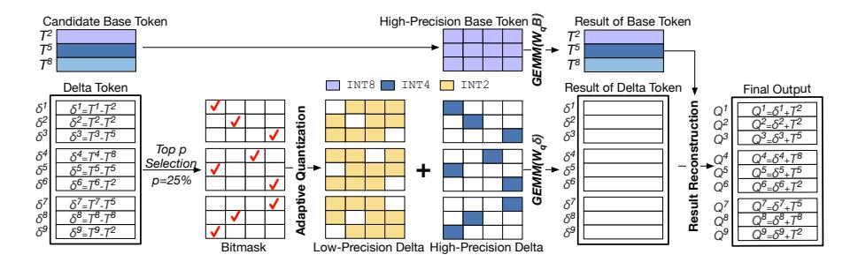

# III. AQUANT ALGORITHM

In this section, our Adaptive Quantization algorithm will be explained. This algorithm dynamically quantizes runtimegenerated visual tokens and KV-caches, which enables *end-to-end and unified* compute/memory savings for both prefilling and decoding. Note that our approach focuses on dynamic tokens and KV-caches, and is orthogonal to the existing static weight quantization [11].

 $TABLE \ I \\ Area/power \ breakdown \ on \ naive \ FP \ quantization.$ 

| Modules                                    | Area (mm 2 ) | Power (mW) |
|--------------------------------------------|-------------------------|------------|
| Systolic Array (64 2 -INT8 MAC) | 1.672                   | 560.4      |
| Similarity Detect+Quant (FP32)             | 1.269                   | 422.7      |

We first explain how this algorithm quantizes the input visual tokens in the prefilling stage in Section III-A — III-C, which comprises three phases:

- The smallest distance is *approximated* by floating-point exponent differences.
- Similar tokens are *adaptively quantized* into different lower bits to preserve accuracy.
- Finally, after processing the linear layer computation in quantized lower bits, the results are *reconstructed* back to floating-point for further operations.

Afterwards, we demonstrate how these quantized data is used to save memory traffic in decoding stage in Section III-D.

The proposed AQuant algorithm aims to provide a hardware-friendly flow to quantize and de-quantize the linear operations in each transformer layer. This flow can later be seamlessly deployed onto existing hardware units—the video CODEC, as detailed in Section IV-A.

## A. Exponent-Similarity Detection (ME & CE)

As shown in Fig. 6, we use Q-matrix projection,  $Q=W_qT$ , as a representative example to demonstrate how our algorithm is applied to input visual tokens during prefilling. The same procedure can be extended to other linear layers by applying to the right matrix. To leverage the data similarity, AQuant adopts a base-delta quantization: The visual tokens, T, are approximated by two parts,  $T\approx B+\delta$ , where B are base tokens, and  $\delta$  are the similar deltas that can be encoded in narrower bits.

**Base Token Selection:** Assuming there are N visual tokens, and each token is represented as a K-dimensional vector, we select M candidate base tokens from them, where M is a predefined hyperparameter for the quantization algorithm, as well as the underlying hardware design parameter. For every F consecutive tokens, where  $F = \lfloor \frac{N}{M} \rfloor$ , the middle token is chosen, resulting in a total of M candidates. Then we

Fig. 7. The details of the adaptive quantization and result reconstruction.

calculate the L1 distance between each visual token  $T^i$  and each candidate base token  $T^j$ :

$$D^{i,j} = \sum_{k=0}^{K-1} |T_k^i - T_k^j|$$

where  $0 \le i < N$  and  $0 \le j < M$ .

To create the delta of visual token  $T^i$  ( $\delta^i$ ) with the narrowest possible distribution, the candidate base token  $T^j$  with the smallest distance is selected as the base token ( $B^i = T^j$ ). The corresponding  $\delta^i$  is then computed as

$$\delta^i = T^i - B^i = T^i - T^j$$

which will be used for base-delta quantization.

The processes of computing  $D^{i,j}$  and  $\delta^i$  reveal high similarity to ME and MC phases in H.265. However, as discussed above, CODEC is designed for integer quantization, while input visual tokens are floating-point. Naively integrating floating point to a CODEC unit leads to expensive power/area overhead as shown in Table I. To sustain a  $64 \times 64$  systolic array, a 64-wide subtract—and-abs reduction tree (abbreviated as Similarity Detect in the table) and a 64-lane FP32 cast (abbreviated as Quant in the table) shall be implemented. These two together cost 43% of the on-chip area, which urges us to find a more efficient approach to similarity detection and quantization.

**Exponent-Similarity Approximation:** Our insight is that the exponent field of a floating-point number encodes the "order of magnitude", which often dominates the differences between two numbers. Thus, instead of performing full floating-point operations to compute the L1 distance, we use the differences between their exponents to approximate the similarity between tokens. We denote  $\bar{T}$  as the exponent field of tokens, and the approximated similarity can be defined as the L1 distance among exponents:

$$\bar{D}^{i,j} = \sum_{k=0}^{K-1} |sign(T_k^i) \times 2^{\bar{T}_k^i} - sign(T_k^j) \times 2^{\bar{T}_k^j}|$$

This approach captures the "order" of the values using integer shifts and subtractions, which significantly reduces arithmetic complexity. Fig. 6 illustrates the process of Exponent-similarity detection. We begin by designating  $T^2$ ,  $T^5$ , and  $T^8$  as candidate base tokens. Next, we approximate the L1 distances between three candidate base tokens and all visual tokens using their sign and exponent bits, which produce a  $9\times 3$  distance matrix. We then compare the distances to estimate the base token for each visual token. Take the first row of the distance matrix (mathematically represented as  $\bar{D}^{1,:}$ ) as an example, we find that the minimal distance value is located in the first column, implying that  $T^2$  is similar to token  $T_1$ . Therefore, we construct the corresponding delta token by subtracting the base token  $T_2$  from  $T_1$  ( $\delta^1 = T^1 - T^2$ ).

This exponent approximation introduces new challenges into hardware: For example, an IEEE 754 single-precision exponent ranges from [-127,128], which means a  $2^{exponent}$  arithmetic operation may still span up to 256-bit scale, which requires additional attention to manage the range efficiently in hardware. Our profiling reveals that during inference, the exponents of visual tokens exhibit a narrow dynamic range, typically confined within [0,8], which will be further discussed in Section IV-A.

## B. Adaptive Quantization

After generating  $\delta$ , each element in  $\delta$  should be encoded using the minimal bitwidth while maintaining accuracy. To achieve this, we made a workload-balanced adaptive quantization. Given a predefined threshold ratio p, for each delta vector  $\delta^i$ , the top p portion of elements with the largest magnitudes are quantized to INT4, and the remaining (1-p) portion is quantized to INT2. p selection will be discussed in our evaluation, Section V. These quantized deltas with different precision construct two mutually complementary sparse matrices. As manifested in Fig. 7, we set the threshold ratio p as 25%, marking the elements with large magnitudes using a bitmask. Subsequently, INT2 quantization (represented by yellow blocks) is applied to small delta values, and INT4 quantization (represented by blue blocks) is applied to large delta values.

For M candidate base tokens that wait to act as the base tokens, higher precision (INT8) is adopted to preserve accuracy. These high-precision candidate base tokens are then multiplied by the weight matrix  $W_q$  for high-precision GEMM

operations, as the resulting output features are critical for reconstructing the final results.

#### C. Result Reconstruction

As discussed above, applying the weight matrix  $W_q$  to quantized visual tokens becomes  $W_qB+W_q\delta$ . As the base token B belongs to one of M candidate base tokens, which constitute only a small subset of all visual tokens,  $W_qB$ 's computation can be eliminated at runtime by directly selecting the results from precomputed candidate base tokens. Given the data similarity among the input visual tokens,  $\delta$  can be encoded with fewer bits, allowing  $W_q\delta$  to be computed at a lower cost. Summing both terms,  $W_qB$  and  $W_q\delta$ , we can reconstruct the final Q matrix.

# III. AQUANT ALGORITHM

In this section, our Adaptive Quantization algorithm will be explained. This algorithm dynamically quantizes runtimegenerated visual tokens and KV-caches, which enables *end-to-end and unified* compute/memory savings for both prefilling and decoding. Note that our approach focuses on dynamic tokens and KV-caches, and is orthogonal to the existing static weight quantization [11].

 $TABLE \ I \\ Area/power \ breakdown \ on \ naive \ FP \ quantization.$ 

| Modules                                    | Area (mm 2 ) | Power (mW) |
|--------------------------------------------|-------------------------|------------|
| Systolic Array (64 2 -INT8 MAC) | 1.672                   | 560.4      |
| Similarity Detect+Quant (FP32)             | 1.269                   | 422.7      |

We first explain how this algorithm quantizes the input visual tokens in the prefilling stage in Section III-A — III-C, which comprises three phases:

- The smallest distance is *approximated* by floating-point exponent differences.
- Similar tokens are *adaptively quantized* into different lower bits to preserve accuracy.
- Finally, after processing the linear layer computation in quantized lower bits, the results are *reconstructed* back to floating-point for further operations.

Afterwards, we demonstrate how these quantized data is used to save memory traffic in decoding stage in Section III-D.

The proposed AQuant algorithm aims to provide a hardware-friendly flow to quantize and de-quantize the linear operations in each transformer layer. This flow can later be seamlessly deployed onto existing hardware units—the video CODEC, as detailed in Section IV-A.

## A. Exponent-Similarity Detection (ME & CE)

As shown in Fig. 6, we use Q-matrix projection,  $Q=W_qT$ , as a representative example to demonstrate how our algorithm is applied to input visual tokens during prefilling. The same procedure can be extended to other linear layers by applying to the right matrix. To leverage the data similarity, AQuant adopts a base-delta quantization: The visual tokens, T, are approximated by two parts,  $T\approx B+\delta$ , where B are base tokens, and  $\delta$  are the similar deltas that can be encoded in narrower bits.

**Base Token Selection:** Assuming there are N visual tokens, and each token is represented as a K-dimensional vector, we select M candidate base tokens from them, where M is a predefined hyperparameter for the quantization algorithm, as well as the underlying hardware design parameter. For every F consecutive tokens, where  $F = \lfloor \frac{N}{M} \rfloor$ , the middle token is chosen, resulting in a total of M candidates. Then we

Fig. 7. The details of the adaptive quantization and result reconstruction.

calculate the L1 distance between each visual token  $T^i$  and each candidate base token  $T^j$ :

$$D^{i,j} = \sum_{k=0}^{K-1} |T_k^i - T_k^j|$$

where  $0 \le i < N$  and  $0 \le j < M$ .

To create the delta of visual token  $T^i$  ( $\delta^i$ ) with the narrowest possible distribution, the candidate base token  $T^j$  with the smallest distance is selected as the base token ( $B^i = T^j$ ). The corresponding  $\delta^i$  is then computed as

$$\delta^i = T^i - B^i = T^i - T^j$$

which will be used for base-delta quantization.

The processes of computing  $D^{i,j}$  and  $\delta^i$  reveal high similarity to ME and MC phases in H.265. However, as discussed above, CODEC is designed for integer quantization, while input visual tokens are floating-point. Naively integrating floating point to a CODEC unit leads to expensive power/area overhead as shown in Table I. To sustain a  $64 \times 64$  systolic array, a 64-wide subtract—and-abs reduction tree (abbreviated as Similarity Detect in the table) and a 64-lane FP32 cast (abbreviated as Quant in the table) shall be implemented. These two together cost 43% of the on-chip area, which urges us to find a more efficient approach to similarity detection and quantization.

**Exponent-Similarity Approximation:** Our insight is that the exponent field of a floating-point number encodes the "order of magnitude", which often dominates the differences between two numbers. Thus, instead of performing full floating-point operations to compute the L1 distance, we use the differences between their exponents to approximate the similarity between tokens. We denote  $\bar{T}$  as the exponent field of tokens, and the approximated similarity can be defined as the L1 distance among exponents:

$$\bar{D}^{i,j} = \sum_{k=0}^{K-1} |sign(T_k^i) \times 2^{\bar{T}_k^i} - sign(T_k^j) \times 2^{\bar{T}_k^j}|$$

This approach captures the "order" of the values using integer shifts and subtractions, which significantly reduces arithmetic complexity. Fig. 6 illustrates the process of Exponent-similarity detection. We begin by designating  $T^2$ ,  $T^5$ , and  $T^8$  as candidate base tokens. Next, we approximate the L1 distances between three candidate base tokens and all visual tokens using their sign and exponent bits, which produce a  $9\times 3$  distance matrix. We then compare the distances to estimate the base token for each visual token. Take the first row of the distance matrix (mathematically represented as  $\bar{D}^{1,:}$ ) as an example, we find that the minimal distance value is located in the first column, implying that  $T^2$  is similar to token  $T_1$ . Therefore, we construct the corresponding delta token by subtracting the base token  $T_2$  from  $T_1$  ( $\delta^1 = T^1 - T^2$ ).

This exponent approximation introduces new challenges into hardware: For example, an IEEE 754 single-precision exponent ranges from [-127,128], which means a  $2^{exponent}$  arithmetic operation may still span up to 256-bit scale, which requires additional attention to manage the range efficiently in hardware. Our profiling reveals that during inference, the exponents of visual tokens exhibit a narrow dynamic range, typically confined within [0,8], which will be further discussed in Section IV-A.

## B. Adaptive Quantization

After generating  $\delta$ , each element in  $\delta$  should be encoded using the minimal bitwidth while maintaining accuracy. To achieve this, we made a workload-balanced adaptive quantization. Given a predefined threshold ratio p, for each delta vector  $\delta^i$ , the top p portion of elements with the largest magnitudes are quantized to INT4, and the remaining (1-p) portion is quantized to INT2. p selection will be discussed in our evaluation, Section V. These quantized deltas with different precision construct two mutually complementary sparse matrices. As manifested in Fig. 7, we set the threshold ratio p as 25%, marking the elements with large magnitudes using a bitmask. Subsequently, INT2 quantization (represented by yellow blocks) is applied to small delta values, and INT4 quantization (represented by blue blocks) is applied to large delta values.

For M candidate base tokens that wait to act as the base tokens, higher precision (INT8) is adopted to preserve accuracy. These high-precision candidate base tokens are then multiplied by the weight matrix  $W_q$  for high-precision GEMM

operations, as the resulting output features are critical for reconstructing the final results.

#### C. Result Reconstruction

As discussed above, applying the weight matrix  $W_q$  to quantized visual tokens becomes  $W_qB+W_q\delta$ . As the base token B belongs to one of M candidate base tokens, which constitute only a small subset of all visual tokens,  $W_qB$ 's computation can be eliminated at runtime by directly selecting the results from precomputed candidate base tokens. Given the data similarity among the input visual tokens,  $\delta$  can be encoded with fewer bits, allowing  $W_q\delta$  to be computed at a lower cost. Summing both terms,  $W_qB$  and  $W_q\delta$ , we can reconstruct the final Q matrix.

