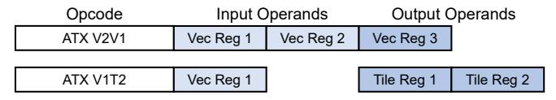

# B. ATX Instructions

The ATX instructions and the core pipeline extensions needed to support them are NCA-agnostic and reusable across different NCAs. The ATX instruction format consists of (1) an opcode that determines the number and type of input/output operands, (2) input architectural register operands, and (3) output architectural register operands. Figure 5 shows two example instructions. The opcode of the first instruction (ATX V2VI) means that the instruction has two input vector register operands and one output vector register operand. The opcode of the second instruction (ATX V1T2) means that the instruction has one input vector register operand and two output tile register operands (using AMX terminology [38]). We use ATX instructions with a different number and type of input and output register operands to accommodate the diversity in NCA tasks. The input operands carry the type of the task and information needed by the UTE to generate the

Fig. 5: ATX instruction format for two example instructions.

Fig. 6: Pipeline extensions to support ATX instructions.

input memory addresses (Section IV). They may additionally include control data that is transferred directly to the NCA. When the instruction completes, the NCA output is written to the output operand registers.

To support the ATX instructions, the core pipeline is extended with an ATX scheduler as shown in Figure 6. It consists of: (1) the ATX Queue, which contains information about the ATX instructions in the ROB, (2) ATX Reservation Stations that participate in the core's wake-up logic, and (3) scheduling logic that issues ATX instructions to the ATX Port once their (renamed) input registers are ready. After the instructions are issued to the ATX Port, they are sent to an internal queue in the UTE. If this queue is full, a structural hazard prevents further ATX instructions from being issued. When an ATX instruction completes, the UTE returns the output to the core, which is then written to the physical register file. Note that, although in our work we have used a single port for the UTE, multiple ATX ports are possible. ATX instructions are committed inorder with the other instructions.

Figure 6 shows the status of 4 ATX instructions and a regular load in a core's ROB. In contrast to Figure 2, ATX instructions do not have to reach the ROB head to be issued to the NCA. ATX instructions can be issued out-of-order, as long as their dependencies are resolved. Further, the need for fences is eliminated and regular loads can be issued freely. The figure shows that ATX Ins1 has completed but not retired, ATX Ins2 is in a reservation station because it depends on an input that is not yet available, ATX Ins3 has already been issued to the UTE, and ATX Ins4 is currently being issued from a reservation station to the UTE.

# B. ATX Instructions

The ATX instructions and the core pipeline extensions needed to support them are NCA-agnostic and reusable across different NCAs. The ATX instruction format consists of (1) an opcode that determines the number and type of input/output operands, (2) input architectural register operands, and (3) output architectural register operands. Figure 5 shows two example instructions. The opcode of the first instruction (ATX V2VI) means that the instruction has two input vector register operands and one output vector register operand. The opcode of the second instruction (ATX V1T2) means that the instruction has one input vector register operand and two output tile register operands (using AMX terminology [38]). We use ATX instructions with a different number and type of input and output register operands to accommodate the diversity in NCA tasks. The input operands carry the type of the task and information needed by the UTE to generate the

Fig. 5: ATX instruction format for two example instructions.

Fig. 6: Pipeline extensions to support ATX instructions.

input memory addresses (Section IV). They may additionally include control data that is transferred directly to the NCA. When the instruction completes, the NCA output is written to the output operand registers.

To support the ATX instructions, the core pipeline is extended with an ATX scheduler as shown in Figure 6. It consists of: (1) the ATX Queue, which contains information about the ATX instructions in the ROB, (2) ATX Reservation Stations that participate in the core's wake-up logic, and (3) scheduling logic that issues ATX instructions to the ATX Port once their (renamed) input registers are ready. After the instructions are issued to the ATX Port, they are sent to an internal queue in the UTE. If this queue is full, a structural hazard prevents further ATX instructions from being issued. When an ATX instruction completes, the UTE returns the output to the core, which is then written to the physical register file. Note that, although in our work we have used a single port for the UTE, multiple ATX ports are possible. ATX instructions are committed inorder with the other instructions.

Figure 6 shows the status of 4 ATX instructions and a regular load in a core's ROB. In contrast to Figure 2, ATX instructions do not have to reach the ROB head to be issued to the NCA. ATX instructions can be issued out-of-order, as long as their dependencies are resolved. Further, the need for fences is eliminated and regular loads can be issued freely. The figure shows that ATX Ins1 has completed but not retired, ATX Ins2 is in a reservation station because it depends on an input that is not yet available, ATX Ins3 has already been issued to the UTE, and ATX Ins4 is currently being issued from a reservation station to the UTE.

