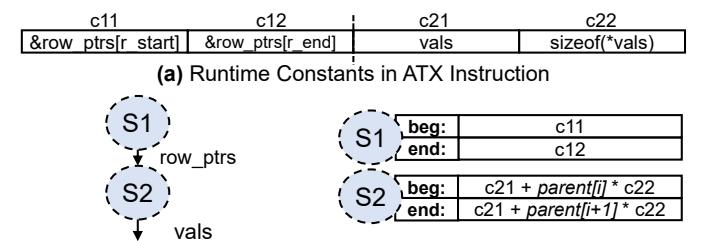

# C. Memory Consistency Implications of ATX Instructions

ATX instructions do not affect the possible orderings between regular (non-ATX) loads and stores in a TSO-consistent system. However, the loads in a task started by an ATX instruction (i.e., ATX Task loads), have more relaxed memory consistency semantics. Such loads are not tracked by the core's load queue and, therefore, do not get squashed and replayed if a cache line accessed by the task gets evicted from the local caches or receives an invalidation. As a result, ATX Task

loads appear weakly-ordered with respect to other ATX Task loads and with respect to normal core loads. This behavior is exposed as part of the ATX memory model, such that programmers and compiler developers can add appropriate synchronization code if stronger ordering is needed.

A second issue with ATX instructions relates to store-toload forwarding. An ATX Task load cannot read data from stores currently residing in the core's store queue or store buffer. The reason is that the load is issued by the UTE, and the UTE does not have access to the core's store queue or store buffer. The load always reads data directly from the L2 cache. To ensure that the ATX Task loads do not read stale data, the programmer or compiler must add a fence between a store and a subsequent ATX instruction that could start a task that consumes data produced by the store. This situation should be avoided, as it cancels out the benefit of speculative execution of ATX instructions. Hence, during the execution of a kernel, any data that the core generates for an NCA should preferably be communicated through input registers rather than through memory. Communication through registers is handled correctly by the existing dependency checking mechanism in the core without needing fences.

#### IV. THE UNIFIED TRANSFER ENGINE (UTE)

<span id="page-4-0"></span>This section details the ATX Unified Transfer Engine (UTE).

## A. Main Idea

The UTE is an out-of-core module that interfaces the NCAs, memory system, and the core (Figure 4). It serves two main goals: core-NCA interface virtualization and accelerated data provision for NCAs.

- 1. Core-NCA Interface Virtualization. The UTE acts as an interface between the core and the different NCAs to avoid making changes to the core's pipeline or adding core ports each time a new NCA is added. The core sends ATX instructions to different NCAs indirectly, by issuing them to a single UTE port. When the core invokes an NCA task, it does not need to track the status of the NCA that will execute it. In addition, the core does not need to know how many different NCA instances can execute the task. Each different task type has an identifier that we call Virtual Accelerator (VAcc) Id. The first input operand of an ATX instruction includes, among other metadata, the VAcc Id of the task type that the instruction invokes. The UTE has a mapping between VAcc Ids and physical NCAs, each given by a Physical Accelerator (PAcc) Id. The UTE is responsible for assigning and scheduling tasks to the appropriate physical NCAs. The UTE also routes output data from NCAs to the core's ATX port(s). The data is then written to the core's register file.
- **2.** Accelerated Data Provision for NCAs. In Section II and Figure 1, we quantified the inefficiency of using a core's general-purpose memory access hardware to provide data to accelerators. To eliminate this inefficiency, the UTE acts as an out-of-core interface between the NCAs and the memory system. The UTE fetches and prefetches data for the NCAs, and then writes it to NCA input buffers (i.e., scratchpads). To

<span id="page-5-0"></span>

Fig. 7: Unified Transfer Engine (UTE) architecture.

be able to handle diverse NCA memory access patterns, the UTE is programmed using a *stream-based* abstraction, largely inspired by [79]. In our work, *streaming* is the process of reading memory elements of a specified size from a start to an end virtual address, possibly with a stride. A task started by an ATX instruction needs at least one stream for each of the input data structures participating in the NCA computation. For indirect memory accesses, more than one inter-dependent streams may be needed to realize the necessary fetch pattern of a data structure.

**3. UTE Architecture.** Figure 7 shows the architecture of the UTE. Before execution begins, the programmer uses regular writes to UTE configuration registers to configure the UTE with: (1) the mapping from VAcc Ids to PAcc Ids (i.e., which physical NCA instances can support which task types), and (2) the stream information for each of the VAcc Ids. The latter includes the number of streams that the task type reads, their dependencies (if any), and other metadata for their configuration. The UTE configuration information is stored in two content-addressable memory (CAM) structures: the VAcc to PAcc Mapping and the VAcc to Streams Mapping (Figure 7). Since the size of these structures is limited, the programmer can remove entries when a task type is no longer neededagain using regular writes to UTE configuration registers. If the core tries to configure more task types than what the CAMs can hold, the UTE signals the core and an exception occurs.

The UTE CAM contents are part of the process state. As in [27], to reduce context-switch overhead, this state is lazily saved and restored by the OS only when a new process attempts to use the UTE (and not at every context switch), via a trap mechanism.

In the following, we give details on the UTE microarchitecture, including the frontend, the backend, the stream units, and the task prefetcher. We also show an example of how the UTE is programmed.

#### B. UTE Frontend Microarchitecture

The frontend is shown in light shade in Figure 7. To understand its operation, consider the journey of a task. First, the ATX instruction that starts the task is placed in the InTaskQ at step ①. It waits there until it is allocated a physical accelerator instance (PAcc), and a set of *Stream Units* at step ②. To allocate a PAcc, the *PAcc Allocator* checks the *VAcc* 

to PAcc Mapping module to see which PAccs are capable of executing the task. To allocate Stream Units, the Stream Unit Allocator checks the VAcc to Streams Mapping module to determine how many Stream Units are needed for the task. The Stream Units are responsible for generating the memory addresses to load data from, and the accelerator's scratchpad addresses to write the loaded data to. The VAcc to Streams Mapping module can optionally contain parent-child dependencies between streams. Once the appropriate PAcc and Stream Units are identified as free, the task is dispatched to the backend at step ③.

Tasks do not need to be dispatched to the backend in order. If the task at the head of the InTaskQ cannot find the necessary resources, the next task in the InTaskQ is processed. If the architecture does not include a PAcc that can handle the task (or if the VAcc to PAcc mapping has not been configured), the UTE signals the core and the ATX instruction causes an exception handled by the OS. We describe the Task Predictor/Prefetcher of the UTE frontend in Section IV-F.

#### C. UTE Backend Microarchitecture

The backend is shown in dark shade in Figure 7. It contains a number of Stream Units for address generation, and a *Load Queue (LDQ)* to load data from memory. Since different Stream Units can be concurrently active, a *Stream Scheduler* (step ④) selects which Stream Unit will issue a request to the memory subsystem (step ⑤) at each cycle. We use a simple age-based scheduling policy: the oldest streams issue first, while ties are resolved in a round-robin fashion.

The backend also contains one port per NCA (PAcc Port), which is used to write and read data to/from the NCA. Each port has a Task Status flag to track the status of the task. When data arrives from memory, it is sent to a *Common Bus* (step **6**) that connects to the PAcc ports, and is forwarded to the appropriate NCA (step 7). Further, data that arrives from memory for a parent stream is also forwarded through the Common Bus to the Stream Units that implement its children streams. The Task Status is updated every time the complete data for a stream arrives from memory and is written to the NCA. When the data for all the streams of a task has arrived, the NCA is notified to start processing. Once processing is done, the NCA's output is moved to the OutQ (step (8)), and the task completes, freeing-up the PAcc Port and Stream Units, and updating the PAcc Status and Stream Unit Status modules. The output is written to registers of the CPU core at step **(9)**.

The core signals the UTE every time that an ATX instruction is squashed because of a branch misprediction or an exception. Then, the UTE interrupts the execution of the corresponding NCA, invalidates any data already loaded into the NCA's input buffers, frees-up the corresponding PAcc Port and Stream Units, and updates the PAcc Status and Stream Unit Status modules. Since NCAs are stateless, no state is preserved across NCA invocations, and the NCA is ready to accept a new task.

## <span id="page-5-1"></span>D. Streams and UTE Stream Unit Microarchitecture

The UTE supports a rich set of NCA access patterns using the Stream Units. A Stream Unit generates: (1) memory

```
1 while(1)
2 setup beg,end; //Start of a stream repetition
3 for(addr=beg; addr < end; addr+=size*stride)
4 load *addr; //Stream iteration
5 if (no_parent_stream or parent_stream_done)
```

Fig. 8: Memory access pattern of a stream.

addresses to load from, and (2) NCA scratchpad (i.e. input buffer) addresses to write to. We now describe only memory address generation, as scratchpad address generation is similar. It is the programmer's responsibility to size a task so that: (1) the data loaded from Stream Units does not overflow the NCA's scratchpad, and (2) the output data of the NCA fits in the output register operands of the ATX instruction.

A stream follows the fetch pattern of Figure 8. In the inner loop, data is loaded from memory starting at address *beg* and ending at address *end*, with a specified element *size* and *stride*. A stream may have a parent stream. In this case, each iteration of the parent stream causes a new repetition in each of its children streams. A repetition is the full execution of the inner loop in the figure. Each stream repetition may have different *bounds* (i.e., *beg* and *end* addresses). Each stream occupies one Stream Unit in the UTE.

To illustrate the operation of a Stream Unit, consider the example of a task that takes a set of rows of a sparse matrix stored in CSR format. For each row in the set, the task computes the sum of its elements, and then stores the sum in a per-row buffer. The pseudocode of the task is shown in Figure 9. The task uses two streams. Stream S1 loads the row pointers stored in array  $row\_ptrs$ , and stream S2 loads the element values stored in array vals. The number of rows is  $r\_end - r\_start$ . For each row, the task reads the pointers to the boundary elements in the row ( $edge\_start$  and  $edge\_end$ ), and then reads the values of the elements in the row and accumulates them into a per-row buffer in the NCA. After the task is done, the NCA output goes to the OutQ, and the UTE moves the OutQ contents to CPU core register(s).

In the example, before a repetition of the inner loop can execute and fetch a row of data from S2, S1 must have brought the two elements that mark the bounds of the row. This example shows that fetch patterns such as indirection and pointer chasing can be implemented by making the bounds parameters of a stream (S2) depend on the values returned by another stream (S1), forming a parent-child dependency tree.

Figure 10 shows the information needed to generate memory addresses for the task. Specifically, Figure 10(a) shows the values contained in the input operands of the ATX instruction that are needed for address generation by the Stream Units. We call these values  $runtime\ constants$ . The constants for S1 are c11 and c12: pointers to the beginning and end of the  $row\_ptrs$  array. The ones for S2 are c21 and c22: the address of the vals array and the size of an element in vals. Figure 10(b) shows the parent-child dependency tree for the streams in our example. S2 uses the row pointers fetched by S1 as begin/end indices in the val array, so S2 is a child of S1. Every iteration of the

```
for (r = r_start; r < r_end; r++)

load edge_start= row_ptrs[r]; % stream S1

load edge_end = row_ptrs[r+1]; % stream S1

for (e = edge_start; e < edge_end; e++)

load val = vals[e]; % stream S2

NCA accumulates val into a per-row buffer

UTE moves OutQ contents to CPU core register(s)</pre>
```

Fig. 9: Pseudocode of an example task.



**(b)** Stream Dependency Tree **(c)** *bexp* Configuration Fig. 10: Information needed for task address generation.

parent stream S1 starts a repetition of the child stream S2, each with different bounds.

To calculate the bounds of each repetition of a stream at runtime, the UTE contains bound expressions (bexps) that are set at task configuration time, and propagated to the Stream Units at task execution time. Figure 10(c) shows the bexps for our example. S1 has bounds directly given by the ATX instruction runtime constants c11 and c12 (Figure 10(a)). S2has bounds that use runtime constants c21 and c22, but that also depend on the data fetched by its parent S1 (indicated by parent[]) and the stream repetition index i. In general, bexps take as inputs: (1) runtime constants from the ATX instructions, (2) data loaded by parent streams, and (3) the index of the stream repetition. Although we omit details due to space, a bexp has the form  $Op1(I_1, Op2(I_2, I_3))$ , where  $I_i$  are inputs, and Op1 and Op2 are either additions, multiplications, comparisons, or shifts. This format is expressive enough to support diverse task data access patterns.

The microarchitecture of a Stream Unit is shown in Figure 11. It has three modules: the *Repetition Initializer*, the *Mem Address Generator*, and the *NCA (Scratchpad) Address Generator*. The Mem and NCA Address Generators have simple increment arithmetic that calculates the next iteration address to read from or to write to, respectively, within a given stream repetition (inner loop of Figure 8). Once these addresses are calculated, they are pushed into the Access Queue, waiting to be selected for issuing by the Stream Scheduler. The Access Queue additionally coalesces accesses from consecutive iterations that target the same cache line.

The Repetition Initializer calculates the bounds (beg and end) for each new repetition of a stream, using a Bounds ALU that computes bexps. Streams without parent start their single repetition when the task is issued, while child streams start a new repetition when their parent produces the needed value(s). bexps are configured before the kernel begins, and are propagated from the VAcc-to-Streams Mapping (Figure 7) to a Stream Unit when the latter is allocated to a task.

The Parent Data Queue (PDQ) holds data fetched by the

<span id="page-7-0"></span>

Fig. 11: Stream Unit microarchitecture.

stream's parent to be used in computing *bexps*. The size of this queue determines how far a parent stream can run ahead with respect to its children, similar to [79].

## E. Programming with ATX

Figure 12 shows the code executed by a CPU core to configure the UTE and generate ATX instructions, where each ATX instruction triggers one instance of the example task of Figure 9 executed on the NCA. During the Task Configuration Time, before the tasks are invoked, the core uses regular reads and writes to UTE configuration registers to configure the UTE. The code first checks whether the UTE is attached to at least one instance of the accelerator type needed to execute the task type (Line 3). This is done by comparing the type identifier of the needed NCA against the contents of an architecture-dependent UTE read-only hardware table. This table stores the type identifiers of the physical NCAs attached to the UTE. If no physical instance of the needed type is found, the code falls back to the default non-ATX CPU execution (Lines 4–6). In this way, the binary remains compatible with other CPUs with the same ISA but different NCAs.

The programmer then defines an identifier for the specific task type (VAcc Id). Different task types in the same execution context must have different VAcc Ids. The UTE is then configured to map all tasks with this VAcc Id to the appropriate NCA type (Line 10). The UTE hardware fills the VAcc to PAcc Mapping module (Figure 7), to mark all physical accelerator instances (PAcc Ids) of this NCA type as capable of supporting tasks with this VAcc Id. Different VAcc Ids may be concurrently active at the UTE. Then, the number of streams for this VAcc Id is communicated to the UTE (Line 11).

The next step is to configure each stream of the task. This process involves configuring: (1) the size of the stream elements, (2) the parent id for the stream (-1 in the case of a root stream), and (3) the *bexps* that are used to calculate the beginning and end bounds of a stream repetition. Although we omit the details for simplicity, the *bexp* is encoded with 2 bytes that include the *Op1* and *Op2* operators, and specifiers for the *I1*, *I2*, *I3* operands (Section IV-D). Optionally, the programmer can also configure: (4) a non-unit stride, and/or (5) flags. The stream configuration information is stored in the VAcc to Streams Mapping module (Figure 7).

At this point, the programmer can use ATX instructions to trigger many different tasks of this type. This is shown in

```
*** Task Configuration Time ***
    //NCA_Type is identifier of needed NCA type
2
    success = UTE_check(NCA_Type);
4
       //NCA type unavailable, fallback to non-ATX code
6
    //General configuration
    VAccId = 1; //Define VAccId for tasks of this type
10
    UTE_cfg_VAcc_to_Type(VAccId,NCA_Type);
11
   UTE cfg num streams(VAccId,2);
13
    //Stream S1 configuration
14
    stream id = 1
15
   parent_id = -1 //This is a root stream
    //8 bytes per S1 element
16
    UTE cfg stream size (VAccId, stream id, 8);
17
    UTE cfg parent (VAccId.stream id.parent id):
18
    UTE_cfg_bexp_beg(VAccId, stream_id, S1_BEG_ENCODE);
19
20
    UTE_cfg_bexp_end(VAccId, stream_id, S1_END_ENCODE);
    //Stream S2 configuration
22
23
    st.ream id = 2
24
    parent_id = 1 //S1 is the parent of S2
25
    //4 bytes per S2 element
26
    UTE_cfg_stream_size(VAccId, stream_id, 4);
29
    *** Task Execution Time ***
30
    c21 = vals; //Starting address of vals[] array
    c22 = sizeof(*vals);
31
32
    rows_per_task = 16;
33
    out_vregister = 0; //Clear output vector reg
34
35
    for (r = 0; r < num_rows; r+= rows_per_task)
       c11 = &row_ptrs[r];
37
       c12 = &row_ptrs[r+rows_per_task];
38
       in_vregister = {VAccId, c11, c12, c21, c22, 0...};
39
       //ATX instruction that triggers an NCA task
       ATXV1V1{in_vregister,out_vregister};
```

Fig. 12: CPU-core pseudocode to configure the UTE and generate ATX instructions. Each ATX instruction triggers one instance of the example task of Figure 9 executed on the NCA.

the Task Execution Time code (Lines 32-43). The code has a loop (Line 35) that, in each iteration, uses an ATX instruction (ATXV1V1 in Line 40) to trigger a task that performs the operation of Figure 9 on 16 consecutive sparse matrix rows. We choose 16 rows per task so that the NCA output fits in a 512-bit vector register—although we could have used one or two 1KB tile registers to support larger outputs. The code loads from memory the task-specific runtime constants c21, c22, c11, and c12. It then concatenates the VAcc Id and these four constants, and stores them in a vector register padded with zeros (Line 38). This vector register is passed as the input operand of the ATX instruction (Line 40). After the ATX instruction completes, the core can use the output vector register (out\_vregister) for other computations or write its contents to memory using regular store instructions. Note that, in actual code, the ATX input and output data would be defined as a struct variable, which the compiler then translates into input and output registers. The loop in Line 35 can be parallelized across multiple cores and their NCAs using, for example, OpenMP constructs.

The overhead of task configuration is negligible, as task configuration is only needed once per task type, and is then reused for potentially thousands of tasks per core during the actual task execution time.

<span id="page-8-1"></span>The ATX design enables NCAs to exploit a high degree of memory-level parallelism (MLP). This results from encoding all the memory accesses of a task in a single ATX instruction, and from supporting fast and efficient memory address and access generation in the UTE. However, even with this support, there are scenarios where even more MLP is desirable to fully saturate the memory resources of the architecture.

A natural way to do so is to increase the number of tasks that are concurrently processed by the UTE backend. However, there can be two obstacles to attain this. First, there may not be enough NCA scratchpads to store all the data that tasks fetch from memory. Second, the CPU cores may not be able to initiate new tasks fast enough. To overcome these limitations, we introduce two forms of *task prefetching*—each one targeting a different obstacle.

- 1. Assisted Task Prefetching. This mechanism targets the scenario where the CPU core can produce new tasks fast enough, but new tasks cannot be dispatched to the UTE backend due to insufficient NCA scratchpads to accept the data fetched from memory. In this case, new tasks will wait in InTaskQ (Figure [7\)](#page-5-0) until an NCA is freed up. With Assisted Prefetching, tasks that wait in InTaskQ are allowed to be dispatched to the backend in *prefetch mode*. In this mode, no NCA is assigned to the task. Instead, the hardware simply prefetches data from leaf streams (e.g., S2 in Figure [10\(](#page-6-1)b)) to the L2. Data from non-leaf streams (e.g., S1 in Figure [10\(](#page-6-1)b)) is fetched into the Stream Units of the children streams in the UTE, in order to generate addresses. However, such data is not propagated to a PAcc port, as would happen in nonprefetch mode. We call these task prefetches *assisted*, since the CPU core assists the UTE with precise information about future tasks. Later, when an NCA is freed up, the task will be re-issued to the backend in non-prefetch mode, and likely find most of its data already in the L2.
- 2. Predicted Task Prefetching. This mechanism targets the scenario where the CPU core cannot produce new tasks fast enough. In this case, InTaskQ remains mostly empty, so the UTE has to predict the tasks that will come next. Luckily, predicting tasks is easier than predicting individual memory accesses. In conventional data prefetching, a hardware prefetcher predicts which memory accesses will come next, given the past memory accesses. In Predicted Task Prefetching, the *Task Predictor/Prefetcher* (Figure [7\)](#page-5-0) predicts which tasks will come next, given the past tasks. Recall that different tasks of the same type share the stream dependency and *bexps* configuration (Figure [10\)](#page-6-1). They only differ in the values of their runtime constants (Figure [10\(](#page-6-1)a)). Thus, we can reformulate the goal of the Task Predictor as to *predict which runtime constants will come next, given the ones observed in the past*.

While we can reuse the ideas of many existing prefetch algorithms, a simple stride algorithm proved effective. Our predictor observes the runtime constants in two consecutive tasks of the same type and extracts their strides. Then, to produce the constants for the next predicted task, it increments the constants of the current task by the extracted strides. In this way, a new predicted task is produced for each real task.

To hide latency effectively, we do not predict the next task, but the next Nth task. Hence, we increment the constants of the current task by N times the extracted strides. We call N the *Prefetch Distance*. High distances correspond to deeper prefetches. To set the prefetch distance for a task, we use a simple runtime heuristic that monitors the average task input sizes, and uses small distances for large sizes and vice-versa. In particular, we use a distance of 1 for tasks with average input size larger than 32KB, 2 for 16KB, etc. More sophisticated techniques to adjust the prefetch distance at runtime such as [\[14\]](#page-13-19), [\[28\]](#page-13-20), [\[36\]](#page-14-21) are possible, but we leave them as future work. After the constants for the predicted task have been determined, the task is dispatched to the UTE backend in *prefetch mode*, as described above.

# C. Memory Consistency Implications of ATX Instructions

ATX instructions do not affect the possible orderings between regular (non-ATX) loads and stores in a TSO-consistent system. However, the loads in a task started by an ATX instruction (i.e., ATX Task loads), have more relaxed memory consistency semantics. Such loads are not tracked by the core's load queue and, therefore, do not get squashed and replayed if a cache line accessed by the task gets evicted from the local caches or receives an invalidation. As a result, ATX Task

loads appear weakly-ordered with respect to other ATX Task loads and with respect to normal core loads. This behavior is exposed as part of the ATX memory model, such that programmers and compiler developers can add appropriate synchronization code if stronger ordering is needed.

A second issue with ATX instructions relates to store-toload forwarding. An ATX Task load cannot read data from stores currently residing in the core's store queue or store buffer. The reason is that the load is issued by the UTE, and the UTE does not have access to the core's store queue or store buffer. The load always reads data directly from the L2 cache. To ensure that the ATX Task loads do not read stale data, the programmer or compiler must add a fence between a store and a subsequent ATX instruction that could start a task that consumes data produced by the store. This situation should be avoided, as it cancels out the benefit of speculative execution of ATX instructions. Hence, during the execution of a kernel, any data that the core generates for an NCA should preferably be communicated through input registers rather than through memory. Communication through registers is handled correctly by the existing dependency checking mechanism in the core without needing fences.

#### IV. THE UNIFIED TRANSFER ENGINE (UTE)

<span id="page-4-0"></span>This section details the ATX Unified Transfer Engine (UTE).

## A. Main Idea

The UTE is an out-of-core module that interfaces the NCAs, memory system, and the core (Figure 4). It serves two main goals: core-NCA interface virtualization and accelerated data provision for NCAs.

- 1. Core-NCA Interface Virtualization. The UTE acts as an interface between the core and the different NCAs to avoid making changes to the core's pipeline or adding core ports each time a new NCA is added. The core sends ATX instructions to different NCAs indirectly, by issuing them to a single UTE port. When the core invokes an NCA task, it does not need to track the status of the NCA that will execute it. In addition, the core does not need to know how many different NCA instances can execute the task. Each different task type has an identifier that we call Virtual Accelerator (VAcc) Id. The first input operand of an ATX instruction includes, among other metadata, the VAcc Id of the task type that the instruction invokes. The UTE has a mapping between VAcc Ids and physical NCAs, each given by a Physical Accelerator (PAcc) Id. The UTE is responsible for assigning and scheduling tasks to the appropriate physical NCAs. The UTE also routes output data from NCAs to the core's ATX port(s). The data is then written to the core's register file.
- **2.** Accelerated Data Provision for NCAs. In Section II and Figure 1, we quantified the inefficiency of using a core's general-purpose memory access hardware to provide data to accelerators. To eliminate this inefficiency, the UTE acts as an out-of-core interface between the NCAs and the memory system. The UTE fetches and prefetches data for the NCAs, and then writes it to NCA input buffers (i.e., scratchpads). To

<span id="page-5-0"></span>

Fig. 7: Unified Transfer Engine (UTE) architecture.

be able to handle diverse NCA memory access patterns, the UTE is programmed using a *stream-based* abstraction, largely inspired by [79]. In our work, *streaming* is the process of reading memory elements of a specified size from a start to an end virtual address, possibly with a stride. A task started by an ATX instruction needs at least one stream for each of the input data structures participating in the NCA computation. For indirect memory accesses, more than one inter-dependent streams may be needed to realize the necessary fetch pattern of a data structure.

**3. UTE Architecture.** Figure 7 shows the architecture of the UTE. Before execution begins, the programmer uses regular writes to UTE configuration registers to configure the UTE with: (1) the mapping from VAcc Ids to PAcc Ids (i.e., which physical NCA instances can support which task types), and (2) the stream information for each of the VAcc Ids. The latter includes the number of streams that the task type reads, their dependencies (if any), and other metadata for their configuration. The UTE configuration information is stored in two content-addressable memory (CAM) structures: the VAcc to PAcc Mapping and the VAcc to Streams Mapping (Figure 7). Since the size of these structures is limited, the programmer can remove entries when a task type is no longer neededagain using regular writes to UTE configuration registers. If the core tries to configure more task types than what the CAMs can hold, the UTE signals the core and an exception occurs.

The UTE CAM contents are part of the process state. As in [27], to reduce context-switch overhead, this state is lazily saved and restored by the OS only when a new process attempts to use the UTE (and not at every context switch), via a trap mechanism.

In the following, we give details on the UTE microarchitecture, including the frontend, the backend, the stream units, and the task prefetcher. We also show an example of how the UTE is programmed.

#### B. UTE Frontend Microarchitecture

The frontend is shown in light shade in Figure 7. To understand its operation, consider the journey of a task. First, the ATX instruction that starts the task is placed in the InTaskQ at step ①. It waits there until it is allocated a physical accelerator instance (PAcc), and a set of *Stream Units* at step ②. To allocate a PAcc, the *PAcc Allocator* checks the *VAcc* 

to PAcc Mapping module to see which PAccs are capable of executing the task. To allocate Stream Units, the Stream Unit Allocator checks the VAcc to Streams Mapping module to determine how many Stream Units are needed for the task. The Stream Units are responsible for generating the memory addresses to load data from, and the accelerator's scratchpad addresses to write the loaded data to. The VAcc to Streams Mapping module can optionally contain parent-child dependencies between streams. Once the appropriate PAcc and Stream Units are identified as free, the task is dispatched to the backend at step ③.

Tasks do not need to be dispatched to the backend in order. If the task at the head of the InTaskQ cannot find the necessary resources, the next task in the InTaskQ is processed. If the architecture does not include a PAcc that can handle the task (or if the VAcc to PAcc mapping has not been configured), the UTE signals the core and the ATX instruction causes an exception handled by the OS. We describe the Task Predictor/Prefetcher of the UTE frontend in Section IV-F.

#### C. UTE Backend Microarchitecture

The backend is shown in dark shade in Figure 7. It contains a number of Stream Units for address generation, and a *Load Queue (LDQ)* to load data from memory. Since different Stream Units can be concurrently active, a *Stream Scheduler* (step ④) selects which Stream Unit will issue a request to the memory subsystem (step ⑤) at each cycle. We use a simple age-based scheduling policy: the oldest streams issue first, while ties are resolved in a round-robin fashion.

The backend also contains one port per NCA (PAcc Port), which is used to write and read data to/from the NCA. Each port has a Task Status flag to track the status of the task. When data arrives from memory, it is sent to a *Common Bus* (step **6**) that connects to the PAcc ports, and is forwarded to the appropriate NCA (step 7). Further, data that arrives from memory for a parent stream is also forwarded through the Common Bus to the Stream Units that implement its children streams. The Task Status is updated every time the complete data for a stream arrives from memory and is written to the NCA. When the data for all the streams of a task has arrived, the NCA is notified to start processing. Once processing is done, the NCA's output is moved to the OutQ (step (8)), and the task completes, freeing-up the PAcc Port and Stream Units, and updating the PAcc Status and Stream Unit Status modules. The output is written to registers of the CPU core at step **(9)**.

The core signals the UTE every time that an ATX instruction is squashed because of a branch misprediction or an exception. Then, the UTE interrupts the execution of the corresponding NCA, invalidates any data already loaded into the NCA's input buffers, frees-up the corresponding PAcc Port and Stream Units, and updates the PAcc Status and Stream Unit Status modules. Since NCAs are stateless, no state is preserved across NCA invocations, and the NCA is ready to accept a new task.

## <span id="page-5-1"></span>D. Streams and UTE Stream Unit Microarchitecture

The UTE supports a rich set of NCA access patterns using the Stream Units. A Stream Unit generates: (1) memory

```
1 while(1)
2 setup beg,end; //Start of a stream repetition
3 for(addr=beg; addr < end; addr+=size*stride)
4 load *addr; //Stream iteration
5 if (no_parent_stream or parent_stream_done)
```

Fig. 8: Memory access pattern of a stream.

addresses to load from, and (2) NCA scratchpad (i.e. input buffer) addresses to write to. We now describe only memory address generation, as scratchpad address generation is similar. It is the programmer's responsibility to size a task so that: (1) the data loaded from Stream Units does not overflow the NCA's scratchpad, and (2) the output data of the NCA fits in the output register operands of the ATX instruction.

A stream follows the fetch pattern of Figure 8. In the inner loop, data is loaded from memory starting at address *beg* and ending at address *end*, with a specified element *size* and *stride*. A stream may have a parent stream. In this case, each iteration of the parent stream causes a new repetition in each of its children streams. A repetition is the full execution of the inner loop in the figure. Each stream repetition may have different *bounds* (i.e., *beg* and *end* addresses). Each stream occupies one Stream Unit in the UTE.

To illustrate the operation of a Stream Unit, consider the example of a task that takes a set of rows of a sparse matrix stored in CSR format. For each row in the set, the task computes the sum of its elements, and then stores the sum in a per-row buffer. The pseudocode of the task is shown in Figure 9. The task uses two streams. Stream S1 loads the row pointers stored in array  $row\_ptrs$ , and stream S2 loads the element values stored in array vals. The number of rows is  $r\_end - r\_start$ . For each row, the task reads the pointers to the boundary elements in the row ( $edge\_start$  and  $edge\_end$ ), and then reads the values of the elements in the row and accumulates them into a per-row buffer in the NCA. After the task is done, the NCA output goes to the OutQ, and the UTE moves the OutQ contents to CPU core register(s).

In the example, before a repetition of the inner loop can execute and fetch a row of data from S2, S1 must have brought the two elements that mark the bounds of the row. This example shows that fetch patterns such as indirection and pointer chasing can be implemented by making the bounds parameters of a stream (S2) depend on the values returned by another stream (S1), forming a parent-child dependency tree.

Figure 10 shows the information needed to generate memory addresses for the task. Specifically, Figure 10(a) shows the values contained in the input operands of the ATX instruction that are needed for address generation by the Stream Units. We call these values  $runtime\ constants$ . The constants for S1 are c11 and c12: pointers to the beginning and end of the  $row\_ptrs$  array. The ones for S2 are c21 and c22: the address of the vals array and the size of an element in vals. Figure 10(b) shows the parent-child dependency tree for the streams in our example. S2 uses the row pointers fetched by S1 as begin/end indices in the val array, so S2 is a child of S1. Every iteration of the

```
for (r = r_start; r < r_end; r++)

load edge_start= row_ptrs[r]; % stream S1

load edge_end = row_ptrs[r+1]; % stream S1

for (e = edge_start; e < edge_end; e++)

load val = vals[e]; % stream S2

NCA accumulates val into a per-row buffer

UTE moves OutQ contents to CPU core register(s)</pre>
```

Fig. 9: Pseudocode of an example task.


**(b)** Stream Dependency Tree **(c)** *bexp* Configuration Fig. 10: Information needed for task address generation.

parent stream S1 starts a repetition of the child stream S2, each with different bounds.

To calculate the bounds of each repetition of a stream at runtime, the UTE contains bound expressions (bexps) that are set at task configuration time, and propagated to the Stream Units at task execution time. Figure 10(c) shows the bexps for our example. S1 has bounds directly given by the ATX instruction runtime constants c11 and c12 (Figure 10(a)). S2has bounds that use runtime constants c21 and c22, but that also depend on the data fetched by its parent S1 (indicated by parent[]) and the stream repetition index i. In general, bexps take as inputs: (1) runtime constants from the ATX instructions, (2) data loaded by parent streams, and (3) the index of the stream repetition. Although we omit details due to space, a bexp has the form  $Op1(I_1, Op2(I_2, I_3))$ , where  $I_i$  are inputs, and Op1 and Op2 are either additions, multiplications, comparisons, or shifts. This format is expressive enough to support diverse task data access patterns.

The microarchitecture of a Stream Unit is shown in Figure 11. It has three modules: the *Repetition Initializer*, the *Mem Address Generator*, and the *NCA (Scratchpad) Address Generator*. The Mem and NCA Address Generators have simple increment arithmetic that calculates the next iteration address to read from or to write to, respectively, within a given stream repetition (inner loop of Figure 8). Once these addresses are calculated, they are pushed into the Access Queue, waiting to be selected for issuing by the Stream Scheduler. The Access Queue additionally coalesces accesses from consecutive iterations that target the same cache line.

The Repetition Initializer calculates the bounds (beg and end) for each new repetition of a stream, using a Bounds ALU that computes bexps. Streams without parent start their single repetition when the task is issued, while child streams start a new repetition when their parent produces the needed value(s). bexps are configured before the kernel begins, and are propagated from the VAcc-to-Streams Mapping (Figure 7) to a Stream Unit when the latter is allocated to a task.

The Parent Data Queue (PDQ) holds data fetched by the

<span id="page-7-0"></span>

Fig. 11: Stream Unit microarchitecture.

stream's parent to be used in computing *bexps*. The size of this queue determines how far a parent stream can run ahead with respect to its children, similar to [79].

## E. Programming with ATX

Figure 12 shows the code executed by a CPU core to configure the UTE and generate ATX instructions, where each ATX instruction triggers one instance of the example task of Figure 9 executed on the NCA. During the Task Configuration Time, before the tasks are invoked, the core uses regular reads and writes to UTE configuration registers to configure the UTE. The code first checks whether the UTE is attached to at least one instance of the accelerator type needed to execute the task type (Line 3). This is done by comparing the type identifier of the needed NCA against the contents of an architecture-dependent UTE read-only hardware table. This table stores the type identifiers of the physical NCAs attached to the UTE. If no physical instance of the needed type is found, the code falls back to the default non-ATX CPU execution (Lines 4–6). In this way, the binary remains compatible with other CPUs with the same ISA but different NCAs.

The programmer then defines an identifier for the specific task type (VAcc Id). Different task types in the same execution context must have different VAcc Ids. The UTE is then configured to map all tasks with this VAcc Id to the appropriate NCA type (Line 10). The UTE hardware fills the VAcc to PAcc Mapping module (Figure 7), to mark all physical accelerator instances (PAcc Ids) of this NCA type as capable of supporting tasks with this VAcc Id. Different VAcc Ids may be concurrently active at the UTE. Then, the number of streams for this VAcc Id is communicated to the UTE (Line 11).

The next step is to configure each stream of the task. This process involves configuring: (1) the size of the stream elements, (2) the parent id for the stream (-1 in the case of a root stream), and (3) the *bexps* that are used to calculate the beginning and end bounds of a stream repetition. Although we omit the details for simplicity, the *bexp* is encoded with 2 bytes that include the *Op1* and *Op2* operators, and specifiers for the *I1*, *I2*, *I3* operands (Section IV-D). Optionally, the programmer can also configure: (4) a non-unit stride, and/or (5) flags. The stream configuration information is stored in the VAcc to Streams Mapping module (Figure 7).

At this point, the programmer can use ATX instructions to trigger many different tasks of this type. This is shown in

```
*** Task Configuration Time ***
    //NCA_Type is identifier of needed NCA type
2
    success = UTE_check(NCA_Type);
4
       //NCA type unavailable, fallback to non-ATX code
6
    //General configuration
    VAccId = 1; //Define VAccId for tasks of this type
10
    UTE_cfg_VAcc_to_Type(VAccId,NCA_Type);
11
   UTE cfg num streams(VAccId,2);
13
    //Stream S1 configuration
14
    stream id = 1
15
   parent_id = -1 //This is a root stream
    //8 bytes per S1 element
16
    UTE cfg stream size (VAccId, stream id, 8);
17
    UTE cfg parent (VAccId.stream id.parent id):
18
    UTE_cfg_bexp_beg(VAccId, stream_id, S1_BEG_ENCODE);
19
20
    UTE_cfg_bexp_end(VAccId, stream_id, S1_END_ENCODE);
    //Stream S2 configuration
22
23
    st.ream id = 2
24
    parent_id = 1 //S1 is the parent of S2
25
    //4 bytes per S2 element
26
    UTE_cfg_stream_size(VAccId, stream_id, 4);
29
    *** Task Execution Time ***
30
    c21 = vals; //Starting address of vals[] array
    c22 = sizeof(*vals);
31
32
    rows_per_task = 16;
33
    out_vregister = 0; //Clear output vector reg
34
35
    for (r = 0; r < num_rows; r+= rows_per_task)
       c11 = &row_ptrs[r];
37
       c12 = &row_ptrs[r+rows_per_task];
38
       in_vregister = {VAccId, c11, c12, c21, c22, 0...};
39
       //ATX instruction that triggers an NCA task
       ATXV1V1{in_vregister,out_vregister};
```

Fig. 12: CPU-core pseudocode to configure the UTE and generate ATX instructions. Each ATX instruction triggers one instance of the example task of Figure 9 executed on the NCA.

the Task Execution Time code (Lines 32-43). The code has a loop (Line 35) that, in each iteration, uses an ATX instruction (ATXV1V1 in Line 40) to trigger a task that performs the operation of Figure 9 on 16 consecutive sparse matrix rows. We choose 16 rows per task so that the NCA output fits in a 512-bit vector register—although we could have used one or two 1KB tile registers to support larger outputs. The code loads from memory the task-specific runtime constants c21, c22, c11, and c12. It then concatenates the VAcc Id and these four constants, and stores them in a vector register padded with zeros (Line 38). This vector register is passed as the input operand of the ATX instruction (Line 40). After the ATX instruction completes, the core can use the output vector register (out\_vregister) for other computations or write its contents to memory using regular store instructions. Note that, in actual code, the ATX input and output data would be defined as a struct variable, which the compiler then translates into input and output registers. The loop in Line 35 can be parallelized across multiple cores and their NCAs using, for example, OpenMP constructs.

The overhead of task configuration is negligible, as task configuration is only needed once per task type, and is then reused for potentially thousands of tasks per core during the actual task execution time.

<span id="page-8-1"></span>The ATX design enables NCAs to exploit a high degree of memory-level parallelism (MLP). This results from encoding all the memory accesses of a task in a single ATX instruction, and from supporting fast and efficient memory address and access generation in the UTE. However, even with this support, there are scenarios where even more MLP is desirable to fully saturate the memory resources of the architecture.

A natural way to do so is to increase the number of tasks that are concurrently processed by the UTE backend. However, there can be two obstacles to attain this. First, there may not be enough NCA scratchpads to store all the data that tasks fetch from memory. Second, the CPU cores may not be able to initiate new tasks fast enough. To overcome these limitations, we introduce two forms of *task prefetching*—each one targeting a different obstacle.

- 1. Assisted Task Prefetching. This mechanism targets the scenario where the CPU core can produce new tasks fast enough, but new tasks cannot be dispatched to the UTE backend due to insufficient NCA scratchpads to accept the data fetched from memory. In this case, new tasks will wait in InTaskQ (Figure [7\)](#page-5-0) until an NCA is freed up. With Assisted Prefetching, tasks that wait in InTaskQ are allowed to be dispatched to the backend in *prefetch mode*. In this mode, no NCA is assigned to the task. Instead, the hardware simply prefetches data from leaf streams (e.g., S2 in Figure [10\(](#page-6-1)b)) to the L2. Data from non-leaf streams (e.g., S1 in Figure [10\(](#page-6-1)b)) is fetched into the Stream Units of the children streams in the UTE, in order to generate addresses. However, such data is not propagated to a PAcc port, as would happen in nonprefetch mode. We call these task prefetches *assisted*, since the CPU core assists the UTE with precise information about future tasks. Later, when an NCA is freed up, the task will be re-issued to the backend in non-prefetch mode, and likely find most of its data already in the L2.
- 2. Predicted Task Prefetching. This mechanism targets the scenario where the CPU core cannot produce new tasks fast enough. In this case, InTaskQ remains mostly empty, so the UTE has to predict the tasks that will come next. Luckily, predicting tasks is easier than predicting individual memory accesses. In conventional data prefetching, a hardware prefetcher predicts which memory accesses will come next, given the past memory accesses. In Predicted Task Prefetching, the *Task Predictor/Prefetcher* (Figure [7\)](#page-5-0) predicts which tasks will come next, given the past tasks. Recall that different tasks of the same type share the stream dependency and *bexps* configuration (Figure [10\)](#page-6-1). They only differ in the values of their runtime constants (Figure [10\(](#page-6-1)a)). Thus, we can reformulate the goal of the Task Predictor as to *predict which runtime constants will come next, given the ones observed in the past*.

While we can reuse the ideas of many existing prefetch algorithms, a simple stride algorithm proved effective. Our predictor observes the runtime constants in two consecutive tasks of the same type and extracts their strides. Then, to produce the constants for the next predicted task, it increments the constants of the current task by the extracted strides. In this way, a new predicted task is produced for each real task.

To hide latency effectively, we do not predict the next task, but the next Nth task. Hence, we increment the constants of the current task by N times the extracted strides. We call N the *Prefetch Distance*. High distances correspond to deeper prefetches. To set the prefetch distance for a task, we use a simple runtime heuristic that monitors the average task input sizes, and uses small distances for large sizes and vice-versa. In particular, we use a distance of 1 for tasks with average input size larger than 32KB, 2 for 16KB, etc. More sophisticated techniques to adjust the prefetch distance at runtime such as [\[14\]](#page-13-19), [\[28\]](#page-13-20), [\[36\]](#page-14-21) are possible, but we leave them as future work. After the constants for the predicted task have been determined, the task is dispatched to the UTE backend in *prefetch mode*, as described above.

