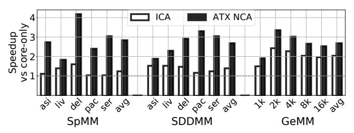

# V. METHODOLOGY

1. Simulation and System Architecture. We evaluate ATX NCAs with an internal silicon-validated multicore CPU simulator that extends Sniper [\[17\]](#page-13-21). We further extend our simulator to model NCAs, ICAs, OCAs, ATX instructions, and the UTE. Our baseline architecture is a 64-core CPU with the system parameters of Sapphire Rapids (SPR) with HBM (i.e., Xeon-Max) [\[11\]](#page-13-7), [\[57\]](#page-14-12), [\[66\]](#page-14-13). We scale the HBM memory bandwidth of the architecture to 4TB/s to match state-of-the-art decoupled accelerator platforms [\[19\]](#page-13-12), [\[61\]](#page-14-14). To eliminate MSHR-related MLP limitations [\[57\]](#page-14-12), we scale the number of L2 MSHRs to 128. The architecture includes industry-grade L1 and L2 spatial prefetchers that have been silicon-validated against the real SPR prefetchers. Table [I](#page-8-2) shows the main CPU, UTE, and accelerator parameters.

TABLE I: System parameters.

|                      | CPU                                                        |  |  |  |  |  |
|----------------------|------------------------------------------------------------|--|--|--|--|--|
| General              | 1 socket; 64 cores; 2.5GHz; AVX/AMX support;               |  |  |  |  |  |
|                      | 16-entry ATX Queue                                         |  |  |  |  |  |
| Caches               | 48KB L1; 2MB L2; 1.875MB LLC per core                      |  |  |  |  |  |
| Mem                  | DDR 1TB, 270GB/s; HBM 64GB, 4TB/s                          |  |  |  |  |  |
|                      | UTE                                                        |  |  |  |  |  |
| General              | Per-core UTE: 2 Input Buffers (i.e., scratchpads) per NCA; |  |  |  |  |  |
|                      | 32KB/buffer; 32 Stream Units; Common Bus with 128B(data)   |  |  |  |  |  |
|                      | + 32B(addr); 128-entry LDQ; 1KB PDQ per Stream Unit;       |  |  |  |  |  |
|                      | only Predicted Task prefetching enabled                    |  |  |  |  |  |
| Accelerators Modeled |                                                            |  |  |  |  |  |
| SpMM/                | SPADE [29]-like arithmetic unit                            |  |  |  |  |  |
| SDDMM                |                                                            |  |  |  |  |  |
| GeMM                 | GeMM unit operating on 8x8 µtiles                          |  |  |  |  |  |
| Decompr.             | DECA [27]-like; W=64, L=16                                 |  |  |  |  |  |

The L2 cache is shared by the core and the UTE, and an arbiter selects between requests from the core's L1 and the UTE, similar to L2 caches shared by multiple cores [\[73\]](#page-15-7). An ATX execution port is added to the core pipeline, which competes with the other execution ports (INT, FP, LD, VEC, etc.) for physical register file (PRF) write access. Although we did not increase the number of PRF write ports, we found that ATX reduces PRF pressure compared to core-only execution, as an ATX instruction replaces multiple loads.

As shown in Table [I,](#page-8-2) we model three ATX NCA accelerators: for SpMM/SDDMM operations, GeMM operations,

TABLE II: Benchmark sparse matrices.

| Short name      | asi | liv | del | pac | ser |
|-----------------|-----|-----|-----|-----|-----|
| Rows (mil)      | 12  | 4   | 17  | 2   | 1   |
| Non-zeros (mil) | 25  | 69  | 101 | 35  | 64  |

and ML weight decompression. The arithmetic units in the SpMM/SDDMM and decompression accelerators are modeled after SPADE [29] and DECA [27], respectively. For GeMM, we model double-precision GeMM units operating on 8x8  $\mu$ tiles. The maximum combined throughput of all 64 SpMM/SDDMM accelerators in our modeled platform is 5.1 double-precision TFLOPs. For the 64 GeMM accelerators, the maximum total throughput is 20.5 double-precision TFLOPs.

We implement double buffering using two 32KB Input Buffers (i.e., scratchpads) per NCA, each of which is attached to a different UTE PAcc port. The scratchpads determine the maximum task input size. For the output operands of the ATX instructions, we use up to two tile registers of 1KB each. This limits the maximum task output size to 2KB.

- **2.** Comparison with Alternative Accelerator Organizations. We compare ATX NCAs against different organizations of the same accelerators: (1) *perfect* ICAs that take zero time to perform computations, (2) L2-attached OCAs (*L2 OCA*) controlled with RoCC-like instructions [6], [63], which, unlike ATX, do not execute speculatively, and (3) LLC-attached OCAs (*LLC OCA*) controlled with memory loads and stores (Section II). The two OCA configurations include optimized out-of-core memory access interfaces that feature the stream support of the UTE.
- **3. Evaluated Kernels**. We use four kernels from scientific computing and machine learning (ML):
- Sparse Matrix Dense Matrix Multiplication (SpMM) and Sampled Dense Matrix - Dense Matrix Multiplication (SDDMM) are two sparse kernels that are popular in graph analytics [9], [16], graph neural networks [1], [13], [31], [48], and ML [18], [34]. They have irregular access patterns. In these kernels, the CPU traverses the sparse matrices, observes the sparsity patterns, creates tasks on the fly, and invokes the accelerator. The programmer or library needs to ensure that the generated tasks do not overflow the accelerator scratchpads. These kernels use fine core-accelerator interleaving. As benchmark sparse matrices, we use asia\_osm, com-LiveJournal, delaunay\_n24, packing-500x100x100, and Serena from SparseSuite [22], based on the selections made in [29]. Table II characterizes the matrices. SpMM and SDDMM are executed with double precision and with 2MB virtual pages to reduce the impact of TLB misses and page walks.
- The popular GeMM kernel, to demonstrate ATX generality.
- Decompression of a sparsified and quantized ML model where, alongside the accelerator, the CPU executes computations using AMX [27]. This kernel also requires fine coreaccelerator interleaving.
- **4. Software**. For our baseline CPU-only execution, we use the vendor-optimized MKL library [78] for SpMM and GeMM. MKL does not support SDDMM and thus we use an optimized SDDMM kernel from TACO [49]. For the ML model decompression, we use the decompress+execute kernel from

Fig. 13: Speedups of ICA and of our ATX NCA, over coreonly execution for different kernels.

libxsmm [35]. All kernels are vectorized with AVX512, while the decompression also uses AMX. For ATX, we create hand-crafted kernels that break down the computation into tasks and use ATX instructions to invoke the NCAs. For parallelization across cores, UTEs, and NCAs, we use OpenMP, to demonstrate that our framework is fully compatible with popular CPU parallel programming models.

**5. Overhead of ATX Extensions**. The main overhead of the ATX extensions is the UTE. The UTE has modest storage needs. In the UTE, the VAcc-to-PAcc and VAcc-to-Streams Mapping tables contain the only architectural process state. In our configuration, these tables require 0.5KB and 4KB, respectively, which is more than enough to concurrently configure the three NCAs used in our evaluation. For comparison, Intel cores with AMX [38] need 8KB of architectural state for AMX tile registers alone. The remaining UTE storage is nonarchitectural state in structures such as the InTaskQ, OutQ, LDQ, Stream Units, and other queues. We calculate that the total storage overhead for one UTE is less than 128KB. Using CACTI [10] and [74], we estimate that 64 UTEs account for less than 1% of the SPR die area [82]. Using the same tools, we estimate that their combined static and dynamic power (at maximum activity) is 4.37% of the SPR TDP of 350W.

# V. METHODOLOGY

1. Simulation and System Architecture. We evaluate ATX NCAs with an internal silicon-validated multicore CPU simulator that extends Sniper [\[17\]](#page-13-21). We further extend our simulator to model NCAs, ICAs, OCAs, ATX instructions, and the UTE. Our baseline architecture is a 64-core CPU with the system parameters of Sapphire Rapids (SPR) with HBM (i.e., Xeon-Max) [\[11\]](#page-13-7), [\[57\]](#page-14-12), [\[66\]](#page-14-13). We scale the HBM memory bandwidth of the architecture to 4TB/s to match state-of-the-art decoupled accelerator platforms [\[19\]](#page-13-12), [\[61\]](#page-14-14). To eliminate MSHR-related MLP limitations [\[57\]](#page-14-12), we scale the number of L2 MSHRs to 128. The architecture includes industry-grade L1 and L2 spatial prefetchers that have been silicon-validated against the real SPR prefetchers. Table [I](#page-8-2) shows the main CPU, UTE, and accelerator parameters.

TABLE I: System parameters.

|                      | CPU                                                        |  |  |  |  |  |
|----------------------|------------------------------------------------------------|--|--|--|--|--|
| General              | 1 socket; 64 cores; 2.5GHz; AVX/AMX support;               |  |  |  |  |  |
|                      | 16-entry ATX Queue                                         |  |  |  |  |  |
| Caches               | 48KB L1; 2MB L2; 1.875MB LLC per core                      |  |  |  |  |  |
| Mem                  | DDR 1TB, 270GB/s; HBM 64GB, 4TB/s                          |  |  |  |  |  |
|                      | UTE                                                        |  |  |  |  |  |
| General              | Per-core UTE: 2 Input Buffers (i.e., scratchpads) per NCA; |  |  |  |  |  |
|                      | 32KB/buffer; 32 Stream Units; Common Bus with 128B(data)   |  |  |  |  |  |
|                      | + 32B(addr); 128-entry LDQ; 1KB PDQ per Stream Unit;       |  |  |  |  |  |
|                      | only Predicted Task prefetching enabled                    |  |  |  |  |  |
| Accelerators Modeled |                                                            |  |  |  |  |  |
| SpMM/                | SPADE [29]-like arithmetic unit                            |  |  |  |  |  |
| SDDMM                |                                                            |  |  |  |  |  |
| GeMM                 | GeMM unit operating on 8x8 µtiles                          |  |  |  |  |  |
| Decompr.             | DECA [27]-like; W=64, L=16                                 |  |  |  |  |  |

The L2 cache is shared by the core and the UTE, and an arbiter selects between requests from the core's L1 and the UTE, similar to L2 caches shared by multiple cores [\[73\]](#page-15-7). An ATX execution port is added to the core pipeline, which competes with the other execution ports (INT, FP, LD, VEC, etc.) for physical register file (PRF) write access. Although we did not increase the number of PRF write ports, we found that ATX reduces PRF pressure compared to core-only execution, as an ATX instruction replaces multiple loads.

As shown in Table [I,](#page-8-2) we model three ATX NCA accelerators: for SpMM/SDDMM operations, GeMM operations,

TABLE II: Benchmark sparse matrices.

| Short name      | asi | liv | del | pac | ser |
|-----------------|-----|-----|-----|-----|-----|
| Rows (mil)      | 12  | 4   | 17  | 2   | 1   |
| Non-zeros (mil) | 25  | 69  | 101 | 35  | 64  |

and ML weight decompression. The arithmetic units in the SpMM/SDDMM and decompression accelerators are modeled after SPADE [29] and DECA [27], respectively. For GeMM, we model double-precision GeMM units operating on 8x8  $\mu$ tiles. The maximum combined throughput of all 64 SpMM/SDDMM accelerators in our modeled platform is 5.1 double-precision TFLOPs. For the 64 GeMM accelerators, the maximum total throughput is 20.5 double-precision TFLOPs.

We implement double buffering using two 32KB Input Buffers (i.e., scratchpads) per NCA, each of which is attached to a different UTE PAcc port. The scratchpads determine the maximum task input size. For the output operands of the ATX instructions, we use up to two tile registers of 1KB each. This limits the maximum task output size to 2KB.

- **2.** Comparison with Alternative Accelerator Organizations. We compare ATX NCAs against different organizations of the same accelerators: (1) *perfect* ICAs that take zero time to perform computations, (2) L2-attached OCAs (*L2 OCA*) controlled with RoCC-like instructions [6], [63], which, unlike ATX, do not execute speculatively, and (3) LLC-attached OCAs (*LLC OCA*) controlled with memory loads and stores (Section II). The two OCA configurations include optimized out-of-core memory access interfaces that feature the stream support of the UTE.
- **3. Evaluated Kernels**. We use four kernels from scientific computing and machine learning (ML):
- Sparse Matrix Dense Matrix Multiplication (SpMM) and Sampled Dense Matrix - Dense Matrix Multiplication (SDDMM) are two sparse kernels that are popular in graph analytics [9], [16], graph neural networks [1], [13], [31], [48], and ML [18], [34]. They have irregular access patterns. In these kernels, the CPU traverses the sparse matrices, observes the sparsity patterns, creates tasks on the fly, and invokes the accelerator. The programmer or library needs to ensure that the generated tasks do not overflow the accelerator scratchpads. These kernels use fine core-accelerator interleaving. As benchmark sparse matrices, we use asia\_osm, com-LiveJournal, delaunay\_n24, packing-500x100x100, and Serena from SparseSuite [22], based on the selections made in [29]. Table II characterizes the matrices. SpMM and SDDMM are executed with double precision and with 2MB virtual pages to reduce the impact of TLB misses and page walks.
- The popular GeMM kernel, to demonstrate ATX generality.
- Decompression of a sparsified and quantized ML model where, alongside the accelerator, the CPU executes computations using AMX [27]. This kernel also requires fine coreaccelerator interleaving.
- **4. Software**. For our baseline CPU-only execution, we use the vendor-optimized MKL library [78] for SpMM and GeMM. MKL does not support SDDMM and thus we use an optimized SDDMM kernel from TACO [49]. For the ML model decompression, we use the decompress+execute kernel from

Fig. 13: Speedups of ICA and of our ATX NCA, over coreonly execution for different kernels.

libxsmm [35]. All kernels are vectorized with AVX512, while the decompression also uses AMX. For ATX, we create hand-crafted kernels that break down the computation into tasks and use ATX instructions to invoke the NCAs. For parallelization across cores, UTEs, and NCAs, we use OpenMP, to demonstrate that our framework is fully compatible with popular CPU parallel programming models.

**5. Overhead of ATX Extensions**. The main overhead of the ATX extensions is the UTE. The UTE has modest storage needs. In the UTE, the VAcc-to-PAcc and VAcc-to-Streams Mapping tables contain the only architectural process state. In our configuration, these tables require 0.5KB and 4KB, respectively, which is more than enough to concurrently configure the three NCAs used in our evaluation. For comparison, Intel cores with AMX [38] need 8KB of architectural state for AMX tile registers alone. The remaining UTE storage is nonarchitectural state in structures such as the InTaskQ, OutQ, LDQ, Stream Units, and other queues. We calculate that the total storage overhead for one UTE is less than 128KB. Using CACTI [10] and [74], we estimate that 64 UTEs account for less than 1% of the SPR die area [82]. Using the same tools, we estimate that their combined static and dynamic power (at maximum activity) is 4.37% of the SPR TDP of 350W.

