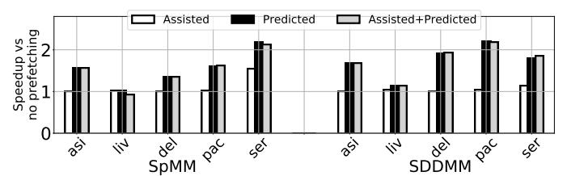

# VI. EVALUATION

In this section, we compare ATX NCAs with other accelerator organizations and evaluate different aspects of ATX NCAs. **1. Comparison with ICAs**. Figure 13 shows the speedups of executing with ICA or with our ATX NCA, over core-only execution. For SpMM/SDDMM, we run our five sparse matrices; for GeMM, we evaluate five configurations which, using BLAS [12] terminology, use N=128 and M=K=1k,2k,4k,8k,16k. ICA relies on the core's memory access infrastructure, and thus suffers from reduced MLP exploitation capabilities. This limitation does not exist in ATX NCA. As a result, ATX NCA delivers average speedups of 2.3x, 2.0x, and 1.3x over ICA for SpMM, SDDMM, and GeMM. The speedup for GeMM is slightly lower, since this kernel has more regular access patterns, which are easier to handle using the existing core's memory access infrastructure. Compared to core-only execution, ATX NCA delivers average speedups of 2.8x, 2.7x, and 2.7x. We see similar trends across a wide variety of sparse matrices and GeMM sizes.

**2. Comparison with L2 OCA and Ablation Study**. We now compare ATX NCAs with L2 OCAs controlled with RoCC-like instructions. Although L2 OCAs share the same spatial

Fig. 14: Comparison with RoCC L2 OCA and ablation study.

placement as ATX NCAs, ATX NCAs have two advantages over them: (1) ATX instructions can be invoked out-of-order and speculatively, and (2) the ATX framework supports task prefetching that can further accelerate data provision from memory. To isolate each effect, Figure 14 shows the speedups of executing with L2 OCA, which is controlled with RoCC-like instructions and uses the SPR L2 prefetcher (*L2 OCA*), with ATX NCA with task prefetching disabled (*ATX NCA No Pref.*), and with our full proposed ATX NCA (*ATX NCA*), over core-only execution. We see that *ATX NCA No Pref.* delivers average speedups of 1.6x, 1.4x, and 1.3x over L2 OCA for SpMM, SDDMM, and GeMM, respectively. With prefetching, our full ATX NCA design attains average speedups over L2 OCA of 2.1x, 2.0x, and 1.4x.

3. Comparison with LLC OCA and Effect of Task Input Size. We compare ATX NCA with the most common form of OCAs, namely OCAs attached at the LLC. We evaluate different sizes of the Input Buffers (i.e., scratchpads), which limit the maximum task input size. Each LLC OCA or ATX NCA has two scratchpads for double buffering. We vary the size of each scratchpad from 8KB to 128KB in LLC OCA and, to keep the near-core SRAM small, from 8KB to 32KB in ATX NCA. Hence, for the same kernel, an ATX NCA with smaller input buffers executes more, smaller tasks than an LLC OCA with larger input buffers. For the LLC OCA, the maximum output size is equal to the input size, while the ATX NCA uses 1-2 output tile registers of 1KB each.

Figure 15 shows the speedups of ATX NCA and of LLC OCA, over core-only for various task sizes running SpMM. We do not show the other kernels for space reasons, but they have similar trends. LLC OCAs incur high core-accelerator communication latency. As OCA invocations do not execute out-of-order, this extra latency has a noticeable performance impact. The figure shows that ATX NCA is 9.4x faster than LLC OCA for an 8KB maximum input task size, and 2.6x for a 128KB maximum input task size. The NCA significantly outperforms the OCA for small tasks finely-interleaved with core execution. The OCA's performance will eventually match NCA's for very large tasks, but at the cost of reduced interleaving with the core and more on-chip scratchpad memory. **4. Roofline Performance**. Figure 16 presents a roofline analysis for the SDDMM kernel with: (a) core-only execution, and (b) computations offloaded to different ATX NCA variants. Performance is shown in Giga Vector Operations per second, where not all vector operations produce FLOPs. Figure 16(a) shows that, without an accelerator, all performance points are in the compute-bound region. Figure 16(a) also shows a

Fig. 15: Speedup of ATX NCA and LLC OCA over core-only with various task sizes running SpMM.

Fig. 16: SDDMM rooflines.

scenario where we replace the SPR prefetchers with oracle ones (*Core* + *Oracle Prefetcher*) that eliminate all stalls due to the memory subsystem. This unrealistic scenario serves as a performance limit of prior prefetching works for provisioning data to CPU cores (e.g., [28], [58], [86]). Despite this addition, performance does not even reach the core's roofline in the compute-bound region due to dependencies, frontend stalls, and other types of core-bound stalls in the CPU core pipelines.

However, when variations of ATX NCAs are added in Figure 16(b), the roofline ridge point moves far to the right, and all the kernels are now in the memory-bound region. We see that our proposed ATX NCA offers significant improvements. However, there is still some performance left on the table. There are two main reasons for this. First, UTE resources are finite. Second, the heuristic that we use to determine the predicted task prefetch distance (Section IV-F) is suboptimal. To gain further insight, in Figure 16(b), we also include performance points for: (1) a UTE provisioned with very high resources such as number of Stream Units and PDQ size (ATX NCA+Inf UTE), and (2) additionally, an oracle that sets the optimal task prefetch distance for each matrix statically (ATX NCA+Inf UTE+Best PF Dist). We see that Inf UTE+Best PF Dist reaches the roofline for all matrices except for LIV.

The reason for the gap in LIV is the task prediction mechanism itself. To predict future tasks, we used a simple algorithm inspired by stride prefetchers. Naturally, such an algorithm (even with the best distance) is not always optimal.

5. Performance, Area, and Power for Different UTE Design Points. To test which UTE design parameters affect performance the most, we perform a design space exploration. We vary: (1) the number of Stream Units, which limit how many real and prefetch tasks can be handled simultaneously in the UTE backend, (2) the LDQ entries (Figure 7), which limit the number of outstanding memory requests, (3) the Common Bus (CB) data width (Figure 7), which limits how many fetch/prefetch requests from the Stream Units the Scheduler can accept per cycle, and (4) the PDQ size (Figure 11), which limits how much a parent stream can run ahead

TABLE III: Average SpMM performance for different UTE design points as a percentage of the performance of Inf UTE.

| _                               | _    |      | _    | _    |        | _       |      |        |      |      |
|---------------------------------|------|------|------|------|--------|---------|------|--------|------|------|
| #Stream Units                   |      |      |      |      |        |         | L    | DQ Ent | ries |      |
| 4                               | 8    | 16   | 32   | 64   |        | 32      | 64   | 128    | 256  | 512  |
| 56%                             | 86%  | 99%  | 99%  | 100% |        | 70%     | 90%  | 98%    | 99%  | 100% |
|                                 |      |      |      |      |        |         |      |        |      |      |
| CB Data Width PDQ Size (Bytes p |      |      |      |      | per St | ream Ui | nit) |        |      |      |
| 64B                             | 128B | 256B | 512B |      | 128    | 256     | 512  | 1k     | 2k   | 4k   |
| 73%                             | 88%  | 98%  | 100% |      | 16%    | 36%     | 62%  | 85%    | 96%  | 100% |

TABLE IV: Area and power overheads of different UTEs as a percentage of SPR die size and TDP.

|       | Small UTE {8,32,64B,256B} | Default UTE {32,128,128B,1KB} | Inf UTE {64,512,512B,4KB} |
|-------|------------------------------|-------------------------------|---------------------------|
| Area  | 0.53%                        | 0.90%                         | 2.71%                     |
| Power | 3.64%                        | 4.37%                         | 9.17%                     |

of its children. We start with the Inf UTE, for which we have assumed {#Stream Units,LDQ Entries,CB Width,PDQ Size}={64,512,512B,4KB}, and progressively reduce each resource while keeping the rest to their "Inf" values to isolate the effect of each resource.

Table III shows the performance of SpMM for the different design points normalized to Inf UTE. Our default UTE parameter values are {32,128,128B,1KB}, which can be shown to achieve 80% of the performance of the Inf UTE. We see that the PDQ Size and the CB Data Width are the two most critical resources bounding performance.

In Table IV, we additionally compare different UTE configurations with respect to their area and power impact. These configurations are a Small UTE with parameter values {8,32,64B,256B}, our Default UTE with {32,128,128B,1KB}, and the Inf UTE with {64,512,512B,4KB}. The area overhead is shown as a percentage of the SPR die size (1600mm²). The power overhead combines static and dynamic power, and is shown as a percentage of the SPR TDP (350W). Dynamic power is estimated at maximum feasible activity. All overheads are for a total of 64 UTEs. We see that our Default UTE is a good design point. It has 3x less area and 2.1x less power overhead than the Inf UTE, while the Inf UTE has only 1.25x higher performance. Further, the Default UTE has 1.7x the area and 1.2x the power overhead of the Small UTE, while it improves performance by 2.5x.

**6. Task Prefetching Analysis**. To evaluate task prefetching, we show results for only SpMM and SDDMM, since prefetching helps GeMM relatively little (Figure 14). Figure 17 shows the speedups of ATX NCA with Assisted Prefetching, Predicted Prefetching, or both, over ATX NCA without prefetching. We see that Predicted Prefetching is the most effective. Only the *ser* matrix benefits from Assisted Prefetching. In most cases for these kernels, the CPU cannot produce new tasks fast enough for assisted prefetches to be timely generated. Combining the two schemes does not lead to significant improvements over only Predicted Prefetching, which is the default mechanism in our evaluation.

Figure 18 shows the impact of the distance of the predicted task prefetches. The figure shows the speedups obtained by applying Predicted Prefetching with distances 1, 2, 4, and with our runtime heuristic, over ATX NCA without prefetching. The best distance varies across kernels and matrices. Also,

Fig. 17: Sensitivity to the task prefetch mechanism.

Fig. 18: Sensitivity to the task prefetch distance.

our simple heuristic of Section IV-F is not always the best. We believe that more sophisticated heuristics for adjusting the distance at runtime, potentially inspired by conventional hardware prefetching, may prove effective.

Fig. 19: Comparing accelerator schemes for decompression.

7. Decompression Use Case. Up to now, we have considered cases where the computation is primarily done by the accelerator, and the core is primarily used for input-inspection, task sizing, or control. We now discuss a case where both core and accelerator perform computation and interleave in a finegrained manner: the accelerator (i.e., DECA) reads tiles of an ML model from memory in a compressed form (quantized/sparsified) and decompresses them; the core takes the resulting tiles and executes GeMMs with AMX instructions. Compared to the previous kernels, the input task sizes here are notably small (512B–2KB). Figure 19 shows the speedups of the different accelerator integration schemes over the coreonly execution for different model compression factors (CF). We see that ATX NCA delivers average speedups of 4.0x, 1.8x, 3.9x, and 18x over core-only, ICA, L2 OCA, and LLC OCA, respectively. The large speedups over the OCAs for this use case are due to the small task sizes, which require fine coreaccelerator interleaving.

# VI. EVALUATION

In this section, we compare ATX NCAs with other accelerator organizations and evaluate different aspects of ATX NCAs. **1. Comparison with ICAs**. Figure 13 shows the speedups of executing with ICA or with our ATX NCA, over core-only execution. For SpMM/SDDMM, we run our five sparse matrices; for GeMM, we evaluate five configurations which, using BLAS [12] terminology, use N=128 and M=K=1k,2k,4k,8k,16k. ICA relies on the core's memory access infrastructure, and thus suffers from reduced MLP exploitation capabilities. This limitation does not exist in ATX NCA. As a result, ATX NCA delivers average speedups of 2.3x, 2.0x, and 1.3x over ICA for SpMM, SDDMM, and GeMM. The speedup for GeMM is slightly lower, since this kernel has more regular access patterns, which are easier to handle using the existing core's memory access infrastructure. Compared to core-only execution, ATX NCA delivers average speedups of 2.8x, 2.7x, and 2.7x. We see similar trends across a wide variety of sparse matrices and GeMM sizes.

**2. Comparison with L2 OCA and Ablation Study**. We now compare ATX NCAs with L2 OCAs controlled with RoCC-like instructions. Although L2 OCAs share the same spatial

Fig. 14: Comparison with RoCC L2 OCA and ablation study.

placement as ATX NCAs, ATX NCAs have two advantages over them: (1) ATX instructions can be invoked out-of-order and speculatively, and (2) the ATX framework supports task prefetching that can further accelerate data provision from memory. To isolate each effect, Figure 14 shows the speedups of executing with L2 OCA, which is controlled with RoCC-like instructions and uses the SPR L2 prefetcher (*L2 OCA*), with ATX NCA with task prefetching disabled (*ATX NCA No Pref.*), and with our full proposed ATX NCA (*ATX NCA*), over core-only execution. We see that *ATX NCA No Pref.* delivers average speedups of 1.6x, 1.4x, and 1.3x over L2 OCA for SpMM, SDDMM, and GeMM, respectively. With prefetching, our full ATX NCA design attains average speedups over L2 OCA of 2.1x, 2.0x, and 1.4x.

3. Comparison with LLC OCA and Effect of Task Input Size. We compare ATX NCA with the most common form of OCAs, namely OCAs attached at the LLC. We evaluate different sizes of the Input Buffers (i.e., scratchpads), which limit the maximum task input size. Each LLC OCA or ATX NCA has two scratchpads for double buffering. We vary the size of each scratchpad from 8KB to 128KB in LLC OCA and, to keep the near-core SRAM small, from 8KB to 32KB in ATX NCA. Hence, for the same kernel, an ATX NCA with smaller input buffers executes more, smaller tasks than an LLC OCA with larger input buffers. For the LLC OCA, the maximum output size is equal to the input size, while the ATX NCA uses 1-2 output tile registers of 1KB each.

Figure 15 shows the speedups of ATX NCA and of LLC OCA, over core-only for various task sizes running SpMM. We do not show the other kernels for space reasons, but they have similar trends. LLC OCAs incur high core-accelerator communication latency. As OCA invocations do not execute out-of-order, this extra latency has a noticeable performance impact. The figure shows that ATX NCA is 9.4x faster than LLC OCA for an 8KB maximum input task size, and 2.6x for a 128KB maximum input task size. The NCA significantly outperforms the OCA for small tasks finely-interleaved with core execution. The OCA's performance will eventually match NCA's for very large tasks, but at the cost of reduced interleaving with the core and more on-chip scratchpad memory. **4. Roofline Performance**. Figure 16 presents a roofline analysis for the SDDMM kernel with: (a) core-only execution, and (b) computations offloaded to different ATX NCA variants. Performance is shown in Giga Vector Operations per second, where not all vector operations produce FLOPs. Figure 16(a) shows that, without an accelerator, all performance points are in the compute-bound region. Figure 16(a) also shows a

Fig. 15: Speedup of ATX NCA and LLC OCA over core-only with various task sizes running SpMM.

Fig. 16: SDDMM rooflines.

scenario where we replace the SPR prefetchers with oracle ones (*Core* + *Oracle Prefetcher*) that eliminate all stalls due to the memory subsystem. This unrealistic scenario serves as a performance limit of prior prefetching works for provisioning data to CPU cores (e.g., [28], [58], [86]). Despite this addition, performance does not even reach the core's roofline in the compute-bound region due to dependencies, frontend stalls, and other types of core-bound stalls in the CPU core pipelines.

However, when variations of ATX NCAs are added in Figure 16(b), the roofline ridge point moves far to the right, and all the kernels are now in the memory-bound region. We see that our proposed ATX NCA offers significant improvements. However, there is still some performance left on the table. There are two main reasons for this. First, UTE resources are finite. Second, the heuristic that we use to determine the predicted task prefetch distance (Section IV-F) is suboptimal. To gain further insight, in Figure 16(b), we also include performance points for: (1) a UTE provisioned with very high resources such as number of Stream Units and PDQ size (ATX NCA+Inf UTE), and (2) additionally, an oracle that sets the optimal task prefetch distance for each matrix statically (ATX NCA+Inf UTE+Best PF Dist). We see that Inf UTE+Best PF Dist reaches the roofline for all matrices except for LIV.

The reason for the gap in LIV is the task prediction mechanism itself. To predict future tasks, we used a simple algorithm inspired by stride prefetchers. Naturally, such an algorithm (even with the best distance) is not always optimal.

5. Performance, Area, and Power for Different UTE Design Points. To test which UTE design parameters affect performance the most, we perform a design space exploration. We vary: (1) the number of Stream Units, which limit how many real and prefetch tasks can be handled simultaneously in the UTE backend, (2) the LDQ entries (Figure 7), which limit the number of outstanding memory requests, (3) the Common Bus (CB) data width (Figure 7), which limits how many fetch/prefetch requests from the Stream Units the Scheduler can accept per cycle, and (4) the PDQ size (Figure 11), which limits how much a parent stream can run ahead

TABLE III: Average SpMM performance for different UTE design points as a percentage of the performance of Inf UTE.

| _                               | _    |      | _    | _    |        | _       |      |        |      |      |
|---------------------------------|------|------|------|------|--------|---------|------|--------|------|------|
| #Stream Units                   |      |      |      |      |        |         | L    | DQ Ent | ries |      |
| 4                               | 8    | 16   | 32   | 64   |        | 32      | 64   | 128    | 256  | 512  |
| 56%                             | 86%  | 99%  | 99%  | 100% |        | 70%     | 90%  | 98%    | 99%  | 100% |
|                                 |      |      |      |      |        |         |      |        |      |      |
| CB Data Width PDQ Size (Bytes p |      |      |      |      | per St | ream Ui | nit) |        |      |      |
| 64B                             | 128B | 256B | 512B |      | 128    | 256     | 512  | 1k     | 2k   | 4k   |
| 73%                             | 88%  | 98%  | 100% |      | 16%    | 36%     | 62%  | 85%    | 96%  | 100% |

TABLE IV: Area and power overheads of different UTEs as a percentage of SPR die size and TDP.

|       | Small UTE {8,32,64B,256B} | Default UTE {32,128,128B,1KB} | Inf UTE {64,512,512B,4KB} |
|-------|------------------------------|-------------------------------|---------------------------|
| Area  | 0.53%                        | 0.90%                         | 2.71%                     |
| Power | 3.64%                        | 4.37%                         | 9.17%                     |

of its children. We start with the Inf UTE, for which we have assumed {#Stream Units,LDQ Entries,CB Width,PDQ Size}={64,512,512B,4KB}, and progressively reduce each resource while keeping the rest to their "Inf" values to isolate the effect of each resource.

Table III shows the performance of SpMM for the different design points normalized to Inf UTE. Our default UTE parameter values are {32,128,128B,1KB}, which can be shown to achieve 80% of the performance of the Inf UTE. We see that the PDQ Size and the CB Data Width are the two most critical resources bounding performance.

In Table IV, we additionally compare different UTE configurations with respect to their area and power impact. These configurations are a Small UTE with parameter values {8,32,64B,256B}, our Default UTE with {32,128,128B,1KB}, and the Inf UTE with {64,512,512B,4KB}. The area overhead is shown as a percentage of the SPR die size (1600mm²). The power overhead combines static and dynamic power, and is shown as a percentage of the SPR TDP (350W). Dynamic power is estimated at maximum feasible activity. All overheads are for a total of 64 UTEs. We see that our Default UTE is a good design point. It has 3x less area and 2.1x less power overhead than the Inf UTE, while the Inf UTE has only 1.25x higher performance. Further, the Default UTE has 1.7x the area and 1.2x the power overhead of the Small UTE, while it improves performance by 2.5x.

**6. Task Prefetching Analysis**. To evaluate task prefetching, we show results for only SpMM and SDDMM, since prefetching helps GeMM relatively little (Figure 14). Figure 17 shows the speedups of ATX NCA with Assisted Prefetching, Predicted Prefetching, or both, over ATX NCA without prefetching. We see that Predicted Prefetching is the most effective. Only the *ser* matrix benefits from Assisted Prefetching. In most cases for these kernels, the CPU cannot produce new tasks fast enough for assisted prefetches to be timely generated. Combining the two schemes does not lead to significant improvements over only Predicted Prefetching, which is the default mechanism in our evaluation.

Figure 18 shows the impact of the distance of the predicted task prefetches. The figure shows the speedups obtained by applying Predicted Prefetching with distances 1, 2, 4, and with our runtime heuristic, over ATX NCA without prefetching. The best distance varies across kernels and matrices. Also,

Fig. 17: Sensitivity to the task prefetch mechanism.

Fig. 18: Sensitivity to the task prefetch distance.

our simple heuristic of Section IV-F is not always the best. We believe that more sophisticated heuristics for adjusting the distance at runtime, potentially inspired by conventional hardware prefetching, may prove effective.

Fig. 19: Comparing accelerator schemes for decompression.

7. Decompression Use Case. Up to now, we have considered cases where the computation is primarily done by the accelerator, and the core is primarily used for input-inspection, task sizing, or control. We now discuss a case where both core and accelerator perform computation and interleave in a finegrained manner: the accelerator (i.e., DECA) reads tiles of an ML model from memory in a compressed form (quantized/sparsified) and decompresses them; the core takes the resulting tiles and executes GeMMs with AMX instructions. Compared to the previous kernels, the input task sizes here are notably small (512B–2KB). Figure 19 shows the speedups of the different accelerator integration schemes over the coreonly execution for different model compression factors (CF). We see that ATX NCA delivers average speedups of 4.0x, 1.8x, 3.9x, and 18x over core-only, ICA, L2 OCA, and LLC OCA, respectively. The large speedups over the OCAs for this use case are due to the small task sizes, which require fine coreaccelerator interleaving.

