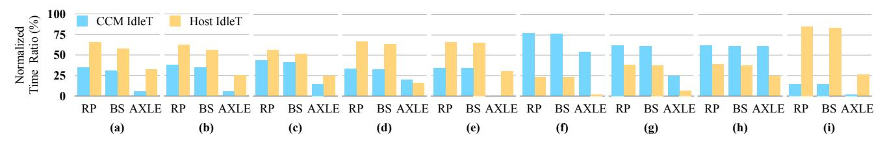
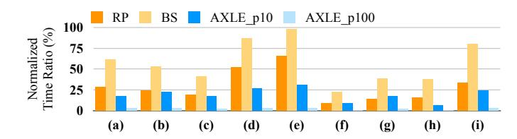

# *C. Two Idle Times*

Figure [12](#page-10-1) shows the CCM and host idle times across workloads when running on RP, BS, and AXLE, with the local polling interval fixed to 500 ns (p10 in Figure [10\)](#page-9-0). As discussed in [§III-C,](#page-4-0) idle times can be explained by aggregating the runtimes of other components. For example, in Figure [12\(](#page-10-1)f) with BS, the CCM idle time is 77.01%, which closely matches the sum of data movement and host runtime in Figure [10\(](#page-9-0)f). Likewise, the host idle time of 22.99% aligns with the combined CCM runtime and data movement time.

Fig. 12. Normalized idle time ratio for baselines and AXLE when using a p10 local polling factor.

Fig. 13. Host core stall time normalized to end-to-end runtime across offloading cases and AXLE when using different local polling factors. Remote polling interval corresponds to p20 (1us).

AXLE reduces both the CCM and host idle times by overlapping component tasks, with the extent of the reduction depending on workload characteristics. For example, in KNN with large-dimensional datasets (Figure [12\(](#page-10-1)a)), the dominant CCM runtime overlaps data movement and host processing, leaving only 5.64% of CCM idle time—an 6.09× reduction compared to RP. The host idle time is also halved relative to RP, but still accounts for 32.36% of total time. This residual idle time arises because the host must wait for CCM processing to advance before streaming and pipelining intermediate results. Similarly, when data movement dominates, as in graph analytics, both idle times are greatly reduced relative to RP. However, host idle time remains non-negligible because large partial results still need to be transferred before host processing can proceed. In Figure [12\(](#page-10-1)d), AXLE achieves a 1.69× reduction in CCM idle time and a 4.28× reduction in host idle time compared to RP.

On the other hand, when host processing dominates, as in the OLAP case, the trend reverses. AXLE minimizes host idle time, while some CCM idle time remains since it must wait for the long host execution to complete. In Figure [12\(](#page-10-1)g), AXLE reduces the CCM idle time by 2.49× and host idle time by 5.76× relative to RP. As a result, the host idle time accounts for only 6.59% of the total time of the RP baseline. On average across all workloads, AXLE reduces CCM idle time by 13.99× and 13.74× compared to RP and BS, respectively, and reduces host idle time by 3.93× and 3.79×.

# *C. Two Idle Times*

Figure [12](#page-10-1) shows the CCM and host idle times across workloads when running on RP, BS, and AXLE, with the local polling interval fixed to 500 ns (p10 in Figure [10\)](#page-9-0). As discussed in [§III-C,](#page-4-0) idle times can be explained by aggregating the runtimes of other components. For example, in Figure [12\(](#page-10-1)f) with BS, the CCM idle time is 77.01%, which closely matches the sum of data movement and host runtime in Figure [10\(](#page-9-0)f). Likewise, the host idle time of 22.99% aligns with the combined CCM runtime and data movement time.

Fig. 12. Normalized idle time ratio for baselines and AXLE when using a p10 local polling factor.

Fig. 13. Host core stall time normalized to end-to-end runtime across offloading cases and AXLE when using different local polling factors. Remote polling interval corresponds to p20 (1us).

AXLE reduces both the CCM and host idle times by overlapping component tasks, with the extent of the reduction depending on workload characteristics. For example, in KNN with large-dimensional datasets (Figure [12\(](#page-10-1)a)), the dominant CCM runtime overlaps data movement and host processing, leaving only 5.64% of CCM idle time—an 6.09× reduction compared to RP. The host idle time is also halved relative to RP, but still accounts for 32.36% of total time. This residual idle time arises because the host must wait for CCM processing to advance before streaming and pipelining intermediate results. Similarly, when data movement dominates, as in graph analytics, both idle times are greatly reduced relative to RP. However, host idle time remains non-negligible because large partial results still need to be transferred before host processing can proceed. In Figure [12\(](#page-10-1)d), AXLE achieves a 1.69× reduction in CCM idle time and a 4.28× reduction in host idle time compared to RP.

On the other hand, when host processing dominates, as in the OLAP case, the trend reverses. AXLE minimizes host idle time, while some CCM idle time remains since it must wait for the long host execution to complete. In Figure [12\(](#page-10-1)g), AXLE reduces the CCM idle time by 2.49× and host idle time by 5.76× relative to RP. As a result, the host idle time accounts for only 6.59% of the total time of the RP baseline. On average across all workloads, AXLE reduces CCM idle time by 13.99× and 13.74× compared to RP and BS, respectively, and reduces host idle time by 3.93× and 3.79×.

