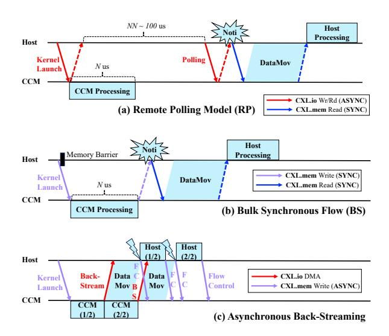

# I. INTRODUCTION

High demands for reducing data movement bottlenecks and for solving memory capacity problems have paved the way for memory disaggregation in recent datacenters [10], [2], [1]. Compute eXpress Link (CXL) [4], [6], [38] has emerged as a promising interconnection technology for efficient, high-performance disaggregated memory systems [9], [27], [29]. However, as the performance gap between processing units and memory grows, it becomes challenging to hide data movement from the critical path, leaving memory and fabric major bottlenecks. This makes the case for adopting emerging CXL-based computational memory, **CCM**, which incorporates a processing-near-memory (PNM) unit in a remote memory.

One of the main approaches to integrate the emerging CCM technology in existing systems is to partially offload memory-intensive operations within the applications (Table I). Prior works in this domain focus on *which* operation to offload [12], [15], [37], [19], [14], [39], [18], [17], [36], [35], [24], [33]. This leads to application-specific PNM solutions which accelerate partial tasks. Such scenarios have been well validated across a wide range of applications, given the diversity of application tasks and the different processing capabilities between the host and the CCM module.

Unlike most existing studies, this work focuses on *how* to perform the partial offload. This is not trivial, since CCM

Fig. 1. Simplified view of existing CCM partial offloading mechanisms (a, b) and the mechanism proposed in this work (c). Dotted lines represent ACKs/responses for the corresponding memory requests, omitted in (c) as they are unnecessary under our fully asynchronous interaction.

can be used both as a device and as memory. Figure 1 illustrates existing partial offloading mechanisms and how our new protocol improves end-to-end runtime. With a traditional device-centric view, most of the previous systems rely on CXL.io messages for task offloading and a remote polling mechanism (Figure 1(a)). This enables asynchronous remote task execution, however, it is not suitable for fine-grained offloading due to the high CXL.io-based remote polling overheads. Recently, M2NDP [12] proposed a CCM architecture that views CCM from a memory-centric perspective. It supports low-overhead task offloading by utilizing CXL.membased host-CCM communication (Figure 1(b)). This reduces the offloading overhead and enables fine-grained task offloading. However, the underlying CXL.mem memory semantics introduce bulk-synchronous data loads and cause the host CPU to be idled during CCM task processing. Our evaluation using a graph analytics benchmark shows that up to 98% of the host and approximately 50% of the CCM remain idle during the total runtime (§III-C). Therefore, existing operation offloading mechanisms are limited by the CXL.io vs. CXL.mem host-CCM communication models they use. In addition, it is not

sufficient to consider only the speed of invoking and executing offloaded operations. Rather, the focus should be on the endto-end execution of the application pipeline, which integrates both host and CCM computations while coordinating the exchange of data and commands between them.

To address these challenges, we propose a novel asynchronous back-streaming protocol (Figure [1\(](#page-0-0)c)) for host–CCM coordination, along with a system, AXLE, that implements it. The asynchronous back-streaming protocol enables continuous overlap of different components, thereby minimizing end-to-end runtime and resource idle times in the host–CCM interaction pipeline. Its core concept is to allow the CXL device to trigger reverse data streaming from the remote to the local memory, coupled with asynchronous pipelining of upstream CCM, data movement and downstream host tasks. The new protocol realizes the offloading mechanism by leveraging the strengths of both the CXL.io and CXL.mem protocols: CXL.io DMA *asynchronously sends partial result* from the CCM to the host, in contrast to prior models that rely on *full synchronous result loads* triggered by host processing units. To launch the offloading kernel and manage the DMA region on the local host, AXLE uses CXL.mem memory requests for control messages, thereby retaining low protocol overheads in the critical path.

AXLE is a system that realizes the asynchronous backstreaming model. To enable rapid and efficient notification of partial result availability, AXLE relocates the polling point to the local host region, partitions the DMA region into two ring buffers for metadata and payload for lightweight polling, and supports fully asynchronous CCM–host communication. DMA-based result streaming delivers partial result data in advance to the local region, enabling the host processing units to access the data locally during task execution. In addition, AXLE supports out-of-order (OoO) streaming, providing an interface to flexibly integrate with existing CCM and host parallel task schedulers [\[19\]](#page-13-10), [\[14\]](#page-13-11), [\[18\]](#page-13-12), [\[17\]](#page-13-13), [\[33\]](#page-13-15) while keeping them isolated, without requiring synchronization of task execution orders.

We compare asynchronous back-streaming and AXLE against the two existing partial offloading mechanisms: based on remote polling (RP) vs. bulk synchronous (BS) flow. Both baselines are implemented on top of the state-of-theart CCM architecture, M2NDP. We also implement an AXLE variant that adopts a different design choice as an additional baseline. We evaluate several workloads with different data movement, CCM and host runtimes. Our results show that AXLE improves end-to-end performance by up to 50.14% compared to RP, and by up to 48.88% compared to BS. Additionally, AXLE reduces application-level CCM idle time by an average of 13.99× and 14.53× relative to RP and BS, respectively, and reduces host idle time by an average of 3.93× and 3.85×. Furthermore, AXLE reduces host core stall time by up to 6×, improving host core utilization.

This paper makes the following contributions:

• We present the duality of CCM from device-centric and memory-centric perspectives, highlighting unexploited

TABLE I TARGET APPLICATION BENCHMARKS AND THE MEMORY-INTENSIVE OPERATIONS THEY OFFLOAD TO CCM.

| Workload        | Offloaded Function                                                   |  |  |
|-----------------|----------------------------------------------------------------------|--|--|
| OLAP/OLTP       | Filtering (e.g., within SELECT) [12]                                 |  |  |
| Graph Analytics | Edge traversal → Vertex update [33]                                  |  |  |
| KNN/ANN         | Vector distance calculation [15], [37], [19]                         |  |  |
| LLM Inference   | Attention block [14]                                                 |  |  |
| DLRM            | Embedding table lookup → Sparse Length Sum (SLS) [12], [39], [18] |  |  |

trade-offs arising from the underlying mechanisms and CXL protocols ([§III\)](#page-2-0). We emphasize an end-to-end pipeline perspective of CCM systems, showing how diverse workload characteristics can lead to suboptimal performance and idle times at both the host and the CCM.

- We propose a new protocol for CCM offloading, asynchronous back-streaming, which uniquely coordinates CXL.io DMA and CXL.mem to enable continuous overlap of components, thereby reducing end-to-end runtime and minimizing idle times in the host–CCM interaction pipeline ([§IV\)](#page-5-0).
- We design AXLE, which embodies asynchronous backstreaming as its offloading mechanism. AXLE supports lightweight host pipelining, proactive back-streaming of data, and an OoO streaming interface that increases data movement parallelism and performance, while ensuring ordering correctness ([§IV\)](#page-5-0).
- We evaluate AXLE through detailed simulations and compare its performance against M2NDP under various partial offloading mechanisms. Across diverse workloads, AXLE provides significant improvements in end-to-end runtime, and host and CCM efficiency. ([§V\)](#page-8-0).

# I. INTRODUCTION

High demands for reducing data movement bottlenecks and for solving memory capacity problems have paved the way for memory disaggregation in recent datacenters [10], [2], [1]. Compute eXpress Link (CXL) [4], [6], [38] has emerged as a promising interconnection technology for efficient, high-performance disaggregated memory systems [9], [27], [29]. However, as the performance gap between processing units and memory grows, it becomes challenging to hide data movement from the critical path, leaving memory and fabric major bottlenecks. This makes the case for adopting emerging CXL-based computational memory, **CCM**, which incorporates a processing-near-memory (PNM) unit in a remote memory.

One of the main approaches to integrate the emerging CCM technology in existing systems is to partially offload memory-intensive operations within the applications (Table I). Prior works in this domain focus on *which* operation to offload [12], [15], [37], [19], [14], [39], [18], [17], [36], [35], [24], [33]. This leads to application-specific PNM solutions which accelerate partial tasks. Such scenarios have been well validated across a wide range of applications, given the diversity of application tasks and the different processing capabilities between the host and the CCM module.

Unlike most existing studies, this work focuses on *how* to perform the partial offload. This is not trivial, since CCM

Fig. 1. Simplified view of existing CCM partial offloading mechanisms (a, b) and the mechanism proposed in this work (c). Dotted lines represent ACKs/responses for the corresponding memory requests, omitted in (c) as they are unnecessary under our fully asynchronous interaction.

can be used both as a device and as memory. Figure 1 illustrates existing partial offloading mechanisms and how our new protocol improves end-to-end runtime. With a traditional device-centric view, most of the previous systems rely on CXL.io messages for task offloading and a remote polling mechanism (Figure 1(a)). This enables asynchronous remote task execution, however, it is not suitable for fine-grained offloading due to the high CXL.io-based remote polling overheads. Recently, M2NDP [12] proposed a CCM architecture that views CCM from a memory-centric perspective. It supports low-overhead task offloading by utilizing CXL.membased host-CCM communication (Figure 1(b)). This reduces the offloading overhead and enables fine-grained task offloading. However, the underlying CXL.mem memory semantics introduce bulk-synchronous data loads and cause the host CPU to be idled during CCM task processing. Our evaluation using a graph analytics benchmark shows that up to 98% of the host and approximately 50% of the CCM remain idle during the total runtime (§III-C). Therefore, existing operation offloading mechanisms are limited by the CXL.io vs. CXL.mem host-CCM communication models they use. In addition, it is not

sufficient to consider only the speed of invoking and executing offloaded operations. Rather, the focus should be on the endto-end execution of the application pipeline, which integrates both host and CCM computations while coordinating the exchange of data and commands between them.

To address these challenges, we propose a novel asynchronous back-streaming protocol (Figure [1\(](#page-0-0)c)) for host–CCM coordination, along with a system, AXLE, that implements it. The asynchronous back-streaming protocol enables continuous overlap of different components, thereby minimizing end-to-end runtime and resource idle times in the host–CCM interaction pipeline. Its core concept is to allow the CXL device to trigger reverse data streaming from the remote to the local memory, coupled with asynchronous pipelining of upstream CCM, data movement and downstream host tasks. The new protocol realizes the offloading mechanism by leveraging the strengths of both the CXL.io and CXL.mem protocols: CXL.io DMA *asynchronously sends partial result* from the CCM to the host, in contrast to prior models that rely on *full synchronous result loads* triggered by host processing units. To launch the offloading kernel and manage the DMA region on the local host, AXLE uses CXL.mem memory requests for control messages, thereby retaining low protocol overheads in the critical path.

AXLE is a system that realizes the asynchronous backstreaming model. To enable rapid and efficient notification of partial result availability, AXLE relocates the polling point to the local host region, partitions the DMA region into two ring buffers for metadata and payload for lightweight polling, and supports fully asynchronous CCM–host communication. DMA-based result streaming delivers partial result data in advance to the local region, enabling the host processing units to access the data locally during task execution. In addition, AXLE supports out-of-order (OoO) streaming, providing an interface to flexibly integrate with existing CCM and host parallel task schedulers [\[19\]](#page-13-10), [\[14\]](#page-13-11), [\[18\]](#page-13-12), [\[17\]](#page-13-13), [\[33\]](#page-13-15) while keeping them isolated, without requiring synchronization of task execution orders.

We compare asynchronous back-streaming and AXLE against the two existing partial offloading mechanisms: based on remote polling (RP) vs. bulk synchronous (BS) flow. Both baselines are implemented on top of the state-of-theart CCM architecture, M2NDP. We also implement an AXLE variant that adopts a different design choice as an additional baseline. We evaluate several workloads with different data movement, CCM and host runtimes. Our results show that AXLE improves end-to-end performance by up to 50.14% compared to RP, and by up to 48.88% compared to BS. Additionally, AXLE reduces application-level CCM idle time by an average of 13.99× and 14.53× relative to RP and BS, respectively, and reduces host idle time by an average of 3.93× and 3.85×. Furthermore, AXLE reduces host core stall time by up to 6×, improving host core utilization.

This paper makes the following contributions:

• We present the duality of CCM from device-centric and memory-centric perspectives, highlighting unexploited

TABLE I TARGET APPLICATION BENCHMARKS AND THE MEMORY-INTENSIVE OPERATIONS THEY OFFLOAD TO CCM.

| Workload        | Offloaded Function                                                   |  |  |
|-----------------|----------------------------------------------------------------------|--|--|
| OLAP/OLTP       | Filtering (e.g., within SELECT) [12]                                 |  |  |
| Graph Analytics | Edge traversal → Vertex update [33]                                  |  |  |
| KNN/ANN         | Vector distance calculation [15], [37], [19]                         |  |  |
| LLM Inference   | Attention block [14]                                                 |  |  |
| DLRM            | Embedding table lookup → Sparse Length Sum (SLS) [12], [39], [18] |  |  |

trade-offs arising from the underlying mechanisms and CXL protocols ([§III\)](#page-2-0). We emphasize an end-to-end pipeline perspective of CCM systems, showing how diverse workload characteristics can lead to suboptimal performance and idle times at both the host and the CCM.

- We propose a new protocol for CCM offloading, asynchronous back-streaming, which uniquely coordinates CXL.io DMA and CXL.mem to enable continuous overlap of components, thereby reducing end-to-end runtime and minimizing idle times in the host–CCM interaction pipeline ([§IV\)](#page-5-0).
- We design AXLE, which embodies asynchronous backstreaming as its offloading mechanism. AXLE supports lightweight host pipelining, proactive back-streaming of data, and an OoO streaming interface that increases data movement parallelism and performance, while ensuring ordering correctness ([§IV\)](#page-5-0).
- We evaluate AXLE through detailed simulations and compare its performance against M2NDP under various partial offloading mechanisms. Across diverse workloads, AXLE provides significant improvements in end-to-end runtime, and host and CCM efficiency. ([§V\)](#page-8-0).

