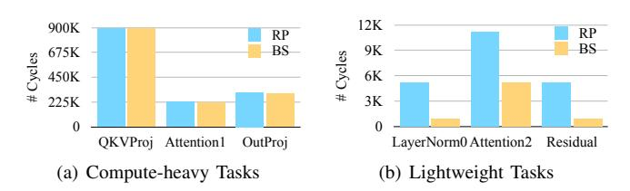

# II. CCM: CXL-BASED COMPUTATIONAL MEMORY

Model. Compute eXpress Link (CXL) is a PCIe-based interconnect that provides cache-coherent access to remote devices using memory semantics [\[4\]](#page-13-3), [\[6\]](#page-13-4), [\[38\]](#page-14-0). CXL defines three protocols: CXL.io, CXL.cache, and CXL.mem. It allows composing different types of devices by combining protocols. Type 1 devices (e.g., smart NICs without device memory) combine CXL.io and CXL.cache for cache-coherent access to host memory, and Type 2 devices (e.g., GPUs) further add CXL.mem to expose their own local memory to the host. A common use case for CXL are Type 3 devices [\[9\]](#page-13-5), [\[38\]](#page-14-0), which mix the CXL.io and CXL.mem protocols to expand memory capacity beyond local servers. CXL.io is a drop-in replacement for the PCIe protocol, whereas CXL.mem enables byte-addressable access to expanded memory regions using typical load and store instructions.

CCM is an emerging technology that incorporates computing resources on top of a CXL Type 3 device. We further discuss the implications of utilizing Type 3 devices for CCM in [§VII.](#page-12-0) Its computing capability is limited in terms of processing speed and power, or auxiliary resources such as cache. However, the embedded CXL Type 3 devices offer high memory performance with respect to the CCM-local

Fig. 2. Block diagram of a real prototype of CCM device. The device appears as an endpoint that supports the CXL protocols and memory expansion. It integrates both FPGA-based hardwired PFLs and single general-purpose core.

compute resources. Therefore, the primary purpose of CCM is to enable PNM for memory-intensive tasks [12], [33]. One of the common use cases is to *partially offload* memory-intensive operations within the applications; we illustrate representative examples in Table I.

Real Prototypes. Real hardware CCM prototypes have been proposed by industry [37], [19], [32], [26] and utilized in prior research. Commonly, these devices rely on application-specific integrated circuits (ASICs) and hardwired primitive function logics (PFLs). For example, the specific device considered in this work is an add-in card custom-developed board with a CXL memory controller and PNM engine integrated into an FPGA. In the initial prototype of the real hardware, the PNM engine was implemented with PFLs designed to support a specific single application such as KNN. This approach aimed to achieve optimized acceleration for targeted applications, resulting in impressive performance improvements.

As shown in Figure 2, the hardware prototype is built around a Xilinx Versal (VP1502) FPGA chip with DRAM mounted across four DIMM slots. The PNM engine provides PFL hardware IP, such as MAC (Multiply Accumulate), ACC (Accumulate), and CMP (Compare), as essential processing blocks for functionalities including numeric/string filtering, vector distance calculation, etc. Additionally, the use of a Cortex-A72 ARM processor as a general-purpose computational unit offers flexibility for adding new operations.

**Simulation Infrastructure.** The state-of-the-art CCM architecture is M2NDP, which provides a design of a low overhead and low cost general-purpose CCM [12]. M2NDP achieves remarkable speedups and energy savings across a variety of workloads, compared to baseline CPU/GPU hosts with CXL memory expansion without PNM. The M2NDP testbed is based on its own open-source simulator [13], a combination of Ramulator [25] as CXL memory devices and BookSim2 [21] as CXL interconnect protocols.

As shown in Figure 2, these prototypes largely rely on specific hardwired logic, making them unsuitable as general-purpose devices for diverse workloads. In addition, current hardware prototypes often experience high latency due to immature CXL IP implementations. As a result, both the architectural components and achievable performance of exist-

#### TABLE II

SUMMARY OF TRADE-OFFS ARISING FROM THE DUALITY OF CCM SYSTEM ARCHITECTURES, AND BENEFITS OF ASYNCHRONOUS BACK-STREAMING IN LEVERAGING THE STRENGTHS OF BOTH MODES.

| Partial Offloading Mechanism | Fine- grained Offloading | CXL Protocol Overhead | Async Execution |
|------------------------------|--------------------------------|-----------------------------|--------------------|
| Remote Polling [37], [19]    | Х                              | High                        | <b>/</b>           |
| Bulk Synchronous Flow [12]   | /                              | Low                         | Х                  |
| Asynchronous Back-Streaming  | <b>✓</b>                       | Low (Hidden)                | ✓                  |

ing hardware still fall short of what the M2NDP architecture envisions (§IV-B), making proper evaluation of the new data and control planes infeasible. Instead, the M2NDP simulator offers ease of access, flexibility to support diverse workloads, and a high-performance CCM model. For these reasons, we use the validated M2NDP simulator as our primary testbed. This simulation-based research serves as a preparatory step toward realizing and validating the new data and control planes on an upcoming ASIC-based CCM device.

#### III. MOTIVATION

## A. Duality of Computational Memory

Given that CCM integrates both compute *and* memory, it can be perceived from two perspectives: *device-centric* view and *memory-centric* view.

Device-centric view [37], [19] assumes CCM is viewed as an accelerator, and operation offloading is performed primarily via CXL.io. It uses CXL.io for various steps in host-CCM communications required to offload the function through a remote mailbox access (MMIO register on the CXL device). A key mechanism in this setting is remote polling (RP; Figure 1(a)). The local host needs to initially write the application kernel descriptor to the CXL memory via CXL.mem, then use CXL.io to (1) enqueue the offloading command, and  $(2 \sim n)$ start polling the mailbox to check if the remote kernel is completed. When the CXL firmware writes the completion descriptor in the mailbox, the host can acknowledge it via polling response. Then, (n+1) the host sends the final CXL.io message to dequeue the offloading command. Lastly, the host sends a CXL.mem message to load the offloading results before processing any dependent host kernel.

The CXL.io-based interactions are asynchronous, and provide an opportunity to avoid blocking the host processing due to remote kernel execution. The main drawback of the RP model is that it cannot support offloading of fine-grained tasks which take on the order of microseconds processing time [12]. Its mechanism requires remote polling between the host and the device, where its polling interval is up to 100 microseconds in a real-hardware setup. Moreover, it adds up CXL.io round-trip time [4], [6] to poll the remote region. These CXL.io-based message exchanges cannot be hidden within the pipeline. As a result, remote polling inherently limits the efficiency of host–CCM interaction and becomes a bottleneck when offloading fine-grained kernels.

Meanwhile, in a memory-centric view, CCM is accessed as a memory device. It supports operation offloading via

Fig. 3. Kernels of the attention block in LLM inference, exhibiting different characteristics under the OPT-2.7B model with a token size of 1K.

CXL.mem, where the mechanism implies *bulk synchronous flow* (BS; Figure [1\(](#page-0-0)b)). To invoke remote functions via memory operations, M2NDP [\[12\]](#page-13-8) proposes several hardware features. A custom packet filter on the CXL memory controller allows the hardware to differentiate between basic memory operations and remote kernel launch. Thus, the host can offload a function simply by issuing a single CXL.mem store operation of the kernel information to the specific remote address range. In this case, a synchronous CXL.mem store response indicates the remote kernel completion. To block other memory operations until the response arrives back at the host, the CXL memory controller also relies on memory barriers.

The BS model effectively solves the existing problems of the RP model. Figure [3](#page-3-0) demonstrates the case of running multiple kernels of the attention block within LLM inference, using both models. The kernels are based on the M2NDP benchmark [\[13\]](#page-13-18) and the attention block execution order is LayerNorm0, QKVProj, Attention1, Attention2, OutProj, and Residual. Among them, half are computationally heavy tasks as shown in Figure [3\(a\),](#page-3-1) where the number of cycles spent to run QKVProj is up to 897K when using RP. In these cases, the BS model results in similar number of cycles, for example, running QKVProj on top of it takes 888K. In contrast, Figure [3\(b\)](#page-3-2) shows the case of running the more lightweight tasks whose number of execution cycles is much less than the heavy tasks. The BS model incurs significantly fewer cycles to execute these tasks: only 16.7% of the cycle count when using the RP. This means that the BS model largely reflects the pure runtime of the kernel, whereas the RP model suffers from long polling intervals and associated overheads, which significantly increase the overall runtime when offloading fine-grained tasks.

The use of CXL.mem enables both fine-grained and coarsegrained offloading without the limitations imposed by remote polling over the CXL link and its associated overheads. However, since the mechanism relies on synchronous CXL.mem operations to execute remote kernels, the host processing unit stalls until the remote execution completes and the results are loaded. Table [II](#page-2-2) summarizes the trade-offs stemming from the duality of CCM system architectures and highlights how our proposed *asynchronous back-streaming* model (Figure [1\(](#page-0-0)c)) leverages the strengths of both modes to support efficient, general-purpose CCM systems.

Observation #1: Trade-offs in duality of CCM. The devicecentric view relies on remote polling mechanism and allows

Fig. 4. KNN execution with various workload configurations on real hardware, showing stacked runtime ratios of CCM (purple) and host tasks (green).

Fig. 5. Execution of KNNs (Ddim, RnumRows) and graph analytics on M2NDP, using remote polling (RP) and bulk synchronous flow (BS) as offloading mechanisms. Normalized runtime ratios are shown as stacked bars for CCM tasks (purple), data movement (yellow), and host tasks (green).

asynchronous operation offloading. The memory-centric view is based on bulk synchronous flow and enables fine-grained offloading. By treating CCM as either a device or memory alone, existing mechanisms miss the opportunity to combine the strengths of both CXL.io and CXL.mem.

# II. CCM: CXL-BASED COMPUTATIONAL MEMORY

Model. Compute eXpress Link (CXL) is a PCIe-based interconnect that provides cache-coherent access to remote devices using memory semantics [\[4\]](#page-13-3), [\[6\]](#page-13-4), [\[38\]](#page-14-0). CXL defines three protocols: CXL.io, CXL.cache, and CXL.mem. It allows composing different types of devices by combining protocols. Type 1 devices (e.g., smart NICs without device memory) combine CXL.io and CXL.cache for cache-coherent access to host memory, and Type 2 devices (e.g., GPUs) further add CXL.mem to expose their own local memory to the host. A common use case for CXL are Type 3 devices [\[9\]](#page-13-5), [\[38\]](#page-14-0), which mix the CXL.io and CXL.mem protocols to expand memory capacity beyond local servers. CXL.io is a drop-in replacement for the PCIe protocol, whereas CXL.mem enables byte-addressable access to expanded memory regions using typical load and store instructions.

CCM is an emerging technology that incorporates computing resources on top of a CXL Type 3 device. We further discuss the implications of utilizing Type 3 devices for CCM in [§VII.](#page-12-0) Its computing capability is limited in terms of processing speed and power, or auxiliary resources such as cache. However, the embedded CXL Type 3 devices offer high memory performance with respect to the CCM-local

Fig. 2. Block diagram of a real prototype of CCM device. The device appears as an endpoint that supports the CXL protocols and memory expansion. It integrates both FPGA-based hardwired PFLs and single general-purpose core.

compute resources. Therefore, the primary purpose of CCM is to enable PNM for memory-intensive tasks [12], [33]. One of the common use cases is to *partially offload* memory-intensive operations within the applications; we illustrate representative examples in Table I.

Real Prototypes. Real hardware CCM prototypes have been proposed by industry [37], [19], [32], [26] and utilized in prior research. Commonly, these devices rely on application-specific integrated circuits (ASICs) and hardwired primitive function logics (PFLs). For example, the specific device considered in this work is an add-in card custom-developed board with a CXL memory controller and PNM engine integrated into an FPGA. In the initial prototype of the real hardware, the PNM engine was implemented with PFLs designed to support a specific single application such as KNN. This approach aimed to achieve optimized acceleration for targeted applications, resulting in impressive performance improvements.

As shown in Figure 2, the hardware prototype is built around a Xilinx Versal (VP1502) FPGA chip with DRAM mounted across four DIMM slots. The PNM engine provides PFL hardware IP, such as MAC (Multiply Accumulate), ACC (Accumulate), and CMP (Compare), as essential processing blocks for functionalities including numeric/string filtering, vector distance calculation, etc. Additionally, the use of a Cortex-A72 ARM processor as a general-purpose computational unit offers flexibility for adding new operations.

**Simulation Infrastructure.** The state-of-the-art CCM architecture is M2NDP, which provides a design of a low overhead and low cost general-purpose CCM [12]. M2NDP achieves remarkable speedups and energy savings across a variety of workloads, compared to baseline CPU/GPU hosts with CXL memory expansion without PNM. The M2NDP testbed is based on its own open-source simulator [13], a combination of Ramulator [25] as CXL memory devices and BookSim2 [21] as CXL interconnect protocols.

As shown in Figure 2, these prototypes largely rely on specific hardwired logic, making them unsuitable as general-purpose devices for diverse workloads. In addition, current hardware prototypes often experience high latency due to immature CXL IP implementations. As a result, both the architectural components and achievable performance of exist-

#### TABLE II

SUMMARY OF TRADE-OFFS ARISING FROM THE DUALITY OF CCM SYSTEM ARCHITECTURES, AND BENEFITS OF ASYNCHRONOUS BACK-STREAMING IN LEVERAGING THE STRENGTHS OF BOTH MODES.

| Partial Offloading Mechanism | Fine- grained Offloading | CXL Protocol Overhead | Async Execution |
|------------------------------|--------------------------------|-----------------------------|--------------------|
| Remote Polling [37], [19]    | Х                              | High                        | <b>/</b>           |
| Bulk Synchronous Flow [12]   | /                              | Low                         | Х                  |
| Asynchronous Back-Streaming  | <b>✓</b>                       | Low (Hidden)                | ✓                  |

ing hardware still fall short of what the M2NDP architecture envisions (§IV-B), making proper evaluation of the new data and control planes infeasible. Instead, the M2NDP simulator offers ease of access, flexibility to support diverse workloads, and a high-performance CCM model. For these reasons, we use the validated M2NDP simulator as our primary testbed. This simulation-based research serves as a preparatory step toward realizing and validating the new data and control planes on an upcoming ASIC-based CCM device.

#### III. MOTIVATION

## A. Duality of Computational Memory

Given that CCM integrates both compute *and* memory, it can be perceived from two perspectives: *device-centric* view and *memory-centric* view.

Device-centric view [37], [19] assumes CCM is viewed as an accelerator, and operation offloading is performed primarily via CXL.io. It uses CXL.io for various steps in host-CCM communications required to offload the function through a remote mailbox access (MMIO register on the CXL device). A key mechanism in this setting is remote polling (RP; Figure 1(a)). The local host needs to initially write the application kernel descriptor to the CXL memory via CXL.mem, then use CXL.io to (1) enqueue the offloading command, and  $(2 \sim n)$ start polling the mailbox to check if the remote kernel is completed. When the CXL firmware writes the completion descriptor in the mailbox, the host can acknowledge it via polling response. Then, (n+1) the host sends the final CXL.io message to dequeue the offloading command. Lastly, the host sends a CXL.mem message to load the offloading results before processing any dependent host kernel.

The CXL.io-based interactions are asynchronous, and provide an opportunity to avoid blocking the host processing due to remote kernel execution. The main drawback of the RP model is that it cannot support offloading of fine-grained tasks which take on the order of microseconds processing time [12]. Its mechanism requires remote polling between the host and the device, where its polling interval is up to 100 microseconds in a real-hardware setup. Moreover, it adds up CXL.io round-trip time [4], [6] to poll the remote region. These CXL.io-based message exchanges cannot be hidden within the pipeline. As a result, remote polling inherently limits the efficiency of host–CCM interaction and becomes a bottleneck when offloading fine-grained kernels.

Meanwhile, in a memory-centric view, CCM is accessed as a memory device. It supports operation offloading via

Fig. 3. Kernels of the attention block in LLM inference, exhibiting different characteristics under the OPT-2.7B model with a token size of 1K.

CXL.mem, where the mechanism implies *bulk synchronous flow* (BS; Figure [1\(](#page-0-0)b)). To invoke remote functions via memory operations, M2NDP [\[12\]](#page-13-8) proposes several hardware features. A custom packet filter on the CXL memory controller allows the hardware to differentiate between basic memory operations and remote kernel launch. Thus, the host can offload a function simply by issuing a single CXL.mem store operation of the kernel information to the specific remote address range. In this case, a synchronous CXL.mem store response indicates the remote kernel completion. To block other memory operations until the response arrives back at the host, the CXL memory controller also relies on memory barriers.

The BS model effectively solves the existing problems of the RP model. Figure [3](#page-3-0) demonstrates the case of running multiple kernels of the attention block within LLM inference, using both models. The kernels are based on the M2NDP benchmark [\[13\]](#page-13-18) and the attention block execution order is LayerNorm0, QKVProj, Attention1, Attention2, OutProj, and Residual. Among them, half are computationally heavy tasks as shown in Figure [3\(a\),](#page-3-1) where the number of cycles spent to run QKVProj is up to 897K when using RP. In these cases, the BS model results in similar number of cycles, for example, running QKVProj on top of it takes 888K. In contrast, Figure [3\(b\)](#page-3-2) shows the case of running the more lightweight tasks whose number of execution cycles is much less than the heavy tasks. The BS model incurs significantly fewer cycles to execute these tasks: only 16.7% of the cycle count when using the RP. This means that the BS model largely reflects the pure runtime of the kernel, whereas the RP model suffers from long polling intervals and associated overheads, which significantly increase the overall runtime when offloading fine-grained tasks.

The use of CXL.mem enables both fine-grained and coarsegrained offloading without the limitations imposed by remote polling over the CXL link and its associated overheads. However, since the mechanism relies on synchronous CXL.mem operations to execute remote kernels, the host processing unit stalls until the remote execution completes and the results are loaded. Table [II](#page-2-2) summarizes the trade-offs stemming from the duality of CCM system architectures and highlights how our proposed *asynchronous back-streaming* model (Figure [1\(](#page-0-0)c)) leverages the strengths of both modes to support efficient, general-purpose CCM systems.

Observation #1: Trade-offs in duality of CCM. The devicecentric view relies on remote polling mechanism and allows

Fig. 4. KNN execution with various workload configurations on real hardware, showing stacked runtime ratios of CCM (purple) and host tasks (green).

Fig. 5. Execution of KNNs (Ddim, RnumRows) and graph analytics on M2NDP, using remote polling (RP) and bulk synchronous flow (BS) as offloading mechanisms. Normalized runtime ratios are shown as stacked bars for CCM tasks (purple), data movement (yellow), and host tasks (green).

asynchronous operation offloading. The memory-centric view is based on bulk synchronous flow and enables fine-grained offloading. By treating CCM as either a device or memory alone, existing mechanisms miss the opportunity to combine the strengths of both CXL.io and CXL.mem.

