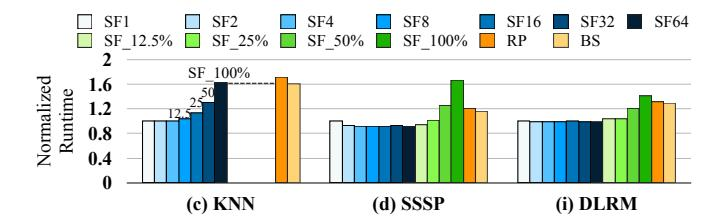
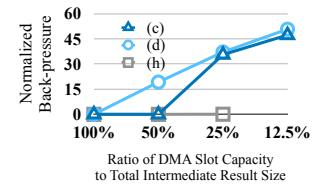

# *E. Impact of AXLE Parameters*

In this section, we vary the AXLE systems configurations and explore their impact on end-to-end runtime.

Impact of Different Streaming Factors. Figure [14](#page-11-0) shows the normalized end-to-end runtime of AXLE with varying streaming factors, alongside RP and BS. Baseline (SF1) sets the smallest streaming factor to 32 bytes, meaning backstreaming is triggered whenever 32 bytes of result data are ready. SF*N* denotes *N*× larger factors than SF1.

In Figure [14\(](#page-11-0)a), the total result data is 2048 bytes (i.e., 512 rows \* 4 bytes), thereby we test from SF1 to SF64. Larger streaming factors batch the results, reducing overlap and pipeline efficiency. At SF64, AXLE back-streams the entire result via CXL.io DMA, which is slightly slower than

Fig. 14. Normalized end-to-end runtime of AXLE and baselines relative to SF1 across different AXLE streaming factors. SFX (blue) denotes a streaming factor of 32  $\times X$  bytes, while SF\_Y% (green) denotes Y% of the total intermediate result size. Workloads with similar trends are omitted.

Fig. 15. Normalized end-to-end runtime of AXLE under different scheduling policies, with and without OoO streaming. Workloads for which OoO streaming does not impact the performance of a given scheduling policy are omitted.

BS, where the entire result is fetched via CXL.mem. In Figure 14(d), increasing SF moderately reduces end-to-end runtime. For example, SF2–SF32 achieve about  $0.93 \times$  the runtime of SF1. This improvement occurs because larger SF amortizes DMA overheads, including per-request preparation latency and the per-batch payload buffer tail-update DMA message. However, excessively large SF values eventually degrade workload performance.

Longer workloads are not affected by prior SF settings, as shown in Figure 14(d) and Figure 14(i). We also evaluate very large batch sizes using SF\_Y%, where a single DMA batch contains Y% of the total intermediate result size. Up to SF\_25%, the performance impact remains marginal; for example, Figure 14(i) shows only a 1.04× runtime compared to SF1. However, excessive SF values such as SF\_50% and SF\_100% can degrade performance, even relative to the baselines. This is because AXLE sends a payload buffer tail-update DMA message per batch, while issuing metadata buffer tailupdate DMA messages per payload. With very large SF values, these separate DMA messages occur simultaneously, creating significant overhead on the CXL link and pipeline, especially when data movement volume is high, as in Figure 14(d). Nevertheless, because AXLE minimizes per-request pipeline overheads, large SF values do not harm workload performance until a certain threshold. Therefore, dynamically selecting an optimal SF could benefit multi-tenant environments.

**Impact of OoO Support.** Figure 15 presents the normalized end-to-end runtime of AXLE under different scheduling policies, with and without OoO streaming. Results are normalized to the case with OoO streaming enabled. We evaluate both round-robin (RR) and FIFO scheduling, applied symmetrically to CCM and host schedulers.

By default, AXLE enables OoO streaming. When disabled, the CCM enforces result ordering before transmission, trig-

(a) End-to-end runtime

(b) CCM cycles waiting for credit

Fig. 16. Normalized end-to-end runtime of AXLE under different DMA slot capacities, along with normalized back-pressure cycles (i.e., CCM waiting for credit) due to host DMA slot unavailability. Workloads whose performance matches that with abundant DMA slot capacity are omitted, where they incur zero back-pressure cycles.

gering back-streams strictly by result offsets. With FIFO scheduling, tasks are already processed in offset order, so enabling or disabling OoO streaming has little impact.

In contrast, under RR scheduling, if the task at the front of the queue is not yet ready, it is moved to the back of the queue and the scheduler proceeds with the next available task. With OoO streaming, AXLE immediately back-streams any available results, regardless of order. Without it, the DMA executor stalls until the correctly ordered result appears, delaying transmission. As shown in Figure 15, disabling the feature increases runtime by  $1.74\times$  for (d),  $1.38\times$  for (e), and  $1.41\times$  for (i) under RR scheduling. These results highlight OoO streaming as a critical mechanism in AXLE, especially when combined with more complex scheduling policies in application-specific designs [19], [14], [18], [17], [33].

Impact of Flow Control. Figure 16(a) presents the normalized end-to-end runtime of AXLE under limited DMA slot capacity, compared to the abundant configuration (DMACp\_100%). The results show that even with reduced DMA buffer capacity, performance degradation is marginal. Workloads with unchanged performance across configurations are omitted; these results demonstrate that AXLE scales well with the number of DMA slots. A key factor behind this scalability is the nimble flow control mechanism achieved via CXL.mem requests, making ring buffer entries quickly available after consumption.

Another contributing factor is that AXLE's pipelining and overlapping effectively hide additional overhead. Figure 16(b) shows the normalized number of back-pressure cycles (i.e., cycles during which the CCM waits for host DMA buffer credits) relative to total runtime cycles. The back-pressure cycles can be substantial; for example, the line corresponding to (d) (skyblue) indicates that a limited 12.5% DMA slot capacity results in a back-pressure ratio of 50.8% of total runtime. Despite this, the result for (d) in Figure 16(a) shows that the end-to-end runtime is rather slightly reduced. This occurs because the back-pressure impact is effectively amortized by AXLE's design, naturally inducing batching without additional overhead and thereby improving efficiency, consistent with the trend observed in Figure 14(d).

Finally, (h) in Figure 16(a) results in deadlock when DMA slot capacity is restricted (DMACp\_12.5%). As described in §V-B, LLM exhibits sparse data dependencies between CCM

and host tasks: a single host task requires sparse results from multiple CCM tasks. Under the RR scheduler combined with AXLE's OoO feature, results arrive in a random order and occupy the limited DMA buffer slots, making it difficult to trigger any host task because the required set of payloads does not arrive together. Consequently, the DMA payload buffer is never consumed, eventually leading to deadlock. To avoid such edge cases, systems can provision sufficiently large DMA buffer capacity or employ in-order scheduling and streaming.

# *E. Impact of AXLE Parameters*

In this section, we vary the AXLE systems configurations and explore their impact on end-to-end runtime.

Impact of Different Streaming Factors. Figure [14](#page-11-0) shows the normalized end-to-end runtime of AXLE with varying streaming factors, alongside RP and BS. Baseline (SF1) sets the smallest streaming factor to 32 bytes, meaning backstreaming is triggered whenever 32 bytes of result data are ready. SF*N* denotes *N*× larger factors than SF1.

In Figure [14\(](#page-11-0)a), the total result data is 2048 bytes (i.e., 512 rows \* 4 bytes), thereby we test from SF1 to SF64. Larger streaming factors batch the results, reducing overlap and pipeline efficiency. At SF64, AXLE back-streams the entire result via CXL.io DMA, which is slightly slower than

Fig. 14. Normalized end-to-end runtime of AXLE and baselines relative to SF1 across different AXLE streaming factors. SFX (blue) denotes a streaming factor of 32  $\times X$  bytes, while SF\_Y% (green) denotes Y% of the total intermediate result size. Workloads with similar trends are omitted.

Fig. 15. Normalized end-to-end runtime of AXLE under different scheduling policies, with and without OoO streaming. Workloads for which OoO streaming does not impact the performance of a given scheduling policy are omitted.

BS, where the entire result is fetched via CXL.mem. In Figure 14(d), increasing SF moderately reduces end-to-end runtime. For example, SF2–SF32 achieve about  $0.93 \times$  the runtime of SF1. This improvement occurs because larger SF amortizes DMA overheads, including per-request preparation latency and the per-batch payload buffer tail-update DMA message. However, excessively large SF values eventually degrade workload performance.

Longer workloads are not affected by prior SF settings, as shown in Figure 14(d) and Figure 14(i). We also evaluate very large batch sizes using SF\_Y%, where a single DMA batch contains Y% of the total intermediate result size. Up to SF\_25%, the performance impact remains marginal; for example, Figure 14(i) shows only a 1.04× runtime compared to SF1. However, excessive SF values such as SF\_50% and SF\_100% can degrade performance, even relative to the baselines. This is because AXLE sends a payload buffer tail-update DMA message per batch, while issuing metadata buffer tailupdate DMA messages per payload. With very large SF values, these separate DMA messages occur simultaneously, creating significant overhead on the CXL link and pipeline, especially when data movement volume is high, as in Figure 14(d). Nevertheless, because AXLE minimizes per-request pipeline overheads, large SF values do not harm workload performance until a certain threshold. Therefore, dynamically selecting an optimal SF could benefit multi-tenant environments.

**Impact of OoO Support.** Figure 15 presents the normalized end-to-end runtime of AXLE under different scheduling policies, with and without OoO streaming. Results are normalized to the case with OoO streaming enabled. We evaluate both round-robin (RR) and FIFO scheduling, applied symmetrically to CCM and host schedulers.

By default, AXLE enables OoO streaming. When disabled, the CCM enforces result ordering before transmission, trig-

(a) End-to-end runtime

(b) CCM cycles waiting for credit

Fig. 16. Normalized end-to-end runtime of AXLE under different DMA slot capacities, along with normalized back-pressure cycles (i.e., CCM waiting for credit) due to host DMA slot unavailability. Workloads whose performance matches that with abundant DMA slot capacity are omitted, where they incur zero back-pressure cycles.

gering back-streams strictly by result offsets. With FIFO scheduling, tasks are already processed in offset order, so enabling or disabling OoO streaming has little impact.

In contrast, under RR scheduling, if the task at the front of the queue is not yet ready, it is moved to the back of the queue and the scheduler proceeds with the next available task. With OoO streaming, AXLE immediately back-streams any available results, regardless of order. Without it, the DMA executor stalls until the correctly ordered result appears, delaying transmission. As shown in Figure 15, disabling the feature increases runtime by  $1.74\times$  for (d),  $1.38\times$  for (e), and  $1.41\times$  for (i) under RR scheduling. These results highlight OoO streaming as a critical mechanism in AXLE, especially when combined with more complex scheduling policies in application-specific designs [19], [14], [18], [17], [33].

Impact of Flow Control. Figure 16(a) presents the normalized end-to-end runtime of AXLE under limited DMA slot capacity, compared to the abundant configuration (DMACp\_100%). The results show that even with reduced DMA buffer capacity, performance degradation is marginal. Workloads with unchanged performance across configurations are omitted; these results demonstrate that AXLE scales well with the number of DMA slots. A key factor behind this scalability is the nimble flow control mechanism achieved via CXL.mem requests, making ring buffer entries quickly available after consumption.

Another contributing factor is that AXLE's pipelining and overlapping effectively hide additional overhead. Figure 16(b) shows the normalized number of back-pressure cycles (i.e., cycles during which the CCM waits for host DMA buffer credits) relative to total runtime cycles. The back-pressure cycles can be substantial; for example, the line corresponding to (d) (skyblue) indicates that a limited 12.5% DMA slot capacity results in a back-pressure ratio of 50.8% of total runtime. Despite this, the result for (d) in Figure 16(a) shows that the end-to-end runtime is rather slightly reduced. This occurs because the back-pressure impact is effectively amortized by AXLE's design, naturally inducing batching without additional overhead and thereby improving efficiency, consistent with the trend observed in Figure 14(d).

Finally, (h) in Figure 16(a) results in deadlock when DMA slot capacity is restricted (DMACp\_12.5%). As described in §V-B, LLM exhibits sparse data dependencies between CCM

and host tasks: a single host task requires sparse results from multiple CCM tasks. Under the RR scheduler combined with AXLE's OoO feature, results arrive in a random order and occupy the limited DMA buffer slots, making it difficult to trigger any host task because the required set of payloads does not arrive together. Consequently, the DMA payload buffer is never consumed, eventually leading to deadlock. To avoid such edge cases, systems can provision sufficiently large DMA buffer capacity or employ in-order scheduling and streaming.

