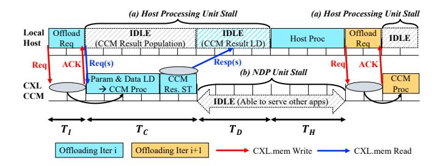
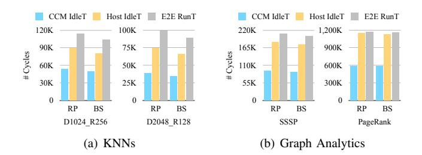

# *B. Workload Considerations*

Prior research has focused on application-specific approaches to identify appropriate operations to be offloaded to CCM (see Table [I](#page-1-0) in [§II\)](#page-1-1). Offloading the specified operations results in reduction of data movement from CXL memory to local hosts, compared to when using only the memory expansion functionality. For example, if we run PageRank (i.e., graph analytics) over the expanded remote memory, the host needs to load every neighbor data per vertex on each iteration to update page rank value [\[40\]](#page-14-5). By offloading neighbor traversal and vertex value update to CCM, it needs to move only the updated vertex data per iteration, leaving only the page rank calculation up to the host. In this example, the maximum data movement amount per iteration can be reduced from {#edge × #vertex} to {#vertex}.

However, there is no guarantee that fixing the offloaded functions will be optimal in terms of end-to-end performance. Depending on the input data type and the offload granularity, the offloading of the same operation, may shift the bottleneck to the host processing time or the data movement time. We demonstrate this by running different KNN and graph analytics workloads on multiple testbeds.

Case #1: Host-Heavy Tasks. Figure [4](#page-3-3) shows the case when running KNN for different vector dimension and number of input vectors in database (i.e., rows), on top of the real hardware. The graph breaks down the runtime ratio of CCM processing and host processing within the end-to-end runtime. As the dimensionality decreases and the number of rows increases, KNN becomes a host processing-intensive application. Offloading vector distance calculations to CCM leads to moving a 4-byte floating point distance value per input vector to host. The host receives {#rows} distance values and selects the top K results. Therefore, as the workload uses smaller dimension size per vector and more rows as input (Figure 4(b)), the ratio of time consumed by the host processing increases (up to 64.67% when the dimension is 32 and the number of rows is 4096).

Similarly, Figure 5(a) illustrates the case where we vary the dimension size and the number of rows while running KNNs on top of the simulator, M2NDP. We simulate both offloading models, RP and BS. For each workload, we normalize each time to the CCM processing time using the RP model. The figure shows that using BS leads to a slightly shorter end-to-end runtime than using RP. Although the CCM hardware specifications in the simulation environment differ from the real hardware (§II), the overall results indicate the same conclusion: significant host processing time, regardless of the offload mechanism.

Case #2: Data Movement-Heavy Offloads. Figure 5(b) shows a breakdown of CCM processing time, data movement time, and host processing time when running graph analytics on top of M2NDP. It shows that both the SSSP and PageRank graph kernels result in considerable data movement time within the entire runtime. For example, the data movement time ratio compared to the total runtime is up to 47.77% when running PageRank using the RP model. With the increase in the number of vertices or the number of hubs (i.e. vertices with a large number of neighbors), the amount of intermediate results to be moved grows [33], directly impacting the data movement time. The increase in data sizes also puts pressure on the CXL credit-based flow control [6], and can result in additional delays and round-trips over the CXL links.

**Observation #2: Same offloading, Different benefit.** Common application-specific solutions focus on *which* operation to offload, but this fixed policy does not guarantee optimal end-to-end performance, as the runtime ratio of CCM processing, data movement, and host processing varies based on the workload and hardware configuration.

## C. Sources of Inefficiency

Regardless of the offloading mechanism, the underlying host-CCM interaction relies on a CXL.mem load response to fetch the remote processing results to local hosts. This makes it difficult to fully utilize existing CCM systems. Figure 6 illustrates how M2NDP handles iterative CCM requests within a single application run. As soon as the host receives the offload remote kernel launch ACK, it issues a CXL.mem load command to fetch the kernel results. With the hardware-supported barrier, the load operation is suspended until the remote kernel execution populates the final result data into

Fig. 6. Naïve partial offloading based on bulk synchronous result fetch, yielding a fully serialized pipeline.

Fig. 7. Comparison of end-to-end runtime and two types of idle time for the same setups as in Figure 5. Idle time is measured as the sum of task launch latency, average stall time of processing units during execution, and waiting time for task completion on the opposite side.

remote memory. The load command is resumed only after the CCM processing is complete, stalling the host processing unit. This leads to significant host idle times (Figure 6(a)), equal to the CCM processing time  $(T_C)$  and remote result data load time  $(T_D)$ . Additionally, partial offloading workloads exhibit dependencies across offloading requests (i.e., iterative kernels) [33], [19], [14], indicating that the next offload iteration may occur only after host processing is complete, and host-side concurrency cannot eliminate idleness within a single application's critical path. For example, in common graph analytics workloads, dependencies exist across iterations because the host must determine the new frontier based on the results of the preceding iteration. Thus, we also observe CCM idle times (Figure 6(b)); the CCM module needs to wait for the next offloading iteration to launch after the result data is dispatched  $(T_D)$  and the host processing  $(T_H)$  completes.

In Figure 7, we show the CCM idle times, host idle times, and the complete runtimes for the same workloads as in Figure 5. Matching time portions in Figure 5 and Figure 7 confirms high CCM idle times and host idle times in existing mechanisms. For example, in Figure 5(b) PageRank on top of RP model, the runtime ratio of  $T_C$ ,  $T_D$ , and  $T_H$  are about 49.9%, 48%, and 2.1%, yielding CCM idle time ratio  $\approx 50\%$  ( $T_D + T_H$ ) and host idle time ratio  $\approx 98\%$  ( $T_C + T_D$ ), consistent with corresponding results in Figure 7(b).

**Observation #3: Two idle times.** Serialized host-CCM interaction introduces host idle time and CCM idle time, creating unnecessary bubbles in the end-to-end execution pipeline. These idle times lower the resource utilization of the host and CCM components, limiting the usability of the general-purpose CCM systems in different scenarios.

# *B. Workload Considerations*

Prior research has focused on application-specific approaches to identify appropriate operations to be offloaded to CCM (see Table [I](#page-1-0) in [§II\)](#page-1-1). Offloading the specified operations results in reduction of data movement from CXL memory to local hosts, compared to when using only the memory expansion functionality. For example, if we run PageRank (i.e., graph analytics) over the expanded remote memory, the host needs to load every neighbor data per vertex on each iteration to update page rank value [\[40\]](#page-14-5). By offloading neighbor traversal and vertex value update to CCM, it needs to move only the updated vertex data per iteration, leaving only the page rank calculation up to the host. In this example, the maximum data movement amount per iteration can be reduced from {#edge × #vertex} to {#vertex}.

However, there is no guarantee that fixing the offloaded functions will be optimal in terms of end-to-end performance. Depending on the input data type and the offload granularity, the offloading of the same operation, may shift the bottleneck to the host processing time or the data movement time. We demonstrate this by running different KNN and graph analytics workloads on multiple testbeds.

Case #1: Host-Heavy Tasks. Figure [4](#page-3-3) shows the case when running KNN for different vector dimension and number of input vectors in database (i.e., rows), on top of the real hardware. The graph breaks down the runtime ratio of CCM processing and host processing within the end-to-end runtime. As the dimensionality decreases and the number of rows increases, KNN becomes a host processing-intensive application. Offloading vector distance calculations to CCM leads to moving a 4-byte floating point distance value per input vector to host. The host receives {#rows} distance values and selects the top K results. Therefore, as the workload uses smaller dimension size per vector and more rows as input (Figure 4(b)), the ratio of time consumed by the host processing increases (up to 64.67% when the dimension is 32 and the number of rows is 4096).

Similarly, Figure 5(a) illustrates the case where we vary the dimension size and the number of rows while running KNNs on top of the simulator, M2NDP. We simulate both offloading models, RP and BS. For each workload, we normalize each time to the CCM processing time using the RP model. The figure shows that using BS leads to a slightly shorter end-to-end runtime than using RP. Although the CCM hardware specifications in the simulation environment differ from the real hardware (§II), the overall results indicate the same conclusion: significant host processing time, regardless of the offload mechanism.

Case #2: Data Movement-Heavy Offloads. Figure 5(b) shows a breakdown of CCM processing time, data movement time, and host processing time when running graph analytics on top of M2NDP. It shows that both the SSSP and PageRank graph kernels result in considerable data movement time within the entire runtime. For example, the data movement time ratio compared to the total runtime is up to 47.77% when running PageRank using the RP model. With the increase in the number of vertices or the number of hubs (i.e. vertices with a large number of neighbors), the amount of intermediate results to be moved grows [33], directly impacting the data movement time. The increase in data sizes also puts pressure on the CXL credit-based flow control [6], and can result in additional delays and round-trips over the CXL links.

**Observation #2: Same offloading, Different benefit.** Common application-specific solutions focus on *which* operation to offload, but this fixed policy does not guarantee optimal end-to-end performance, as the runtime ratio of CCM processing, data movement, and host processing varies based on the workload and hardware configuration.

## C. Sources of Inefficiency

Regardless of the offloading mechanism, the underlying host-CCM interaction relies on a CXL.mem load response to fetch the remote processing results to local hosts. This makes it difficult to fully utilize existing CCM systems. Figure 6 illustrates how M2NDP handles iterative CCM requests within a single application run. As soon as the host receives the offload remote kernel launch ACK, it issues a CXL.mem load command to fetch the kernel results. With the hardware-supported barrier, the load operation is suspended until the remote kernel execution populates the final result data into

Fig. 6. Naïve partial offloading based on bulk synchronous result fetch, yielding a fully serialized pipeline.

Fig. 7. Comparison of end-to-end runtime and two types of idle time for the same setups as in Figure 5. Idle time is measured as the sum of task launch latency, average stall time of processing units during execution, and waiting time for task completion on the opposite side.

remote memory. The load command is resumed only after the CCM processing is complete, stalling the host processing unit. This leads to significant host idle times (Figure 6(a)), equal to the CCM processing time  $(T_C)$  and remote result data load time  $(T_D)$ . Additionally, partial offloading workloads exhibit dependencies across offloading requests (i.e., iterative kernels) [33], [19], [14], indicating that the next offload iteration may occur only after host processing is complete, and host-side concurrency cannot eliminate idleness within a single application's critical path. For example, in common graph analytics workloads, dependencies exist across iterations because the host must determine the new frontier based on the results of the preceding iteration. Thus, we also observe CCM idle times (Figure 6(b)); the CCM module needs to wait for the next offloading iteration to launch after the result data is dispatched  $(T_D)$  and the host processing  $(T_H)$  completes.

In Figure 7, we show the CCM idle times, host idle times, and the complete runtimes for the same workloads as in Figure 5. Matching time portions in Figure 5 and Figure 7 confirms high CCM idle times and host idle times in existing mechanisms. For example, in Figure 5(b) PageRank on top of RP model, the runtime ratio of  $T_C$ ,  $T_D$ , and  $T_H$  are about 49.9%, 48%, and 2.1%, yielding CCM idle time ratio  $\approx 50\%$  ( $T_D + T_H$ ) and host idle time ratio  $\approx 98\%$  ( $T_C + T_D$ ), consistent with corresponding results in Figure 7(b).

**Observation #3: Two idle times.** Serialized host-CCM interaction introduces host idle time and CCM idle time, creating unnecessary bubbles in the end-to-end execution pipeline. These idle times lower the resource utilization of the host and CCM components, limiting the usability of the general-purpose CCM systems in different scenarios.

