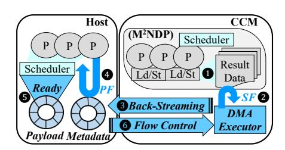

# *B. Overview of AXLE*

We design a system named AXLE, which integrates the new asynchronous back-streaming protocol and control plane support to effectively overcome all challenges.

Figure [8](#page-6-0) illustrates in dark blue the overall AXLE components across the host and CCM modules. The CCM modules adopt a fine-grained multithreaded architecture [\[28\]](#page-13-27), as in M2NDP. It employs µthreads that interleave execution by rapidly switching among one another, ensuring a steady instruction fetch, effectively hiding memory access latency and enabling high parallelism. In M2NDP, each processing unit integrates 16 µthreads. When the host offloads a task kernel,

Fig. 8. Overview of AXLE components built on top of M2NDP. Dark blue shapes indicate new components in AXLE, while light blue shapes represent existing components interfacing with AXLE.

the CCM scheduler partitions the task such that each µthread processes a fixed-size input vector. Its scheduling policy is designed to balance the load across µthreads while maximizing CXL memory bandwidth utilization. On the host side, we extend the architecture with different hardware configurations to represent general-purpose cores. For instance, we configure two µthreads per processing unit to emulate hyper-threading.

First, the host offloads the target CCM kernel by issuing a CXL.mem store request, as in the BS model, but without blocking for synchronous completion. Multiple µthreads within the CCM process the store instruction and populate result data ( 1 ), with order determined by the CCM scheduler's policy. A DMA executor of AXLE monitors the result data and prepares DMA execution. It forms a single *payload* when continuous result data size reaches the DMA slot size. AXLE uses ring buffers for various purposes ([§IV-C\)](#page-6-1) on the local host region. Thus, the DMA slot size equals the ring buffer slot size, which is by default 32 bytes and configurable. The DMA executor also creates *metadata* per payload. When the pending payloads' size gets equal or larger than the *streaming factor* (*SF*) ( 2 ), the DMA executor triggers back-streaming of payloads and metadata using CXL.io DMA ( 3 ).

The host has two separate ring buffers in its local DMA region for payload and metadata. The host polls only the tail pointer of the metadata ring buffer every polling interval (*PF*), which is configurable. When the metadata tail is updated, the host knows new partial results have arrived in its local region ( 4 ). Then, the polling routine fetches all the metadata slots that are ready, from its head index to (tail index - 1), and places them in the *ready pool*, a direct interface to the host scheduler. The host scheduler can pick the target tasks in the ready pool following its own scheduling policies. By seeing the metadata in the pool, the host knows which payload slot to fetch to execute downstream task, where it actually loads the dependent partial CCM result data for its execution from the local region ( 5 ). After processing metadata and payload ring buffer slots, the host sends flow control messages with the updated indexes for each head to the CCM device using CXL.mem ( 6 ). This ensures correct DMA region management by preventing any overwrite or overflow of the fixed size of the ring buffers.

After all offloading iterations complete, application completion is detected either explicitly via a tagged final CXL.io message, or implicitly once all downstream host tasks are triggered. We adopt the latter for our single-application setting.

Fig. 9. Detailed example flow of asynchronous back-streaming protocol and AXLE mechanisms. ACKs are omitted after first set of memory operations.

The former better suits for multi-tenant environments, where completion timing information must be tracked explicitly on a per-tenant basis, for example, to schedule subsequent tenants' workloads upon the completion of each offloading request.

# *B. Overview of AXLE*

We design a system named AXLE, which integrates the new asynchronous back-streaming protocol and control plane support to effectively overcome all challenges.

Figure [8](#page-6-0) illustrates in dark blue the overall AXLE components across the host and CCM modules. The CCM modules adopt a fine-grained multithreaded architecture [\[28\]](#page-13-27), as in M2NDP. It employs µthreads that interleave execution by rapidly switching among one another, ensuring a steady instruction fetch, effectively hiding memory access latency and enabling high parallelism. In M2NDP, each processing unit integrates 16 µthreads. When the host offloads a task kernel,

Fig. 8. Overview of AXLE components built on top of M2NDP. Dark blue shapes indicate new components in AXLE, while light blue shapes represent existing components interfacing with AXLE.

the CCM scheduler partitions the task such that each µthread processes a fixed-size input vector. Its scheduling policy is designed to balance the load across µthreads while maximizing CXL memory bandwidth utilization. On the host side, we extend the architecture with different hardware configurations to represent general-purpose cores. For instance, we configure two µthreads per processing unit to emulate hyper-threading.

First, the host offloads the target CCM kernel by issuing a CXL.mem store request, as in the BS model, but without blocking for synchronous completion. Multiple µthreads within the CCM process the store instruction and populate result data ( 1 ), with order determined by the CCM scheduler's policy. A DMA executor of AXLE monitors the result data and prepares DMA execution. It forms a single *payload* when continuous result data size reaches the DMA slot size. AXLE uses ring buffers for various purposes ([§IV-C\)](#page-6-1) on the local host region. Thus, the DMA slot size equals the ring buffer slot size, which is by default 32 bytes and configurable. The DMA executor also creates *metadata* per payload. When the pending payloads' size gets equal or larger than the *streaming factor* (*SF*) ( 2 ), the DMA executor triggers back-streaming of payloads and metadata using CXL.io DMA ( 3 ).

The host has two separate ring buffers in its local DMA region for payload and metadata. The host polls only the tail pointer of the metadata ring buffer every polling interval (*PF*), which is configurable. When the metadata tail is updated, the host knows new partial results have arrived in its local region ( 4 ). Then, the polling routine fetches all the metadata slots that are ready, from its head index to (tail index - 1), and places them in the *ready pool*, a direct interface to the host scheduler. The host scheduler can pick the target tasks in the ready pool following its own scheduling policies. By seeing the metadata in the pool, the host knows which payload slot to fetch to execute downstream task, where it actually loads the dependent partial CCM result data for its execution from the local region ( 5 ). After processing metadata and payload ring buffer slots, the host sends flow control messages with the updated indexes for each head to the CCM device using CXL.mem ( 6 ). This ensures correct DMA region management by preventing any overwrite or overflow of the fixed size of the ring buffers.

After all offloading iterations complete, application completion is detected either explicitly via a tagged final CXL.io message, or implicitly once all downstream host tasks are triggered. We adopt the latter for our single-application setting.

Fig. 9. Detailed example flow of asynchronous back-streaming protocol and AXLE mechanisms. ACKs are omitted after first set of memory operations.

The former better suits for multi-tenant environments, where completion timing information must be tracked explicitly on a per-tenant basis, for example, to schedule subsequent tenants' workloads upon the completion of each offloading request.

