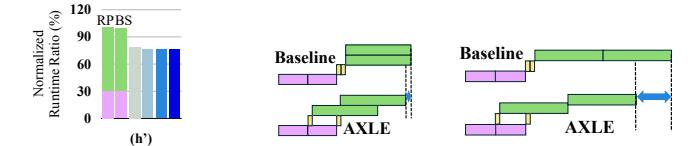

# *D. Towards Real Systems*

Hardware Architectures. The CCM model is built upon the CXL Type 3 device architecture ([§II\)](#page-1-1). A CXL Type 3 device allows the host to access device memory, which is sufficient to support host-initiated partial offloading. In contrast, the asynchronous back-streaming protocol requires device-initiated data transfers. To enable back-streaming while maintaining compatibility with existing CCM models, we target environments where a DMA engine is attached as a bus master on top of a CXL Type 3 device. In this configuration, payloads are transferred from the device to the host physical address via a CXL.io (PCIe) posted write. We configured sufficiently long CXL.io protocol latency for evaluation ([§V-A\)](#page-8-1). Software Stack Considerations. The design of AXLE is currently evaluated in a simulation environment. Assuming access to a hardware testbed and CXL IPs, building AXLErequires no changes to the underlying hardware or CXL protocol. On top of this, the full-system implementation consists of three primary software components: kernel-level on the host, userlevel on the host, and firmware on the device. The kernel-level component handles the CCM device driver, managing host DMA memory regions, and providing abstractions for offloading while handling the heavy lifting of low-level interactions. For example, DMA regions must be pre-pinned so that the device can directly access host physical addresses during DMA operations. These regions should also bypass the host cache

TABLE III

Simulation setup. The CCM configuration is based on  $\rm M^2NDP$  with 16  $\mu$ threads per subcore. The host is modeled with 2  $\mu$ threads per processing unit.

| Module | Hardware Configuration                                                                                                                                                                                                                                                                                                                                                                                                                                             |  |
|--------|--------------------------------------------------------------------------------------------------------------------------------------------------------------------------------------------------------------------------------------------------------------------------------------------------------------------------------------------------------------------------------------------------------------------------------------------------------------------|--|
| Host   | Processing unit & Cache freq: 3GHz # Processing units: 32, # $\mu$ Threads: 2 Main memory: DDR5_4800, 16 channels                                                                                                                                                                                                                                                                                                                                                  |  |
| CCM    | Processing unit & Cache freq: 2GHz # Processing units: 16, # μThreads: 16 CXL memory: DDR5_4800, 16 channels                                                                                                                                                                                                                                                                                                                                                       |  |
| Others | Scheduling policy: Round-robin (§V-E) CXL.mem round-trip protocol latency: 70 ns CXL.io round-trip protocol latency: 350 ns (RP) Firmware freq: 2 GHz (RP) Remote polling interval: 1 μs (AXLE) Polling Interval: 50 ns, 500 ns, 5 μs (AXLE) Streaming Factor: 32B, 64B (§V-E) (AXLE) Single DMA slot size: 32B, 64B (AXLE) DMA slot capacity: 50000 (§V-E) (AXLE) DMA preparation latency: 500 ns per req. (AXLE) Interrupt handling latency: 50 μs [11] per req. |  |

 $\label{thm:condition} TABLE\ IV$  Properties of the workloads used in our evaluation.

| Annot.     | Domain          | Application | Characteristics        |
|------------|-----------------|-------------|------------------------|
| (a)        | VectorDB        | KNN         | Dim: 2048, #Rows: 128  |
| (b)        | VectorDB        | KNN         | Dim: 1024, #Rows: 256  |
| (c)        | VectorDB        | KNN         | Dim: 512, #Rows: 512   |
| (d)        | Graph Analytics | SSSP        | #V: 264346, #E: 733846 |
| (e)        | Graph Analytics | PageRank    | #V: 299067, #E: 977676 |
| (f)        | OLÂP            | SSB         | Query: Q1_1 [30]       |
| (g)        | OLAP            | SSB         | Query: Q1_2 [30]       |
| (g) (h) | LLM Inference   | OPT 2.7b    | #Tokens: 1K            |
| (i)        | DLRM            | Criteo [7]  | Dim: 256, #Rows: 1M    |

to prevent cache staleness (§IV-C) during frequent streaming. Because a DMA region can be physically non-contiguous, the kernel must maintain a scatter-gather list for DMA physical regions and shadow the descriptors to the CCM device.

The user-level component should ensure correct communication and protocol behavior, such as flow control messages. We leave the design of a programming framework and APIs that allow host applications to leverage CCM across different offloading mechanisms to future work.

Finally, the CCM device firmware interfaces with the OS device driver and is responsible for the main part of asynchronous back-streaming. It should process offloading requests, monitor CCM result population, and trigger back-streaming through the DMA executor. The DMA executor is programmable using the shadow DMA region descriptors provided by the operating systems, allowing it to specify the source and destination addresses within the DMA routine.

#### V. EVALUATION

## A. Simulation Setup

We implement AXLE on top of the open-source CCM simulator  $M^2NDP$  and compare it against the partial offloading mechanisms described in §II: Remote Polling (RP) and Bulk Synchronous flow (BS). Since  $M^2NDP$  natively supports only

bulk synchronous flows, we implement a separate RP model on top of M2NDP. For the end-to-end runtime evaluation, we also implement an AXLE variant that uses interrupt-based result notification as an additional baseline (AXLE\_Interrupt). We adopt the general hardware configurations from M2NDP ([12], TABLE IV), with minor modifications to reflect varying computational capabilities of the host and CCM modules (§II). Table III summarizes the configuration changes applied in our end-to-end evaluation. We follow the CXL 3.0 specification [4] and prior documentation [6], [27] to configure the latency parameters of the CXL.mem and CXL.io protocols. In particular, [6] reports that CXL.io, similar to PCIe, can exhibit a pin-to-pin round-trip latency of approximately 275 ns on Intel Xeon platforms. In our evaluation, however, we adopt a more conservative latency value. For DMA preparation overhead, we assume a one-way control-plane latency (e.g., descriptor stores), while excluding data preparation and actual write time, which are explicitly modeled as memory operations in the simulator. Overall, our configuration remains conservative compared to recent PCIe latency measurements [16].

We evaluate nine representative workloads across five domains, following the partial offloading schemes in prior studies (Table I). Workload characteristics are summarized in Table IV. We implement several workload kernels in addition to the benchmarks used in M2NDP [13] in a similar RISC-V instructions form. The kernel instructions are executed by all of the  $\mu$ threads, each assigned a fixed-size input vector predetermined by the host and CCM schedulers. Our goal is to evaluate diverse host-CCM interaction patterns and offloading boundaries, defined by varying the relative combinations of CCM task length, data movement volume, and host task length. Accordingly, although some evaluated inputs are relatively small due to simulation constraints, our focus is on capturing relative communication-computation ratios rather than absolute dataset sizes; these trends are expected to remain consistent under scaling, and the results can be generalized to larger inputs. Figure 10 shows that the workloads in Table IV represent a wide distribution of different CCM task time, data movement time, and host task time ratios. For example, the OLAP and LLM workloads are dominated by host-side execution, while DLRM is dominated by CCM-side computation. In VectorDB, data movement time is marginal and the remaining components are relatively balanced, whereas the Graph workloads have a large portion of data movement time. Consistent with §III-B, we further vary input sets within the same workload (i.e., KNN) to highlight sensitivity to parameters under different workload characteristics.

## B. End-to-end Runtime

Figure 10 compares the end-to-end runtime of RP, BS, AXLE\_Interrupt, and the default AXLE under various local polling intervals. For RP and BS, we stack the individual component times, whereas for AXLE we use a single bar since tasks are overlapped. Each component runtime is normalized to the total runtime of RP, so the total ratio of RP is always 100%, while BS shows a slightly lower value. For instance, in

Fig. 10. Normalized end-to-end runtime ratio for baselines, AXLE variants with interrupt-based notification, and AXLE (polling factors: p1 = 50 ns, p10 = 500 ns, p100 = 5 µs). (a)–(d) show lightweight tasks with fine-grained offloading, where the interrupt-handling delay becomes a severe bottleneck. (e)–(g) show longer tasks where interrupt latency is partially hidden by overlap, yet still incurs significantly higher overhead than AXLE using local polling.

Figure [10\(](#page-9-0)a), the total ratio is 100% for RP and 90.46% for BS. AXLE further reduces the end-to-end runtime by overlapping tasks, achieving 63.41% in the same case.

As discussed earlier, rapid notification is crucial for the endto-end pipeline, making a na¨ıve interrupt-based mechanism an unsuitable design choice ([§IV-A\)](#page-5-2). In Figure [10,](#page-9-0) we demonstrate this by evaluating an AXLE variant that assumes an optimistic 50 µs [\[11\]](#page-13-29) interrupt-handling delay per DMA request (e.g., context switching and related costs). Figure [10\(](#page-9-0)a)–(d), (i) show that this delay becomes a severe bottleneck for lightweight tasks. For example, using AXLE Interrupt in Figure [10\(](#page-9-0)a) results in a normalized runtime of 214.64% relative to RP. Figure [10\(](#page-9-0)e)–(g) present longer tasks where interrupt latency is partially hidden by AXLE 's overlapping execution. Nonetheless, AXLE Interrupt still incurs higher overhead than AXLE with local polling.

Compared to RP and BS, AXLE consistently reduces the end-to-end runtime for most workloads, except in Figure [10\(](#page-9-0)h). For instance, when running PageRank (Figure [10\(](#page-9-0)e)) with a 50 ns polling interval (p1), the total runtime ratio decreases by up to 50.14% and 48.88% relative to RP and BS, respectively. In this case, increasing the polling interval has little effect. In contrast, for relatively fine-grained tasks, the polling interval has a more pronounced impact. For example, with KNN (Figure [10\(](#page-9-0)b)), extending the interval to 5 µs (p100) increases the runtime by 1.18× compared to using the 50 ns interval.

In Figure [10\(](#page-9-0)j), we report the end-to-end time ratio reduction of AXLE under different polling intervals. We present average, geomean, and maximum values across all workloads compared to each baselines. With a short interval (p1), the average of the time ratio reductions across all workloads is 30.21% over RP and 26.22% over BS. Extending the interval to p100 diminishes the benefit. Nevertheless, we show that polling intervals of a few microseconds provide substantial improvements. Longer polling intervals introduce a clear tradeoff between application performance and host core efficiency, which we analyze in detail in the later sections ([§V-E\)](#page-10-0).

Overall, when the workload is well parallelized, AXLE delivers predictable performance, as the longest-running component tends to overlap most of the remaining runtime. For instance, in Figure [10\(](#page-9-0)f), the runtime ratios for BS are 22.24% for CCM processing, 0.58% for data movement, and 75.84% for host processing (totaling 98.66%). In comparison, AXLE achieves an end-to-end runtime of 77.12%, indicating that host processing effectively overlaps the other components through

(a) LLM result with less processing units (b) The case of Figure [10\(](#page-9-0)h) (c) The case of Figure [11\(](#page-9-1)a)

Fig. 11. Different LLM-case results under modified hardware configurations: reduced processing units in both the CCM (32 → 8) and the host (16 → 4), followed by analyses of how these changes impact the end-to-end pipeline with AXLE. Colors and legend follow Figure [10.](#page-9-0)

pipelining. AXLE therefore provides general optimization across diverse workloads and configurations without requiring application-specific knowledge.

However, the performance improvement can be marginal for certain workloads and configurations, as illustrated in Figure [10\(](#page-9-0)h). During LLM inference, the host offloads the attention block to CCM (Table [I\)](#page-1-0), while the host handles the fullyconnected MLP layers. In this case, CCM processes a large dataset, but the intermediate attention output is considerably small ([1, hidden\_size]), which leads to result sparsity. As a result, host tasks are far fewer than CCM tasks due to this sparse data dependency. Note that even with overlapping, the final host task always sits at the end of the pipeline. When the number of host tasks is small, this last task's runtime roughly matches the total runtime of concurrently executed host tasks in the baseline, leading to similar end-to-end performance (i.e., Figure [11\(b\)\)](#page-9-2). Figure [11\(a\)](#page-9-3) shows the same workload under a different hardware setup. With fewer host processing units, the host can no longer batch all requests (i.e., the green host tasks are no longer fully concurrent), making AXLE 's overlap more effective, as illustrated in Figure [11\(c\).](#page-9-4) Consequently, AXLE achieves a 75.99% runtime ratio (p10) compared to RP.

# *D. Towards Real Systems*

Hardware Architectures. The CCM model is built upon the CXL Type 3 device architecture ([§II\)](#page-1-1). A CXL Type 3 device allows the host to access device memory, which is sufficient to support host-initiated partial offloading. In contrast, the asynchronous back-streaming protocol requires device-initiated data transfers. To enable back-streaming while maintaining compatibility with existing CCM models, we target environments where a DMA engine is attached as a bus master on top of a CXL Type 3 device. In this configuration, payloads are transferred from the device to the host physical address via a CXL.io (PCIe) posted write. We configured sufficiently long CXL.io protocol latency for evaluation ([§V-A\)](#page-8-1). Software Stack Considerations. The design of AXLE is currently evaluated in a simulation environment. Assuming access to a hardware testbed and CXL IPs, building AXLErequires no changes to the underlying hardware or CXL protocol. On top of this, the full-system implementation consists of three primary software components: kernel-level on the host, userlevel on the host, and firmware on the device. The kernel-level component handles the CCM device driver, managing host DMA memory regions, and providing abstractions for offloading while handling the heavy lifting of low-level interactions. For example, DMA regions must be pre-pinned so that the device can directly access host physical addresses during DMA operations. These regions should also bypass the host cache

TABLE III

Simulation setup. The CCM configuration is based on  $\rm M^2NDP$  with 16  $\mu$ threads per subcore. The host is modeled with 2  $\mu$ threads per processing unit.

| Module | Hardware Configuration                                                                                                                                                                                                                                                                                                                                                                                                                                             |  |
|--------|--------------------------------------------------------------------------------------------------------------------------------------------------------------------------------------------------------------------------------------------------------------------------------------------------------------------------------------------------------------------------------------------------------------------------------------------------------------------|--|
| Host   | Processing unit & Cache freq: 3GHz # Processing units: 32, # $\mu$ Threads: 2 Main memory: DDR5_4800, 16 channels                                                                                                                                                                                                                                                                                                                                                  |  |
| CCM    | Processing unit & Cache freq: 2GHz # Processing units: 16, # μThreads: 16 CXL memory: DDR5_4800, 16 channels                                                                                                                                                                                                                                                                                                                                                       |  |
| Others | Scheduling policy: Round-robin (§V-E) CXL.mem round-trip protocol latency: 70 ns CXL.io round-trip protocol latency: 350 ns (RP) Firmware freq: 2 GHz (RP) Remote polling interval: 1 μs (AXLE) Polling Interval: 50 ns, 500 ns, 5 μs (AXLE) Streaming Factor: 32B, 64B (§V-E) (AXLE) Single DMA slot size: 32B, 64B (AXLE) DMA slot capacity: 50000 (§V-E) (AXLE) DMA preparation latency: 500 ns per req. (AXLE) Interrupt handling latency: 50 μs [11] per req. |  |

 $\label{thm:condition} TABLE\ IV$  Properties of the workloads used in our evaluation.

| Annot.     | Domain          | Application | Characteristics        |
|------------|-----------------|-------------|------------------------|
| (a)        | VectorDB        | KNN         | Dim: 2048, #Rows: 128  |
| (b)        | VectorDB        | KNN         | Dim: 1024, #Rows: 256  |
| (c)        | VectorDB        | KNN         | Dim: 512, #Rows: 512   |
| (d)        | Graph Analytics | SSSP        | #V: 264346, #E: 733846 |
| (e)        | Graph Analytics | PageRank    | #V: 299067, #E: 977676 |
| (f)        | OLÂP            | SSB         | Query: Q1_1 [30]       |
| (g)        | OLAP            | SSB         | Query: Q1_2 [30]       |
| (g) (h) | LLM Inference   | OPT 2.7b    | #Tokens: 1K            |
| (i)        | DLRM            | Criteo [7]  | Dim: 256, #Rows: 1M    |

to prevent cache staleness (§IV-C) during frequent streaming. Because a DMA region can be physically non-contiguous, the kernel must maintain a scatter-gather list for DMA physical regions and shadow the descriptors to the CCM device.

The user-level component should ensure correct communication and protocol behavior, such as flow control messages. We leave the design of a programming framework and APIs that allow host applications to leverage CCM across different offloading mechanisms to future work.

Finally, the CCM device firmware interfaces with the OS device driver and is responsible for the main part of asynchronous back-streaming. It should process offloading requests, monitor CCM result population, and trigger back-streaming through the DMA executor. The DMA executor is programmable using the shadow DMA region descriptors provided by the operating systems, allowing it to specify the source and destination addresses within the DMA routine.

#### V. EVALUATION

## A. Simulation Setup

We implement AXLE on top of the open-source CCM simulator  $M^2NDP$  and compare it against the partial offloading mechanisms described in §II: Remote Polling (RP) and Bulk Synchronous flow (BS). Since  $M^2NDP$  natively supports only

bulk synchronous flows, we implement a separate RP model on top of M2NDP. For the end-to-end runtime evaluation, we also implement an AXLE variant that uses interrupt-based result notification as an additional baseline (AXLE\_Interrupt). We adopt the general hardware configurations from M2NDP ([12], TABLE IV), with minor modifications to reflect varying computational capabilities of the host and CCM modules (§II). Table III summarizes the configuration changes applied in our end-to-end evaluation. We follow the CXL 3.0 specification [4] and prior documentation [6], [27] to configure the latency parameters of the CXL.mem and CXL.io protocols. In particular, [6] reports that CXL.io, similar to PCIe, can exhibit a pin-to-pin round-trip latency of approximately 275 ns on Intel Xeon platforms. In our evaluation, however, we adopt a more conservative latency value. For DMA preparation overhead, we assume a one-way control-plane latency (e.g., descriptor stores), while excluding data preparation and actual write time, which are explicitly modeled as memory operations in the simulator. Overall, our configuration remains conservative compared to recent PCIe latency measurements [16].

We evaluate nine representative workloads across five domains, following the partial offloading schemes in prior studies (Table I). Workload characteristics are summarized in Table IV. We implement several workload kernels in addition to the benchmarks used in M2NDP [13] in a similar RISC-V instructions form. The kernel instructions are executed by all of the  $\mu$ threads, each assigned a fixed-size input vector predetermined by the host and CCM schedulers. Our goal is to evaluate diverse host-CCM interaction patterns and offloading boundaries, defined by varying the relative combinations of CCM task length, data movement volume, and host task length. Accordingly, although some evaluated inputs are relatively small due to simulation constraints, our focus is on capturing relative communication-computation ratios rather than absolute dataset sizes; these trends are expected to remain consistent under scaling, and the results can be generalized to larger inputs. Figure 10 shows that the workloads in Table IV represent a wide distribution of different CCM task time, data movement time, and host task time ratios. For example, the OLAP and LLM workloads are dominated by host-side execution, while DLRM is dominated by CCM-side computation. In VectorDB, data movement time is marginal and the remaining components are relatively balanced, whereas the Graph workloads have a large portion of data movement time. Consistent with §III-B, we further vary input sets within the same workload (i.e., KNN) to highlight sensitivity to parameters under different workload characteristics.

## B. End-to-end Runtime

Figure 10 compares the end-to-end runtime of RP, BS, AXLE\_Interrupt, and the default AXLE under various local polling intervals. For RP and BS, we stack the individual component times, whereas for AXLE we use a single bar since tasks are overlapped. Each component runtime is normalized to the total runtime of RP, so the total ratio of RP is always 100%, while BS shows a slightly lower value. For instance, in

Fig. 10. Normalized end-to-end runtime ratio for baselines, AXLE variants with interrupt-based notification, and AXLE (polling factors: p1 = 50 ns, p10 = 500 ns, p100 = 5 µs). (a)–(d) show lightweight tasks with fine-grained offloading, where the interrupt-handling delay becomes a severe bottleneck. (e)–(g) show longer tasks where interrupt latency is partially hidden by overlap, yet still incurs significantly higher overhead than AXLE using local polling.

Figure [10\(](#page-9-0)a), the total ratio is 100% for RP and 90.46% for BS. AXLE further reduces the end-to-end runtime by overlapping tasks, achieving 63.41% in the same case.

As discussed earlier, rapid notification is crucial for the endto-end pipeline, making a na¨ıve interrupt-based mechanism an unsuitable design choice ([§IV-A\)](#page-5-2). In Figure [10,](#page-9-0) we demonstrate this by evaluating an AXLE variant that assumes an optimistic 50 µs [\[11\]](#page-13-29) interrupt-handling delay per DMA request (e.g., context switching and related costs). Figure [10\(](#page-9-0)a)–(d), (i) show that this delay becomes a severe bottleneck for lightweight tasks. For example, using AXLE Interrupt in Figure [10\(](#page-9-0)a) results in a normalized runtime of 214.64% relative to RP. Figure [10\(](#page-9-0)e)–(g) present longer tasks where interrupt latency is partially hidden by AXLE 's overlapping execution. Nonetheless, AXLE Interrupt still incurs higher overhead than AXLE with local polling.

Compared to RP and BS, AXLE consistently reduces the end-to-end runtime for most workloads, except in Figure [10\(](#page-9-0)h). For instance, when running PageRank (Figure [10\(](#page-9-0)e)) with a 50 ns polling interval (p1), the total runtime ratio decreases by up to 50.14% and 48.88% relative to RP and BS, respectively. In this case, increasing the polling interval has little effect. In contrast, for relatively fine-grained tasks, the polling interval has a more pronounced impact. For example, with KNN (Figure [10\(](#page-9-0)b)), extending the interval to 5 µs (p100) increases the runtime by 1.18× compared to using the 50 ns interval.

In Figure [10\(](#page-9-0)j), we report the end-to-end time ratio reduction of AXLE under different polling intervals. We present average, geomean, and maximum values across all workloads compared to each baselines. With a short interval (p1), the average of the time ratio reductions across all workloads is 30.21% over RP and 26.22% over BS. Extending the interval to p100 diminishes the benefit. Nevertheless, we show that polling intervals of a few microseconds provide substantial improvements. Longer polling intervals introduce a clear tradeoff between application performance and host core efficiency, which we analyze in detail in the later sections ([§V-E\)](#page-10-0).

Overall, when the workload is well parallelized, AXLE delivers predictable performance, as the longest-running component tends to overlap most of the remaining runtime. For instance, in Figure [10\(](#page-9-0)f), the runtime ratios for BS are 22.24% for CCM processing, 0.58% for data movement, and 75.84% for host processing (totaling 98.66%). In comparison, AXLE achieves an end-to-end runtime of 77.12%, indicating that host processing effectively overlaps the other components through

(a) LLM result with less processing units (b) The case of Figure [10\(](#page-9-0)h) (c) The case of Figure [11\(](#page-9-1)a)

Fig. 11. Different LLM-case results under modified hardware configurations: reduced processing units in both the CCM (32 → 8) and the host (16 → 4), followed by analyses of how these changes impact the end-to-end pipeline with AXLE. Colors and legend follow Figure [10.](#page-9-0)

pipelining. AXLE therefore provides general optimization across diverse workloads and configurations without requiring application-specific knowledge.

However, the performance improvement can be marginal for certain workloads and configurations, as illustrated in Figure [10\(](#page-9-0)h). During LLM inference, the host offloads the attention block to CCM (Table [I\)](#page-1-0), while the host handles the fullyconnected MLP layers. In this case, CCM processes a large dataset, but the intermediate attention output is considerably small ([1, hidden\_size]), which leads to result sparsity. As a result, host tasks are far fewer than CCM tasks due to this sparse data dependency. Note that even with overlapping, the final host task always sits at the end of the pipeline. When the number of host tasks is small, this last task's runtime roughly matches the total runtime of concurrently executed host tasks in the baseline, leading to similar end-to-end performance (i.e., Figure [11\(b\)\)](#page-9-2). Figure [11\(a\)](#page-9-3) shows the same workload under a different hardware setup. With fewer host processing units, the host can no longer batch all requests (i.e., the green host tasks are no longer fully concurrent), making AXLE 's overlap more effective, as illustrated in Figure [11\(c\).](#page-9-4) Consequently, AXLE achieves a 75.99% runtime ratio (p10) compared to RP.

