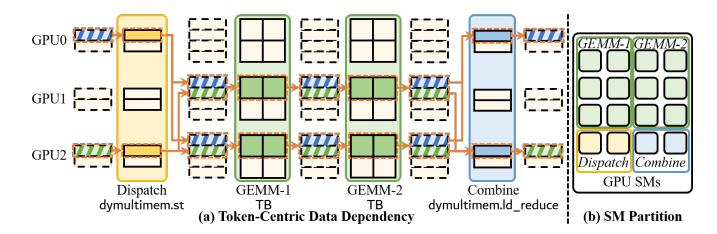
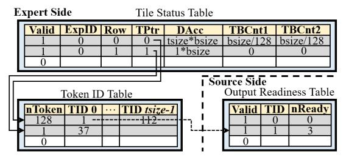

# *A. Key Idea of Token-Centric Kernel Fusion*

Token-centric kernel fusion treats the MoE layer as a *token-paced pipeline* rather than four isolated operators. As illustrated in Fig. 12(a), the insight is that readiness can be determined at *token/tile* granularity, so operation can be performed as soon as their inputs for a given token (or a tile of tsize tokens) become available, without waiting for operator-wide completion. Concretely, by explicitly tracking these token-level dependencies and scheduling at *readiness boundaries*, Dispatch and Combine proceed *concurrently*.

As previewed in Sec. II-D, Fig. 4(a)–(f) provides a detailed illustration of how kernel fusion *translates the traffic reduction* of dynamic multimem addressing into *speedup*. Without dynamic multimem addressing, the two baselines in Fig. 4(a)(b),

Fig. 12. (a) Token-centric data dependency chain across Dispatch, GEMM-1, GEMM-2, and Combine. (b) SM partition for pipelined execution.

i.e., DeepEP (baseline without overlap) and COMET (baseline with basic overlap), suffer from significant communication bottlenecks. Dynamic multimem addressing reduces GPU→switch traffic for Dispatch and switch→GPU traffic for Combine, yielding DySHARP-Basic (dynamic multimem addressing without overlap) and DySHARP-COMET (dynamic multimem addressing with basic overlap) in Fig. 4(c)(d). However, this traffic reduction does not directly lead to speedup because of the asymmetry between two directions in communication pattern. Hence we propose token-centric kernel fusion to translate traffic reduction into overall speedup. As depicted in Fig. 4(f), this is achieved by co-executing Dispatch and Combine concurrently, thereby merging complementary asymmetric communication patterns in Fig. 4(c)(d). This concurrent execution is fine-grained pipelining the *whole* Dispatch-Computation-Combine flow. Importantly, token-centric kernel fusion *alone* in Fig. 4(e) does *not* yield speedup over the SOTA baseline COMET, it must be *integrated* with in-switch computing together to unlock the full performance potential. We provide detailed experimental analysis in Sec. VI-A3.

## *B. Token Tracker*

The token tracker is proposed to detect *readiness boundaries*. It detects when a tile of tokens from Dispatch becomes consumable for its consumer GEMM TBs, and when a token with its topk expert outputs are ready for its Combine.

- *1) Token Tracker Design:* The tracker monitors the dependency chains as illustrated in Fig. 12(a).
- Dispatch⇒GEMM-1: When tsize dispatched tokens for an expert have arrived through dymultimem.st, the corresponding row of GEMM-1 TBs is ready and can be issued immediately. Each expert locally counts arrived tokens. When counter reaches tsize, a row of GEMM-1 TBs is marked ready to issue.
- GEMM-1⇒GEMM-2: A GEMM-2 TB row becomes ready when the corresponding GEMM-1 TB row completes. Tracker monitors TB completion of GEMM-1 and notifies the scheduler when a row of TB completes.
- GEMM-2⇒Combine: For each token, when all its topk expert outputs are produced, Combine for this token can be executed via dymultimem.ld\_reduce. When a GEMM-2 TB row finishes its tsize outputs, it notifies the source GPU of these tokens. Source GPU counts the number of notifications received for each token, and is ready when counter reaches topk.

Fig. 13. Architecture design of token tracker. Token tracker introduces Tile Status Table for Dispatch⇒GEMM-1 and GEMM-1⇒GEMM-2 readiness tracking, and cooperates with proposed Token ID Table and Output Readiness Table to track GEMM-2⇒Combine readiness.

*2) Token Tracker Architectural Support:* To implement the above readiness tracking, the tracker uses three lightweight tables, as shown in Fig. 13.

Tile Status (TS) Table monitors the status of each tsizetoken tile corresponding to a GEMM TB row. It tracks 1) the readiness of Dispatch⇒GEMM-1, 2) the readiness of GEMM-1⇒GEMM-2, and 3) the completion of GEMM-2 TB row to assist GEMM-2⇒Combine readiness tracking.

Each entry TS Table includes a Valid field to indicate if the entry is valid, an ExpID field to identify the expert that the tsize tokens belong to, and a Row field to record the row of TB these tokens correspond to. 1) To track the readiness of Dispatch⇒GEMM-1, TS Table uses DAcc field to track the number of dymultimem.st access to the address region for these tsize tokens. Reaching tsize∗bsize indicates the arrival of dispatched tsize tokens, marking the GEMM-1 TB row ready to issue. 2) TS Table includes a TBCnt1 field to track GEMM-1⇒GEMM-2 readiness. This field tracks the number of completed GEMM-1 TB of this row. Completion of all TBs in this row indicates the readiness of the corresponding GEMM-2 TB row. 3) Similar to TBCnt1, TBCnt2 counts the number of completed GEMM-2 TB of this row. The completion of the row starts the notification to source GPUs for GEMM-2⇒Combine readiness tracking. The TS Table resides on-chip and can be offloaded to DRAM on overflow.

Token ID (TID) Table and Output Readiness (OR) Table are for GEMM-2⇒Combine readiness tracking. TID Table records tokens of each token tile, which are the tokens to be notified at the completion of GEMM-2 TB row. It records the number of tokens in this tile as nToken and each token ID as TID, which is registered when allocating the layout block to the algebraic block. Due to size and low access frequency, this table is placed in DRAM. OR Table receives this notification to track the readiness of each token for Combine. OR Table entry adopts a counter nReady to track the readiness of token TID. OR Table resides on-chip and can be offloaded to DRAM.

When TS Table detects the completion of a GEMM-2 TB row, tracker notifies source GPUs of these tokens for their readiness. Tracker indexes TID Table with TPtr to collect completed token IDs, and then sends notifications to source GPUs of these tokens. When source GPU receives a notification, it increments nReady of the token entry. nReady reaching topk indicates the readiness of this token for Combine.

To guarantee visibility of produced data before accessing, all state updates in token tracker's tables are performed after written data is visible to all SMs, i.e., when the acknowledge is detected, indicating stored data has arrived at LLC/DRAM.

#### C. Token-Centric Scheduler

The scheduler realizes token-paced pipeline based on readiness detection of the tracker. It allows Dispatch and Combine to run concurrently, merging asymmetric traffic of in-switch computing. This scheduler is implemented in software through megakernel that employs persistent thread blocks (TBs) to bypass hardware TB scheduler [26]. Original TBs are represented as *tasks*, and the action of *issuing a TB to an SM* is emulated by a persistent TB fetching a task from the task list.

- 1) SM Partitioning: As shown in Fig. 12(b), to achieve pipelining, SMs are partitioned into four groups dedicated to Dispatch, GEMM-1, GEMM-2, and Combine. A modified TB scheduler issues TBs of each kernel to its SM group. GEMM-1 and GEMM-2 can share SMs when one has no ready TB.
- 2) Readiness-Gated Schedule: Consistent with Sec. IV-A, operation is gated by readiness besides resource availability. To check readiness for synchronization, the kernel polls the field indicating readiness in the token tracker's tables using a dedicated load instruction within a loop until they are ready:
- GEMM-1/GEMM-2: a row of TB is issued only when the tracker marks the corresponding row *ready* based on TS Table and the target SM group has capacity.
- Combine: communication kernels query token readiness,
  i.e., if the nReady of OR entry reaches topk, before issuing dymultimem.ld\_reduce for that token.

As shown in Fig. 4(f), because readiness is checked at token/tile granularity, MoE layer is executed as a token-paced pipeline. Dispatch, dominating GPU—switch, and Combine, dominating switch—GPU, naturally run in parallel, merging asymmetric pattern to improve bandwidth utilization.

#### V. EXPERIMENTAL METHODOLOGY

### A. Hardware Configuration

In our experiment, we simulate the NVIDIA GH200 NVL32 [33], a 32-GPU system interconnected via nine NVSwitch with a fully connected fat-tree topology. We integrate BookSim2 [16] and our customized Accel-Sim [18] to simulate our system in a cycle-accurate approach, with each GPU configured based on the NVIDIA H200 specifications [32]. For DeepSeek-V3, we extend the latest version of Accel-Sim, which supports basic Hopper features, to simulate high-performance FP8 kernels. To enable multi-GPU simulation, we support concurrent execution across GPUs connected through a switch-based network through BookSim2.

NVLink is modeled using real device parameters of NVLink 4.0 [34]. The bidirectional bandwidth of NVLink is configured to 900 GB/s, and the latency of a single NVLink is configured to 250ns, where the round-trip latency is 1 µs. Flit size is set as 16B. For our modeled NVSwitch, each input port provides sixteen 256-depth virtual channels, with eight for requests and eight for responses. Port reduction buffer size is set to 64KB.

For architectural support of dynamic multimem addressing, the MultimemQ in LSU consists of 32 entries, and AL TLB in Hub is configured to 512 entries. For token-centric kernel fusion, both TS Table and OR Table have 1024 entries. Our simulator is validated against DGX-H100, with average errors within 6% for GEMM and DeepEP communication operators across diverse shapes/volumes.

#### B. Benchmark

| Name       | Hidden | MoE Hidden | Attention | Sequence | Number of | topk        |
|------------|--------|------------|-----------|----------|-----------|-------------|
|            | Size   | Size       | Heads     | Length   | Experts   | Candidates  |
| Small (S)  | 2048   | 512        | 32        | 2048     | 64        | {8, 16, 32} |
| Medium (M) | 4096   | 1024       | 64        | 4096     | 128       | {8, 16, 32} |
| Large (L)  | 7168   | 2048       | 128       | 8192     | 256       | {8, 16, 32} |
|            |        | ,          | TARLEI    |          |           |             |

MODEL CONFIGURATIONS ADOPTED IN EVALUATION.

DeepSeek-V3 [6] stands as one of the most competitive MoE-based LLMs. We therefore refer DeepSeek-V3 for our evaluation. Table I details the model configurations adopted in our evaluation. In addition to the official DeepSeek-V3 model configuration, denoted as *Large* (L), we configure two additional model sizes: Small (S) and Medium (M). The number of activated experts, topk, is 8 in DeepSeek-V3. We also evaluate topk = 16/32 to cover broader sparsity ranges, which may be potentially adopted in larger future models. Our evaluation focuses on communication-heavy MoE training, with data parallelism for attention layers and expert parallelism for MoE layers within a NVL32 node. For end-to-end training, the 16-way pipeline parallelism is adopted across 16-NVL32 nodes [6]. Following ByteDance's observation for typical training jobs [1], [57], we model the token distribution across experts as a normal distribution with a standard deviation (std) of 0.032.

#### C. Baseline

DySHARP is evaluated against seven baselines: 1) **DeepEP** [59] is the state-of-the-art communication library for Dispatch and Combine, where no in-switch computing is utilized. 2) **NVLink SHARP** (**NVLS**) [19] is the existing inswitch computing solution for static collective operations. Dispatch/Combine are replaced with AllGather/Reduce-Scatter as a workaround. 3) **FasterMoE** [10] and 4) **Tutel** [12] are coarse-grained computation-communication overlapping solutions for MoE. 5) **CCFuser** [53] and 6) **COMET** [57] are fine-grained overlapping solutions, supporting Dispatch-GEMM and GEMM-Combine overlapping. 7) **DualPipe** [6] is an overlap strategy designed for cross-node pipeline.

# *A. Key Idea of Token-Centric Kernel Fusion*

Token-centric kernel fusion treats the MoE layer as a *token-paced pipeline* rather than four isolated operators. As illustrated in Fig. 12(a), the insight is that readiness can be determined at *token/tile* granularity, so operation can be performed as soon as their inputs for a given token (or a tile of tsize tokens) become available, without waiting for operator-wide completion. Concretely, by explicitly tracking these token-level dependencies and scheduling at *readiness boundaries*, Dispatch and Combine proceed *concurrently*.

As previewed in Sec. II-D, Fig. 4(a)–(f) provides a detailed illustration of how kernel fusion *translates the traffic reduction* of dynamic multimem addressing into *speedup*. Without dynamic multimem addressing, the two baselines in Fig. 4(a)(b),

Fig. 12. (a) Token-centric data dependency chain across Dispatch, GEMM-1, GEMM-2, and Combine. (b) SM partition for pipelined execution.

i.e., DeepEP (baseline without overlap) and COMET (baseline with basic overlap), suffer from significant communication bottlenecks. Dynamic multimem addressing reduces GPU→switch traffic for Dispatch and switch→GPU traffic for Combine, yielding DySHARP-Basic (dynamic multimem addressing without overlap) and DySHARP-COMET (dynamic multimem addressing with basic overlap) in Fig. 4(c)(d). However, this traffic reduction does not directly lead to speedup because of the asymmetry between two directions in communication pattern. Hence we propose token-centric kernel fusion to translate traffic reduction into overall speedup. As depicted in Fig. 4(f), this is achieved by co-executing Dispatch and Combine concurrently, thereby merging complementary asymmetric communication patterns in Fig. 4(c)(d). This concurrent execution is fine-grained pipelining the *whole* Dispatch-Computation-Combine flow. Importantly, token-centric kernel fusion *alone* in Fig. 4(e) does *not* yield speedup over the SOTA baseline COMET, it must be *integrated* with in-switch computing together to unlock the full performance potential. We provide detailed experimental analysis in Sec. VI-A3.

## *B. Token Tracker*

The token tracker is proposed to detect *readiness boundaries*. It detects when a tile of tokens from Dispatch becomes consumable for its consumer GEMM TBs, and when a token with its topk expert outputs are ready for its Combine.

- *1) Token Tracker Design:* The tracker monitors the dependency chains as illustrated in Fig. 12(a).
- Dispatch⇒GEMM-1: When tsize dispatched tokens for an expert have arrived through dymultimem.st, the corresponding row of GEMM-1 TBs is ready and can be issued immediately. Each expert locally counts arrived tokens. When counter reaches tsize, a row of GEMM-1 TBs is marked ready to issue.
- GEMM-1⇒GEMM-2: A GEMM-2 TB row becomes ready when the corresponding GEMM-1 TB row completes. Tracker monitors TB completion of GEMM-1 and notifies the scheduler when a row of TB completes.
- GEMM-2⇒Combine: For each token, when all its topk expert outputs are produced, Combine for this token can be executed via dymultimem.ld\_reduce. When a GEMM-2 TB row finishes its tsize outputs, it notifies the source GPU of these tokens. Source GPU counts the number of notifications received for each token, and is ready when counter reaches topk.

Fig. 13. Architecture design of token tracker. Token tracker introduces Tile Status Table for Dispatch⇒GEMM-1 and GEMM-1⇒GEMM-2 readiness tracking, and cooperates with proposed Token ID Table and Output Readiness Table to track GEMM-2⇒Combine readiness.

*2) Token Tracker Architectural Support:* To implement the above readiness tracking, the tracker uses three lightweight tables, as shown in Fig. 13.

Tile Status (TS) Table monitors the status of each tsizetoken tile corresponding to a GEMM TB row. It tracks 1) the readiness of Dispatch⇒GEMM-1, 2) the readiness of GEMM-1⇒GEMM-2, and 3) the completion of GEMM-2 TB row to assist GEMM-2⇒Combine readiness tracking.

Each entry TS Table includes a Valid field to indicate if the entry is valid, an ExpID field to identify the expert that the tsize tokens belong to, and a Row field to record the row of TB these tokens correspond to. 1) To track the readiness of Dispatch⇒GEMM-1, TS Table uses DAcc field to track the number of dymultimem.st access to the address region for these tsize tokens. Reaching tsize∗bsize indicates the arrival of dispatched tsize tokens, marking the GEMM-1 TB row ready to issue. 2) TS Table includes a TBCnt1 field to track GEMM-1⇒GEMM-2 readiness. This field tracks the number of completed GEMM-1 TB of this row. Completion of all TBs in this row indicates the readiness of the corresponding GEMM-2 TB row. 3) Similar to TBCnt1, TBCnt2 counts the number of completed GEMM-2 TB of this row. The completion of the row starts the notification to source GPUs for GEMM-2⇒Combine readiness tracking. The TS Table resides on-chip and can be offloaded to DRAM on overflow.

Token ID (TID) Table and Output Readiness (OR) Table are for GEMM-2⇒Combine readiness tracking. TID Table records tokens of each token tile, which are the tokens to be notified at the completion of GEMM-2 TB row. It records the number of tokens in this tile as nToken and each token ID as TID, which is registered when allocating the layout block to the algebraic block. Due to size and low access frequency, this table is placed in DRAM. OR Table receives this notification to track the readiness of each token for Combine. OR Table entry adopts a counter nReady to track the readiness of token TID. OR Table resides on-chip and can be offloaded to DRAM.

When TS Table detects the completion of a GEMM-2 TB row, tracker notifies source GPUs of these tokens for their readiness. Tracker indexes TID Table with TPtr to collect completed token IDs, and then sends notifications to source GPUs of these tokens. When source GPU receives a notification, it increments nReady of the token entry. nReady reaching topk indicates the readiness of this token for Combine.

To guarantee visibility of produced data before accessing, all state updates in token tracker's tables are performed after written data is visible to all SMs, i.e., when the acknowledge is detected, indicating stored data has arrived at LLC/DRAM.

#### C. Token-Centric Scheduler

The scheduler realizes token-paced pipeline based on readiness detection of the tracker. It allows Dispatch and Combine to run concurrently, merging asymmetric traffic of in-switch computing. This scheduler is implemented in software through megakernel that employs persistent thread blocks (TBs) to bypass hardware TB scheduler [26]. Original TBs are represented as *tasks*, and the action of *issuing a TB to an SM* is emulated by a persistent TB fetching a task from the task list.

- 1) SM Partitioning: As shown in Fig. 12(b), to achieve pipelining, SMs are partitioned into four groups dedicated to Dispatch, GEMM-1, GEMM-2, and Combine. A modified TB scheduler issues TBs of each kernel to its SM group. GEMM-1 and GEMM-2 can share SMs when one has no ready TB.
- 2) Readiness-Gated Schedule: Consistent with Sec. IV-A, operation is gated by readiness besides resource availability. To check readiness for synchronization, the kernel polls the field indicating readiness in the token tracker's tables using a dedicated load instruction within a loop until they are ready:
- GEMM-1/GEMM-2: a row of TB is issued only when the tracker marks the corresponding row *ready* based on TS Table and the target SM group has capacity.
- Combine: communication kernels query token readiness,
  i.e., if the nReady of OR entry reaches topk, before issuing dymultimem.ld\_reduce for that token.

As shown in Fig. 4(f), because readiness is checked at token/tile granularity, MoE layer is executed as a token-paced pipeline. Dispatch, dominating GPU—switch, and Combine, dominating switch—GPU, naturally run in parallel, merging asymmetric pattern to improve bandwidth utilization.

#### V. EXPERIMENTAL METHODOLOGY

### A. Hardware Configuration

In our experiment, we simulate the NVIDIA GH200 NVL32 [33], a 32-GPU system interconnected via nine NVSwitch with a fully connected fat-tree topology. We integrate BookSim2 [16] and our customized Accel-Sim [18] to simulate our system in a cycle-accurate approach, with each GPU configured based on the NVIDIA H200 specifications [32]. For DeepSeek-V3, we extend the latest version of Accel-Sim, which supports basic Hopper features, to simulate high-performance FP8 kernels. To enable multi-GPU simulation, we support concurrent execution across GPUs connected through a switch-based network through BookSim2.

NVLink is modeled using real device parameters of NVLink 4.0 [34]. The bidirectional bandwidth of NVLink is configured to 900 GB/s, and the latency of a single NVLink is configured to 250ns, where the round-trip latency is 1 µs. Flit size is set as 16B. For our modeled NVSwitch, each input port provides sixteen 256-depth virtual channels, with eight for requests and eight for responses. Port reduction buffer size is set to 64KB.

For architectural support of dynamic multimem addressing, the MultimemQ in LSU consists of 32 entries, and AL TLB in Hub is configured to 512 entries. For token-centric kernel fusion, both TS Table and OR Table have 1024 entries. Our simulator is validated against DGX-H100, with average errors within 6% for GEMM and DeepEP communication operators across diverse shapes/volumes.

#### B. Benchmark

| Name       | Hidden | MoE Hidden | Attention | Sequence | Number of | topk        |
|------------|--------|------------|-----------|----------|-----------|-------------|
|            | Size   | Size       | Heads     | Length   | Experts   | Candidates  |
| Small (S)  | 2048   | 512        | 32        | 2048     | 64        | {8, 16, 32} |
| Medium (M) | 4096   | 1024       | 64        | 4096     | 128       | {8, 16, 32} |
| Large (L)  | 7168   | 2048       | 128       | 8192     | 256       | {8, 16, 32} |
|            |        | ,          | TARLEI    |          |           |             |

MODEL CONFIGURATIONS ADOPTED IN EVALUATION.

DeepSeek-V3 [6] stands as one of the most competitive MoE-based LLMs. We therefore refer DeepSeek-V3 for our evaluation. Table I details the model configurations adopted in our evaluation. In addition to the official DeepSeek-V3 model configuration, denoted as *Large* (L), we configure two additional model sizes: Small (S) and Medium (M). The number of activated experts, topk, is 8 in DeepSeek-V3. We also evaluate topk = 16/32 to cover broader sparsity ranges, which may be potentially adopted in larger future models. Our evaluation focuses on communication-heavy MoE training, with data parallelism for attention layers and expert parallelism for MoE layers within a NVL32 node. For end-to-end training, the 16-way pipeline parallelism is adopted across 16-NVL32 nodes [6]. Following ByteDance's observation for typical training jobs [1], [57], we model the token distribution across experts as a normal distribution with a standard deviation (std) of 0.032.

#### C. Baseline

DySHARP is evaluated against seven baselines: 1) **DeepEP** [59] is the state-of-the-art communication library for Dispatch and Combine, where no in-switch computing is utilized. 2) **NVLink SHARP** (**NVLS**) [19] is the existing inswitch computing solution for static collective operations. Dispatch/Combine are replaced with AllGather/Reduce-Scatter as a workaround. 3) **FasterMoE** [10] and 4) **Tutel** [12] are coarse-grained computation-communication overlapping solutions for MoE. 5) **CCFuser** [53] and 6) **COMET** [57] are fine-grained overlapping solutions, supporting Dispatch-GEMM and GEMM-Combine overlapping. 7) **DualPipe** [6] is an overlap strategy designed for cross-node pipeline.

